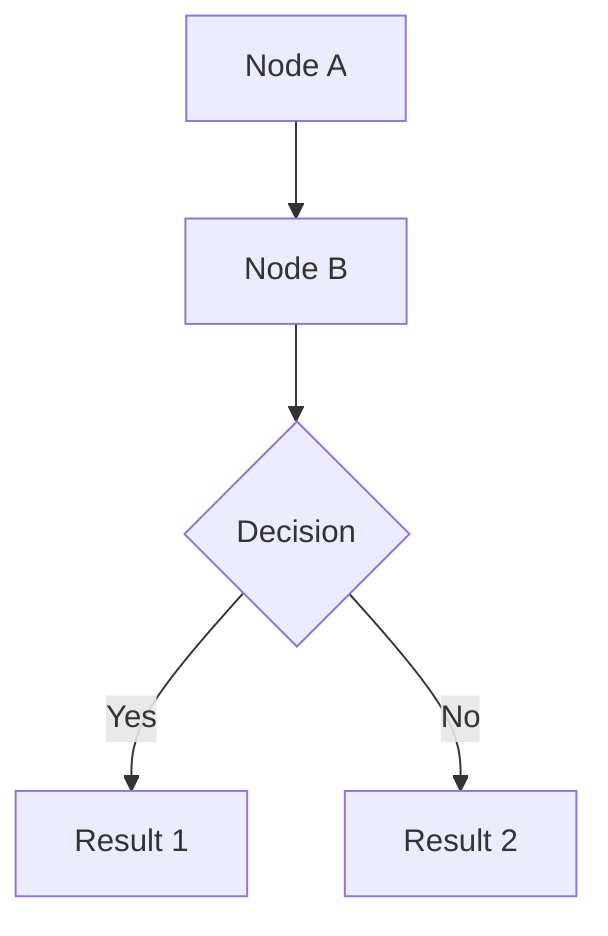

# Carmen.NET Diagrams Index

All diagrams are generated using Mermaid syntax for easy rendering in GitHub, Markdown viewers, and documentation tools.

---

## Architecture Diagrams (C4 Model)

### Level 1: System Context
**File**: `docs/architecture/c4-context.md`

Shows Carmen.NET in the context of its users and external systems.

**Elements**:
- Carmen.NET ERP System (center)
- Users: Accountants, Finance Managers, System Admins, Auditors
- External Systems: Banking, Tax Authority, Email, Reporting, Office/Excel

### Level 2: Container Diagram
**File**: `docs/architecture/c4-container.md`

Shows the high-level technology choices and how containers communicate.

**Containers**:
- Web API Application (ASP.NET Web API, .NET Framework)
- SQL Server Database (multi-tenant)
- Excel Add-in (VSTO/Office API)
- Mobile App (Xamarin/React Native)
- Email Service (SMTP)

### Level 3: Component Diagram - API Layer
**File**: `docs/architecture/c4-component-api.md`

Detailed breakdown of the Web API Application components.

**Component Groups**:
- Authentication & Security (Login, Token, Permission, RBAC)
- AP Module Controllers (7 controllers)
- AR Module Controllers (9 controllers)
- GL Module Controllers (5 controllers)
- Asset Module Controllers (6 controllers)
- Income Module Controllers (5 controllers)
- System Admin Controllers (15+ controllers)
- Utility Controllers (Excel, File, Report, Log)
- Base Components (BaseApiController, Tenant Context)

### Deployment Diagram
**File**: `docs/architecture/deployment-diagram.md`

Infrastructure and deployment architecture.

**Tiers**:
- Client Tier (Web, Excel, Mobile, API Clients)
- Load Balancer / Reverse Proxy
- Web Server Tier (2+ servers with IIS + Carmen.WebApi)
- Application Server Tier (Business Logic)
- Database Tier (SQL Server Cluster: Primary + Replica)
- External Integration (Banking, Tax, Email)

---

## Database Diagrams (ERD)

### Master Overview
**File**: `docs/database/erd-master-overview.md`

System-wide entity relationships showing how all modules integrate.

**Key Relationships**:
- All transaction modules → GL Module (financial posting)
- Multi-tenant: TENANT → COMPANY → DEPARTMENT
- Dimension allocation across modules
- Workflow support for critical transactions

**Entities**: 18 core entities across all modules

### AP Module ERD
**File**: `docs/database/erd-ap-module.md`

Accounts Payable module entities and relationships.

**Entities** (7):
- VENDOR (master)
- AP_INVOICE_H / AP_INVOICE_D (invoices)
- AP_PAYMENT (payments)
- AP_WHT (withholding tax)
- AP_REQUISITION (purchase requisitions)
- AP_PO_H / AP_PO_D (purchase orders)
- AP_RECEIVING (goods receiving)

**Workflows**:
- Requisition → PO → Receiving → Invoice → Payment
- Invoice → WHT file generation
- All transactions post to GL

### AR Module ERD
**File**: `docs/database/erd-ar-module.md`

Accounts Receivable module entities and relationships.

**Entities** (9):
- CUSTOMER (master)
- AR_CONTRACT (contracts)
- AR_FOLIO (invoice grouping)
- AR_INVOICE_H / AR_INVOICE_D (invoices)
- AR_RECEIPT (receipts)
- AR_DEPOSIT (deposits)
- AR_CREDIT_NOTE (credit memos)
- AR_DEBIT_NOTE (additional charges)
- AR_WRITE_OFF (bad debt)

**Workflows**:
- Contract → Invoice → Receipt
- Credit/Debit notes for adjustments
- Write-off for bad debts
- All transactions post to GL

### GL Module ERD
**File**: `docs/database/erd-gl-module.md`

General Ledger module entities and relationships.

**Entities** (7):
- ACCOUNT_CODE (chart of accounts)
- GL_JV_H / GL_JV_D (journal vouchers)
- GL_PERIOD (accounting periods)
- GL_ALLOCATION_JV_H / GL_ALLOCATION_JV_D (allocations)
- GL_AMORTIZE (amortization schedules)
- GL_JV_FR_H / GL_JV_FR_D (foreign currency JV)
- BUDGET (budget vs actual)

**Workflows**:
- JV creation → Approval → Posting → Update balances
- Period management (open/close)
- Cost allocation
- Amortization scheduling

### Asset Module ERD
**File**: `docs/database/erd-asset-module.md`

Asset Management module entities and relationships.

**Entities** (7):
- ASSET_REGISTER (asset master)
- ASSET_CATEGORY (asset categories with depreciation settings)
- ASSET_LOCATION (physical locations)
- ASSET_DEPARTMENT (department assignments)
- ASSET_HISTORY (audit trail)
- ASSET_DISPOSAL (disposal records with gain/loss)
- PRE_ASSET (work-in-progress assets)

**Workflows**:
- Acquisition → Depreciation → Transfer → Disposal
- Pre-asset (WIP) → Asset conversion
- Monthly depreciation posting to GL

### Income Module ERD
**File**: `docs/database/erd-income-module.md`

Income/Revenue module entities and relationships.

**Entities** (8):
- INCOME_SOURCE (revenue sources)
- INCOME_CATEGORY (hierarchical categories)
- INCOME_PRODUCT (product/service master)
- INCOME_INVOICE_H / INCOME_INVOICE_D (invoices)
- INCOME_REVENUE (direct revenue recognition)
- INCOME_PAY_CODE (payment codes)
- INCOME_PAY_TYPE (payment types)

**Workflows**:
- Product setup → Invoicing → Payment
- Revenue recognition (point-in-time, over-time, milestone)
- Deferred revenue management

---

## Viewing the Diagrams

### In GitHub
All Mermaid diagrams render automatically in GitHub when viewing `.md` files.

### In VS Code
Install the **Mermaid Preview** extension:
1. Install extension: `bierner.markdown-mermaid`
2. Open any `.md` file with diagrams
3. Click the preview icon (or press `Ctrl+Shift+V`)

### Online Mermaid Editor
Use the online editor to view and edit diagrams:
- **Mermaid Live Editor**: https://mermaid.live/
- Copy/paste diagram code from any `.md` file
- Edit and export as PNG/SVG

### Export to Images
Using Mermaid CLI:
```bash
# Install Mermaid CLI
npm install -g @mermaid-js/mermaid-cli

# Generate PNG images
mmdc -i docs/architecture/c4-context.md -o docs/architecture/c4-context.png

# Generate SVG images
mmdc -i docs/architecture/c4-context.md -o docs/architecture/c4-context.svg -t neutral

# Batch convert all diagrams
find docs -name "*.md" -exec mmdc -i {} -o {}.png \;
```

---

## Diagram Conventions

### Entity Relationship Diagrams (ERD)

**Relationship Notation**:
- `||--o{` : One-to-many (one parent, many children)
- `||--|{` : One-to-many (mandatory children)
- `||--o|` : One-to-zero-or-one
- `||--|` : One-to-one

**Field Notation**:
- `PK` : Primary Key
- `FK` : Foreign Key
- `"Description"` : Field description/comment

### C4 Architecture Diagrams

**Color Coding**:
- **System** (Blue): Carmen.NET system components
- **External** (Gray): External systems and services
- **User** (Dark Blue): User groups and actors
- **Container** (Various): Different container types
- **Component** (Various): Different component types

### Mermaid Syntax

**Entity Definition**:
```mermaid
ENTITY_NAME {
    datatype fieldName PK/FK "Description"
}
```

**Relationship**:
```mermaid
PARENT ||--o{ CHILD : "relationship"
```

**Graph/Flowchart**:


---

## Diagram Statistics

| Category | Count | Files |
|----------|-------|-------|
| **C4 Diagrams** | 4 | c4-context, c4-container, c4-component-api, deployment-diagram |
| **ERD Diagrams** | 6 | erd-master-overview, erd-ap-module, erd-ar-module, erd-gl-module, erd-asset-module, erd-income-module |
| **Total Entities** | 50+ | Across all ERD diagrams |
| **Total Components** | 60+ | Controllers, services, and base components |

---

## Updates and Maintenance

**Version**: 1.0
**Format**: Mermaid (migrated from PlantUML)
**Last Updated**: 2025-10-06

**To Update Diagrams**:
1. Edit the `.md` file directly
2. Modify Mermaid code between ` ```mermaid ` and ` ``` `
3. Preview changes in GitHub or VS Code
4. Commit changes to version control

**Best Practices**:
- Keep diagrams simple and focused
- Use consistent naming conventions
- Add descriptions for clarity
- Update diagrams when architecture/schema changes
- Version control all diagram files
