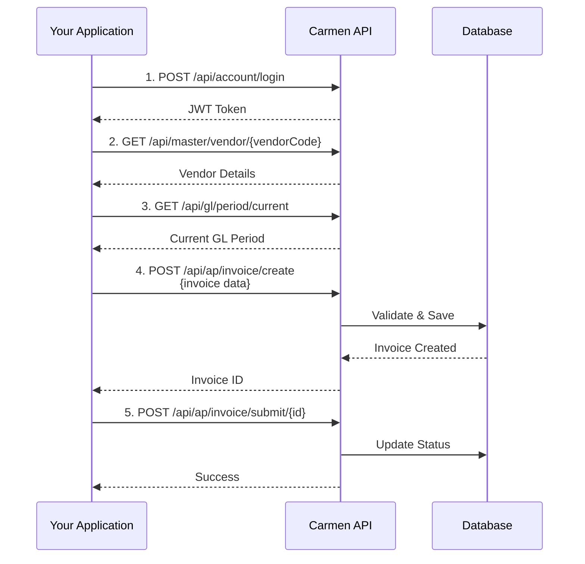

# API Integration Guide

## Overview

This guide provides comprehensive instructions for integrating with the Carmen.NET API, including common integration scenarios, code examples, best practices, and troubleshooting guidance.

## Table of Contents

1. [Getting Started](#getting-started)
2. [Integration Scenarios](#integration-scenarios)
3. [Code Examples](#code-examples)
4. [Best Practices](#best-practices)
5. [Performance Optimization](#performance-optimization)
6. [Testing](#testing)
7. [Troubleshooting](#troubleshooting)

## Getting Started

### Prerequisites

- Carmen.NET API base URL
- Valid user credentials
- Tenant code (for multi-tenant environments)
- Understanding of [Authentication Guide](authentication-guide.md)
- Familiarity with [Error Handling](error-handling-guide.md)

### Quick Start

```typescript
// 1. Initialize API client
const client = new CarmenApiClient('https://api.carmen.com');

// 2. Authenticate
await client.login('user@company.com', 'password', 'TENANT001');

// 3. Make API calls
const invoices = await client.get('/api/ap/invoice/list');
```

## Integration Scenarios

### Scenario 1: Create AP Invoice

**Business Use Case**: Create a new vendor invoice in the system

**Complete Workflow**:



**Step-by-Step Implementation**:

```typescript
interface ApInvoiceCreateRequest {
    invoiceNumber: string;
    invoiceDate: string; // ISO 8601 format
    dueDate: string;
    vendorCode: string;
    description: string;
    amount: number;
    taxAmount?: number;
    whtAmount?: number;
    lines: ApInvoiceLine[];
}

interface ApInvoiceLine {
    lineNo: number;
    accountCode: string;
    description: string;
    amount: number;
    departmentCode?: string;
}

async function createApInvoice(): Promise<string> {
    const client = new CarmenApiClient('https://api.carmen.com');

    // Step 1: Authenticate
    const loginSuccess = await client.login(
        'ap.clerk@company.com',
        'password',
        'TENANT001'
    );

    if (!loginSuccess) {
        throw new Error('Authentication failed');
    }

    // Step 2: Validate vendor exists and is active
    const vendor = await client.get(`/api/master/vendor/V001`);
    if (!vendor.isActive) {
        throw new Error('Vendor is not active');
    }

    // Step 3: Get current GL period
    const period = await client.get('/api/gl/period/current');
    if (period.status !== 'Open') {
        throw new Error('Current GL period is not open');
    }

    // Step 4: Prepare invoice data
    const invoice: ApInvoiceCreateRequest = {
        invoiceNumber: 'INV-2025-001',
        invoiceDate: '2025-10-06',
        dueDate: '2025-11-05', // 30 days payment terms
        vendorCode: 'V001',
        description: 'Professional Services - October 2025',
        amount: 100000.00,
        taxAmount: 7000.00, // 7% VAT
        whtAmount: 5000.00, // 5% WHT
        lines: [
            {
                lineNo: 1,
                accountCode: '5100', // Professional Expense
                description: 'Consulting Services',
                amount: 100000.00,
                departmentCode: 'IT'
            }
        ]
    };

    // Step 5: Create invoice
    const createResponse = await client.post(
        '/api/ap/invoice/create',
        invoice
    );

    if (!createResponse.success) {
        throw new Error(`Failed to create invoice: ${createResponse.message}`);
    }

    const invoiceId = createResponse.data.id;
    console.log(`Invoice created with ID: ${invoiceId}`);

    // Step 6: Submit for approval (optional, based on workflow)
    if (invoice.amount > 10000) {
        const submitResponse = await client.post(
            `/api/ap/invoice/submit/${invoiceId}`
        );

        if (submitResponse.success) {
            console.log('Invoice submitted for approval');
        }
    }

    return invoiceId;
}
```

### Scenario 2: Process Payment

**Business Use Case**: Create payment for approved invoices

```typescript
interface ApPaymentCreateRequest {
    paymentDate: string;
    bankAccountCode: string;
    paymentMethod: 'Check' | 'Wire' | 'ACH' | 'Cash';
    checkNumber?: string;
    wireReference?: string;
    description: string;
    invoices: PaymentInvoiceApplication[];
}

interface PaymentInvoiceApplication {
    invoiceId: string;
    paymentAmount: number;
    discountAmount?: number;
}

async function processPayment(): Promise<string> {
    const client = new CarmenApiClient('https://api.carmen.com');
    await client.login('ap.manager@company.com', 'password', 'TENANT001');

    // Step 1: Get invoices ready for payment
    const invoices = await client.get('/api/ap/invoice/list', {
        status: 'Posted', // Status = 1
        dueDate_lte: '2025-10-06' // Due on or before today
    });

    // Step 2: Select invoices to pay
    const invoicesToPay = invoices.data.filter(inv =>
        inv.outstandingAmount > 0 && inv.vendorCode === 'V001'
    );

    // Step 3: Calculate total payment amount
    const totalAmount = invoicesToPay.reduce((sum, inv) =>
        sum + inv.outstandingAmount, 0
    );

    // Step 4: Create payment
    const payment: ApPaymentCreateRequest = {
        paymentDate: '2025-10-06',
        bankAccountCode: 'BANK001',
        paymentMethod: 'Check',
        checkNumber: 'CHK-2025-100',
        description: `Payment to Vendor V001 - ${invoicesToPay.length} invoices`,
        invoices: invoicesToPay.map(inv => ({
            invoiceId: inv.id,
            paymentAmount: inv.outstandingAmount
        }))
    };

    const response = await client.post('/api/ap/payment/create', payment);

    if (response.success) {
        const paymentId = response.data.id;

        // Step 5: Submit for approval if needed
        if (totalAmount > 25000) {
            await client.post(`/api/ap/payment/submit/${paymentId}`);
            console.log('Payment submitted for approval');
        } else {
            // Step 6: Auto-post if below threshold
            await client.post(`/api/ap/payment/post/${paymentId}`);
            console.log('Payment posted to GL');
        }

        return paymentId;
    }

    throw new Error(`Payment failed: ${response.message}`);
}
```

### Scenario 3: Generate AR Invoice

**Business Use Case**: Create customer invoice from contract

```typescript
interface ArInvoiceGenerateRequest {
    contractId: string;
    invoiceDate: string;
    dueDate?: string; // Optional, calculated from payment terms
    description?: string;
}

async function generateArInvoice(contractId: string): Promise<string> {
    const client = new CarmenApiClient('https://api.carmen.com');
    await client.login('ar.clerk@company.com', 'password', 'TENANT001');

    // Step 1: Get contract details
    const contract = await client.get(`/api/ar/contract/${contractId}`);

    if (contract.status !== 'Active') {
        throw new Error('Contract is not active');
    }

    // Step 2: Check customer credit limit
    const customer = await client.get(`/api/master/customer/${contract.customerCode}`);

    if (customer.creditLimit > 0) {
        // Get current outstanding balance
        const outstanding = await client.get(
            `/api/ar/customer/${customer.code}/outstanding`
        );

        if (outstanding.amount + contract.amount > customer.creditLimit) {
            throw new Error('Customer credit limit will be exceeded');
        }
    }

    // Step 3: Generate invoice from contract
    const request: ArInvoiceGenerateRequest = {
        contractId: contractId,
        invoiceDate: new Date().toISOString().split('T')[0],
        description: `Invoice for Contract ${contract.contractNumber}`
    };

    const response = await client.post('/api/ar/invoice/generate-from-contract', request);

    if (response.success) {
        const invoiceId = response.data.id;

        // Step 4: Submit for approval if needed
        if (contract.amount > 25000) {
            await client.post(`/api/ar/invoice/submit/${invoiceId}`);
            console.log('Invoice submitted for approval');
        } else {
            // Step 5: Auto-post and send to customer
            await client.post(`/api/ar/invoice/post/${invoiceId}`);

            // Step 6: Send invoice to customer
            await client.post(`/api/ar/invoice/send/${invoiceId}`, {
                method: 'Email',
                recipientEmail: customer.email
            });

            console.log(`Invoice posted and sent to ${customer.email}`);
        }

        return invoiceId;
    }

    throw new Error(`Invoice generation failed: ${response.message}`);
}
```

### Scenario 4: Record AR Receipt

**Business Use Case**: Record customer payment and apply to invoices

```typescript
interface ArReceiptCreateRequest {
    receiptDate: string;
    receiptNumber: string;
    customerCode: string;
    paymentMethod: 'Cash' | 'Check' | 'Wire' | 'CreditCard';
    amount: number;
    checkNumber?: string;
    checkDate?: string;
    bankAccountCode?: string;
    description: string;
    applications: ReceiptApplication[];
}

interface ReceiptApplication {
    invoiceId: string;
    appliedAmount: number;
}

async function recordReceipt(): Promise<string> {
    const client = new CarmenApiClient('https://api.carmen.com');
    await client.login('ar.clerk@company.com', 'password', 'TENANT001');

    const customerCode = 'C001';
    const receiptAmount = 50000.00;

    // Step 1: Get customer outstanding invoices
    const invoices = await client.get('/api/ar/invoice/list', {
        customerCode: customerCode,
        status: 'Posted',
        orderBy: 'invoiceDate' // FIFO application
    });

    // Step 2: Apply receipt to invoices (FIFO)
    const applications: ReceiptApplication[] = [];
    let remainingAmount = receiptAmount;

    for (const invoice of invoices.data) {
        if (remainingAmount <= 0) break;

        const applyAmount = Math.min(invoice.outstandingAmount, remainingAmount);

        applications.push({
            invoiceId: invoice.id,
            appliedAmount: applyAmount
        });

        remainingAmount -= applyAmount;
    }

    // Step 3: Create receipt
    const receipt: ArReceiptCreateRequest = {
        receiptDate: '2025-10-06',
        receiptNumber: 'RCP-2025-001',
        customerCode: customerCode,
        paymentMethod: 'Check',
        amount: receiptAmount,
        checkNumber: '123456',
        checkDate: '2025-10-05',
        bankAccountCode: 'BANK001',
        description: 'Payment received from customer',
        applications: applications
    };

    const response = await client.post('/api/ar/receipt/create', receipt);

    if (response.success) {
        const receiptId = response.data.id;

        // Step 4: Post receipt to GL
        await client.post(`/api/ar/receipt/post/${receiptId}`);

        // Step 5: Mark as deposited
        await client.post(`/api/ar/receipt/deposit/${receiptId}`, {
            depositDate: '2025-10-06',
            depositSlipNumber: 'DEP-2025-001'
        });

        console.log(`Receipt ${receiptId} created and deposited`);

        // Handle overpayment if any
        if (remainingAmount > 0) {
            console.log(`Overpayment amount: ${remainingAmount} - Created as customer credit`);
        }

        return receiptId;
    }

    throw new Error(`Receipt creation failed: ${response.message}`);
}
```

### Scenario 5: Period Close Workflow

**Business Use Case**: Execute month-end GL period close

```typescript
async function executePeriodClose(periodCode: string): Promise<boolean> {
    const client = new CarmenApiClient('https://api.carmen.com');
    await client.login('controller@company.com', 'password', 'TENANT001');

    // Step 1: Get period status
    const period = await client.get(`/api/gl/period/${periodCode}`);

    if (period.status !== 'Open') {
        throw new Error(`Period ${periodCode} is not open (status: ${period.status})`);
    }

    // Step 2: Run pre-close validation
    const validation = await client.post(`/api/gl/period/validate/${periodCode}`);

    if (!validation.success) {
        console.error('Validation failed:', validation.validationErrors);

        // Display validation errors
        validation.validationErrors.forEach((error: any) => {
            console.error(`- ${error.category}: ${error.message}`);
        });

        return false;
    }

    console.log('All validation checks passed');

    // Step 3: Initiate close
    const closeResponse = await client.post(`/api/gl/period/initiate-close/${periodCode}`);

    if (!closeResponse.success) {
        throw new Error(`Failed to initiate close: ${closeResponse.message}`);
    }

    // Step 4: Execute close
    const executeResponse = await client.post(`/api/gl/period/execute-close/${periodCode}`);

    if (executeResponse.success) {
        console.log(`Period ${periodCode} closed successfully`);
        console.log(`Closing journal voucher: ${executeResponse.data.closingJvNumber}`);
        console.log(`Period locked at: ${executeResponse.data.closedTimestamp}`);

        return true;
    }

    throw new Error(`Period close failed: ${executeResponse.message}`);
}
```

### Scenario 6: Batch Import from External System

**Business Use Case**: Import bank statement transactions

```typescript
interface BankStatementImport {
    bankAccountCode: string;
    statementDate: string;
    openingBalance: number;
    closingBalance: number;
    transactions: BankTransaction[];
}

interface BankTransaction {
    transactionDate: string;
    description: string;
    referenceNumber: string;
    debitAmount: number;
    creditAmount: number;
    balance: number;
}

async function importBankStatement(csvFilePath: string): Promise<void> {
    const client = new CarmenApiClient('https://api.carmen.com');
    await client.login('accountant@company.com', 'password', 'TENANT001');

    // Step 1: Parse CSV file
    const transactions = await parseCsvFile(csvFilePath);

    // Step 2: Prepare import request
    const importRequest: BankStatementImport = {
        bankAccountCode: 'BANK001',
        statementDate: '2025-10-31',
        openingBalance: transactions[0].balance - transactions[0].debitAmount + transactions[0].creditAmount,
        closingBalance: transactions[transactions.length - 1].balance,
        transactions: transactions
    };

    // Step 3: Validate import
    const validateResponse = await client.post(
        '/api/bank/statement/validate',
        importRequest
    );

    if (!validateResponse.success) {
        console.error('Validation failed:', validateResponse.errors);
        return;
    }

    // Step 4: Import transactions
    const importResponse = await client.post(
        '/api/bank/statement/import',
        importRequest
    );

    if (importResponse.success) {
        console.log(`Imported ${importResponse.data.transactionsImported} transactions`);
        console.log(`Auto-matched: ${importResponse.data.autoMatched}`);
        console.log(`Unmatched: ${importResponse.data.unmatched}`);

        // Step 5: Review unmatched transactions
        if (importResponse.data.unmatched > 0) {
            const unmatched = await client.get(
                `/api/bank/reconciliation/unmatched?bankAccount=BANK001&date=2025-10-31`
            );

            console.log('Unmatched transactions requiring manual review:');
            unmatched.data.forEach((txn: any) => {
                console.log(`- ${txn.date}: ${txn.description} ${txn.amount}`);
            });
        }
    }
}

async function parseCsvFile(filePath: string): Promise<BankTransaction[]> {
    // Implementation depends on your CSV library
    // This is a simplified example
    const fs = require('fs');
    const csv = require('csv-parser');
    const transactions: BankTransaction[] = [];

    return new Promise((resolve, reject) => {
        fs.createReadStream(filePath)
            .pipe(csv())
            .on('data', (row: any) => {
                transactions.push({
                    transactionDate: row['Date'],
                    description: row['Description'],
                    referenceNumber: row['Reference'],
                    debitAmount: parseFloat(row['Debit'] || '0'),
                    creditAmount: parseFloat(row['Credit'] || '0'),
                    balance: parseFloat(row['Balance'])
                });
            })
            .on('end', () => resolve(transactions))
            .on('error', reject);
    });
}
```

## Best Practices

### 1. Connection Management

```typescript
// Use connection pooling
const clientPool = new CarmenApiClientPool({
    maxClients: 10,
    baseUrl: 'https://api.carmen.com'
});

// Reuse clients
const client = await clientPool.acquire();
try {
    await client.get('/api/ap/invoice/list');
} finally {
    clientPool.release(client);
}
```

### 2. Batch Operations

```typescript
// Instead of creating invoices one by one
for (const invoice of invoices) {
    await client.post('/api/ap/invoice/create', invoice); // Slow!
}

// Use batch create endpoint
await client.post('/api/ap/invoice/batch-create', {
    invoices: invoices
}); // Fast!
```

### 3. Pagination

```typescript
async function getAllInvoices(): Promise<Invoice[]> {
    const allInvoices: Invoice[] = [];
    let page = 1;
    const pageSize = 100;

    while (true) {
        const response = await client.get('/api/ap/invoice/list', {
            page: page,
            pageSize: pageSize
        });

        allInvoices.push(...response.data);

        if (response.data.length < pageSize) {
            break; // Last page
        }

        page++;
    }

    return allInvoices;
}
```

### 4. Rate Limiting

```typescript
class RateLimiter {
    private requests: number[] = [];
    private limit: number = 100; // requests per minute

    async throttle() {
        const now = Date.now();
        const oneMinuteAgo = now - 60000;

        // Remove requests older than 1 minute
        this.requests = this.requests.filter(time => time > oneMinuteAgo);

        if (this.requests.length >= this.limit) {
            const oldestRequest = this.requests[0];
            const waitTime = 60000 - (now - oldestRequest);
            await new Promise(resolve => setTimeout(resolve, waitTime));
            return this.throttle();
        }

        this.requests.push(now);
    }
}

const rateLimiter = new RateLimiter();

// Before each request
await rateLimiter.throttle();
await client.get('/api/ap/invoice/list');
```

### 5. Caching

```typescript
class CachedApiClient {
    private cache: Map<string, {data: any, expiry: number}> = new Map();
    private cacheTtl = 5 * 60 * 1000; // 5 minutes

    async get(endpoint: string, params?: any): Promise<any> {
        const cacheKey = `${endpoint}:${JSON.stringify(params)}`;
        const cached = this.cache.get(cacheKey);

        if (cached && cached.expiry > Date.now()) {
            return cached.data;
        }

        const data = await client.get(endpoint, params);

        this.cache.set(cacheKey, {
            data: data,
            expiry: Date.now() + this.cacheTtl
        });

        return data;
    }

    invalidate(pattern: string) {
        for (const key of this.cache.keys()) {
            if (key.includes(pattern)) {
                this.cache.delete(key);
            }
        }
    }
}

// Usage
const cachedClient = new CachedApiClient();

// First call - hits API
const vendors = await cachedClient.get('/api/master/vendor/list');

// Second call within 5 minutes - returns cached data
const vendorsAgain = await cachedClient.get('/api/master/vendor/list');

// After creating a vendor, invalidate cache
await client.post('/api/master/vendor/create', newVendor);
cachedClient.invalidate('/api/master/vendor');
```

## Performance Optimization

### Use Field Selection

```typescript
// Don't fetch all fields if you don't need them
const invoices = await client.get('/api/ap/invoice/list', {
    fields: 'id,invoiceNumber,amount,status' // Only fetch needed fields
});
```

### Use Compression

```typescript
const client = new CarmenApiClient('https://api.carmen.com', {
    compression: true // Enable gzip compression
});
```

### Parallel Requests

```typescript
// Execute independent requests in parallel
const [vendors, customers, accounts] = await Promise.all([
    client.get('/api/master/vendor/list'),
    client.get('/api/master/customer/list'),
    client.get('/api/gl/account/list')
]);
```

## Testing

### Unit Testing

```typescript
import { describe, it, expect, jest } from '@jest/globals';

describe('AP Invoice Creation', () => {
    it('should create invoice successfully', async () => {
        const mockClient = {
            post: jest.fn().mockResolvedValue({
                success: true,
                data: { id: '12345' }
            })
        };

        const invoice = {
            invoiceNumber: 'TEST-001',
            vendorCode: 'V001',
            amount: 1000
        };

        const result = await mockClient.post('/api/ap/invoice/create', invoice);

        expect(result.success).toBe(true);
        expect(result.data.id).toBe('12345');
        expect(mockClient.post).toHaveBeenCalledWith(
            '/api/ap/invoice/create',
            invoice
        );
    });
});
```

### Integration Testing

```typescript
describe('End-to-End Invoice Workflow', () => {
    let client: CarmenApiClient;
    let invoiceId: string;

    beforeAll(async () => {
        client = new CarmenApiClient('https://test-api.carmen.com');
        await client.login('test@test.com', 'password', 'TEST');
    });

    it('should create invoice', async () => {
        const response = await client.post('/api/ap/invoice/create', testInvoice);
        expect(response.success).toBe(true);
        invoiceId = response.data.id;
    });

    it('should submit invoice for approval', async () => {
        const response = await client.post(`/api/ap/invoice/submit/${invoiceId}`);
        expect(response.success).toBe(true);
    });

    it('should approve invoice', async () => {
        const response = await client.post(`/api/ap/invoice/approve/${invoiceId}`);
        expect(response.success).toBe(true);
    });

    it('should post invoice to GL', async () => {
        const response = await client.post(`/api/ap/invoice/post/${invoiceId}`);
        expect(response.success).toBe(true);
    });

    afterAll(async () => {
        // Cleanup
        await client.delete(`/api/ap/invoice/${invoiceId}`);
    });
});
```

## Troubleshooting

See [Error Handling Guide](error-handling-guide.md) for detailed error codes and resolution steps.

### Common Issues

| Issue | Cause | Resolution |
|-------|-------|------------|
| **Timeout errors** | Large dataset, slow network | Use pagination, increase timeout |
| **429 Rate Limit** | Too many requests | Implement rate limiting, use batch endpoints |
| **Intermittent 401** | Token expiring | Implement proactive token refresh |
| **Slow performance** | Fetching too much data | Use field selection, pagination, caching |

---

**Document Version**: 1.0
**Last Updated**: 2025-10-06
**Status**: Phase 4 - API & Integration Documentation
