# Carmen.NET - API Component Diagram (C4 Level 3)

```mermaid
graph TB
    subgraph "Web API Application Components"
        subgraph "Authentication & Security"
            LOGIN[Login Controller<br/>Order: 0<br/>User Authentication]
            TOKEN[Token Controller<br/>Order: 4<br/>Token Management]
            AUTH_FILTER[Authorization Filter<br/>Authorize Attribute<br/>Token Validation]
            PERMISSION[Permission Service<br/>FncPermission<br/>RBAC Checks]
        end

        subgraph "AP Module Controllers"
            AP_INV[AP Invoice Controller<br/>Order: 200<br/>Invoice Management]
            AP_PAY[AP Payment Controller<br/>Order: 210<br/>Payment Processing]
            AP_WHT[AP WHT Controller<br/>Order: 220<br/>Withholding Tax]
            AP_VENDOR[AP Vendor Controller<br/>Order: 230<br/>Vendor Management]
            AP_OTHER["+3 More AP Controllers<br/>PO, Requisition, Receiving"]
        end

        subgraph "AR Module Controllers"
            AR_INV[AR Invoice Controller<br/>Order: 300<br/>AR Invoicing]
            AR_RCPT[AR Receipt Controller<br/>Order: 310<br/>Receipt Processing]
            AR_CONTRACT[AR Contract Controller<br/>Order: 320<br/>Contract Management]
            AR_OTHER["+6 More AR Controllers<br/>Customer, Folio, Notes"]
        end

        subgraph "GL Module Controllers"
            GL_ACCOUNT[Account Code Controller<br/>Order: 400<br/>Chart of Accounts]
            GL_JV[GL JV Controller<br/>Order: 410<br/>Journal Vouchers]
            GL_PERIOD[GL Period Controller<br/>Order: 430<br/>Period Management]
            GL_OTHER["+2 More GL Controllers<br/>Allocation, Amortize"]
        end

        subgraph "Asset Module Controllers"
            ASSET_REG[Asset Register Controller<br/>Order: 500<br/>Asset Management]
            ASSET_CAT[Asset Category Controller<br/>Order: 510<br/>Asset Categories]
            ASSET_DISP[Asset Disposal Controller<br/>Order: 520<br/>Asset Disposal]
            ASSET_OTHER["+3 More Asset Controllers<br/>History, Location, Dept"]
        end

        subgraph "Income Module Controllers"
            INC_INV[Income Invoice Controller<br/>Order: 600<br/>Income Invoicing]
            INC_REV[Income Revenue Controller<br/>Order: 610<br/>Revenue Recognition]
            INC_OTHER["+3 More Income Controllers<br/>Product, Category, Source"]
        end

        subgraph "System Admin Controllers"
            USER[User Controller<br/>User Management]
            ROLE[Role Controller<br/>Role & Permission]
            TENANT[Tenant Controller<br/>Order: 5<br/>Multi-tenant Config]
            CONFIG[Config Controller<br/>System Configuration]
            ADMIN_OTHER["+11 More Admin Controllers<br/>Workflow, Dimension, etc."]
        end

        subgraph "Utility Controllers"
            EXCEL[Excel Controller<br/>Order: 1000<br/>Excel Import/Export]
            FILE[File Controller<br/>Order: 1010<br/>File Upload/Download]
            REPORT[Report Controller<br/>Order: 800+<br/>Financial Reports]
            LOG[Process Log Controller<br/>Order: 1020<br/>Audit Logging]
        end

        subgraph "Base Components"
            BASE_CTRL[Base API Controller<br/>858 Lines<br/>Error Handling<br/>JSON Responses<br/>Logging]
            TENANT_CTX[Tenant Context Service<br/>FncBase<br/>Multi-tenant Isolation]
        end
    end

    subgraph "External Dependencies"
        EF[Entity Framework<br/>Data Access Layer]
        CRYPTO[Carmen.Crypto<br/>Encryption Library]
        LOGGER[Logging Service<br/>LogHttpRequest/Result]
    end

    %% Authentication flow
    LOGIN --> TOKEN
    AUTH_FILTER --> TOKEN
    AUTH_FILTER --> PERMISSION

    %% All controllers inherit from Base
    BASE_CTRL -.->|inherits| AP_INV
    BASE_CTRL -.->|inherits| AR_INV
    BASE_CTRL -.->|inherits| GL_JV
    BASE_CTRL -.->|inherits| ASSET_REG
    BASE_CTRL -.->|inherits| INC_INV
    BASE_CTRL -.->|inherits| USER

    %% All controllers use tenant context
    TENANT_CTX --> AP_INV
    TENANT_CTX --> AR_INV
    TENANT_CTX --> GL_JV
    TENANT_CTX --> ASSET_REG
    TENANT_CTX --> INC_INV

    %% All controllers use permission service
    PERMISSION --> AP_INV
    PERMISSION --> AR_INV
    PERMISSION --> GL_JV
    PERMISSION --> ASSET_REG
    PERMISSION --> INC_INV

    %% Base controller dependencies
    BASE_CTRL --> LOGGER
    BASE_CTRL --> EF

    %% Security dependencies
    LOGIN --> CRYPTO
    TOKEN --> CRYPTO

    %% Data access
    AP_INV --> EF
    AR_INV --> EF
    GL_JV --> EF
    ASSET_REG --> EF
    INC_INV --> EF
    USER --> EF

    classDef authComponent fill:#ff6b6b,stroke:#c92a2a,color:#ffffff
    classDef moduleComponent fill:#1168bd,stroke:#0b4884,color:#ffffff
    classDef baseComponent fill:#20c997,stroke:#087f5b,color:#ffffff
    classDef utilComponent fill:#ffd43b,stroke:#e8ac00,color:#000000
    classDef external fill:#999999,stroke:#666666,color:#ffffff

    class LOGIN,TOKEN,AUTH_FILTER,PERMISSION authComponent
    class AP_INV,AP_PAY,AP_WHT,AR_INV,AR_RCPT,GL_JV,GL_ACCOUNT,ASSET_REG,INC_INV,INC_REV moduleComponent
    class BASE_CTRL,TENANT_CTX baseComponent
    class EXCEL,FILE,REPORT,LOG,USER,ROLE,TENANT,CONFIG utilComponent
    class EF,CRYPTO,LOGGER external
```

## Component Architecture

### Authentication & Security Components

**Login Controller** (Order: 0)
- Highest priority in API
- Username/password authentication
- Token generation coordination

**Token Controller** (Order: 4)
- JWT token generation
- Token validation
- Token refresh (inferred)

**Authorization Filter**
- Applied to all controllers via `[Authorize]` attribute
- Token validation on every request
- User/tenant context extraction

**Permission Service**
- RBAC implementation
- Permission format: `{Module}.{Entity}`
- Actions: View, Create, Update, Delete, Approve, Post, Close

### Module Controllers

**AP Module** (7 controllers, Orders: 200-299)
- Invoice management, payment processing
- Withholding tax, vendor management
- Purchase orders, requisitions, receiving

**AR Module** (9 controllers, Orders: 300-399)
- AR invoicing, receipt processing
- Contract and folio management
- Customer management, credit/debit notes

**GL Module** (5 controllers, Orders: 400-499)
- Chart of accounts, journal vouchers
- Period management, allocations
- Amortization

**Asset Module** (6 controllers, Orders: 500-599)
- Asset register and categories
- Disposal and history tracking
- Location and department assignment

**Income Module** (5 controllers, Orders: 600-699)
- Income invoicing and revenue recognition
- Product and category management
- Income source tracking

### System Administration

**User & Role Management**
- User CRUD operations
- Role and permission assignment
- Password management

**Tenant Management** (Order: 5)
- Multi-tenant configuration
- Tenant-user mapping
- Tenant-specific settings

**Configuration**
- System-wide settings
- Module-specific configuration
- Workflow and dimension setup

### Utility Controllers

**Excel Controller** (Order: 1000)
- Excel file import/export
- Template generation
- Bulk data operations

**File Controller** (Order: 1010)
- File upload/download
- File storage management
- Document management

**Report Controller** (Order: 800+)
- Financial report generation
- Custom report creation
- Export to PDF/Excel

**Process Log Controller** (Order: 1020)
- Audit trail logging
- User activity tracking
- System event logging

### Base Components

**Base API Controller** (858 lines)
- Standardized JSON response methods
- Centralized error handling
- Request/response logging
- Common utilities

**Tenant Context Service**
- Multi-tenant isolation enforcement
- `FncBase.ApplyTenantIfUseTenant(useTenant)`
- Applied to ALL database operations
- Prevents cross-tenant data leakage

### External Dependencies

**Entity Framework**
- ORM for data access
- LINQ query support
- Change tracking and transactions

**Carmen.Crypto**
- Encryption/decryption services
- Sensitive data protection
- Password hashing

**Logging Service**
- `LogHttpRequest.Info()` - Request logging
- `LogHttpResult.Error()` - Error logging
- File-based logging (inferred)

## Design Patterns

- **Inheritance**: All controllers inherit from BaseApiController
- **Dependency Injection**: Services injected into controllers (inferred)
- **Filter Pattern**: `[Authorize]` attribute on all controllers
- **Repository Pattern**: Data access abstraction (inferred)
- **DTO Pattern**: View* models for responses, Param* for requests
