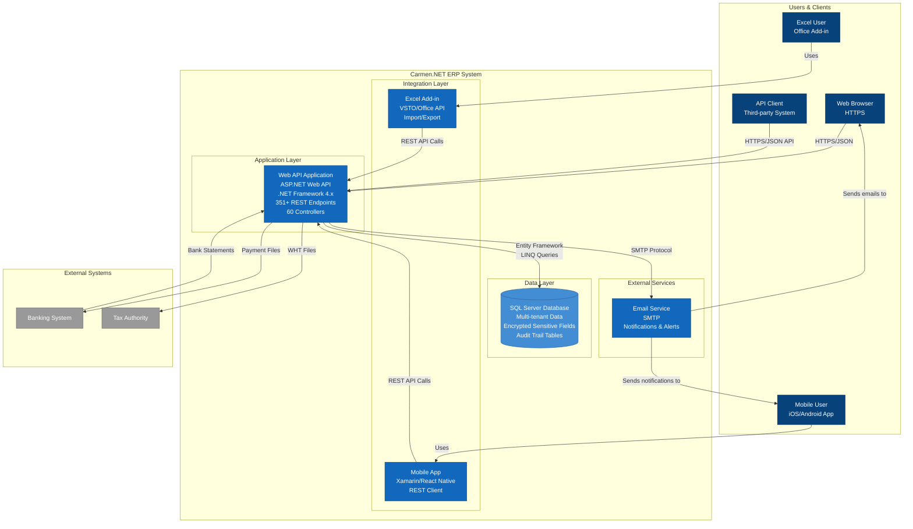

# Carmen.NET - Container Diagram (C4 Level 2)

## Container Overview

Carmen.NET consists of several containers that work together to provide comprehensive financial ERP functionality.

### Application Containers

**Web API Application**
- **Technology**: ASP.NET Web API, .NET Framework 4.x
- **Purpose**: Core business logic and REST API endpoints
- **Scale**: 351+ endpoints across 60 controllers
- **Features**:
  - Token-based authentication (JWT)
  - Role-based access control (RBAC)
  - Multi-tenant context management
  - Comprehensive error handling and logging

**Excel Add-in**
- **Technology**: VSTO (Visual Studio Tools for Office), Office JavaScript API
- **Purpose**: Batch data import/export via Excel
- **Features**:
  - Template-based data entry
  - Bulk upload capabilities
  - Data validation before import

**Mobile App**
- **Technology**: Xamarin or React Native (inferred)
- **Purpose**: Mobile access to core functionality
- **Features**:
  - Transaction approval workflows
  - Report viewing
  - Real-time notifications

### Data Container

**SQL Server Database**
- **Technology**: SQL Server 2014+
- **Purpose**: Multi-tenant data storage
- **Features**:
  - Tenant-isolated data
  - Encrypted sensitive fields
  - Complete audit trail
  - Transaction support (ACID)

### External Services

**Email Service**
- **Technology**: SMTP
- **Purpose**: Notifications and alerts
- **Features**:
  - Workflow notifications
  - System alerts
  - User communications

## Integration Patterns

- **Web Browser**: HTTPS/JSON REST API
- **Excel Add-in**: REST API via Office API
- **Mobile App**: REST API via native HTTP client
- **Third-party Systems**: REST API with token authentication
- **Database**: Entity Framework ORM with LINQ
- **Banking**: File-based integration (payment files, statements)
- **Tax Authority**: File-based WHT submissions
