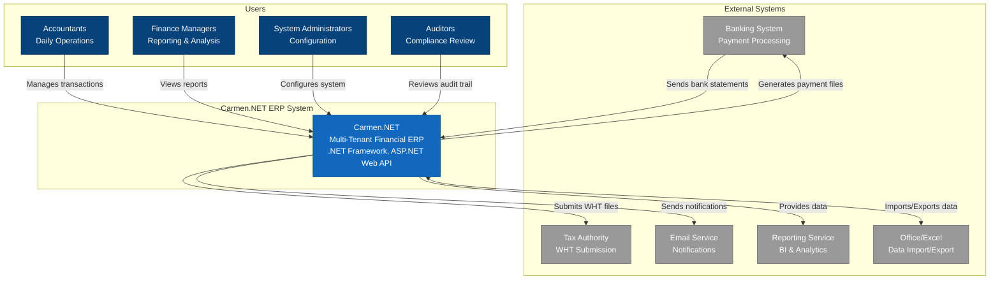

# Carmen.NET - System Context Diagram (C4 Level 1)

## System Context

**Carmen.NET** is a comprehensive multi-tenant financial ERP system that serves multiple user types and integrates with various external systems.

### Users

- **Accountants**: Daily transaction management (AP, AR, GL entries)
- **Finance Managers**: Financial reporting, analysis, and decision support
- **System Administrators**: User management, permissions, system configuration
- **Auditors**: Compliance review, audit trail examination

### External Systems

- **Banking System**: Payment file generation, bank statement reconciliation
- **Tax Authority**: WHT (Withholding Tax) file submission, tax compliance
- **Email Service**: Notifications, alerts, workflow notifications
- **Reporting Service**: Business intelligence, advanced analytics
- **Office/Excel**: Batch data import/export, template-based entry

### Key Capabilities

- Multi-tenant operations with complete data isolation
- 11 core financial modules (AP, AR, GL, Asset, Income, Tax, etc.)
- 351+ REST API endpoints
- Role-based access control
- Comprehensive audit trail
