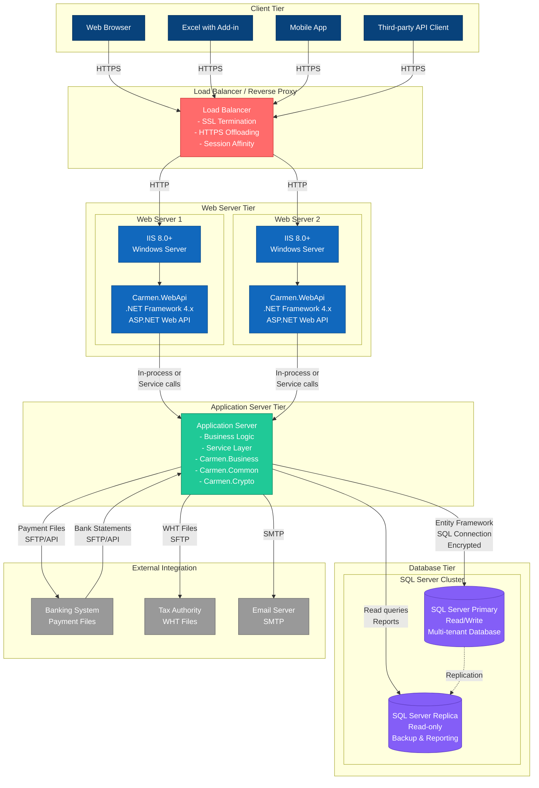

# Carmen.NET - Deployment Diagram



## Deployment Architecture

### Client Tier

**Web Browser**
- Modern browsers (Chrome, Firefox, Edge, Safari)
- HTTPS connection to load balancer
- Token stored in browser storage/cookies

**Excel with Add-in**
- Microsoft Excel 2013+ with Carmen.NET Add-in
- VSTO or Office JavaScript API
- REST API communication

**Mobile App**
- iOS/Android native apps
- REST API consumption
- Local data caching

**Third-party API Client**
- External systems integration
- REST API with token authentication
- JSON request/response

### Load Balancer / Reverse Proxy Tier

**Load Balancer**
- **SSL Termination**: HTTPS to HTTP conversion
- **Session Affinity**: Sticky sessions if needed (stateless design may not require)
- **Health Checks**: Monitor web server availability
- **Load Distribution**: Round-robin or least connections
- **Technologies**: Nginx, HAProxy, F5, or cloud load balancer (Azure Load Balancer, AWS ELB)

### Web Server Tier

**Web Server 1 & 2** (Redundant configuration)
- **Operating System**: Windows Server 2012 R2+ or Linux (if using Kestrel)
- **Web Server**: IIS 8.0+ or Kestrel
- **Runtime**: .NET Framework 4.x runtime
- **Application**: Carmen.WebApi deployed
- **Configuration**: Machine-specific settings, connection strings

**Scaling**:
- Horizontal scaling by adding more web server instances
- Stateless API design allows any server to handle any request
- No session affinity required

### Application Server Tier

**Application Server**
- **Components**: Business logic, service layer, validation
- **Libraries**: Carmen.Business, Carmen.Common, Carmen.Crypto
- **Purpose**: Centralized business logic execution
- **Communication**: In-process (same server) or service calls (separate server)

**Note**: In many deployments, application server logic may be co-located with web servers for simplicity.

### Database Tier

**SQL Server Cluster**

**Primary Database**
- **Purpose**: Read/write operations
- **Technology**: SQL Server 2014+ (Standard or Enterprise)
- **Features**:
  - Multi-tenant data with tenant isolation
  - Encrypted sensitive fields
  - Full audit trail
  - ACID transactions
- **Backup**: Daily full backup, hourly incremental
- **High Availability**: Clustering or Always On Availability Groups

**Replica Database**
- **Purpose**: Read-only queries, reporting, backup
- **Replication**: Synchronous or asynchronous from primary
- **Use Cases**:
  - Financial reports (offload from primary)
  - Business intelligence queries
  - Disaster recovery failover

### External Integration

**Banking System**
- **Protocol**: SFTP or API
- **Direction**: Bidirectional
- **Files**: Payment files (outbound), bank statements (inbound)

**Tax Authority**
- **Protocol**: SFTP or secure file upload
- **Direction**: Outbound
- **Files**: WHT (Withholding Tax) files

**Email Server**
- **Protocol**: SMTP
- **Purpose**: Notifications, alerts, workflow emails
- **Security**: TLS encryption

## Deployment Specifications

### Infrastructure Requirements

**Load Balancer**
- CPU: 2-4 cores
- RAM: 4-8 GB
- Network: 1 Gbps+
- SSL certificate installed

**Web Servers** (per server)
- CPU: 4-8 cores
- RAM: 8-16 GB
- Disk: 50 GB SSD (OS + application)
- Network: 1 Gbps
- OS: Windows Server 2012 R2+ or Linux

**Application Server** (if separate)
- CPU: 8-16 cores
- RAM: 16-32 GB
- Disk: 100 GB SSD
- Network: 1 Gbps

**Database Server**
- CPU: 16-32 cores
- RAM: 64-128 GB
- Disk: 500 GB - 2 TB SSD (database files)
- Network: 10 Gbps
- OS: Windows Server 2012 R2+
- SQL Server: 2014+ Standard or Enterprise

### Network Configuration

**Firewall Rules**
- Port 443 (HTTPS): Internet → Load Balancer
- Port 80 (HTTP): Load Balancer → Web Servers
- Port 1433 (SQL): Web Servers → Database
- Port 22 (SSH): Admin access (restricted IPs)
- Port 3389 (RDP): Admin access (restricted IPs)

**Security Zones**
- **DMZ**: Load balancer
- **Application Zone**: Web servers, application servers
- **Data Zone**: Database servers (most restricted)

## Deployment Strategies

### Single-Server Deployment (Development/Small)
```
Single Server:
  - IIS + Carmen.WebApi
  - SQL Server Express
  - All components co-located
```

### Multi-Server Deployment (Production/Standard)
```
Load Balancer (1)
  ↓
Web Servers (2+)
  ↓
Database Cluster (1 Primary + 1 Replica)
```

### High-Availability Deployment (Enterprise)
```
Load Balancer (2, active-passive)
  ↓
Web Servers (4+, auto-scaling)
  ↓
Application Servers (2+)
  ↓
Database Cluster (3+ nodes with Always On)
```

## Scalability & Performance

### Horizontal Scaling
- Add more web server instances behind load balancer
- Stateless API design enables linear scaling
- Database read replicas for reporting queries

### Vertical Scaling
- Increase CPU/RAM on web servers
- Increase database server resources
- SSD for database storage

### Performance Targets
- **API Response**: <200ms average, <500ms P95
- **Concurrent Users**: 100+ per web server
- **Throughput**: 1000+ requests/minute per server
- **Database**: <100ms for simple queries, <500ms for complex

## High Availability & Disaster Recovery

### Web Tier HA
- Multiple web servers behind load balancer
- Health checks and automatic failover
- Zero-downtime deployments (rolling updates)

### Database HA
- SQL Server Always On Availability Groups
- Automatic failover to replica
- RPO (Recovery Point Objective): <5 minutes
- RTO (Recovery Time Objective): <15 minutes

### Backup Strategy
- **Database**: Daily full, hourly incremental
- **Application**: Git repository + artifact storage
- **Configuration**: Backed up daily
- **Retention**: 30 days online, 1 year archive

## Monitoring & Logging

### Application Monitoring
- IIS logs
- Application logs (LogHttpRequest, LogHttpResult)
- Performance counters (CPU, memory, requests/sec)
- Custom metrics (API response times, error rates)

### Database Monitoring
- SQL Server performance monitoring
- Query performance tracking
- Blocking and deadlock detection
- Storage and backup monitoring

### Infrastructure Monitoring
- Server health (CPU, RAM, disk, network)
- Load balancer health and traffic
- Alert thresholds and notifications
