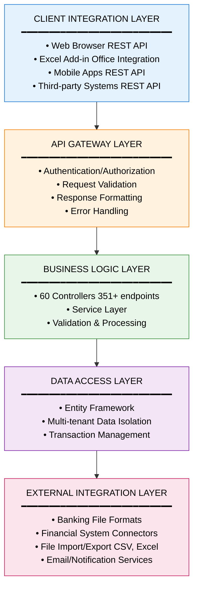
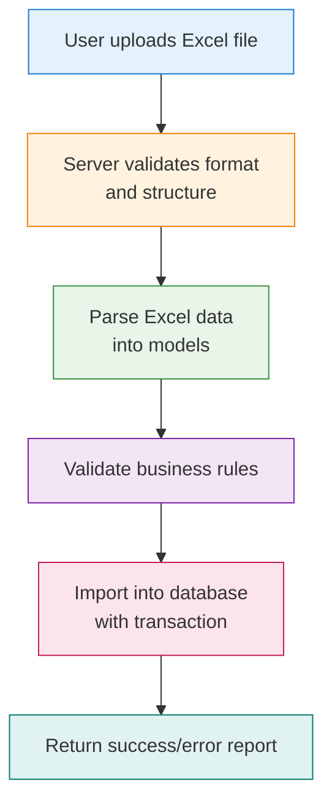
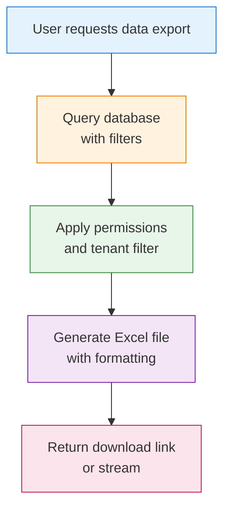
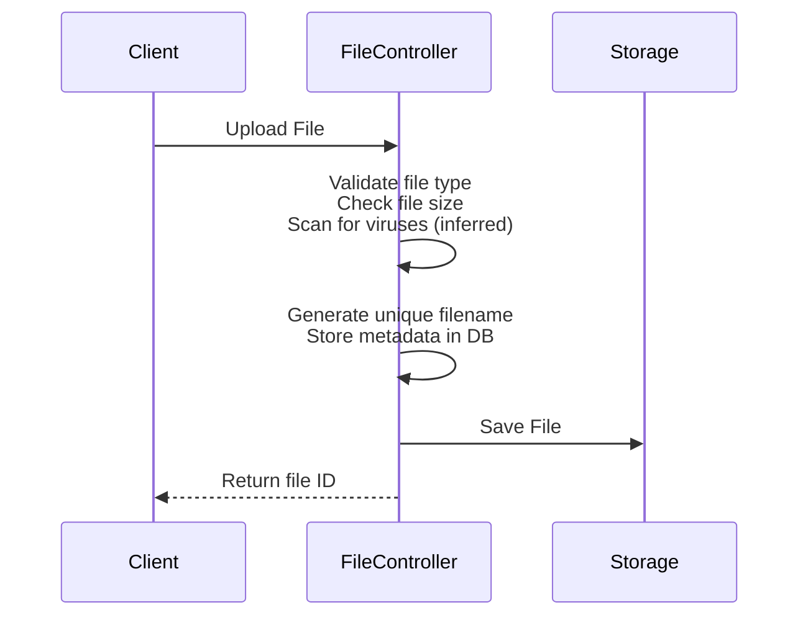
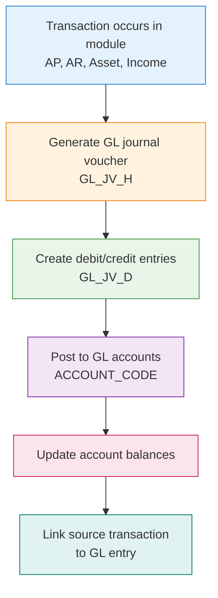

# Carmen.NET Integration Architecture

**Document Version**: 1.0
**Last Updated**: 2025-10-06
**Status**: Phase 2 Analysis

---

## Executive Summary

Carmen.NET implements a comprehensive multi-layered integration architecture supporting REST APIs, file-based imports/exports, financial system integration, and multi-tenant data exchange. The system provides 351+ REST API endpoints across 60 controllers with standardized JSON responses, Excel integration capabilities, and financial data interchange formats.

---

## 1. Integration Overview

### 1.1 Integration Layers



### 1.2 Integration Patterns

**Supported Integration Types**:
1. **Synchronous REST API**: Real-time request/response
2. **File-Based Integration**: Batch import/export (CSV, Excel)
3. **Database Integration**: Direct database access (multi-tenant aware)
4. **Financial Interchange**: Banking file formats (WHT, payment files)

---

## 2. REST API Integration

### 2.1 API Architecture

**API Endpoint Structure**:
```
https://{domain}/api/{module}/{entity}/{action}
```

**Example Endpoints**:
- `POST /api/login` - Authentication
- `GET /api/ap/invoice/list` - List AP invoices
- `POST /api/ap/invoice/create` - Create AP invoice
- `PUT /api/ap/invoice/update` - Update AP invoice
- `DELETE /api/ap/invoice/delete/{id}` - Delete AP invoice

### 2.2 API Endpoint Inventory

**Total Endpoints**: 351+
**Controllers**: 60

**Endpoint Distribution by Module**:

| Module | Controllers | Estimated Endpoints | Order Range |
|--------|-------------|---------------------|-------------|
| **Authentication** | 2 | 5-10 | 0, 4 |
| **System Admin** | 15+ | 80-100 | 1-20 |
| **Accounts Payable** | 7 | 40-50 | 200-299 |
| **Accounts Receivable** | 9 | 50-60 | 300-399 |
| **General Ledger** | 5 | 30-40 | 400-499 |
| **Asset Management** | 6 | 35-45 | 500-599 |
| **Income/Revenue** | 5 | 30-40 | 600-699 |
| **Tax & Compliance** | 3+ | 20-30 | Various |

### 2.3 Request/Response Patterns

**Standard Request Headers**:
```http
POST /api/ap/invoice/create HTTP/1.1
Host: example.com
Content-Type: application/json
Authorization: Bearer {token}
Accept: application/json
```

**Request Body Pattern** (Create/Update):
```json
{
  "useTenant": true,
  "data": {
    "invhInvNo": "INV-2025-001",
    "invhDate": "2025-10-06",
    "vnCode": "VN001",
    "invhAmt": 10000.00,
    "invhTaxAmt": 700.00,
    "invhDesc": "Invoice description"
  }
}
```

**Success Response Pattern**:
```json
{
  "success": true,
  "code": "OK",
  "message": "Operation completed successfully",
  "data": {
    "invhId": 12345,
    "invhInvNo": "INV-2025-001",
    "invhStatus": 0
  }
}
```

**Error Response Pattern**:
```json
{
  "success": false,
  "code": "VALIDATION_ERROR",
  "message": "Validation failed",
  "errors": [
    {
      "field": "invhAmt",
      "message": "Amount must be greater than zero"
    }
  ]
}
```

**Forbidden Response Pattern** (Permission denied):
```json
{
  "success": false,
  "code": "FORBIDDEN",
  "message": "You do not have permission to perform this action",
  "module": "AP.Invoice",
  "action": "Create"
}
```

### 2.4 API Authentication Flow

```
┌─────────┐                           ┌──────────────┐
│ Client  │                           │   Server     │
└────┬────┘                           └──────┬───────┘
     │                                       │
     │  1. POST /api/login                  │
     │  { username, password }              │
     ├──────────────────────────────────────▶│
     │                                       │
     │  2. Validate credentials              │
     │     Generate JWT token                │
     │                                       │
     │  3. Return token                      │
     │◀──────────────────────────────────────┤
     │  { token: "eyJ..." }                  │
     │                                       │
     │  4. Subsequent requests               │
     │  Authorization: Bearer eyJ...         │
     ├──────────────────────────────────────▶│
     │                                       │
     │  5. Validate token                    │
     │     Check permissions                 │
     │     Apply tenant context              │
     │                                       │
     │  6. Return response                   │
     │◀──────────────────────────────────────┤
     │                                       │
```

### 2.5 Multi-Tenant API Routing

**Tenant Context Handling**:
```csharp
// All API requests include tenant context
public async Task<IHttpActionResult> GetInvoices(bool useTenant)
{
    // Apply tenant filter
    FncBase.ApplyTenantIfUseTenant(useTenant);

    // Data automatically filtered by tenant
    var invoices = await GetInvoicesFromDatabase();

    return this.JsonResultOk(invoices);
}
```

**Tenant Isolation Pattern**:
- Every API call accepts `useTenant` parameter
- Tenant context extracted from authentication token
- Database queries automatically filtered by tenant
- No cross-tenant data leakage

---

## 3. File-Based Integration

### 3.1 Excel Integration

**ExcelController** (Order: 1000):
- Excel file import/export
- Template generation
- Data validation
- Multi-sheet support

**Excel Import Pattern**:


**Excel Export Pattern**:


**Supported Excel Operations**:
- **Import**: Vendors, customers, invoices, receipts, GL accounts
- **Export**: Reports, transaction lists, master data
- **Templates**: Pre-formatted templates for batch data entry

### 3.2 CSV Import/Export

**CSV Import Controller Pattern** (inferred):
```csharp
[HttpPost]
[Route("api/import/csv")]
public async Task<IHttpActionResult> ImportCsv(CsvImportRequest request)
{
    // 1. Validate file format
    // 2. Parse CSV data
    // 3. Validate each row
    // 4. Import with transaction
    // 5. Return import summary
}
```

**CSV Export Controller Pattern** (inferred):
```csharp
[HttpGet]
[Route("api/export/csv")]
public async Task<IHttpActionResult> ExportCsv(CsvExportRequest request)
{
    // 1. Apply filters and permissions
    // 2. Query data
    // 3. Format as CSV
    // 4. Return CSV file
}
```

### 3.3 File Upload/Download

**FileController** (Order: 1010):
- File upload handling
- File storage management
- Download link generation
- File type validation

**Upload Flow**:


---

## 4. Financial System Integration

### 4.1 Banking Integration

**Withholding Tax (WHT) File Generation**:
- **ApWhtController** (Order: 220)
- Generate WHT file formats for tax authorities
- Support multiple WHT file formats
- Compliance with local tax regulations

**WHT File Format Pattern** (inferred):
```
Header Record
  - Company information
  - Tax period
  - Total WHT amount

Detail Records (for each vendor)
  - Vendor tax ID
  - Invoice reference
  - WHT amount
  - WHT rate
  - Income type

Trailer Record
  - Total records
  - Total amount
  - Checksum
```

**Payment File Integration**:
- **ApPaymentController** (Order: 210)
- Generate bank payment files
- Support multiple bank formats
- Payment reconciliation

**Payment File Format Pattern** (inferred):
```
Header
  - Company bank account
  - Payment date
  - Total payment amount

Payment Details
  - Vendor bank account
  - Payment amount
  - Payment reference
  - Vendor name

Trailer
  - Total payments
  - Total amount
  - File checksum
```

### 4.2 Financial Reporting Integration

**ReportController** (Order: 800-899 range):
- Financial statement generation
- Custom report generation
- Report scheduling
- Export to PDF/Excel

**Report Types** (inferred from module structure):
- Trial Balance
- Profit & Loss Statement
- Balance Sheet
- Cash Flow Statement
- Aged Payables/Receivables
- Tax Reports
- Management Reports

### 4.3 General Ledger Integration

**GL Posting Pattern**:


**GL Integration Points**:

| Source Module | Transaction Type | GL Impact |
|---------------|------------------|-----------|
| **AP** | Invoice | DR: Expense/Asset, CR: AP Payable |
| **AP** | Payment | DR: AP Payable, CR: Cash/Bank |
| **AP** | WHT | DR: WHT Receivable, CR: Expense |
| **AR** | Invoice | DR: AR Receivable, CR: Revenue |
| **AR** | Receipt | DR: Cash/Bank, CR: AR Receivable |
| **Asset** | Purchase | DR: Asset, CR: Cash/AP |
| **Asset** | Depreciation | DR: Depreciation Expense, CR: Accumulated Depreciation |
| **Income** | Revenue | DR: Cash/AR, CR: Revenue |

---

## 5. Database Integration

### 5.1 Multi-Tenant Database Architecture

**Database Isolation Patterns** (inferred):

**Pattern 1: Shared Database with Tenant Column**:
```sql
-- All tables include TenantId column
SELECT * FROM AP_INVOICE_H
WHERE TenantId = @CurrentTenantId
  AND InvhStatus = @Status
```

**Pattern 2: Tenant-Specific Schema**:
```sql
-- Each tenant has separate schema
SELECT * FROM [Tenant001].AP_INVOICE_H
WHERE InvhStatus = @Status
```

**Pattern 3: Separate Database per Tenant**:
```sql
-- Each tenant has separate database
-- Connection string switched based on tenant context
USE Carmen_Tenant001
SELECT * FROM AP_INVOICE_H
WHERE InvhStatus = @Status
```

### 5.2 Database Access Patterns

**Entity Framework Pattern**:
```csharp
public async Task<List<ApInvoiceH>> GetInvoices(bool useTenant)
{
    // Apply tenant context
    FncBase.ApplyTenantIfUseTenant(useTenant);

    // EF query automatically filtered by tenant
    using (var context = new CarmenDbContext())
    {
        return await context.ApInvoiceH
            .Where(x => x.InvhStatus == status)
            .ToListAsync();
    }
}
```

### 5.3 Database Integration Security

**Security Measures**:
- ✅ Parameterized queries (SQL injection prevention)
- ✅ Tenant isolation at query level
- ✅ Row-level security enforcement
- ✅ Encrypted connections (TLS/SSL)
- ✅ Minimal privilege database accounts

---

## 6. Integration Patterns & Best Practices

### 6.1 RESTful Design Principles

**Resource-Based URLs**:
```
✅ Good: /api/ap/invoice/{id}
❌ Bad:  /api/getInvoice?id=123

✅ Good: POST /api/ap/invoice
❌ Bad:  GET /api/createInvoice

✅ Good: PUT /api/ap/invoice/{id}
❌ Bad:  POST /api/updateInvoice
```

**HTTP Method Usage**:
- `GET` - Retrieve resources (list, detail)
- `POST` - Create new resources
- `PUT` - Update existing resources
- `DELETE` - Delete resources
- `PATCH` - Partial update (if implemented)

### 6.2 Error Handling Patterns

**Standardized Error Responses**:
```csharp
// BaseApiController pattern (858 lines)
try {
    // Business logic
    return this.JsonResultOk(data);
}
catch (ValidationException vex) {
    return this.JsonResultBadRequest(vex.Message);
}
catch (UnauthorizedException uex) {
    return this.JsonResultUnauthorized(uex.Message);
}
catch (ForbiddenException fex) {
    return this.JsonResultForbidden(message, module, action);
}
catch (Exception ex) {
    LogHttpResult.Error(ex);
    return this.JsonResultInternalError(ex);
}
```

**HTTP Status Code Usage**:
- `200 OK` - Success
- `201 Created` - Resource created
- `400 Bad Request` - Validation error
- `401 Unauthorized` - Authentication required
- `403 Forbidden` - Permission denied
- `404 Not Found` - Resource not found
- `500 Internal Server Error` - Server error

### 6.3 Data Validation Patterns

**Model Validation** (597 models):
```csharp
// Request model with validation attributes
public class CreateInvoiceRequest
{
    [Required]
    [StringLength(50)]
    public string InvhInvNo { get; set; }

    [Required]
    public DateTime InvhDate { get; set; }

    [Required]
    [Range(0.01, double.MaxValue)]
    public decimal InvhAmt { get; set; }
}
```

**Business Rule Validation**:
```csharp
// Controller-level validation
public async Task<IHttpActionResult> CreateInvoice(CreateInvoiceRequest request)
{
    // 1. Model validation (automatic)
    if (!ModelState.IsValid)
        return this.JsonResultBadRequest(ModelState);

    // 2. Permission check
    var permission = await FncPermission.GetPermissionInfoByPermissionNameAsync("AP.Invoice");
    if (!permission.Create)
        return this.JsonResultForbidden("", "AP.Invoice", "Create");

    // 3. Business rule validation
    if (await InvoiceAlreadyExists(request.InvhInvNo))
        return this.JsonResultBadRequest("Invoice number already exists");

    // 4. Create invoice
    var result = await CreateInvoiceInDatabase(request);
    return this.JsonResultOk(result);
}
```

### 6.4 Transaction Management

**Transaction Pattern** (inferred):
```csharp
public async Task<IHttpActionResult> CreateInvoiceWithDetails(InvoiceRequest request)
{
    using (var transaction = context.Database.BeginTransaction())
    {
        try
        {
            // 1. Create invoice header
            var header = await CreateInvoiceHeader(request.Header);

            // 2. Create invoice details
            foreach (var detail in request.Details)
            {
                detail.InvhId = header.InvhId;
                await CreateInvoiceDetail(detail);
            }

            // 3. Create GL journal voucher
            await CreateGLJournal(header);

            // 4. Commit transaction
            transaction.Commit();

            return this.JsonResultOk(header);
        }
        catch (Exception ex)
        {
            transaction.Rollback();
            LogHttpResult.Error(ex);
            return this.JsonResultInternalError(ex);
        }
    }
}
```

---

## 7. API Documentation & Discovery

### 7.1 Swagger/NSwag Integration

**Swagger Configuration**:
- All controllers documented with Swagger attributes
- SwaggerControllerOrder attribute for organization
- Automatic API documentation generation
- Interactive API testing UI

**Swagger UI Access** (inferred):
```
https://{domain}/swagger
```

**Swagger Annotations Example**:
```csharp
[SwaggerControllerOrder(200)]
[Route("api/ap/invoice")]
public class ApInvoiceController : BaseApiController
{
    [HttpGet]
    [Route("list")]
    [SwaggerOperation("GetInvoiceList")]
    [SwaggerResponse(200, "Success", typeof(List<ViewApInvoice>))]
    [SwaggerResponse(403, "Forbidden")]
    public async Task<IHttpActionResult> GetList(bool useTenant)
    {
        // Implementation
    }
}
```

### 7.2 API Versioning

**Versioning Strategy** (inferred):
- Version in URL: `/api/v1/ap/invoice`
- Version in header: `Api-Version: 1.0`
- Backward compatibility maintained

### 7.3 API Discovery

**Controller Discovery by Order**:

| Order Range | Module | Purpose |
|-------------|--------|---------|
| 0-10 | Authentication | Login, tokens, session |
| 11-99 | System Admin | Users, roles, permissions, tenants |
| 100-199 | Configuration | Settings, preferences |
| 200-299 | Accounts Payable | AP workflows |
| 300-399 | Accounts Receivable | AR workflows |
| 400-499 | General Ledger | GL operations |
| 500-599 | Asset Management | Asset tracking |
| 600-699 | Income/Revenue | Revenue management |
| 800-899 | Reporting | Financial reports |
| 1000+ | Utilities | Excel, files, utilities |

---

## 8. Integration Security

### 8.1 API Security Layers

**Layer 1: Network Security**:
- HTTPS/TLS encryption (inferred)
- Firewall rules
- DDoS protection

**Layer 2: Authentication**:
- Token-based authentication (JWT)
- Token expiration and refresh
- Secure token storage

**Layer 3: Authorization**:
- RBAC permission checks
- Resource-level access control
- Tenant isolation

**Layer 4: Input Validation**:
- Model validation
- SQL injection prevention
- XSS prevention
- Request size limits

**Layer 5: Output Security**:
- Sensitive data filtering
- Error message sanitization
- No stack traces in production

### 8.2 Rate Limiting & Throttling

**Recommended Implementation** (not currently detected):
```csharp
// Rate limiting pattern
[RateLimit(MaxRequests = 100, TimeWindow = 60)] // 100 requests per minute
public class ApInvoiceController : BaseApiController
{
    // Controllers
}
```

### 8.3 CORS Configuration

**CORS Policy** (inferred):
```csharp
// Allow specific origins
services.AddCors(options =>
{
    options.AddPolicy("CarmenPolicy", builder =>
    {
        builder.WithOrigins("https://carmen-client.com")
               .AllowAnyMethod()
               .AllowAnyHeader()
               .AllowCredentials();
    });
});
```

---

## 9. Integration Monitoring & Logging

### 9.1 Request/Response Logging

**Logging Pattern** (found in all controllers):
```csharp
try
{
    LogHttpRequest.Info($"{this.GetType().Name} : GetInvoiceList");

    // Business logic
    var result = await GetInvoices(useTenant);

    return this.JsonResultOk(result);
}
catch (Exception e)
{
    LogHttpResult.Error(e);
    return this.JsonResultInternalError(e);
}
```

**Logged Information**:
- Request timestamp
- Controller and method name
- User/tenant context
- Request parameters
- Response status
- Error details (if any)
- Execution time (inferred)

### 9.2 Integration Metrics

**Recommended Metrics** (for monitoring):
- API response time (P50, P95, P99)
- API error rate
- Request volume per endpoint
- Authentication failure rate
- Permission denial rate
- File upload/download success rate
- Database query performance

### 9.3 Process Logging

**ProcessLogController** (Order: 1020):
- Action logging (`EnumLogAction`)
- User activity tracking
- Integration event logging
- Audit trail

---

## 10. Integration Points Summary

### 10.1 Inbound Integrations

**Client Applications → Carmen.NET**:
- Web browser via REST API
- Excel Add-in via REST API
- Mobile apps via REST API
- Third-party systems via REST API

**File Uploads → Carmen.NET**:
- Excel files (vendors, invoices, etc.)
- CSV files (batch import)
- Banking files (payment reconciliation)

**External Systems → Carmen.NET**:
- Banking systems (payment files, bank statements)
- Tax systems (WHT file submission)

### 10.2 Outbound Integrations

**Carmen.NET → Client Applications**:
- JSON responses via REST API
- Excel file downloads
- CSV file exports
- PDF reports

**Carmen.NET → External Systems**:
- Banking payment files
- WHT tax files
- Financial reports
- Email notifications (inferred)

**Carmen.NET → General Ledger**:
- GL journal vouchers from all modules
- Automatic GL posting

---

## 11. Integration Architecture Patterns

### 11.1 Design Patterns Observed

**1. API Gateway Pattern**:
- Single entry point for all API requests
- Centralized authentication/authorization
- Request routing to appropriate controllers

**2. Repository Pattern** (inferred):
- Data access abstraction
- Entity Framework as ORM
- Separation of data logic from business logic

**3. DTO (Data Transfer Object) Pattern**:
- View models for responses (View*)
- Parameter models for requests (Param*)
- Separation of internal models from API contracts

**4. Unit of Work Pattern** (inferred):
- Transaction management
- Coordinated database operations
- Rollback on failure

**5. Request-Response Pattern**:
- Standardized JSON responses
- Consistent error handling
- HTTP status code conventions

### 11.2 Integration Anti-Patterns to Avoid

**❌ Tight Coupling**:
- Direct database access from clients
- Hard-coded connection strings in clients
- Client-side business logic

**❌ Chatty APIs**:
- Multiple requests to fetch related data
- N+1 query problems
- Inefficient data transfer

**❌ Security Issues**:
- Sensitive data in URLs
- Authentication tokens in query strings
- Unencrypted data transmission

---

## 12. Integration Best Practices

### 12.1 API Design Best Practices

✅ **Implemented**:
- RESTful resource naming
- HTTP method semantics
- Consistent response format
- Comprehensive error handling
- Authentication/authorization
- Multi-tenant isolation

⚠️ **Recommended Enhancements**:
- API versioning strategy
- Rate limiting implementation
- Request/response compression
- Caching headers
- HATEOAS (Hypermedia links)
- Pagination for large datasets

### 12.2 File Integration Best Practices

✅ **Implemented**:
- File type validation
- File upload handling
- Excel import/export

⚠️ **Recommended Enhancements**:
- File size limits
- Virus scanning
- Asynchronous file processing
- Progress tracking for large files
- File retention policies

### 12.3 Database Integration Best Practices

✅ **Implemented**:
- Parameterized queries
- Multi-tenant isolation
- Transaction management
- Connection pooling (EF default)

⚠️ **Recommended Enhancements**:
- Database connection retry logic
- Query performance monitoring
- Slow query logging
- Database migration versioning

---

## 13. Integration Testing Strategy

### 13.1 API Testing Levels

**Unit Testing**:
- Controller action methods
- Request/response models
- Validation logic

**Integration Testing**:
- API endpoint end-to-end
- Database interactions
- Multi-tenant isolation
- Permission checks

**Contract Testing**:
- API contract validation
- Request/response schema validation
- Backward compatibility

**Load Testing**:
- Concurrent user simulation
- Performance benchmarking
- Scalability testing

### 13.2 Testing Tools (Recommended)

**API Testing**:
- Postman collections
- Swagger UI
- RestSharp (C#)
- xUnit/NUnit

**File Integration Testing**:
- Sample Excel files
- CSV test data
- File format validators

**Database Testing**:
- Entity Framework test utilities
- In-memory database (testing)
- Transaction rollback (cleanup)

---

## 14. Integration Performance Optimization

### 14.1 API Performance Patterns

**Caching Strategies**:
- Response caching for read-heavy endpoints
- ETags for conditional requests
- Client-side caching headers

**Query Optimization**:
- Eager loading vs. lazy loading
- Pagination for large datasets
- Filtering at database level
- Index optimization

**Async/Await Pattern** (already implemented):
```csharp
public async Task<IHttpActionResult> GetInvoices(bool useTenant)
{
    var invoices = await GetInvoicesAsync(useTenant);
    return this.JsonResultOk(invoices);
}
```

### 14.2 File Processing Optimization

**Batch Processing**:
- Asynchronous file import for large files
- Progress tracking and reporting
- Chunk-based processing

**Streaming**:
- Stream large file downloads
- Avoid loading entire file in memory
- Resume capability for large files

---

## 15. Compliance & Standards

### 15.1 API Standards Compliance

**REST Maturity Model**:
- ✅ Level 0: HTTP as transport (Basic)
- ✅ Level 1: Resources (Resource URIs)
- ✅ Level 2: HTTP Methods (GET, POST, PUT, DELETE)
- ⚠️ Level 3: HATEOAS (Hypermedia controls) - Not implemented

**JSON API Specification**:
- ✅ Consistent JSON structure
- ✅ Error response format
- ✅ Resource identification

### 15.2 Financial Integration Standards

**Banking File Formats**:
- Support for local banking standards
- Payment file format compliance
- Bank reconciliation standards

**Tax Compliance**:
- WHT file format compliance
- Tax reporting standards
- Regulatory requirement adherence

---

## Conclusion

Carmen.NET implements a **comprehensive integration architecture** with:

✅ **REST API**: 351+ endpoints across 60 controllers with standardized JSON responses
✅ **File Integration**: Excel and CSV import/export with validation
✅ **Financial Integration**: Banking payment files, WHT files, GL posting
✅ **Multi-Tenant Support**: Tenant isolation across all integration points
✅ **Security**: Token-based authentication, RBAC, input validation
✅ **Database Integration**: Entity Framework with multi-tenant awareness
✅ **Logging & Monitoring**: Comprehensive request/response logging

**Integration Maturity**: **STRONG** with opportunities for enhancement in rate limiting, caching, asynchronous processing, and API versioning.

---

**Document Generated**: 2025-10-06
**Analysis Phase**: Phase 2 - Architecture & Data Modeling
**Next**: System Architecture Documentation
