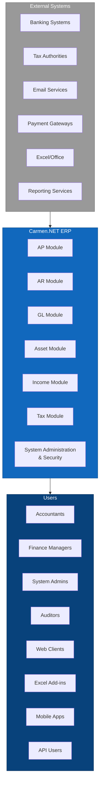
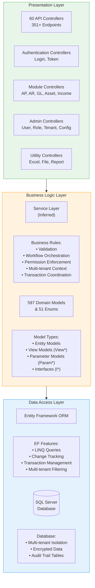
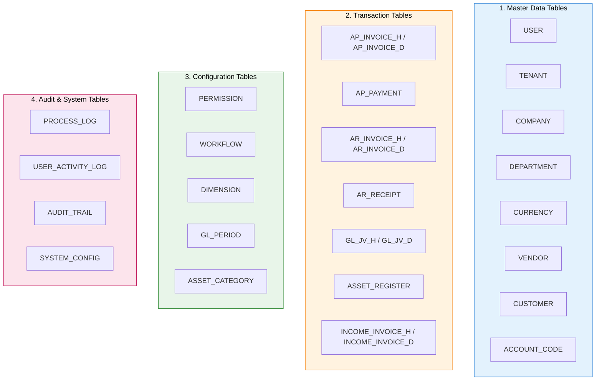
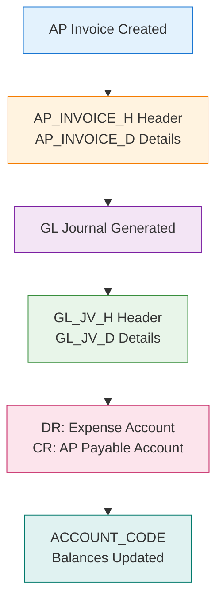
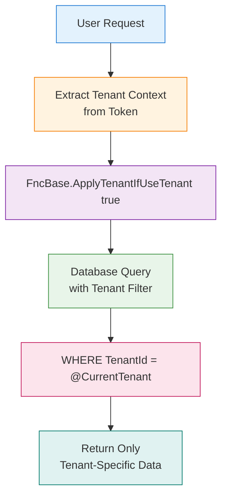
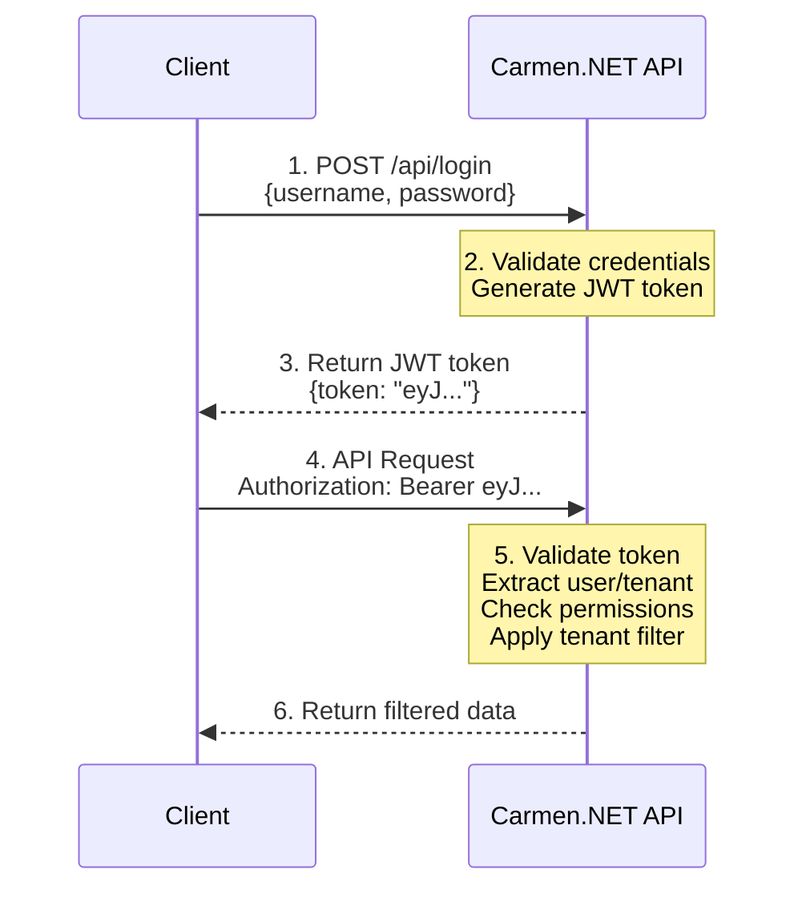
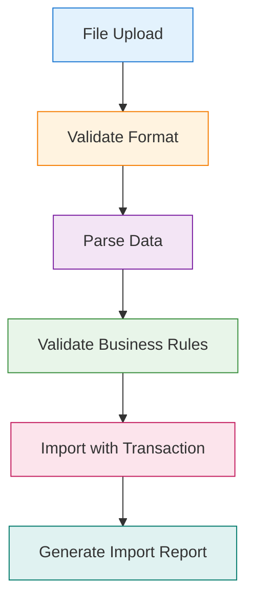
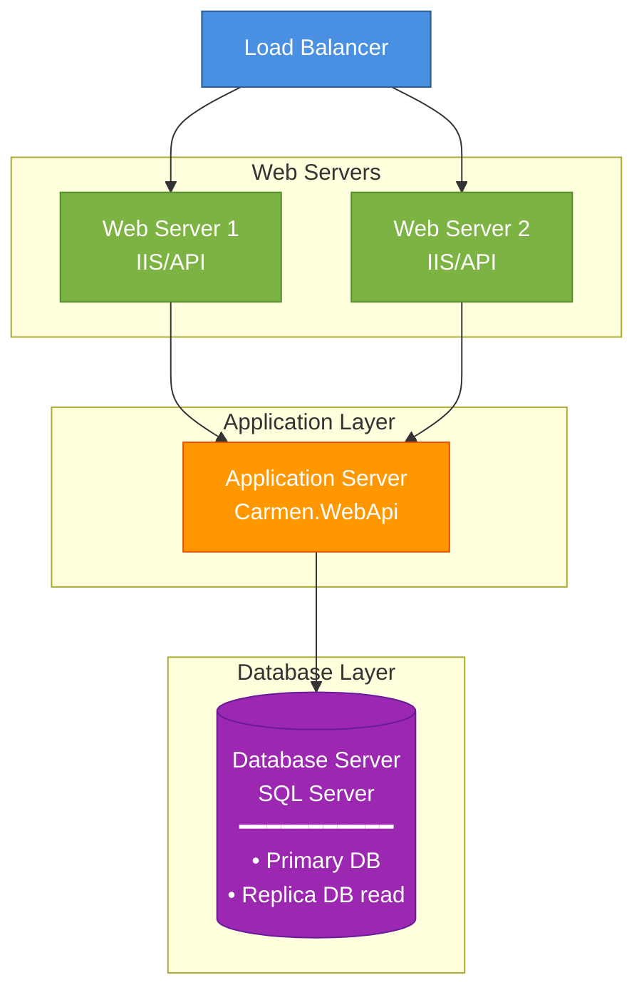

# Carmen.NET System Architecture

**Document Version**: 1.0
**Last Updated**: 2025-10-06
**Status**: Phase 2 Complete

---

## Executive Summary

Carmen.NET is a comprehensive multi-tenant financial ERP system built on .NET Framework with ASP.NET Web API. The system implements a 3-tier architecture with strict separation of concerns, role-based access control, and multi-tenant data isolation. With 11 core modules, 351+ API endpoints, and 597 data models, the system provides complete financial management capabilities from accounts payable/receivable to asset management and financial reporting.

**Architecture Highlights**:
- **3-Tier Architecture**: Presentation (API) → Business Logic → Data Access
- **Multi-Tenant**: Isolated data and operations per tenant
- **Security**: Token-based authentication, RBAC, encryption
- **Scalability**: REST API design, stateless architecture
- **Integration**: 351+ REST endpoints, Excel/CSV, banking files

---

## 1. System Context

### 1.1 System Landscape



### 1.2 System Scope

**In Scope**:
- ✅ Financial accounting (AP, AR, GL)
- ✅ Asset management and depreciation
- ✅ Income and revenue recognition
- ✅ Tax management and compliance
- ✅ Financial reporting
- ✅ Multi-tenant operations
- ✅ User and permission management
- ✅ Workflow and approval processes

**Out of Scope**:
- ❌ Human Resources Management
- ❌ Inventory Management (beyond asset tracking)
- ❌ Manufacturing/Production
- ❌ CRM functionality
- ❌ Supply Chain Management

---

## 2. High-Level Architecture

### 2.1 Architectural Style

**Primary Pattern**: 3-Tier Layered Architecture
**Secondary Patterns**: RESTful API, Multi-Tenant SaaS, RBAC



### 2.2 Architectural Principles

**1. Separation of Concerns**:
- Presentation layer handles HTTP and API concerns
- Business logic layer enforces rules and workflows
- Data access layer manages persistence

**2. Single Responsibility**:
- Each controller handles one domain entity or workflow
- Each model represents one concept
- Each service has one clear purpose

**3. Dependency Inversion**:
- Controllers depend on interfaces, not concrete implementations
- Service layer abstracts data access
- Pluggable components via interfaces

**4. Open/Closed Principle**:
- Extensible through inheritance and interfaces
- Closed for modification through stable base classes
- New features added without changing existing code

**5. Interface Segregation**:
- 104+ interface definitions (I* models)
- Clients depend only on interfaces they use
- Small, focused interfaces over large monolithic ones

---

## 3. Component Architecture

### 3.1 Project Structure

**Carmen.NET Solution** (28 projects):

```mermaid
graph TD
    Root["Carmen.NET/"]

    Root --> WebApi["Carmen.WebApi/<br/>API Layer (Main)"]
    Root --> Domain["Carmen.Domain/<br/>Domain Layer"]
    Root --> Business["Carmen.Business/<br/>Business Logic Layer"]
    Root --> Data["Carmen.Data/<br/>Data Access Layer"]
    Root --> Crypto["Carmen.Crypto/<br/>Security Library"]
    Root --> Common["Carmen.Common/<br/>Shared Utilities"]
    Root --> Tests["Carmen.Tests/<br/>Test Projects"]

    WebApi --> Controllers["Controllers/<br/>60 API Controllers"]
    WebApi --> Areas["Areas/<br/>Additional API areas"]
    WebApi --> AppStart["App_Start/<br/>Configuration"]
    WebApi --> WebConfig["Web.config<br/>API configuration"]

    Controllers --> Auth["Authentication/<br/>Login, Token"]
    Controllers --> AP["AP/<br/>Accounts Payable<br/>(7 controllers)"]
    Controllers --> AR["AR/<br/>Accounts Receivable<br/>(9 controllers)"]
    Controllers --> GL["GL/<br/>General Ledger<br/>(5 controllers)"]
    Controllers --> Asset["Asset/<br/>Asset Management<br/>(6 controllers)"]
    Controllers --> Income["Income/<br/>Income/Revenue<br/>(5 controllers)"]
    Controllers --> Admin["Admin/<br/>System Admin<br/>(15+ controllers)"]

    Domain --> DomainModels["Models/<br/>597 domain models"]
    Domain --> Enums["Enums/<br/>51 enumerations"]

    DomainModels --> Entities["Entities/<br/>Database entities"]
    DomainModels --> Views["Views/<br/>View models (View*)"]
    DomainModels --> Params["Params/<br/>Request models (Param*)"]
    DomainModels --> Interfaces["Interfaces/<br/>Interface definitions (I*)"]

    Business --> Services["Services/<br/>Business services"]
    Business --> Validators["Validators/<br/>Validation logic"]
    Business --> Workflows["Workflows/<br/>Workflow orchestration"]

    Data --> Context["Context/<br/>EF DbContext"]
    Data --> Repositories["Repositories/<br/>Data repositories"]
    Data --> Migrations["Migrations/<br/>Database migrations"]

    Crypto --> Encryption["Encryption/<br/>Encryption services"]
    Crypto --> Decryption["Decryption/<br/>Decryption services"]

    Common --> Helpers["Helpers/<br/>Helper utilities"]
    Common --> Extensions["Extensions/<br/>Extension methods"]
    Common --> Constants["Constants/<br/>Shared constants"]

    Tests --> Unit["Unit/<br/>Unit tests"]
    Tests --> Integration["Integration/<br/>Integration tests"]
    Tests --> APITests["API/<br/>API tests"]

    style Root fill:#e1f5ff,stroke:#0288d1
    style WebApi fill:#e8f5e9,stroke:#4caf50
    style Domain fill:#fff3e0,stroke:#ff9800
    style Business fill:#f3e5f5,stroke:#9c27b0
    style Data fill:#e3f2fd,stroke:#2196f3
    style Crypto fill:#fce4ec,stroke:#e91e63
    style Common fill:#fff9c4,stroke:#fbc02d
    style Tests fill:#e0f2f1,stroke:#009688
```



### 3.2 Module Component Breakdown

**Accounts Payable (AP) Module**:
```
AP Module Components
│
├── Controllers (7)
│   ├── ApInvoiceController          (Order: 200) - Invoice management
│   ├── ApPaymentController          (Order: 210) - Payment processing
│   ├── ApWhtController              (Order: 220) - Withholding tax
│   ├── ApVendorController           (Order: 230) - Vendor management
│   ├── ApRequisitionController      (Order: 240) - Purchase requisition
│   ├── ApPurchaseOrderController    (Order: 250) - Purchase orders
│   └── ApReceivingController        (Order: 260) - Goods receiving
│
├── Models
│   ├── Entities (AP_INVOICE_H, AP_INVOICE_D, AP_PAYMENT, etc.)
│   ├── Views (ViewApInvoice, ViewApPayment, etc.)
│   └── Params (ParamApInvoice, ParamApPayment, etc.)
│
└── Database Tables
    ├── AP_INVOICE_H                 # Invoice header
    ├── AP_INVOICE_D                 # Invoice details
    ├── AP_PAYMENT                   # Payments
    ├── AP_WHT                       # Withholding tax
    └── VENDOR                       # Vendor master
```

**Accounts Receivable (AR) Module**:
```
AR Module Components
│
├── Controllers (9)
│   ├── ArInvoiceController          (Order: 300) - AR invoicing
│   ├── ArReceiptController          (Order: 310) - Receipt processing
│   ├── ArContractController         (Order: 320) - Contract management
│   ├── ArFolioController            (Order: 330) - Folio management
│   ├── ArCustomerController         (Order: 340) - Customer management
│   ├── ArDepositController          (Order: 350) - Deposit handling
│   ├── ArCreditNoteController       (Order: 360) - Credit notes
│   ├── ArDebitNoteController        (Order: 370) - Debit notes
│   └── ArWriteOffController         (Order: 380) - Write-offs
│
├── Models
│   ├── Entities (AR_INVOICE_H, AR_INVOICE_D, AR_RECEIPT, etc.)
│   ├── Views (ViewArInvoice, ViewArReceipt, etc.)
│   └── Params (ParamArInvoice, ParamArReceipt, etc.)
│
└── Database Tables
    ├── AR_INVOICE_H                 # Invoice header
    ├── AR_INVOICE_D                 # Invoice details
    ├── AR_RECEIPT                   # Receipts
    ├── AR_CONTRACT                  # Contracts
    ├── AR_FOLIO                     # Folios
    └── CUSTOMER                     # Customer master
```

**General Ledger (GL) Module**:
```
GL Module Components
│
├── Controllers (5)
│   ├── AccountCodeController        (Order: 400) - Chart of accounts
│   ├── GlJvController               (Order: 410) - Journal vouchers
│   ├── GlJvFrController             (Order: 420) - Foreign JV
│   ├── GlPeriodController           (Order: 430) - Period management
│   ├── GlAllocationJvController     (Order: 440) - Allocation JV
│   └── GlAmortizeController         (Order: 450) - Amortization
│
├── Models
│   ├── Entities (ACCOUNT_CODE, GL_JV_H, GL_JV_D, etc.)
│   ├── Views (ViewGlJv, ViewAccountCode, etc.)
│   └── Params (ParamGlJv, ParamGlPeriod, etc.)
│
└── Database Tables
    ├── ACCOUNT_CODE                 # Chart of accounts
    ├── GL_JV_H                      # Journal voucher header
    ├── GL_JV_D                      # Journal voucher details
    ├── GL_PERIOD                    # Accounting periods
    ├── GL_ALLOCATION_JV_H           # Allocation header
    └── GL_AMORTIZE                  # Amortization
```

**Asset Management Module**:
```
Asset Module Components
│
├── Controllers (6)
│   ├── AssetRegisterController      (Order: 500) - Asset register
│   ├── AssetCategoryController      (Order: 510) - Asset categories
│   ├── AssetDisposalController      (Order: 520) - Asset disposal
│   ├── AssetHistoryController       (Order: 530) - Asset history
│   ├── AssetLocationController      (Order: 540) - Asset locations
│   └── AssetDepartmentController    (Order: 550) - Asset departments
│
├── Models
│   ├── Entities (ASSET_REGISTER, ASSET_CATEGORY, etc.)
│   ├── Views (ViewAsset, ViewAssetDisposal, etc.)
│   └── Params (ParamAsset, ParamAssetDisposal, etc.)
│
└── Database Tables
    ├── ASSET_REGISTER               # Asset master
    ├── ASSET_CATEGORY               # Asset categories
    ├── ASSET_DISPOSAL               # Disposal records
    ├── ASSET_HISTORY                # Asset history
    ├── ASSET_LOCATION               # Asset locations
    └── ASSET_DEPARTMENT             # Asset departments
```

**Income/Revenue Module**:
```
Income Module Components
│
├── Controllers (5)
│   ├── IncomeInvoiceController      (Order: 600) - Income invoicing
│   ├── IncomeRevenueController      (Order: 610) - Revenue recognition
│   ├── IncomeProductController      (Order: 620) - Product management
│   ├── IncomeCategoryController     (Order: 630) - Income categories
│   └── IncomeSourceController       (Order: 640) - Income sources
│
├── Models
│   ├── Entities (INCOME_INVOICE, INCOME_REVENUE, etc.)
│   ├── Views (ViewIncomeInvoice, ViewIncomeRevenue, etc.)
│   └── Params (ParamIncomeInvoice, ParamIncomeRevenue, etc.)
│
└── Database Tables
    ├── INCOME_INVOICE_H             # Invoice header
    ├── INCOME_INVOICE_D             # Invoice details
    ├── INCOME_REVENUE               # Revenue records
    ├── INCOME_PRODUCT               # Product master
    ├── INCOME_CATEGORY              # Income categories
    └── INCOME_SOURCE                # Income sources
```

---

## 4. Data Architecture

### 4.1 Data Model Overview

**Total Models**: 597
**Enumerations**: 51
**Interfaces**: 104+ (I* pattern)

**Model Categories**:
- **Entity Models**: Database-mapped entities
- **View Models**: API response DTOs (View*)
- **Parameter Models**: API request DTOs (Param*)
- **Interface Models**: Contracts and abstractions (I*)

### 4.2 Database Schema Overview

**Core Entity Groups**:



### 4.3 Data Flow Architecture

**Transaction to GL Posting Flow**:


**Multi-Tenant Data Flow**:


### 4.4 Database Relationships

**Master-Detail Relationships**:
- Invoice Header (1) ↔ Invoice Details (N)
- GL JV Header (1) ↔ GL JV Details (N)
- Asset Register (1) ↔ Asset History (N)
- Income Invoice Header (1) ↔ Invoice Details (N)

**Lookup Relationships**:
- Transactions → ACCOUNT_CODE (GL account)
- Transactions → VENDOR/CUSTOMER (party)
- Transactions → DEPARTMENT (department)
- Transactions → CURRENCY (currency code)

**Workflow Relationships**:
- Entity → WORKFLOW (approval workflow)
- Entity → USER (approver)
- Entity → STATUS (workflow status)

---

## 5. Security Architecture

### 5.1 Security Layers

**Layer 1: Network Security**:
- HTTPS/TLS encryption
- Firewall rules
- Network segmentation

**Layer 2: Application Security**:
- Token-based authentication (JWT)
- Role-based access control (RBAC)
- Multi-tenant isolation
- Input validation

**Layer 3: Data Security**:
- Encryption at rest (Carmen.Crypto)
- Encryption in transit (HTTPS)
- Database-level encryption
- Sensitive data masking

**Layer 4: Audit & Compliance**:
- Comprehensive logging
- Audit trail
- User activity tracking
- Process logging

### 5.2 Authentication & Authorization Flow



### 5.3 Permission Model

**Permission Format**: `{Module}.{Entity}`

**Examples**:
- `AP.Invoice` - AP Invoice permissions
- `AR.Receipt` - AR Receipt permissions
- `GL.Journal` - GL Journal permissions
- `Asset.Register` - Asset Register permissions

**Permission Actions**:
- **View**: Read/list permissions
- **Create**: Create new records
- **Update**: Modify existing records
- **Delete**: Delete records
- **Approve**: Approve workflow items
- **Post**: Post to GL
- **Close**: Close periods/transactions

**Permission Check Pattern**:
```csharp
var permission = await FncPermission.GetPermissionInfoByPermissionNameAsync("AP.Invoice");

if (!permission.View)
    return this.JsonResultForbidden("", "AP.Invoice", "View");

if (!permission.Create)
    return this.JsonResultForbidden("", "AP.Invoice", "Create");
```

---

## 6. Integration Architecture

### 6.1 API Integration

**API Specifications**:
- **Protocol**: HTTPS REST
- **Format**: JSON
- **Authentication**: JWT Bearer Token
- **Endpoints**: 351+ across 60 controllers
- **Documentation**: Swagger/NSwag

**API Endpoint Categories**:
- Authentication (Login, Token)
- Master Data (Vendor, Customer, Account)
- Transactions (Invoice, Payment, Receipt)
- Reports (Financial reports, analytics)
- Utilities (Excel, File, Export)

### 6.2 File Integration

**Supported File Formats**:
- **Excel**: Import/export master data and transactions
- **CSV**: Batch data import/export
- **Banking Files**: Payment files, bank statements
- **WHT Files**: Tax withholding file formats

**File Processing Flow**:


### 6.3 External System Integration

**Banking Integration**:
- Payment file generation
- Bank statement reconciliation
- Direct debit/credit processing

**Tax Integration**:
- WHT file generation for tax authorities
- Tax report submission
- Compliance reporting

**GL Integration**:
- All modules post to GL automatically
- GL journal voucher generation
- Account balance updates

---

## 7. Deployment Architecture

### 7.1 Deployment Model

**Standard Deployment**:


**Multi-Tenant Deployment**:
- **Option 1**: Shared database with tenant isolation
- **Option 2**: Separate schema per tenant
- **Option 3**: Separate database per tenant

### 7.2 Infrastructure Requirements

**Web Server**:
- IIS 8.0+ or Kestrel
- .NET Framework 4.x runtime
- Windows Server 2012+ or Linux

**Application Server**:
- ASP.NET Web API
- Entity Framework
- Carmen.NET assemblies

**Database Server**:
- SQL Server 2014+ (Standard or Enterprise)
- Minimum 50 GB storage
- Full-text search capability

**Network**:
- HTTPS/TLS 1.2+
- Firewall configured for API access
- VPN for administrative access

### 7.3 Scalability Considerations

**Horizontal Scaling**:
- Stateless API design (no server-side sessions)
- Load balancer distribution
- Database read replicas

**Vertical Scaling**:
- Increase server CPU/RAM
- Database performance tuning
- Caching strategies

**Performance Targets**:
- API response time: <200ms (avg), <500ms (P95)
- Concurrent users: 100+ per server
- Database queries: <100ms (simple), <500ms (complex)
- File upload: 10 MB limit per request

---

## 8. Technology Stack

### 8.1 Backend Technologies

**Framework & Runtime**:
- .NET Framework 4.x
- ASP.NET Web API 2.x
- C# 7.0+

**Data Access**:
- Entity Framework 6.x
- LINQ
- SQL Server 2014+

**Security**:
- JWT (JSON Web Tokens)
- Carmen.Crypto library
- HTTPS/TLS

**API Documentation**:
- Swagger/Swashbuckle
- NSwag

**Logging**:
- Custom logging framework (LogHttpRequest, LogHttpResult)
- File-based logging (inferred)

### 8.2 Frontend Technologies (Inferred)

**Web Client**:
- HTML5/CSS3/JavaScript
- jQuery or modern JS framework (React/Vue/Angular)
- Bootstrap or similar UI framework

**Excel Add-in**:
- Office JavaScript API
- VSTO (Visual Studio Tools for Office)

**Mobile** (if implemented):
- Xamarin or React Native
- REST API consumption

### 8.3 Third-Party Libraries & Services

**Known Dependencies**:
- Newtonsoft.Json (JSON serialization)
- Entity Framework
- Swagger/NSwag
- (Additional dependencies from dependency analysis)

---

## 9. Non-Functional Requirements

### 9.1 Performance

**Response Time**:
- API calls: <200ms average, <500ms P95
- Database queries: <100ms simple, <500ms complex
- File upload: Support up to 10 MB files
- Report generation: <5 seconds for standard reports

**Throughput**:
- 100+ concurrent users per server
- 1000+ API requests per minute
- Batch processing: 1000+ records per minute

**Resource Usage**:
- CPU: <70% average utilization
- Memory: <4 GB per server instance
- Database: <50 GB per tenant (average)

### 9.2 Reliability

**Availability**:
- Target uptime: 99.9% (8.7 hours/year downtime)
- Planned maintenance windows
- Redundant servers and database replication

**Data Integrity**:
- ACID transactions
- Database backups (daily full, hourly incremental)
- Transaction rollback on failure

**Error Handling**:
- Graceful error responses
- No data corruption on failure
- Automatic retry for transient failures

### 9.3 Security

**Authentication**:
- Strong password policies (8+ characters, complexity)
- Token expiration (configurable, default 60 minutes)
- Account lockout after failed attempts

**Authorization**:
- Role-based access control (RBAC)
- Granular permissions per module/entity
- Multi-tenant data isolation

**Data Protection**:
- Encryption at rest (Carmen.Crypto)
- Encryption in transit (HTTPS/TLS 1.2+)
- Sensitive data masking in logs

**Compliance**:
- GDPR readiness (data protection, right to be forgotten)
- SOC 2 alignment (access controls, audit logging)
- Local tax compliance (WHT, financial reporting)

### 9.4 Maintainability

**Code Quality**:
- Consistent coding standards
- Comprehensive error handling
- Logging and diagnostics

**Documentation**:
- API documentation (Swagger)
- System architecture documentation
- Database schema documentation
- User manuals and guides

**Testing**:
- Unit test coverage target: ≥80%
- Integration tests for critical paths
- API contract tests
- Performance/load testing

### 9.5 Scalability

**User Growth**:
- Support 1000+ users per deployment
- Linear scaling with hardware addition
- Database sharding capability (multi-tenant)

**Data Growth**:
- Handle 10+ years of financial data
- Archive and purge strategies
- Database partitioning for large tables

**Geographic Distribution**:
- Multi-region deployment capability
- Data residency compliance
- Replication and synchronization

---

## 10. Quality Attributes

### 10.1 Quality Attribute Scenarios

**Availability Scenario**:
```
Source: System monitoring
Stimulus: Server failure detected
Environment: Normal operations
Artifact: Web API server
Response: Failover to backup server
Response Measure: <30 seconds downtime
```

**Performance Scenario**:
```
Source: User
Stimulus: API request for invoice list
Environment: Peak load (100 concurrent users)
Artifact: API endpoint
Response: Return invoice list
Response Measure: <200ms average response time
```

**Security Scenario**:
```
Source: Unauthorized user
Stimulus: Attempt to access restricted endpoint
Environment: Production system
Artifact: Authorization layer
Response: Deny access, log attempt
Response Measure: 100% prevention, <10ms overhead
```

**Modifiability Scenario**:
```
Source: Developer
Stimulus: Add new API endpoint
Environment: Development
Artifact: Controller layer
Response: Create new controller method
Response Measure: <4 hours effort, no impact on existing endpoints
```

---

## 11. Design Decisions & Rationale

### 11.1 Architecture Decisions

**Decision 1: 3-Tier Layered Architecture**
- **Rationale**: Clear separation of concerns, maintainability, testability
- **Trade-offs**: Slight performance overhead vs. modularity
- **Alternatives Considered**: Microservices (too complex for current scale)

**Decision 2: RESTful API**
- **Rationale**: Industry standard, language-agnostic, scalable
- **Trade-offs**: Stateless design requires token management
- **Alternatives Considered**: SOAP (too heavyweight), GraphQL (unnecessary complexity)

**Decision 3: Multi-Tenant with Tenant Column**
- **Rationale**: Balance between isolation and resource efficiency
- **Trade-offs**: Shared database vs. complete isolation
- **Alternatives Considered**: Separate DB per tenant (higher cost), separate schema (migration complexity)

**Decision 4: Token-Based Authentication (JWT)**
- **Rationale**: Stateless, scalable, industry standard
- **Trade-offs**: Token size vs. server-side session management
- **Alternatives Considered**: Session-based auth (not scalable), OAuth2 (over-engineered for use case)

**Decision 5: Entity Framework ORM**
- **Rationale**: Productivity, LINQ support, change tracking
- **Trade-offs**: Performance overhead vs. raw SQL, learning curve
- **Alternatives Considered**: Dapper (less productive), raw ADO.NET (too low-level)

### 11.2 Technology Choices

**.NET Framework vs. .NET Core**:
- **Decision**: .NET Framework 4.x
- **Rationale**: Mature ecosystem, enterprise support, Windows integration
- **Future**: Consider migration to .NET 6/8 for cross-platform and performance

**SQL Server vs. Other RDBMS**:
- **Decision**: SQL Server
- **Rationale**: Enterprise features, .NET integration, mature tooling
- **Trade-offs**: Licensing cost vs. PostgreSQL/MySQL

**Swagger/NSwag vs. Custom Documentation**:
- **Decision**: Swagger/NSwag
- **Rationale**: Auto-generated API docs, interactive testing, industry standard
- **Trade-offs**: Additional dependency vs. manual documentation

---

## 12. Architecture Constraints

### 12.1 Technical Constraints

- Must use .NET Framework 4.x (Windows compatibility requirement)
- Must support SQL Server 2014+ (enterprise standard)
- Must provide REST API (integration requirement)
- Must support multi-tenancy (business requirement)
- Must encrypt sensitive data (compliance requirement)

### 12.2 Business Constraints

- Must support local accounting standards (Thailand, inferred)
- Must generate WHT tax files (regulatory requirement)
- Must maintain complete audit trail (compliance requirement)
- Must support Excel integration (user requirement)
- Must be multi-tenant (SaaS business model)

### 12.3 Organizational Constraints

- Development team familiar with .NET/C#
- Windows Server infrastructure
- SQL Server licensing and expertise
- Compliance with internal security policies

---

## 13. Future Architecture Evolution

### 13.1 Short-Term Enhancements (6-12 months)

**Performance Optimization**:
- Implement response caching
- Add database query optimization
- Enable compression for API responses
- Implement API rate limiting

**Security Enhancements**:
- Add two-factor authentication (2FA)
- Implement token refresh mechanism
- Add API request signing
- Enhance password policies

**Monitoring & Observability**:
- Add application performance monitoring (APM)
- Implement centralized logging (ELK stack)
- Add real-time dashboards
- Set up alerting and notifications

### 13.2 Medium-Term Evolution (1-2 years)

**Migration to .NET 6/8**:
- Migrate from .NET Framework to .NET 6/8
- Containerization with Docker
- Kubernetes orchestration
- Cross-platform deployment (Linux)

**Microservices Consideration**:
- Evaluate module extraction (AP, AR, GL as microservices)
- Event-driven architecture with message queues
- Service mesh for inter-service communication
- API gateway pattern

**Advanced Features**:
- Machine learning for fraud detection
- Predictive analytics for cash flow
- Automated reconciliation
- AI-powered invoice processing

### 13.3 Long-Term Vision (3-5 years)

**Cloud-Native Architecture**:
- Full cloud migration (Azure/AWS)
- Serverless functions for batch processing
- Managed database services
- Auto-scaling and global distribution

**Platform Ecosystem**:
- Open API marketplace
- Third-party integrations
- Plugin architecture
- Developer SDK and tools

**Advanced Capabilities**:
- Real-time collaboration features
- Mobile-first experience
- Blockchain for audit trail
- IoT integration for asset tracking

---

## 14. Architecture Governance

### 14.1 Architecture Review Process

**Review Triggers**:
- New module development
- Major feature additions
- Performance/security issues
- Technology stack changes

**Review Checklist**:
- ✅ Alignment with architecture principles
- ✅ Security review and threat modeling
- ✅ Performance impact assessment
- ✅ Scalability considerations
- ✅ Documentation completeness
- ✅ Testing strategy

### 14.2 Architecture Compliance

**Standards Enforcement**:
- Code review process
- Automated code quality checks
- Security scanning (SAST/DAST)
- Performance testing

**Metrics & KPIs**:
- API response time percentiles (P50, P95, P99)
- Error rate per endpoint
- Security vulnerability count
- Code coverage percentage
- Technical debt ratio

---

## Conclusion

Carmen.NET implements a **well-structured 3-tier architecture** with:

✅ **Clear Separation**: Presentation, Business Logic, Data Access layers
✅ **Strong Security**: Multi-layer security with authentication, authorization, encryption
✅ **Multi-Tenant**: Complete tenant isolation across all layers
✅ **Scalable Design**: RESTful API, stateless architecture, horizontal scaling capability
✅ **Comprehensive Coverage**: 11 modules, 351+ endpoints, 597 models supporting complete financial operations
✅ **Maintainability**: Consistent patterns, extensive logging, comprehensive documentation

**Architecture Maturity**: **STRONG** - Production-ready with clear evolution path for cloud-native and microservices transformation.

---

**Document Generated**: 2025-10-06
**Analysis Phase**: Phase 2 - Architecture & Data Modeling
**Status**: COMPLETE
