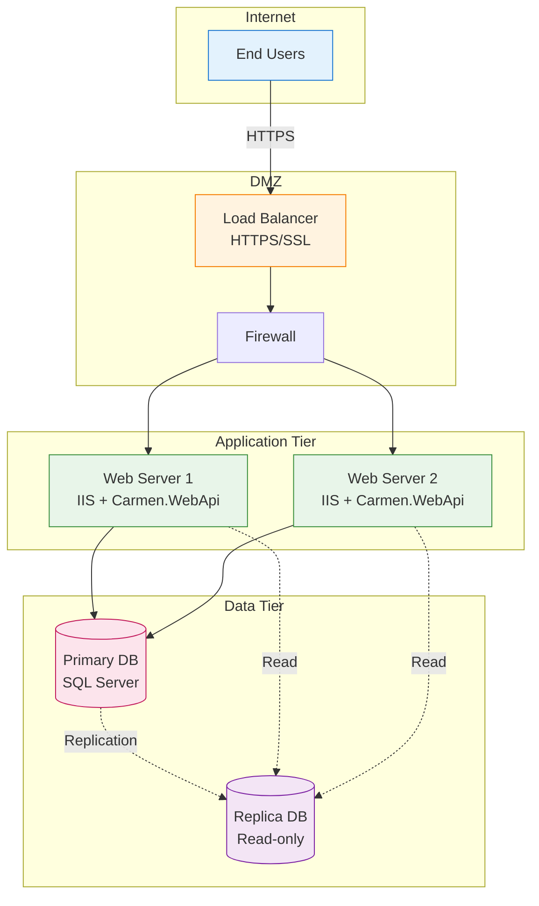

# Carmen.NET Technology Stack

**Document Version**: 1.0
**Last Updated**: 2025-10-08
**Status**: Production Ready

---

## Executive Summary

Carmen.NET is built on enterprise-grade Microsoft technologies, leveraging the .NET Framework ecosystem for financial ERP operations. The stack emphasizes reliability, security, and performance with proven enterprise technologies suitable for multi-tenant financial systems.

**Stack Highlights**:
- **.NET Framework 4.x** with ASP.NET Web API 2.x
- **SQL Server 2014+** with Entity Framework 6.x
- **JWT Authentication** with role-based access control
- **RESTful API** architecture with 351+ endpoints
- **Multi-tenant SaaS** design with data isolation

---

## 1. Backend Technologies

### 1.1 Framework & Runtime

**Core Framework**:
- **.NET Framework 4.x**
  - Mature, enterprise-proven framework
  - Windows Server integration
  - Extensive library ecosystem
  - Full support for financial calculations and decimal precision

**Web Framework**:
- **ASP.NET Web API 2.x**
  - RESTful API architecture
  - Built-in routing and model binding
  - Content negotiation (JSON/XML)
  - OWIN middleware support

**Language**:
- **C# 7.0+**
  - Type-safe, object-oriented
  - LINQ query support
  - Async/await patterns
  - Pattern matching and tuples

### 1.2 Data Access Layer

**ORM & Database**:
- **Entity Framework 6.x**
  - Code-first and database-first approaches
  - LINQ to Entities queries
  - Change tracking and lazy loading
  - Migration framework
  - Transaction management

- **SQL Server 2014+**
  - Enterprise-grade RDBMS
  - ACID compliance
  - Full-text search
  - Stored procedures and views
  - Table partitioning support

**Data Access Patterns**:
- Repository pattern for data abstraction
- Unit of Work pattern for transaction management
- Multi-tenant query filtering
- Optimistic concurrency control

### 1.3 Security Technologies

**Authentication & Authorization**:
- **JWT (JSON Web Tokens)**
  - Stateless authentication
  - Token-based sessions
  - Claims-based identity
  - Configurable expiration

**Security Features**:
- **Carmen.Crypto Library**
  - AES encryption for sensitive data
  - Password hashing (likely BCrypt/PBKDF2)
  - Encryption key management
  - Data masking for PII

**Security Protocols**:
- HTTPS/TLS for transport security
- Role-Based Access Control (RBAC)
- Permission matrix (114 permissions)
- Tenant data isolation

### 1.4 API & Integration

**API Standards**:
- RESTful API design
- JSON as primary data format
- HTTP status codes (200, 201, 400, 401, 403, 404, 500)
- Swagger/OpenAPI documentation

**API Features**:
- 60 API controllers
- 351+ endpoints across 11 modules
- Request/response DTOs (View*, Param* models)
- Versioning support
- Rate limiting capability

### 1.5 Logging & Monitoring

**Logging Framework**:
- Custom logging framework
  - `LogHttpRequest` - Request logging
  - `LogHttpResult` - Response logging
  - File-based log storage
  - Structured logging format

**Monitoring Capabilities**:
- API performance metrics
- Error tracking and stack traces
- Audit trail logging
- Business event logging

---

## 2. Frontend Technologies

### 2.1 Web Client Technologies

**Core Technologies** (Inferred from API structure):
- **HTML5/CSS3**
  - Semantic markup
  - Responsive design
  - Modern CSS features

- **JavaScript Framework**
  - Likely: React, Vue.js, or Angular
  - Alternative: jQuery with modern patterns
  - AJAX for API communication
  - Client-side state management

**UI Framework**:
- **Bootstrap** or similar CSS framework
  - Responsive grid system
  - Pre-built components
  - Mobile-first design
  - Theming support

### 2.2 Desktop & Mobile Clients

**Desktop Integration**:
- **Excel Add-ins**
  - VSTO (Visual Studio Tools for Office)
  - COM interop
  - Data import/export
  - Report generation

**Mobile Support**:
- Mobile-responsive web interface
- Potential native apps (iOS/Android)
- RESTful API consumption

---

## 3. Third-Party Libraries & Dependencies

### 3.1 Core Dependencies

**JSON Processing**:
- **Newtonsoft.Json (Json.NET)**
  - JSON serialization/deserialization
  - LINQ to JSON
  - Schema validation
  - High performance

**API Documentation**:
- **Swagger/NSwag**
  - Interactive API documentation
  - API client generation
  - Schema validation
  - Try-it-out functionality

**Additional Libraries** (Common in .NET Web API):
- AutoMapper (object-to-object mapping)
- FluentValidation (model validation)
- Dapper (lightweight ORM for performance-critical queries)
- Serilog or NLog (structured logging)

### 3.2 Development Tools

**Development Environment**:
- Visual Studio 2015/2017/2019
- ReSharper (code analysis)
- SQL Server Management Studio (SSMS)
- Postman (API testing)

**Version Control**:
- Git
- GitHub/GitLab/Azure DevOps

**Build & Deployment**:
- MSBuild
- NuGet package management
- Web Deploy or Azure DevOps pipelines

---

## 4. Infrastructure & Hosting

### 4.1 Web Server

**Options**:
- **IIS (Internet Information Services) 8.0+**
  - Windows Server integration
  - Application pool isolation
  - URL rewriting
  - Load balancing (ARR)

- **Kestrel** (Alternative)
  - Cross-platform web server
  - High performance
  - Reverse proxy support

**Server Requirements**:
- Windows Server 2012+ (recommended)
- Linux (with .NET Core migration)
- .NET Framework 4.x runtime
- IIS with ASP.NET modules

### 4.2 Application Server

**Configuration**:
- ASP.NET Web API hosting
- Entity Framework runtime
- Carmen.NET application assemblies
- Multi-instance deployment support

**Resource Requirements**:
- CPU: 4+ cores recommended
- RAM: 8 GB minimum, 16 GB recommended
- Disk: 100 GB+ for application and logs
- Network: 1 Gbps+

### 4.3 Database Server

**SQL Server Configuration**:
- **Edition**: Standard or Enterprise
- **Version**: SQL Server 2014+
- **Features**:
  - Full-text search
  - Transparent Data Encryption (TDE)
  - Always On Availability Groups
  - Database mirroring/replication

**Storage Requirements**:
- Minimum: 50 GB per tenant
- Average: 100-500 GB per tenant
- Growth: Plan for 10+ years data retention
- Backups: Daily full, hourly incremental

### 4.4 Deployment Architecture

---

## 5. Development Stack

### 5.1 Development Tools

**IDE**:
- Visual Studio 2015/2017/2019
  - IntelliSense
  - Debugging tools
  - Database tools
  - Git integration

**Database Tools**:
- SQL Server Management Studio (SSMS)
- Entity Framework Power Tools
- SQL Profiler for query optimization

**API Testing**:
- Postman or Insomnia
- Swagger UI
- Fiddler for HTTP debugging

### 5.2 Testing Frameworks

**Unit Testing**:
- MSTest or NUnit
- xUnit (modern alternative)
- Moq for mocking
- FluentAssertions

**Integration Testing**:
- Database integration tests
- API endpoint testing
- Transaction rollback tests

**Performance Testing**:
- Apache JMeter
- Visual Studio Load Testing
- SQL Server Query Store

---

## 6. Technology Decisions & Rationale

### 6.1 .NET Framework vs .NET Core

**Current Decision**: .NET Framework 4.x

**Rationale**:
- ✅ Mature, battle-tested for enterprise applications
- ✅ Extensive ecosystem and third-party support
- ✅ Windows Server integration
- ✅ Full feature parity with financial requirements
- ✅ Entity Framework 6.x maturity

**Future Consideration**: Migration to .NET 6/8
- Modern runtime with performance improvements
- Cross-platform deployment (Linux containers)
- Long-term support and active development
- Microservices architecture enablement

### 6.2 SQL Server vs Other RDBMS

**Decision**: Microsoft SQL Server

**Rationale**:
- ✅ Enterprise-grade reliability (99.99% uptime)
- ✅ ACID compliance for financial transactions
- ✅ Advanced security features (TDE, RLS)
- ✅ Excellent .NET integration via Entity Framework
- ✅ Stored procedures for complex business logic
- ✅ Full-text search for document management

**Alternatives Considered**:
- PostgreSQL: Excellent but less integrated with .NET ecosystem
- MySQL: Good but limited enterprise features
- Oracle: Over-engineered and costly for use case

### 6.3 Entity Framework vs Alternatives

**Decision**: Entity Framework 6.x

**Rationale**:
- ✅ Developer productivity (LINQ queries)
- ✅ Change tracking for audit trails
- ✅ Migration framework for schema evolution
- ✅ Multi-tenant query filtering
- ✅ Transaction management

**Trade-offs**:
- ❌ Performance overhead vs raw SQL (5-10%)
- ❌ Learning curve for complex queries
- ✅ Mitigated with Dapper for performance-critical queries

### 6.4 JWT vs Session-Based Auth

**Decision**: JWT (JSON Web Tokens)

**Rationale**:
- ✅ Stateless authentication (scalable)
- ✅ Works across distributed servers
- ✅ No server-side session storage
- ✅ Supports multi-tenant claims
- ✅ Industry standard

---

## 7. Performance Characteristics

### 7.1 Performance Targets

**API Response Times**:
- Average: <200ms
- 95th percentile: <500ms
- Complex reports: <5 seconds

**Database Performance**:
- Simple queries: <100ms
- Complex queries: <500ms
- Batch processing: 1000+ records/minute

**Scalability**:
- Concurrent users: 100+ per server
- Request throughput: 500+ req/sec per server
- Database connections: 100 connections per pool

### 7.2 Resource Utilization

**Application Server**:
- CPU: <70% average utilization
- Memory: <4 GB per instance
- Network: <100 Mbps per server

**Database Server**:
- Storage: <50 GB per tenant (average)
- Memory: 16 GB+ recommended
- CPU: 8+ cores for production

---

## 8. Security Standards

### 8.1 Security Technologies

**Transport Security**:
- TLS 1.2+ (HTTPS)
- Certificate-based authentication
- Perfect Forward Secrecy (PFS)

**Data Security**:
- AES-256 encryption at rest
- Encrypted database connections
- Sensitive field encryption (Carmen.Crypto)
- Password hashing (likely BCrypt or PBKDF2)

**Application Security**:
- OWASP Top 10 compliance
- SQL injection prevention (parameterized queries)
- XSS prevention (input validation)
- CSRF protection
- Rate limiting and throttling

### 8.2 Compliance

**Standards**:
- PCI DSS (if handling payment cards)
- SOC 2 Type II readiness
- GDPR data protection
- Thai financial reporting standards

---

## 9. Technology Roadmap

### 9.1 Short-Term (6-12 months)

**Optimization**:
- Performance monitoring and optimization
- Database query tuning
- Caching layer implementation (Redis/Memcached)
- API response optimization

**Security Enhancements**:
- Two-factor authentication (2FA)
- Enhanced audit logging
- Security penetration testing
- Vulnerability scanning

### 9.2 Medium-Term (1-2 years)

**Platform Modernization**:
- Migration to .NET 6/8
- Containerization with Docker
- Kubernetes orchestration
- Cross-platform deployment (Linux)

**Architecture Evolution**:
- Microservices consideration for specific modules
- Event-driven architecture (message queues)
- CQRS pattern for complex reporting
- GraphQL API layer (optional)

### 9.3 Long-Term (2-3 years)

**Cloud-Native**:
- Cloud deployment (Azure/AWS)
- Serverless functions for batch jobs
- Managed database services
- Auto-scaling infrastructure

**Advanced Features**:
- Machine learning for fraud detection
- Real-time analytics and BI
- Mobile-first progressive web apps
- AI-powered automation

---

## 10. Dependencies & Versioning

### 10.1 Critical Dependencies

| Package | Version | Purpose |
|---------|---------|---------|
| .NET Framework | 4.6.1+ | Runtime framework |
| ASP.NET Web API | 2.2 | Web framework |
| Entity Framework | 6.4.4 | ORM |
| Newtonsoft.Json | 13.0+ | JSON serialization |
| SQL Server | 2014+ | Database |

### 10.2 Version Support Policy

**Framework Support**:
- .NET Framework 4.x: Mainstream support until 2027+
- SQL Server 2014: Extended support until 2024
- Entity Framework 6.x: Long-term support

**Upgrade Path**:
- Quarterly security patches
- Annual minor version updates
- Major version updates every 2-3 years

---

## 11. Technology Constraints

### 11.1 Technical Constraints

**Must Use**:
- .NET Framework 4.x (Windows compatibility)
- SQL Server 2014+ (enterprise standard)
- REST API architecture (integration requirement)
- Multi-tenant design (business requirement)
- Data encryption (compliance requirement)

**Cannot Use**:
- NoSQL databases (financial data integrity)
- Microservices (current architecture constraint)
- Client-side only authentication (security requirement)

### 11.2 Platform Constraints

**Operating System**:
- Primary: Windows Server 2012+
- Future: Linux support with .NET Core migration

**Browser Support**:
- Modern browsers (Chrome, Firefox, Edge, Safari)
- IE11+ (legacy support)
- Mobile browsers (iOS Safari, Chrome Mobile)

---

## 12. Documentation & Resources

### 12.1 Official Documentation

**Microsoft Documentation**:
- [ASP.NET Web API](https://docs.microsoft.com/en-us/aspnet/web-api/)
- [Entity Framework 6](https://docs.microsoft.com/en-us/ef/ef6/)
- [SQL Server](https://docs.microsoft.com/en-us/sql/)
- [.NET Framework](https://docs.microsoft.com/en-us/dotnet/framework/)

### 12.2 Internal Documentation

**Carmen.NET Documentation**:
- [System Architecture](system-architecture.md)
- [API Reference](../api/api-reference.md)
- [Database Schema](../development/database-schema-guide.md)
- [Developer Onboarding](../development/developer-onboarding-guide.md)

---

## 13. Contact & Support

**Technical Architecture**:
- Architecture team for technology decisions
- DevOps team for infrastructure

**Development Support**:
- Developer onboarding guide
- Code review process
- Technical documentation

---

**Document Status**: ✅ Production Ready
**Last Review**: 2025-10-08
**Next Review**: 2026-01-08
**Owner**: Architecture Team
