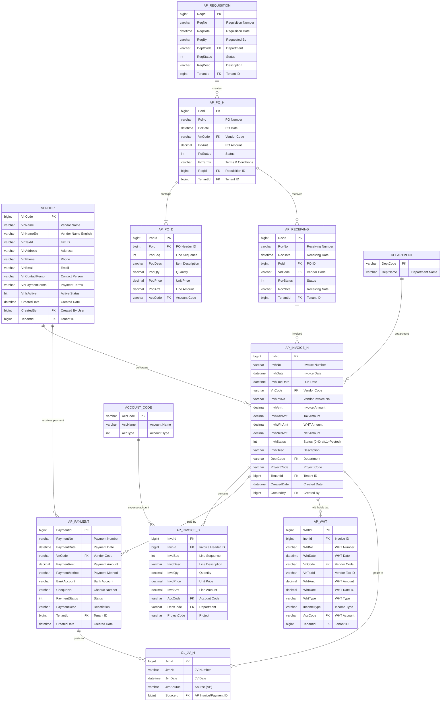

# Accounts Payable (AP) Module - Entity Relationship Diagram



## AP Module Workflow

### 1. Purchase Requisition Flow (Optional)
```
Requisition Created → Approved → Converted to PO
```

### 2. Purchase Order Flow
```
PO Created → PO Approved → Goods Received → Invoice Matched
```

### 3. Invoice Flow
```
Invoice Entered → Validated → Approved → Posted to GL
```

### 4. Payment Flow
```
Invoice Due → Payment Created → Approved → Posted to GL
```

### 5. WHT Flow
```
Invoice with WHT → WHT Record Created → WHT File Generated
```

## GL Posting Examples

### Invoice Posting
```
DR: Expense Account (from AP_INVOICE_D.AccCode)  $1000
DR: WHT Receivable                               $  30
CR: AP Payable                                   $1030
```

### Payment Posting
```
DR: AP Payable                                   $1030
CR: Bank/Cash Account                            $1030
```

### WHT Posting (included in invoice posting)
```
DR: Expense Account                              $1000
DR: WHT Receivable (tax credit)                  $  30
CR: AP Payable (net amount)                      $1030
```

## Key Tables

**VENDOR**: Master vendor list with tax ID, payment terms
**AP_INVOICE_H/D**: Invoice header and line items
**AP_PAYMENT**: Payment records with bank/cheque details
**AP_WHT**: Withholding tax records for tax reporting
**AP_REQUISITION**: Purchase requisitions (pre-PO)
**AP_PO_H/D**: Purchase orders
**AP_RECEIVING**: Goods receiving records

## Status Codes (typical values)

**Invoice Status** (`InvhStatus`):
- 0 = Draft
- 1 = Posted to GL
- 2 = Pending Approval
- 3 = Approved
- 9 = Cancelled

**Payment Status** (`PaymentStatus`):
- 0 = Draft
- 1 = Posted
- 2 = Cleared
- 9 = Void

## Multi-Tenant

All tables include `TenantId` for data isolation.
Enforced via `FncBase.ApplyTenantIfUseTenant(useTenant)` in all controllers.
