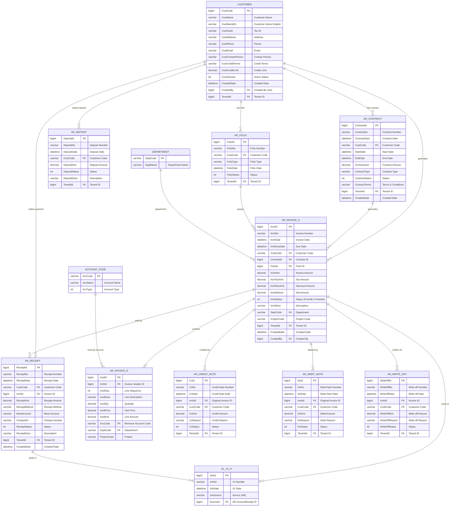

# Accounts Receivable (AR) Module - Entity Relationship Diagram



## AR Module Workflow

### 1. Contract Flow (Optional)
```
Contract Created → Approved → Active → Generate Invoices
```

### 2. Invoice Flow
```
Invoice Created → Validated → Approved → Posted to GL
```

### 3. Receipt Flow
```
Payment Received → Receipt Created → Applied to Invoice → Posted to GL
```

### 4. Credit/Debit Note Flow
```
Issue Identified → Credit/Debit Note Created → Approved → Posted to GL
```

### 5. Write-off Flow
```
Bad Debt Identified → Write-off Approved → Posted to GL
```

## GL Posting Examples

### Invoice Posting
```
DR: AR Receivable                                $1070
CR: Revenue Account (from AR_INVOICE_D.AccCode)  $1000
CR: Tax Payable                                  $  70
```

### Receipt Posting
```
DR: Bank/Cash Account                            $1070
CR: AR Receivable                                $1070
```

### Credit Note Posting
```
DR: Revenue Account                              $ 100
CR: AR Receivable                                $ 100
```

### Debit Note Posting
```
DR: AR Receivable                                $ 100
CR: Revenue Account                              $ 100
```

### Write-off Posting
```
DR: Bad Debt Expense                             $ 500
CR: AR Receivable                                $ 500
```

## Key Tables

**CUSTOMER**: Master customer list with credit limit, terms
**AR_CONTRACT**: Long-term contracts for recurring invoicing
**AR_FOLIO**: Grouping of related invoices (e.g., monthly billing)
**AR_INVOICE_H/D**: Invoice header and line items
**AR_RECEIPT**: Payment receipts with bank/cheque details
**AR_DEPOSIT**: Customer deposits (advance payments)
**AR_CREDIT_NOTE**: Credit memos for returns/adjustments
**AR_DEBIT_NOTE**: Additional charges
**AR_WRITE_OFF**: Bad debt write-offs

## Status Codes (typical values)

**Invoice Status** (`InvhStatus`):
- 0 = Draft
- 1 = Posted to GL
- 2 = Pending Approval
- 3 = Approved
- 4 = Partially Paid
- 5 = Fully Paid
- 9 = Cancelled

**Receipt Status** (`ReceiptStatus`):
- 0 = Draft
- 1 = Posted
- 2 = Cleared
- 3 = Bounced
- 9 = Void

**Contract Status** (`ContractStatus`):
- 0 = Draft
- 1 = Active
- 2 = Suspended
- 3 = Expired
- 9 = Terminated

## Multi-Tenant

All tables include `TenantId` for data isolation.
Enforced via `FncBase.ApplyTenantIfUseTenant(useTenant)` in all controllers.

## Aging & Collections

AR Module supports:
- **Aging Reports**: 0-30, 31-60, 61-90, 90+ days
- **Credit Limit Management**: Prevent over-credit sales
- **Collection Management**: Track overdue invoices
- **Statement Generation**: Customer statements
