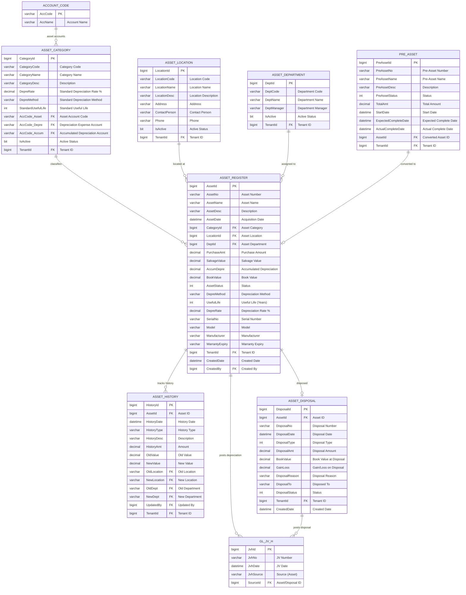

# Asset Management Module - Entity Relationship Diagram



## Asset Management Workflow

### 1. Asset Acquisition Flow
```
Purchase Request → PO → Receiving → Pre-Asset (if WIP) → Asset Register
```

### 2. Depreciation Flow
```
Monthly Process → Calculate Depreciation → Generate JV → Post to GL
```

### 3. Transfer Flow
```
Transfer Request → Approval → Update Location/Department → Record History
```

### 4. Disposal Flow
```
Disposal Request → Approval → Calculate Gain/Loss → Post to GL → Update Status
```

## Depreciation Methods

**Straight Line**:
```
Annual Depreciation = (Cost - Salvage Value) / Useful Life
Monthly Depreciation = Annual Depreciation / 12
```

**Declining Balance**:
```
Annual Depreciation = Book Value × Depreciation Rate
```

**Sum of Years Digits**:
```
Annual Depreciation = (Cost - Salvage Value) × (Remaining Life / Sum of Years)
```

**Units of Production**:
```
Depreciation per Unit = (Cost - Salvage Value) / Total Units
Period Depreciation = Units Produced × Depreciation per Unit
```

## GL Posting Examples

### Asset Acquisition
```
DR: Asset Account (from ASSET_CATEGORY.AccCode_Asset)  $10,000
CR: Cash/AP Account                                    $10,000
```

### Monthly Depreciation
```
DR: Depreciation Expense (AccCode_Depre)               $   100
CR: Accumulated Depreciation (AccCode_Accum)           $   100
```

### Asset Disposal (Gain)
```
DR: Cash/Receivable                                    $ 6,000
DR: Accumulated Depreciation                           $ 5,000
CR: Asset Account                                      $10,000
CR: Gain on Disposal                                   $ 1,000
```

### Asset Disposal (Loss)
```
DR: Cash/Receivable                                    $ 3,000
DR: Accumulated Depreciation                           $ 5,000
DR: Loss on Disposal                                   $ 2,000
CR: Asset Account                                      $10,000
```

## Key Tables

**ASSET_REGISTER**: Master asset list with depreciation details
**ASSET_CATEGORY**: Asset categories with default depreciation settings
**ASSET_LOCATION**: Physical locations of assets
**ASSET_DEPARTMENT**: Department assignments for assets
**ASSET_HISTORY**: Complete audit trail of asset changes
**ASSET_DISPOSAL**: Asset disposal records with gain/loss
**PRE_ASSET**: Work-in-progress assets (construction, software development)

## Asset Status

**Asset Status** (`AssetStatus`):
- 0 = In Use
- 1 = Idle
- 2 = Under Maintenance
- 3 = Disposed
- 4 = Sold
- 5 = Scrapped
- 9 = Written Off

**Pre-Asset Status** (`PreAssetStatus`):
- 0 = Planning
- 1 = In Progress
- 2 = Completed (converted to Asset)
- 9 = Cancelled

**Disposal Type** (`DisposalType`):
- 1 = Sale
- 2 = Scrap
- 3 = Trade-in
- 4 = Donation
- 5 = Transfer
- 9 = Write-off

## Asset History Types

**History Type** (`HistoryType`):
- ACQUIRE = Asset Acquisition
- DEPRECIATE = Depreciation Posting
- TRANSFER = Location/Department Transfer
- REVALUE = Revaluation
- IMPAIR = Impairment
- DISPOSE = Disposal
- MAINTAIN = Maintenance Record

## Asset Reports

- **Asset Register Report**: Complete asset listing
- **Depreciation Schedule**: Current and projected depreciation
- **Asset Valuation Report**: Book value by category/location/department
- **Disposal Report**: Gain/loss on disposals
- **Asset Movement Report**: Transfers and changes
- **Maintenance History**: Asset maintenance tracking
- **Asset Age Analysis**: Asset age distribution

## Multi-Tenant

All tables include `TenantId` for data isolation.
Enforced via `FncBase.ApplyTenantIfUseTenant(useTenant)` in all controllers.

## Pre-Asset (Work in Progress)

**Use Cases**:
- Building construction
- Software development
- Machine assembly
- Custom equipment fabrication

**Process**:
1. Create Pre-Asset record
2. Accumulate costs (labor, materials, overhead)
3. When complete, convert to Asset Register
4. Start depreciation from in-service date
