# General Ledger (GL) Module - Entity Relationship Diagram

```mermaid
erDiagram
    %% Account Code Hierarchy
    ACCOUNT_CODE ||--o{ ACCOUNT_CODE : "parent account"

    %% Journal Voucher Relationships
    GL_JV_H ||--|{ GL_JV_D : "contains"
    ACCOUNT_CODE ||--o{ GL_JV_D : "posted to"
    GL_PERIOD ||--o{ GL_JV_H : "period for"

    %% Allocation JV
    GL_ALLOCATION_JV_H ||--|{ GL_ALLOCATION_JV_D : "contains"
    ACCOUNT_CODE ||--o{ GL_ALLOCATION_JV_D : "allocated to"

    %% Amortization
    ACCOUNT_CODE ||--o{ GL_AMORTIZE : "amortized"

    %% Foreign JV
    GL_JV_FR_H ||--|{ GL_JV_FR_D : "contains"
    ACCOUNT_CODE ||--o{ GL_JV_FR_D : "posted to"

    %% Budget
    ACCOUNT_CODE ||--o{ BUDGET : "budgeted"
    GL_PERIOD ||--o{ BUDGET : "budget period"

    %% Lookups
    DEPARTMENT ||--o{ GL_JV_D : "department"
    CURRENCY ||--o{ GL_JV_H : "currency"
    DIMENSION ||--o{ GL_JV_D : "dimension"

    %% Entities
    ACCOUNT_CODE {
        varchar AccCode PK
        varchar AccName "Account Name"
        varchar AccNameEn "Account Name English"
        int AccType "Account Type"
        int AccNature "Account Nature (DR/CR)"
        int AccLevel "Hierarchy Level"
        varchar ParentAccCode FK "Parent Account"
        bit IsActive "Active Status"
        bit AllowPosting "Allow Direct Posting"
        datetime CreatedDate "Created Date"
        bigint TenantId FK "Tenant ID"
    }

    GL_JV_H {
        bigint JvhId PK
        varchar JvhNo "JV Number"
        datetime JvhDate "JV Date"
        varchar JvhDesc "JV Description"
        int JvhStatus "Status (0=Draft,1=Posted)"
        varchar JvhSource "Source Module (AP/AR/GL)"
        bigint SourceId FK "Source Transaction ID"
        int JvhType "JV Type"
        varchar CurrencyCode FK "Currency Code"
        decimal ExchangeRate "Exchange Rate"
        bigint PeriodId FK "Period ID"
        bigint TenantId FK "Tenant ID"
        datetime CreatedDate "Created Date"
        bigint CreatedBy FK "Created By"
    }

    GL_JV_D {
        bigint JvdId PK
        bigint JvhId FK "JV Header ID"
        int JvdSeq "Line Sequence"
        varchar AccCode FK "Account Code"
        varchar JvdDesc "Line Description"
        decimal JvdDr "Debit Amount"
        decimal JvdCr "Credit Amount"
        varchar DeptCode FK "Department"
        varchar ProjectCode "Project Code"
        varchar DimensionCode FK "Dimension"
    }

    GL_PERIOD {
        bigint PeriodId PK
        int PeriodYear "Fiscal Year"
        int PeriodMonth "Fiscal Month"
        int PeriodStatus "Status (0=Open,1=Closed)"
        datetime StartDate "Period Start Date"
        datetime EndDate "Period End Date"
        datetime ClosedDate "Closed Date"
        bigint ClosedBy FK "Closed By User"
        bigint TenantId FK "Tenant ID"
    }

    GL_ALLOCATION_JV_H {
        bigint AllocId PK
        varchar AllocNo "Allocation Number"
        datetime AllocDate "Allocation Date"
        varchar AllocDesc "Allocation Description"
        varchar AllocType "Allocation Type"
        decimal TotalAmt "Total Amount to Allocate"
        int AllocStatus "Status"
        bigint TenantId FK "Tenant ID"
    }

    GL_ALLOCATION_JV_D {
        bigint AllocdId PK
        bigint AllocId FK "Allocation Header ID"
        int AllocdSeq "Sequence"
        varchar AccCode FK "Account Code"
        varchar DeptCode FK "Department"
        decimal AllocdRate "Allocation Rate %"
        decimal AllocdAmt "Allocated Amount"
    }

    GL_AMORTIZE {
        bigint AmortizeId PK
        varchar AmortizeNo "Amortization Number"
        varchar AccCode FK "Expense Account"
        varchar AssetAccCode FK "Asset/Prepaid Account"
        int AmortizeType "Type (0=Expense,1=Revenue)"
        datetime StartDate "Start Date"
        datetime EndDate "End Date"
        int AmortizeMonths "Amortization Months"
        decimal TotalAmt "Total Amount"
        decimal MonthlyAmt "Monthly Amortization"
        decimal AmortizedAmt "Amortized to Date"
        int AmortizeStatus "Status"
        bigint TenantId FK "Tenant ID"
    }

    GL_JV_FR_H {
        bigint JvFrId PK
        varchar JvFrNo "Foreign JV Number"
        datetime JvFrDate "JV Date"
        varchar JvFrDesc "JV Description"
        varchar CurrencyCode FK "Foreign Currency"
        decimal ExchangeRate "Exchange Rate"
        int JvFrStatus "Status"
        bigint TenantId FK "Tenant ID"
    }

    GL_JV_FR_D {
        bigint JvFrdId PK
        bigint JvFrId FK "Foreign JV Header ID"
        int JvFrdSeq "Sequence"
        varchar AccCode FK "Account Code"
        decimal JvFrdDrFC "Debit Foreign Currency"
        decimal JvFrdCrFC "Credit Foreign Currency"
        decimal JvFrdDrLC "Debit Local Currency"
        decimal JvFrdCrLC "Credit Local Currency"
    }

    BUDGET {
        bigint BudgetId PK
        varchar BudgetNo "Budget Number"
        bigint PeriodId FK "Period ID"
        varchar AccCode FK "Account Code"
        varchar DeptCode FK "Department"
        decimal BudgetAmt "Budget Amount"
        decimal ActualAmt "Actual Amount"
        decimal VarianceAmt "Variance"
        bigint TenantId FK "Tenant ID"
    }

    DEPARTMENT {
        varchar DeptCode PK
        varchar DeptName "Department Name"
    }

    CURRENCY {
        varchar CurrencyCode PK
        varchar CurrencyName "Currency Name"
        decimal ExchangeRate "Exchange Rate"
    }

    DIMENSION {
        varchar DimensionCode PK
        varchar DimensionName "Dimension Name"
        varchar DimensionType "Dimension Type"
    }
```



## GL Module Workflow

### 1. Journal Voucher Flow
```
JV Created (Manual or Auto) → Validated → Approved → Posted to GL → Update Account Balances
```

### 2. Period Management Flow
```
Open Period → Transactions Posted → Period Closed → No More Posting Allowed
```

### 3. Allocation Flow
```
Create Allocation Rule → Run Allocation → Generate JV → Post to GL
```

### 4. Amortization Flow
```
Create Amortization Schedule → Monthly Auto-Generate JV → Post to GL
```

## Account Code Structure

**Account Hierarchy** (Example):
```
1000 - Assets (Level 1)
  1100 - Current Assets (Level 2)
    1110 - Cash & Bank (Level 3)
      1111 - Petty Cash (Level 4)
      1112 - Bank Account A (Level 4)
```

**Account Types** (`AccType`):
- 1 = Asset
- 2 = Liability
- 3 = Equity
- 4 = Revenue
- 5 = Expense

**Account Nature** (`AccNature`):
- 0 = Debit (Assets, Expenses)
- 1 = Credit (Liabilities, Equity, Revenue)

## GL Posting Examples

### Manual Journal Entry
```
DR: Expense Account                              $1000
CR: Cash Account                                 $1000
```

### Allocation Example (Overhead Allocation)
```
DR: Dept A Expense                               $ 600
DR: Dept B Expense                               $ 400
CR: Overhead Pool                                $1000
```

### Amortization Example (Monthly)
```
DR: Amortization Expense                         $ 100
CR: Prepaid Asset                                $ 100
```

### Foreign Currency JV
```
DR: Expense Account (USD 100 @ 30)              THB 3000
CR: Bank Account (USD 100 @ 30)                 THB 3000
```

## Key Tables

**ACCOUNT_CODE**: Chart of accounts with hierarchy
**GL_JV_H/D**: Journal voucher header and details (core transaction table)
**GL_PERIOD**: Accounting period management (monthly close)
**GL_ALLOCATION_JV_H/D**: Cost allocation journal
**GL_AMORTIZE**: Amortization schedules (prepaid, deferred revenue)
**GL_JV_FR_H/D**: Foreign currency journal vouchers
**BUDGET**: Budget vs. actual tracking

## Period Status

**Period Status** (`PeriodStatus`):
- 0 = Open - Transactions allowed
- 1 = Closed - No posting allowed
- 2 = Adjusting - Only adjusting entries allowed

**Period Close Process**:
1. Review all transactions in period
2. Run period-end reports
3. Reconcile all accounts
4. Close period (change status to 1)
5. Generate opening balances for next period

## GL Validation Rules

1. **Balanced Entry**: Total DR must equal total CR
2. **Account Validation**: Only active accounts with `AllowPosting=true`
3. **Period Validation**: Cannot post to closed periods
4. **Source Tracking**: All auto-generated JVs link to source transaction

## Multi-Tenant

All tables include `TenantId` for data isolation.
Enforced via `FncBase.ApplyTenantIfUseTenant(useTenant)` in all controllers.

## Financial Reports Generated from GL

- **Trial Balance**: All account balances
- **Balance Sheet**: Assets = Liabilities + Equity
- **Profit & Loss**: Revenue - Expenses
- **Cash Flow Statement**: Operating/Investing/Financing activities
- **Budget vs. Actual**: Variance analysis
- **Account Ledger**: Transaction detail by account
