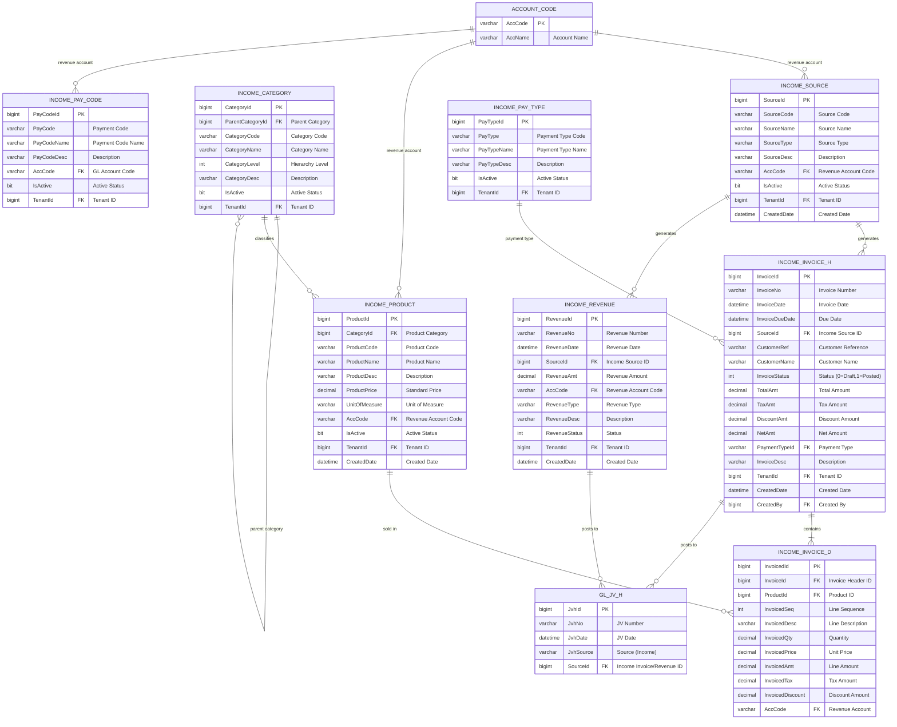

# Income/Revenue Module - Entity Relationship Diagram



## Income Module Workflow

### 1. Product Setup Flow
```
Define Category Hierarchy → Create Products → Set Prices → Assign Revenue Accounts
```

### 2. Invoice Flow
```
Create Invoice → Add Line Items (Products) → Calculate Tax → Approve → Post to GL
```

### 3. Revenue Recognition Flow
```
Revenue Event → Create Revenue Record → Post to GL
```

### 4. Payment Flow
```
Invoice Generated → Payment Received → Record Receipt → Post to GL
```

## Income Source Types

**Source Type Examples**:
- RENTAL = Rental income
- SERVICE = Service fees
- SUBSCRIPTION = Subscription revenue
- INTEREST = Interest income
- ROYALTY = Royalty income
- OTHER = Other income sources

## GL Posting Examples

### Income Invoice Posting
```
DR: Cash/AR Receivable                               $1070
CR: Revenue Account (from INCOME_INVOICE_D.AccCode)  $1000
CR: Tax Payable                                      $  70
```

### Revenue Recognition Posting
```
DR: Receivable/Unearned Revenue                      $1000
CR: Revenue Account (from INCOME_REVENUE.AccCode)    $1000
```

### Deferred Revenue (Subscription Example)
```
Initial Receipt:
DR: Cash                                             $1200
CR: Unearned Revenue                                 $1200

Monthly Recognition (12 months):
DR: Unearned Revenue                                 $ 100
CR: Revenue Account                                  $ 100
```

## Key Tables

**INCOME_SOURCE**: Revenue stream sources and categories
**INCOME_CATEGORY**: Hierarchical product/service categories
**INCOME_PRODUCT**: Product/service master with pricing
**INCOME_INVOICE_H/D**: Invoice header and line items
**INCOME_REVENUE**: Direct revenue recognition records
**INCOME_PAY_CODE**: Payment codes for revenue tracking
**INCOME_PAY_TYPE**: Payment type classification

## Status Codes

**Invoice Status** (`InvoiceStatus`):
- 0 = Draft
- 1 = Posted to GL
- 2 = Pending Approval
- 3 = Approved
- 4 = Paid
- 9 = Cancelled

**Revenue Status** (`RevenueStatus`):
- 0 = Draft
- 1 = Recognized (Posted)
- 2 = Deferred
- 3 = Accrued
- 9 = Reversed

## Revenue Recognition Patterns

### 1. Point-in-Time Recognition
```
Service Completed → Invoice Generated → Revenue Recognized Immediately
```

### 2. Over-Time Recognition
```
Contract Start → Monthly Recognition → Complete over Contract Period
```

### 3. Milestone-Based Recognition
```
Milestone 1 Complete (30%) → Recognize 30% Revenue
Milestone 2 Complete (40%) → Recognize 40% Revenue
Milestone 3 Complete (30%) → Recognize 30% Revenue
```

### 4. Subscription Revenue
```
Annual Payment Received → Recognize 1/12 Monthly for 12 Months
```

## Product Category Hierarchy

**Example Structure**:
```
Services (Level 1)
  ├─ Consulting (Level 2)
  │   ├─ IT Consulting (Level 3)
  │   └─ Management Consulting (Level 3)
  └─ Training (Level 2)
      ├─ Technical Training (Level 3)
      └─ Soft Skills Training (Level 3)

Products (Level 1)
  ├─ Software (Level 2)
  │   ├─ Licenses (Level 3)
  │   └─ Subscriptions (Level 3)
  └─ Hardware (Level 2)
```

## Income Reports

- **Revenue by Source**: Revenue breakdown by income source
- **Revenue by Product**: Revenue by product/service
- **Revenue by Category**: Hierarchical revenue analysis
- **Revenue Recognition Schedule**: Deferred revenue tracking
- **Invoice Aging**: Outstanding invoice analysis
- **Revenue Forecast**: Projected revenue based on contracts

## Multi-Tenant

All tables include `TenantId` for data isolation.
Enforced via `FncBase.ApplyTenantIfUseTenant(useTenant)` in all controllers.

## Use Cases

### 1. Rental Income
- **Income Source**: Property rentals
- **Products**: Unit A, Unit B, Parking Space
- **Invoicing**: Monthly rental invoices
- **Revenue Recognition**: Monthly over lease term

### 2. Subscription SaaS
- **Income Source**: Software subscriptions
- **Products**: Basic Plan, Pro Plan, Enterprise Plan
- **Invoicing**: Annual/monthly subscription invoices
- **Revenue Recognition**: Ratably over subscription period

### 3. Professional Services
- **Income Source**: Consulting services
- **Products**: Hourly consulting, Project-based consulting
- **Invoicing**: Time & materials or fixed-price invoices
- **Revenue Recognition**: Upon completion or milestone-based

### 4. Educational Institution
- **Income Source**: Tuition fees
- **Products**: Course A, Course B, Program C
- **Invoicing**: Semester invoices
- **Revenue Recognition**: Over academic term
