# Carmen.NET - Master Data Model Overview

```mermaid
erDiagram
    %% Accounts Payable Module
    VENDOR ||--o{ AP_INVOICE : "generates"
    AP_INVOICE ||--o{ GL_JV : "posts to"
    AP_PAYMENT ||--o{ GL_JV : "posts to"

    %% Accounts Receivable Module
    CUSTOMER ||--o{ AR_INVOICE : "generates"
    AR_INVOICE ||--o{ GL_JV : "posts to"
    AR_RECEIPT ||--o{ GL_JV : "posts to"
    AR_CONTRACT ||--o{ AR_INVOICE : "generates"

    %% General Ledger Module
    GL_JV ||--o{ GL_JV_DETAIL : "contains"
    ACCOUNT_CODE ||--o{ GL_JV_DETAIL : "used in"
    GL_PERIOD ||--o{ GL_JV : "period for"

    %% Asset Management Module
    ASSET_REGISTER ||--o{ GL_JV : "posts depreciation"
    ASSET_DISPOSAL ||--o{ GL_JV : "posts disposal"
    ASSET_CATEGORY ||--o{ ASSET_REGISTER : "classifies"

    %% Income/Revenue Module
    INCOME_INVOICE ||--o{ GL_JV : "posts revenue"
    INCOME_SOURCE ||--o{ INCOME_INVOICE : "generates"

    %% Master Data Relationships
    TENANT ||--o{ COMPANY : "owns"
    TENANT ||--o{ USER : "has users"
    COMPANY ||--o{ DEPARTMENT : "has"
    CURRENCY ||--o{ AP_INVOICE : "currency"
    CURRENCY ||--o{ AR_INVOICE : "currency"

    %% Dimension Allocation
    DIMENSION ||--o{ GL_JV_DETAIL : "allocates"
    DEPARTMENT ||--o{ DIMENSION : "references"

    %% Workflow
    WORKFLOW ||--o{ AP_INVOICE : "approves"
    WORKFLOW ||--o{ AR_INVOICE : "approves"
    WORKFLOW ||--o{ GL_JV : "approves"

    %% Core Entities
    VENDOR {
        bigint VendorId PK
        varchar VendorCode
        varchar VendorName
        varchar TaxId
        varchar ContactInfo
    }

    CUSTOMER {
        bigint CustomerId PK
        varchar CustomerCode
        varchar CustomerName
        varchar TaxId
        varchar ContactInfo
    }

    AP_INVOICE {
        bigint InvoiceId PK
        bigint VendorId FK
        varchar InvoiceNo
        datetime InvoiceDate
        decimal TotalAmt
        int Status
    }

    AR_INVOICE {
        bigint InvoiceId PK
        bigint CustomerId FK
        varchar InvoiceNo
        datetime InvoiceDate
        decimal TotalAmt
        int Status
    }

    AP_PAYMENT {
        bigint PaymentId PK
        bigint InvoiceId FK
        varchar PaymentNo
        datetime PaymentDate
        decimal PaymentAmt
    }

    AR_RECEIPT {
        bigint ReceiptId PK
        bigint InvoiceId FK
        varchar ReceiptNo
        datetime ReceiptDate
        decimal ReceiptAmt
    }

    AR_CONTRACT {
        bigint ContractId PK
        bigint CustomerId FK
        varchar ContractNo
        datetime StartDate
        datetime EndDate
    }

    ACCOUNT_CODE {
        varchar AccCode PK
        varchar AccName
        int AccType
        int AccNature
        int AccLevel
    }

    GL_JV {
        bigint JvId PK
        varchar JvNo
        datetime JvDate
        varchar JvDesc
        int JvStatus
        varchar JvSource
    }

    GL_JV_DETAIL {
        bigint JvdId PK
        bigint JvId FK
        varchar AccCode FK
        decimal DrAmt
        decimal CrAmt
    }

    GL_PERIOD {
        bigint PeriodId PK
        int PeriodYear
        int PeriodMonth
        int Status
    }

    ASSET_REGISTER {
        bigint AssetId PK
        varchar AssetNo
        varchar AssetName
        decimal PurchaseAmt
        decimal AccumDepre
    }

    ASSET_CATEGORY {
        bigint CategoryId PK
        varchar CategoryCode
        varchar CategoryName
        decimal DepreRate
    }

    ASSET_DISPOSAL {
        bigint DisposalId PK
        bigint AssetId FK
        datetime DisposalDate
        decimal DisposalAmt
    }

    INCOME_INVOICE {
        bigint InvoiceId PK
        bigint SourceId FK
        varchar InvoiceNo
        datetime InvoiceDate
        decimal TotalAmt
    }

    INCOME_SOURCE {
        bigint SourceId PK
        varchar SourceCode
        varchar SourceName
        varchar SourceType
    }

    TENANT {
        bigint TenantId PK
        varchar TenantCode
        varchar TenantName
        bit IsActive
    }

    COMPANY {
        bigint CompanyId PK
        bigint TenantId FK
        varchar CompanyCode
        varchar CompanyName
    }

    USER {
        bigint UserId PK
        bigint TenantId FK
        varchar Username
        varchar Email
        bit IsActive
    }

    DEPARTMENT {
        bigint DeptId PK
        varchar DeptCode
        varchar DeptName
    }

    CURRENCY {
        varchar CurrencyCode PK
        varchar CurrencyName
        decimal ExchangeRate
    }

    DIMENSION {
        bigint DimensionId PK
        varchar DimensionCode
        varchar DimensionName
    }

    WORKFLOW {
        bigint WorkflowId PK
        varchar WorkflowCode
        varchar ModuleName
        int ApprovalLevel
    }
```



## System Overview

Carmen.NET's data model centers around **General Ledger** as the hub, with all transaction modules posting to GL.

### Core Principles

1. **Multi-Tenant Architecture**: All data segregated by TenantId
2. **GL-Centric**: All financial transactions eventually post to GL
3. **Header-Detail Pattern**: Transactional entities split into header and detail tables
4. **Workflow Support**: Approval workflows for critical transactions
5. **Audit Trail**: Complete transaction history maintained

### Module Integration

**Financial Flow**:
```
AP/AR/Asset/Income Transactions
        ↓
Generate GL Journal Voucher (GL_JV)
        ↓
Create Debit/Credit Entries (GL_JV_DETAIL)
        ↓
Update Account Balances (ACCOUNT_CODE)
```

### Key Relationships

- **One-to-Many**: Vendor → AP Invoices, Customer → AR Invoices
- **Header-Detail**: AP_INVOICE_H → AP_INVOICE_D (details), GL_JV_H → GL_JV_D
- **Multi-Tenant**: Tenant → Users, Tenant → Companies
- **Lookup**: ACCOUNT_CODE referenced by all GL postings
- **Workflow**: Workflow definitions applied to transactions

### Data Isolation

Every entity (except master lookup tables) includes:
- `TenantId` column for multi-tenant isolation
- Applied automatically via `FncBase.ApplyTenantIfUseTenant()`
- Enforced at application and database levels
