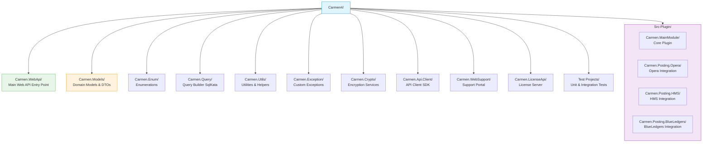
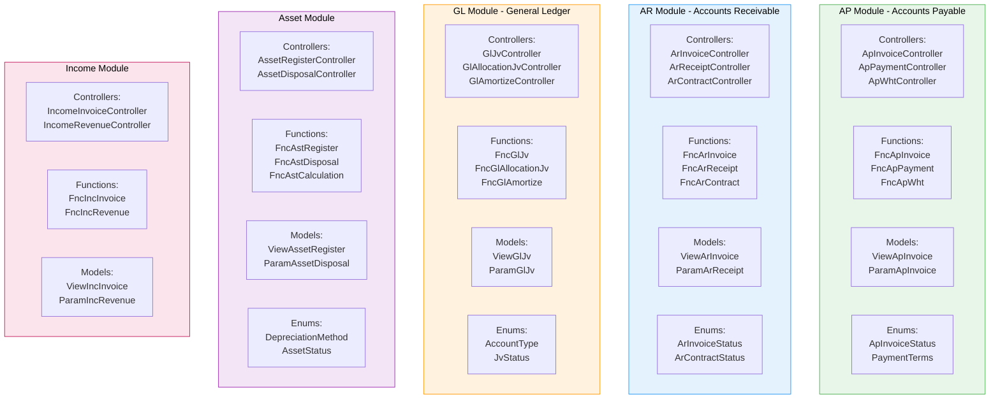
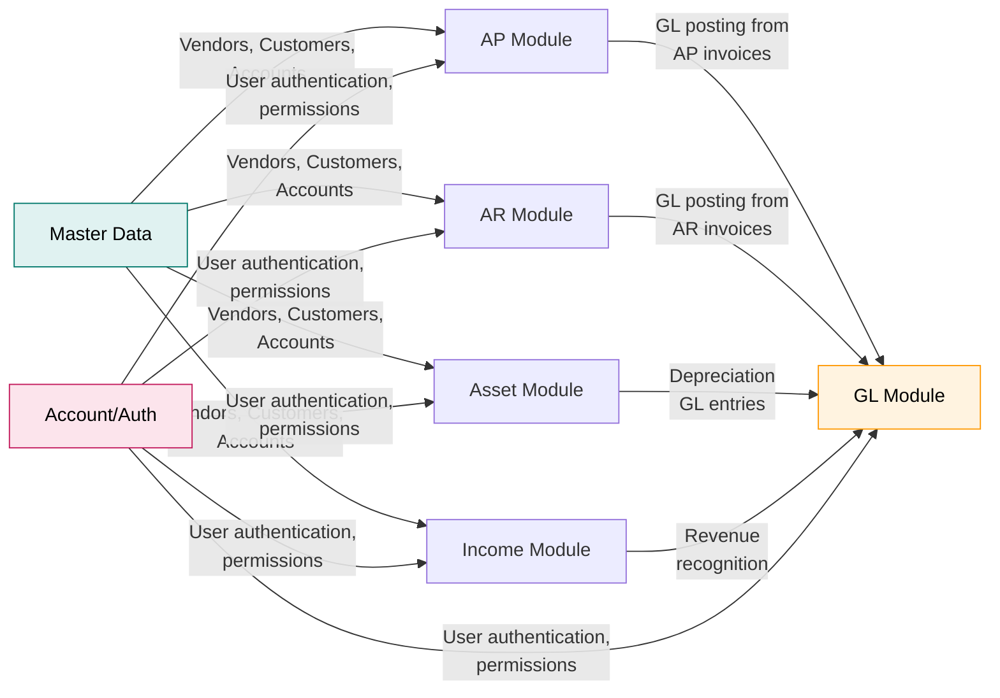
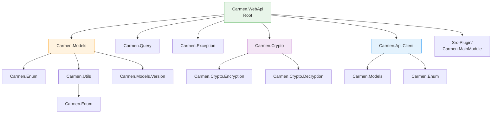

# Carmen.NET Developer Code Structure Guide

**Document Version:** 1.0
**Last Updated:** October 6, 2025
**Target Audience:** Backend Developers, Solution Architects
**Prerequisites:** Developer Onboarding Guide, .NET Framework 4.x knowledge

---

## Table of Contents

1. [Solution Architecture](#solution-architecture)
2. [Project Organization](#project-organization)
3. [Naming Conventions](#naming-conventions)
4. [Directory Structure](#directory-structure)
5. [Module Boundaries](#module-boundaries)
6. [Dependency Management](#dependency-management)
7. [Code Organization Patterns](#code-organization-patterns)
8. [Common Code Locations](#common-code-locations)
9. [File Naming Standards](#file-naming-standards)
10. [Best Practices](#best-practices)

---

## 1. Solution Architecture

### Overview

Carmen.NET uses a **modular monolith architecture** organized into 17+ C# projects within a single solution. The architecture separates concerns into distinct layers while maintaining clear module boundaries.



### Solution File

**Location:** `Carmen4/Carmen.sln` (if exists) or individual `.csproj` files

**Target Framework:**
- **Core Libraries:** .NET Standard 2.0 (Carmen.Models, Carmen.Enum, Carmen.Utils)
- **Web API:** .NET Framework 4.6.2+ (Carmen.WebApi)
- **Modern Migration Path:** Targeting .NET 8 in modernization roadmap

---

## 2. Project Organization

### Core Projects (Alphabetical Order)

#### **Carmen.Api.Client**
- **Purpose:** Client SDK for external integrations
- **Dependencies:** Carmen.Models, Carmen.Enum
- **Key Files:** API client wrappers, HTTP helpers

#### **Carmen.Crypto**
- **Purpose:** Encryption/decryption services
- **Sub-Projects:**
  - `Carmen.Crypto.Encryption` - Encryption logic
  - `Carmen.Crypto.Decryption` - Decryption logic
- **Usage:** Secure data storage, password hashing

#### **Carmen.Enum**
- **Purpose:** System-wide enumerations
- **Dependencies:** None (base library)
- **Target Framework:** .NET Standard 2.0
- **Key Enums:**
  - `PaymentTerms` (NET15, NET30, NET60, NET90, COD, Prepaid)
  - `PaymentMethod` (Cash, Check, Wire, ACH, CreditCard)
  - `ApInvoiceStatus` (Draft, PendingApproval, Approved, etc.)
  - `AccountType` (Asset, Liability, Equity, Revenue, Expense)

#### **Carmen.Exception**
- **Purpose:** Custom exception types
- **Dependencies:** Minimal
- **Usage:** Domain-specific error handling

#### **Carmen.Models**
- **Purpose:** Domain entities, DTOs, view models
- **Dependencies:** Carmen.Enum, Carmen.Utils, Carmen.Models.Version
- **Target Framework:** .NET Standard 2.0
- **File Types:**
  - `I*.cs` - Interfaces (e.g., `IPermissionStore.cs`)
  - `View*.cs` - View models (e.g., `ViewApInvoice.cs`)
  - `Param*.cs` - Parameter objects (e.g., `ParamDashboard.cs`)
  - Entity classes (e.g., `GlAJvH.cs` - GL Auto JV Header)

**Sub-Projects:**
- `Carmen.Models.Interface` - External integration models
- `Carmen.Models.InterfaceList` - Interface configuration
- `Carmen.Models.Version` - Version information

#### **Carmen.Query**
- **Purpose:** SQL query builder (SqlKata wrapper)
- **Dependencies:** SqlKata, Dapper
- **Usage:** Dynamic query construction

#### **Carmen.Utils**
- **Purpose:** Shared utilities and helpers
- **Dependencies:** Carmen.Enum, Newtonsoft.Json
- **Target Framework:** .NET Standard 2.0
- **NuGet Packages:**
  - `Newtonsoft.Json` 12.0.3
  - `Json.Net.DataSetConverters` 1.0.1
  - `System.Data.DataSetExtensions` 4.5.0
  - `System.Drawing.Common` 5.0.2

#### **Carmen.WebApi** ⭐ (Main Entry Point)
- **Purpose:** RESTful Web API, business logic, data access
- **Dependencies:** All Carmen.* projects
- **Target Framework:** .NET Framework 4.6.2+
- **Key Technologies:**
  - ASP.NET Web API 2
  - Entity Framework 6.x
  - Swashbuckle (Swagger documentation)
  - SignalR (real-time notifications)

---

## 3. Naming Conventions

### Project Naming

```
Carmen.<Domain>                 # Core projects
Carmen.<Domain>.<Subdomain>     # Sub-projects
```

**Examples:**
- `Carmen.Models` - Main models
- `Carmen.Models.Interface` - Interface-specific models
- `Carmen.Posting.Opera` - Opera integration plugin

### Namespace Naming

**Convention:** Match project structure exactly

```csharp
namespace Carmen.WebApi.Controllers        // Controllers folder
namespace Carmen.WebApi.Functions          // Functions folder
namespace Carmen.Models                    // Root namespace
namespace Carmen.WebApi.Connection         // Connection folder
```

### Class Naming

| Type | Convention | Example |
|------|------------|---------|
| **Controllers** | `{Entity}Controller` | `ApInvoiceController` |
| **Functions** | `Fnc{Entity}` | `FncApInvoice` |
| **Models (View)** | `View{Entity}` | `ViewApInvoice` |
| **Models (Interface)** | `I{Entity}` | `IPermissionStore` |
| **Models (Param)** | `Param{Entity}` | `ParamDashboard` |
| **Enums** | PascalCase | `PaymentTerms` |
| **Helpers** | `{Domain}Helper` | `StringHelper` |

### Variable Naming

```csharp
// Public properties - PascalCase
public string InvoiceNumber { get; set; }
public decimal TotalAmount { get; set; }

// Private fields - _camelCase
private readonly IDbFactory _dbFactory;
private string _tenantCode;

// Local variables - camelCase
var dbFac = DbFactory.CarmenDbFactory();
var permission = await FncPermission.GetPermissionInfoByPermissionNameAsync();

// Constants - UPPER_CASE or PascalCase
private const int MAX_RETRY_COUNT = 3;
public const string DefaultCurrency = "THB";

// Method parameters - camelCase
public async Task<IHttpActionResult> GetById(int invhSeq, string useTenant = "")
```

### Method Naming

```csharp
// Controllers - HTTP verb pattern
public async Task<IHttpActionResult> GetList()
public async Task<IHttpActionResult> GetById(int id)
public async Task<IHttpActionResult> Create(ParamApInvoice param)
public async Task<IHttpActionResult> Update(int id, ParamApInvoice param)
public async Task<IHttpActionResult> Delete(int id)
public async Task<IHttpActionResult> Search(UriQueryString qs)

// Functions - descriptive action
public static async Task<ViewPagedResult<ViewApInvoice>> GetListAsync()
public static async Task<ViewApInvoice> GetByIdAsync(int id)
public static async Task<int> CreateAsync(ParamApInvoice param)
public static async Task<bool> UpdateAsync(int id, ParamApInvoice param)
public static async Task<bool> DeleteAsync(int id)

// Helpers - verb + noun
public static string FormatCurrency(decimal amount)
public static bool ValidateEmail(string email)
public static DateTime ConvertToThaiDate(DateTime date)
```

---

## 4. Directory Structure

### Carmen.WebApi Project Structure

```mermaid
graph TD
    Root["Carmen.WebApi/"]

    Root --> AppData["App_Data/<br/>DB scripts & migrations"]
    Root --> AppStart["App_Start/<br/>Startup config"]
    Root --> Areas["Areas/<br/>Management & Support"]
    Root --> Config["Config/<br/>Language & settings"]
    Root --> Connection["Connection/<br/>DB factory & contexts"]
    Root --> Controllers["Controllers/ ⭐<br/>60+ API Controllers"]
    Root --> Functions["Functions/ ⭐<br/>90+ Business Logic"]
    Root --> Helper["Helper/<br/>Exception & utilities"]
    Root --> Hubs["Hubs/<br/>SignalR real-time"]
    Root --> InterfaceCtrl["InterfaceControllers/<br/>External integrations"]
    Root --> Models["Models/<br/>Request/Response DTOs"]
    Root --> Plugins["Plugins/<br/>Plugin assemblies"]
    Root --> Scripts["Scripts/<br/>JavaScript files"]
    Root --> Views["Views/<br/>MVC views"]
    Root --> GlobalAsax["Global.asax.cs<br/>App startup"]
    Root --> Startup["Startup.cs<br/>OWIN startup"]
    Root --> WebConfig["Web.config<br/>Configuration"]

    AppData --> InstallAdmin["InstallScriptAdmin/"]
    AppData --> InstallCarmen["InstallScriptCarmen/"]

    AppStart --> WebApiConfig["WebApiConfig.cs"]
    AppStart --> SwaggerConfig["SwaggerConfig.cs"]

    Connection --> DbFactory["DbFactory.cs"]
    Connection --> DatabaseCarmen["DatabaseCarmen.cs"]
    Connection --> DatabaseAdmin["DatabaseAdmin.cs"]

    Controllers --> ApInvoiceCtrl["ApInvoiceController.cs"]
    Controllers --> ArInvoiceCtrl["ArInvoiceController.cs"]
    Controllers --> GlJvCtrl["GlJvController.cs"]
    Controllers --> More60["... 60+ controllers"]

    Functions --> FncApInvoice["FncApInvoice.cs"]
    Functions --> FncArInvoice["FncArInvoice.cs"]
    Functions --> FncGlJv["FncGlJv.cs"]
    Functions --> FncPermission["FncPermission.cs"]
    Functions --> More90["... 90+ functions"]

    InterfaceCtrl --> AP_Interface["AP/"]
    InterfaceCtrl --> AR_Interface["AR/"]
    InterfaceCtrl --> GL_Interface["GL/"]
    InterfaceCtrl --> Opera["Opera/"]
    InterfaceCtrl --> BlueLedgers["BlueLedgers/"]

    style Root fill:#e1f5ff,stroke:#0288d1
    style Controllers fill:#e8f5e9,stroke:#4caf50
    style Functions fill:#fff3e0,stroke:#ff9800
    style Connection fill:#f3e5f5,stroke:#9c27b0
    style InterfaceCtrl fill:#fce4ec,stroke:#c2185b
```



### Key Folder Purposes

| Folder | Purpose | Example Files |
|--------|---------|---------------|
| **Controllers/** | API endpoints, HTTP request handling | `ApInvoiceController.cs` |
| **Functions/** | Business logic, data access, calculations | `FncApInvoice.cs` |
| **Connection/** | Database factory, connection management | `DbFactory.cs` |
| **Models/** | Request/response DTOs (WebApi-specific) | `GblParamsObj.cs` |
| **Helper/** | Cross-cutting utilities | `StringHelper.cs` |
| **InterfaceControllers/** | External system integrations | `OperaController.cs` |
| **App_Start/** | Application configuration | `WebApiConfig.cs` |

---

## 5. Module Boundaries

### Business Module Organization

Carmen.NET organizes code by **functional modules**, not technical layers:



### Cross-Module Dependencies



**Forbidden Dependencies:**
- ❌ **AP ↛ AR** - No direct dependency between modules
- ❌ **AR ↛ Asset** - Use GL as intermediary

### Module Communication Pattern

**Correct Pattern:**
```csharp
// ApInvoiceController.cs - AP Module
public async Task<IHttpActionResult> Post(ParamApInvoice param)
{
    // 1. AP business logic
    var invhSeq = await FncApInvoice.CreateAsync(dbFac, param);

    // 2. GL posting (cross-module via FncGlJv)
    if (param.IsPosted)
    {
        var glParam = MapApInvoiceToGlJv(param);
        await FncGlJv.CreateAsync(dbFac, glParam);  // ✅ Via shared function
    }

    return JsonResultOk(invhSeq);
}
```

**Anti-Pattern (Avoid):**
```csharp
// ❌ BAD: Direct controller-to-controller calls
var arController = new ArInvoiceController();
var result = await arController.GetById(123);  // NEVER DO THIS
```

---

## 6. Dependency Management

### Project Reference Graph



### NuGet Package Strategy

**Core Packages (All Projects):**
```xml
<PackageReference Include="Newtonsoft.Json" Version="12.0.3" />
```

**Web API Packages (Carmen.WebApi):**
```xml
<!-- Web Framework -->
<PackageReference Include="Microsoft.AspNet.WebApi" Version="5.2.7" />
<PackageReference Include="Microsoft.AspNet.WebApi.Owin" Version="5.2.7" />

<!-- ORM & Database -->
<PackageReference Include="EntityFramework" Version="6.4.4" />
<PackageReference Include="Dapper" Version="2.0.123" />
<PackageReference Include="SqlKata" Version="2.3.7" />

<!-- Authentication -->
<PackageReference Include="Microsoft.Owin.Security.Jwt" Version="4.2.0" />
<PackageReference Include="Microsoft.AspNet.Identity.Owin" Version="2.2.3" />

<!-- Documentation -->
<PackageReference Include="Swashbuckle" Version="5.6.0" />

<!-- Real-time -->
<PackageReference Include="Microsoft.AspNet.SignalR" Version="2.4.3" />
```

**Utility Packages (Carmen.Utils):**
```xml
<PackageReference Include="Json.Net.DataSetConverters" Version="1.0.1" />
<PackageReference Include="System.Data.DataSetExtensions" Version="4.5.0" />
<PackageReference Include="System.Drawing.Common" Version="5.0.2" />
```

### Dependency Rules

**✅ DO:**
- Reference Carmen.Enum from any project (base library, no dependencies)
- Reference Carmen.Utils for shared utilities
- Reference Carmen.Models for domain entities
- Use NuGet packages for third-party libraries
- Keep .NET Standard projects dependency-free

**❌ DON'T:**
- Create circular dependencies between projects
- Reference Carmen.WebApi from library projects
- Duplicate code instead of creating shared utilities
- Use different versions of Newtonsoft.Json across projects

---

## 7. Code Organization Patterns

### Controller Pattern

**File Location:** `Carmen.WebApi/Controllers/{Entity}Controller.cs`

**Structure:**
```csharp
namespace Carmen.WebApi.Controllers
{
    using Carmen.Models;
    using Carmen.WebApi.Connection;
    using Functions;
    using Swashbuckle.Swagger.Annotations;
    using System.Net;
    using System.Threading.Tasks;
    using System.Web.Http;

    [SwaggerControllerOrder(201)]
    public class ApInvoiceController : BaseApiController
    {
        // GET: api/apInvoice
        [HttpGet]
        [Authorize]
        [Route("api/apInvoice")]
        public async Task<IHttpActionResult> GetList([FromUri] string q = "", string useTenant = "")
        {
            try
            {
                LogHttpRequest.Info($"{this.GetType().Name} : GetList");
                FncBase.ApplyTenantIfUseTenant(useTenant);

                var permission = await FncPermission.GetPermissionInfoByPermissionNameAsync("AP.Invoice");
                if (!permission.View) return JsonResultForbidden("", "AP.Invoice", "View");

                var dbFac = DbFactory.CarmenDbFactory();
                dbFac.Qs = GetUriQuery(q, true);

                var result = await FncApInvoice.GetListAsync(dbFac, dbFac.Qs);
                return JsonResultOk(JObject.FromObject(result));
            }
            catch (Exception e)
            {
                LogHttpResult.Error(e);
                return JsonResultInternalError(e);
            }
        }

        // GET: api/apInvoice/{id}
        [HttpGet]
        [Authorize]
        [Route("api/apInvoice/{invhSeq}")]
        public async Task<IHttpActionResult> GetById(int invhSeq, string useTenant = "")
        {
            // Similar structure...
        }

        // POST: api/apInvoice
        [HttpPost]
        [Authorize]
        [Route("api/apInvoice")]
        public async Task<IHttpActionResult> Create(ParamApInvoice param)
        {
            // Create logic...
        }

        // PUT: api/apInvoice/{id}
        [HttpPut]
        [Authorize]
        [Route("api/apInvoice/{invhSeq}")]
        public async Task<IHttpActionResult> Update(int invhSeq, ParamApInvoice param)
        {
            // Update logic...
        }

        // DELETE: api/apInvoice/{id}
        [HttpDelete]
        [Authorize]
        [Route("api/apInvoice/{invhSeq}")]
        public async Task<IHttpActionResult> Delete(int invhSeq)
        {
            // Delete logic...
        }
    }
}
```

**Key Patterns:**
1. **Inherit from BaseApiController** - Provides `JsonResultOk()`, `JsonResultForbidden()`, etc.
2. **Try-Catch-Log** - Every action wrapped in try-catch with logging
3. **Permission Check** - Use `FncPermission.GetPermissionInfoByPermissionNameAsync()`
4. **Tenant Isolation** - Call `FncBase.ApplyTenantIfUseTenant(useTenant)`
5. **Async/Await** - All database operations use async pattern
6. **Swagger Attributes** - Document with `[SwaggerResponse]`, `[SwaggerControllerOrder]`

### Function Pattern

**File Location:** `Carmen.WebApi/Functions/Fnc{Entity}.cs`

**Structure:**
```csharp
namespace Carmen.WebApi.Functions
{
    using Carmen.Models;
    using Carmen.WebApi.Connection;
    using Dapper;
    using SqlKata;
    using System.Collections.Generic;
    using System.Linq;
    using System.Threading.Tasks;

    public static class FncApInvoice
    {
        // Read operations
        public static async Task<ViewPagedResult<ViewApInvoice>> GetListAsync(
            IDbFactory dbFac,
            UriQueryString qs)
        {
            using (var db = dbFac.GetConnection())
            {
                var query = new Query("AP_INVOICE_H AS H")
                    .LeftJoin("VENDOR AS V", "V.VendorCode", "H.VendorCode")
                    .Select("H.*", "V.VendorName")
                    .Where("H.TenantCode", FncBase.CurrentTenantCode);

                // Apply filters from query string
                if (!string.IsNullOrEmpty(qs.Filter))
                {
                    query.WhereContains("H.InvoiceNumber", qs.Filter)
                         .OrWhereContains("V.VendorName", qs.Filter);
                }

                var totalRows = await db.ExecuteScalarAsync<int>(
                    dbFac.Compiler.Compile(query.AsCount()).Sql);

                var sql = dbFac.Compiler.Compile(query.Paginate(qs.Page, qs.PageSize));
                var data = await db.QueryAsync<ViewApInvoice>(sql.Sql, sql.NamedBindings);

                return new ViewPagedResult<ViewApInvoice>
                {
                    Data = data.ToList(),
                    TotalRows = totalRows,
                    Page = qs.Page,
                    PageSize = qs.PageSize
                };
            }
        }

        public static async Task<ViewApInvoice> GetByIdAsync(IDbFactory dbFac, int invhSeq)
        {
            using (var db = dbFac.GetConnection())
            {
                var query = new Query("AP_INVOICE_H AS H")
                    .LeftJoin("VENDOR AS V", "V.VendorCode", "H.VendorCode")
                    .Select("H.*", "V.VendorName")
                    .Where("H.InvhSeq", invhSeq)
                    .Where("H.TenantCode", FncBase.CurrentTenantCode);

                var sql = dbFac.Compiler.Compile(query);
                return await db.QueryFirstOrDefaultAsync<ViewApInvoice>(sql.Sql, sql.NamedBindings);
            }
        }

        // Write operations
        public static async Task<int> CreateAsync(IDbFactory dbFac, ParamApInvoice param)
        {
            using (var db = dbFac.GetConnection())
            {
                // Validation
                await ValidateApInvoiceAsync(dbFac, param);

                // Insert header
                var headerSql = @"
                    INSERT INTO AP_INVOICE_H (
                        TenantCode, InvoiceNumber, InvoiceDate, VendorCode,
                        Amount, TaxAmount, WhtAmount, TotalAmount, Status
                    ) VALUES (
                        @TenantCode, @InvoiceNumber, @InvoiceDate, @VendorCode,
                        @Amount, @TaxAmount, @WhtAmount, @TotalAmount, @Status
                    );
                    SELECT CAST(SCOPE_IDENTITY() as int);";

                var invhSeq = await db.ExecuteScalarAsync<int>(headerSql, new
                {
                    TenantCode = FncBase.CurrentTenantCode,
                    param.InvoiceNumber,
                    param.InvoiceDate,
                    param.VendorCode,
                    param.Amount,
                    param.TaxAmount,
                    param.WhtAmount,
                    TotalAmount = param.Amount + param.TaxAmount - param.WhtAmount,
                    Status = "Draft"
                });

                // Insert lines
                foreach (var line in param.Lines)
                {
                    await CreateLineAsync(dbFac, invhSeq, line);
                }

                return invhSeq;
            }
        }

        // Validation
        private static async Task ValidateApInvoiceAsync(IDbFactory dbFac, ParamApInvoice param)
        {
            // Check vendor exists
            var vendorExists = await FncVendor.ExistsAsync(dbFac, param.VendorCode);
            if (!vendorExists)
                throw new BusinessException("VENDOR_NOT_FOUND", $"Vendor {param.VendorCode} not found");

            // Check duplicate invoice number
            var duplicate = await CheckDuplicateInvoiceAsync(dbFac, param.VendorCode, param.InvoiceNumber);
            if (duplicate)
                throw new BusinessException("DUPLICATE_INVOICE", "Invoice number already exists for this vendor");

            // Validate amounts
            if (param.Amount <= 0)
                throw new BusinessException("INVALID_AMOUNT", "Invoice amount must be greater than zero");
        }
    }
}
```

**Key Patterns:**
1. **Static class** - Functions are stateless static methods
2. **Async suffix** - All async methods end with `Async`
3. **Using statements** - Proper disposal of database connections
4. **Tenant filtering** - Always apply `FncBase.CurrentTenantCode` in WHERE clauses
5. **SqlKata queries** - Use query builder for type safety
6. **Validation first** - Validate before any database modifications
7. **Transaction management** - Use transactions for multi-table operations

### Model Organization

**Carmen.Models Project:**

```csharp
// Interfaces (IPermissionStore.cs)
namespace Carmen.Models
{
    public interface IPermissionStore
    {
        string PermissionName { get; set; }
        bool View { get; set; }
        bool Create { get; set; }
        bool Update { get; set; }
        bool Delete { get; set; }
        bool Approve { get; set; }
    }
}

// View Models (ViewApInvoice.cs)
namespace Carmen.Models
{
    public class ViewApInvoice
    {
        public int InvhSeq { get; set; }
        public string TenantCode { get; set; }
        public string InvoiceNumber { get; set; }
        public DateTime InvoiceDate { get; set; }
        public string VendorCode { get; set; }
        public string VendorName { get; set; }  // Joined from VENDOR table
        public decimal Amount { get; set; }
        public decimal TaxAmount { get; set; }
        public decimal WhtAmount { get; set; }
        public decimal TotalAmount { get; set; }
        public string Status { get; set; }
        public DateTime CreatedDate { get; set; }
        public string CreatedBy { get; set; }
    }
}

// Parameter Models (ParamApInvoice.cs)
namespace Carmen.Models
{
    using System.Collections.Generic;
    using System.ComponentModel.DataAnnotations;

    public class ParamApInvoice
    {
        [Required]
        [MaxLength(50)]
        public string InvoiceNumber { get; set; }

        [Required]
        public DateTime InvoiceDate { get; set; }

        [Required]
        [MaxLength(20)]
        public string VendorCode { get; set; }

        [Range(0.01, double.MaxValue)]
        public decimal Amount { get; set; }

        public decimal TaxAmount { get; set; }
        public decimal WhtAmount { get; set; }

        public List<ParamApInvoiceLine> Lines { get; set; } = new List<ParamApInvoiceLine>();
    }

    public class ParamApInvoiceLine
    {
        public int LineNum { get; set; }
        public string Description { get; set; }
        public decimal Amount { get; set; }
        public string AccountCode { get; set; }
    }
}
```

---

## 8. Common Code Locations

### Finding Code by Feature

| Task | Location | Example File |
|------|----------|--------------|
| **Add new API endpoint** | `Carmen.WebApi/Controllers/` | `ApInvoiceController.cs` |
| **Implement business logic** | `Carmen.WebApi/Functions/` | `FncApInvoice.cs` |
| **Define data model** | `Carmen.Models/` | `ViewApInvoice.cs` |
| **Add enumeration** | `Carmen.Enum/` | `PaymentTerms.cs` |
| **Database connection** | `Carmen.WebApi/Connection/` | `DbFactory.cs` |
| **Permission checks** | `Carmen.WebApi/Functions/` | `FncPermission.cs` |
| **External integration** | `Carmen.WebApi/InterfaceControllers/` | `OperaController.cs` |
| **Utility functions** | `Carmen.Utils/` | `StringHelper.cs` |
| **Custom exceptions** | `Carmen.Exception/` | `BusinessException.cs` |
| **API configuration** | `Carmen.WebApi/App_Start/` | `WebApiConfig.cs` |
| **Swagger setup** | `Carmen.WebApi/App_Start/` | `SwaggerConfig.cs` |
| **Database scripts** | `Carmen.WebApi/App_Data/` | `InstallScriptCarmen/` |

### Quick Reference: Common Base Classes

```csharp
// Controllers
public class ApInvoiceController : BaseApiController { }

// Functions (all static, no base class)
public static class FncApInvoice { }

// Models (no inheritance for DTOs)
public class ViewApInvoice { }
public class ParamApInvoice { }

// Custom Exceptions
public class BusinessException : ApplicationException { }
```

---

## 9. File Naming Standards

### File Name = Class Name

**Rule:** One class per file, file name matches class name exactly

```
✅ ApInvoiceController.cs      → class ApInvoiceController
✅ FncApInvoice.cs             → class FncApInvoice
✅ ViewApInvoice.cs            → class ViewApInvoice
✅ PaymentTerms.cs             → enum PaymentTerms

❌ ApInvoice.cs                → contains ApInvoiceController (confusing)
❌ Helpers.cs                  → contains StringHelper, DateHelper (multiple classes)
```

### Exception: Multiple Related Enums

**Allowed** when enums are tightly coupled:

```csharp
// File: ApInvoiceEnums.cs
namespace Carmen.Enum
{
    public enum ApInvoiceStatus
    {
        Draft,
        PendingApproval,
        Approved,
        Posted
    }

    public enum ApInvoiceType
    {
        Invoice,
        CreditNote,
        DebitNote
    }
}
```

### Test Files

**Convention:** `{ClassUnderTest}Tests.cs` or `{ClassUnderTest}Test.cs`

```
ApInvoiceControllerTests.cs    # Tests for ApInvoiceController
FncApInvoiceTests.cs           # Tests for FncApInvoice
```

---

## 10. Best Practices

### ✅ DO

**Separation of Concerns:**
```csharp
// ✅ Controller handles HTTP, Functions handle business logic
public async Task<IHttpActionResult> GetList()
{
    var result = await FncApInvoice.GetListAsync(dbFac, qs);  // Delegate to function
    return JsonResultOk(result);
}
```

**Async/Await Consistently:**
```csharp
// ✅ Use async/await for all I/O operations
public static async Task<ViewApInvoice> GetByIdAsync(int id)
{
    var result = await db.QueryFirstOrDefaultAsync<ViewApInvoice>(sql);
    return result;
}
```

**Dependency Injection (where supported):**
```csharp
// ✅ Use DI for testability (newer code)
private readonly IDbFactory _dbFactory;

public ApInvoiceController(IDbFactory dbFactory)
{
    _dbFactory = dbFactory;
}
```

**Explicit null checks:**
```csharp
// ✅ Check for null before using
var invoice = await FncApInvoice.GetByIdAsync(id);
if (invoice == null)
    return JsonResultNullObject();

return JsonResultOk(invoice);
```

**Validate early:**
```csharp
// ✅ Validate at the start of the function
public static async Task CreateAsync(ParamApInvoice param)
{
    if (param == null) throw new ArgumentNullException(nameof(param));
    if (string.IsNullOrEmpty(param.InvoiceNumber))
        throw new BusinessException("INVALID_INVOICE", "Invoice number required");

    // Proceed with creation...
}
```

### ❌ DON'T

**Don't mix concerns:**
```csharp
// ❌ BAD: Database logic in controller
public async Task<IHttpActionResult> GetList()
{
    using (var db = dbFac.GetConnection())  // DON'T
    {
        var sql = "SELECT * FROM AP_INVOICE_H";  // DON'T
        var result = await db.QueryAsync(sql);
        return JsonResultOk(result);
    }
}

// ✅ GOOD: Delegate to function layer
public async Task<IHttpActionResult> GetList()
{
    var result = await FncApInvoice.GetListAsync(dbFac, qs);
    return JsonResultOk(result);
}
```

**Don't use blocking calls in async methods:**
```csharp
// ❌ BAD: .Result blocks the thread
var result = FncApInvoice.GetListAsync(dbFac, qs).Result;  // DON'T

// ✅ GOOD: Await properly
var result = await FncApInvoice.GetListAsync(dbFac, qs);
```

**Don't skip permission checks:**
```csharp
// ❌ BAD: No permission check
public async Task<IHttpActionResult> Delete(int id)
{
    await FncApInvoice.DeleteAsync(dbFac, id);  // SECURITY RISK
    return JsonResultOk();
}

// ✅ GOOD: Check permission first
public async Task<IHttpActionResult> Delete(int id)
{
    var permission = await FncPermission.GetPermissionInfoByPermissionNameAsync("AP.Invoice");
    if (!permission.Delete)
        return JsonResultForbidden("", "AP.Invoice", "Delete");

    await FncApInvoice.DeleteAsync(dbFac, id);
    return JsonResultOk();
}
```

**Don't hardcode tenant code:**
```csharp
// ❌ BAD: Hardcoded tenant
var query = new Query("AP_INVOICE_H")
    .Where("TenantCode", "TENANT001");  // DON'T

// ✅ GOOD: Use FncBase.CurrentTenantCode
var query = new Query("AP_INVOICE_H")
    .Where("TenantCode", FncBase.CurrentTenantCode);
```

**Don't swallow exceptions:**
```csharp
// ❌ BAD: Silent failure
try
{
    await FncApInvoice.CreateAsync(dbFac, param);
}
catch
{
    // Silent failure - nobody knows what went wrong
}

// ✅ GOOD: Log and return proper error
try
{
    await FncApInvoice.CreateAsync(dbFac, param);
}
catch (Exception e)
{
    LogHttpResult.Error(e);
    return JsonResultInternalError(e);
}
```

### Code Review Checklist

Before submitting code for review:

- [ ] File name matches class name
- [ ] Namespace matches folder structure
- [ ] Async methods have `Async` suffix
- [ ] All database operations use async/await
- [ ] Permission checks present in controllers
- [ ] Tenant code applied to all queries (`FncBase.CurrentTenantCode`)
- [ ] Proper error handling with logging
- [ ] No hardcoded values (use configuration)
- [ ] Swagger documentation attributes added
- [ ] Unit tests written (if applicable)
- [ ] No compiler warnings
- [ ] Follows existing code patterns in the module

---

## Summary

This guide covers the Carmen.NET codebase structure and organization:

1. **Solution Architecture** - 17+ projects in modular monolith
2. **Project Organization** - Core libraries (Models, Enum, Utils) + Web API
3. **Naming Conventions** - PascalCase classes, _camelCase private fields
4. **Directory Structure** - Controllers, Functions, Models, Connection folders
5. **Module Boundaries** - 11 business modules (AP, AR, GL, Asset, Income, etc.)
6. **Dependency Management** - Project references, NuGet packages
7. **Code Organization** - Controller → Function → Database pattern
8. **Common Code Locations** - Quick reference for where to add code
9. **File Naming** - One class per file, file name = class name
10. **Best Practices** - DOs and DON'Ts with examples

**Next Steps:**
- Review [Design Patterns Documentation](design-patterns-guide.md) for implementation patterns
- Study [Database Schema Documentation](database-schema-guide.md) for data model
- Consult [Testing Guide](testing-guide.md) for writing tests
- Reference [Developer Onboarding Guide](developer-onboarding-guide.md) for setup

---

**Document Status:** ✅ Complete
**For Support:** Contact development team or refer to architecture decision records
