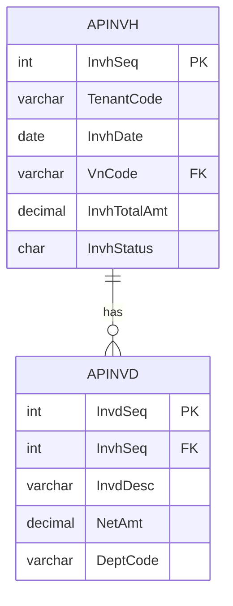
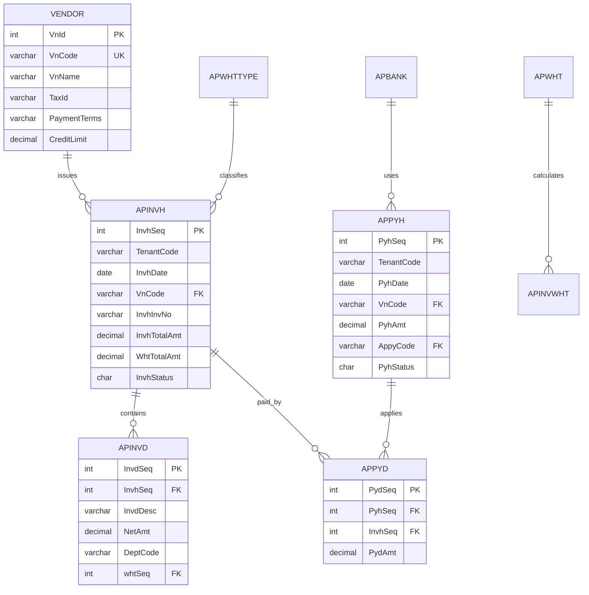
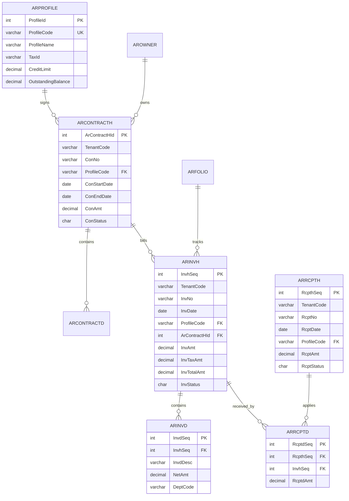
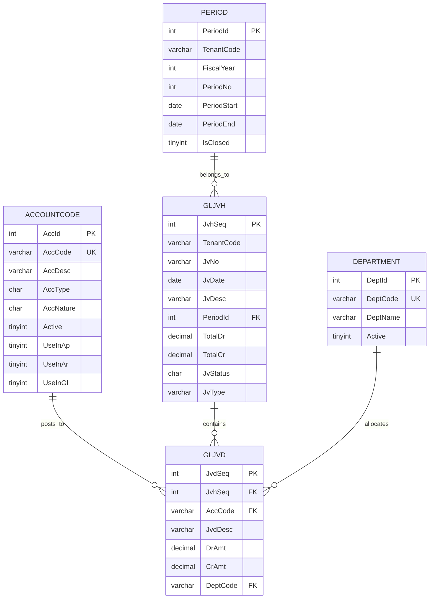
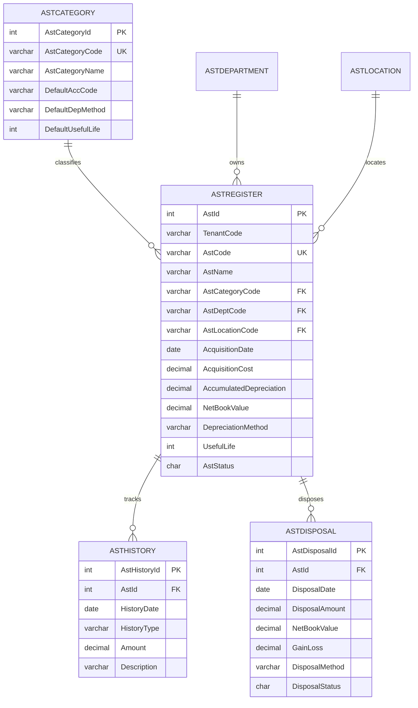
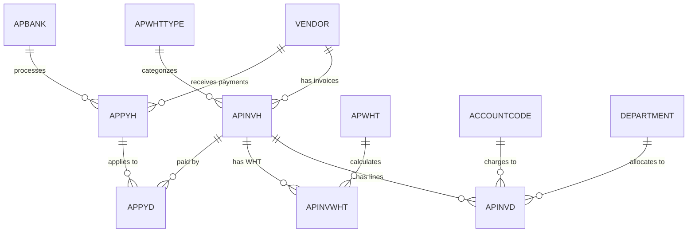
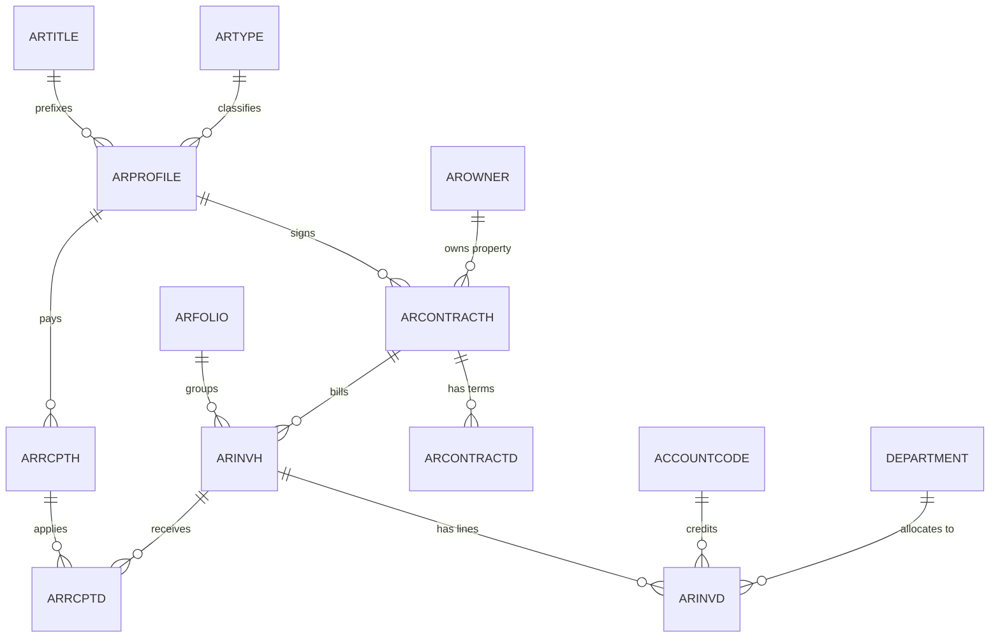
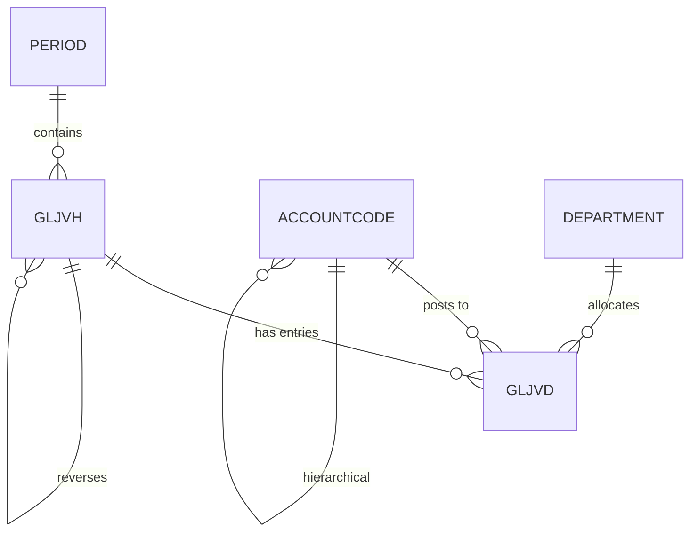

# Carmen.NET Database Schema Documentation

**Document Version:** 1.0
**Last Updated:** October 6, 2025
**Target Audience:** Database Administrators, Backend Developers, Data Analysts
**Prerequisites:** Data Dictionary, SQL knowledge

---

## Table of Contents

1. [Database Overview](#database-overview)
2. [Schema Architecture](#schema-architecture)
3. [Module Schemas](#module-schemas)
4. [Entity Relationship Diagrams](#entity-relationship-diagrams)
5. [Table Reference](#table-reference)
6. [Indexes & Performance](#indexes--performance)
7. [Stored Procedures & Functions](#stored-procedures--functions)
8. [Views](#views)
9. [Data Migration](#data-migration)

---

## 1. Database Overview

### Database Configuration

**Primary Database:** `Carmen` (Tenant-specific)
**Admin Database:** `CarmenAdmin` (Multi-tenant management)
**Database Engine:** MySQL 5.7+ / MariaDB 10.3+
**Character Set:** UTF-8
**Storage Engine:** InnoDB (ACID compliance, transactions, foreign keys)
**Collation:** `utf8_general_ci`

### Multi-Tenancy Architecture

Carmen.NET implements **row-level multi-tenancy** with data isolation at the application layer:

```sql
-- Example: Every transactional table includes TenantCode
CREATE TABLE apinvh (
  InvhSeq INT PRIMARY KEY AUTO_INCREMENT,
  TenantCode VARCHAR(20) NOT NULL,  -- ← Multi-tenant isolation
  InvhDate DATE,
  VnCode VARCHAR(20),
  -- ... other fields
  KEY TenantCode_I (TenantCode)      -- ← Index for filtering
) ENGINE=InnoDB;

-- All queries must filter by TenantCode
SELECT * FROM apinvh WHERE TenantCode = 'TENANT001' AND InvhSeq = 123;
```

**Benefits:**
- ✅ Single database simplifies backups and migrations
- ✅ Shared infrastructure reduces operational costs
- ✅ Schema changes apply to all tenants simultaneously

**Considerations:**
- ⚠️ Application must enforce tenant filtering on ALL queries
- ⚠️ No database-level tenant isolation (rely on application layer)
- ⚠️ Requires careful index design for multi-tenant queries

### Database Statistics

| Metric | Count |
|--------|-------|
| **Total Tables** | 80+ |
| **AP Module Tables** | 12 |
| **AR Module Tables** | 15 |
| **GL Module Tables** | 8 |
| **Asset Module Tables** | 7 |
| **Master Data Tables** | 20 |
| **System Tables** | 18 |
| **Stored Procedures** | 75+ |
| **Views** | 65+ |
| **Functions** | 15+ |

---

## 2. Schema Architecture

### Naming Conventions

**Table Naming:**
```
{module}{entity}{type}

module: ap, ar, gl, ast (asset), inc (income)
entity: inv (invoice), py (payment), jv (journal voucher)
type: h (header), d (detail/lines)
```

**Examples:**
- `apinvh` - **A**ccounts **P**ayable **Inv**oice **H**eader
- `apinvd` - **A**ccounts **P**ayable **Inv**oice **D**etail
- `appyh` - **A**ccounts **P**ayable **P**a**y**ment **H**eader
- `arinvh` - **A**ccounts **R**eceivable **Inv**oice **H**eader
- `gljvh` - **G**eneral **L**edger **J**ournal **V**oucher **H**eader

**Column Naming:**
```
{prefix}{PropertyName}

prefix: Module-specific (Invh, Pyd, AccCode, VnCode)
PropertyName: CamelCase descriptor
```

**Examples:**
- `InvhSeq` - Invoice Header Sequence (Primary Key)
- `InvhDate` - Invoice Header Date
- `VnCode` - Vendor Code
- `PydAmt` - Payment Detail Amount

### Data Types

**Standard Field Types:**

| Purpose | Data Type | Example |
|---------|-----------|---------|
| **Primary Key** | `INT AUTO_INCREMENT` | `InvhSeq INT PRIMARY KEY` |
| **Codes** | `VARCHAR(10-20)` | `VnCode VARCHAR(20)` |
| **Names** | `VARCHAR(50-255)` | `VnName VARCHAR(255)` |
| **Descriptions** | `VARCHAR(255-500)` | `InvhDesc VARCHAR(255)` |
| **Long Text** | `TEXT` / `LONGTEXT` | `InvhInfo LONGTEXT` |
| **Amounts** | `DECIMAL(18,4)` | `InvhTotalAmt DECIMAL(18,4)` |
| **Rates** | `DECIMAL(18,8)` | `CurRate DECIMAL(18,8)` |
| **Dates** | `DATE` | `InvhDate DATE` |
| **Timestamps** | `DATETIME` / `TIMESTAMP` | `LastModified TIMESTAMP` |
| **Flags** | `TINYINT(1)` / `CHAR(1)` | `Active TINYINT(1)` |

### Header-Detail Pattern

Most transactional tables follow a **header-detail** structure:



**Pattern Benefits:**
- ✅ Normalized structure (avoid duplication)
- ✅ Flexible line items (varying quantities)
- ✅ Easy to query totals and breakdowns

---

## 3. Module Schemas

### Accounts Payable (AP) Module

**Core Tables:**



**Key Relationships:**
- VENDOR → APINVH (One vendor, many invoices)
- APINVH → APINVD (One invoice, many lines)
- APINVH ← APPYD → APPYH (Payment application: many-to-many)
- APINVH → APINVWHT (One invoice, many WHT line items)

**Business Rules:**
1. Invoice total = SUM(APINVD.NetAmt) + Taxes - WHT
2. Outstanding = InvhTotalAmt - SUM(APPYD.PydAmt)
3. Payment must reference at least one invoice
4. WHT calculated per line or header level

---

### Accounts Receivable (AR) Module

**Core Tables:**



**Key Relationships:**
- ARPROFILE → ARCONTRACTH (Customer contracts)
- ARCONTRACTH → ARINVH (Contract billing)
- ARINVH → ARINVD (Invoice line items)
- ARINVH ← ARRCPTD → ARRCPTH (Receipt application: many-to-many)
- ARFOLIO → ARINVH (Hotel folio tracking)

**Business Rules:**
1. Invoice total = SUM(ARINVD.NetAmt) + VAT
2. Outstanding = InvTotalAmt - SUM(ARRCPTD.RcptdAmt)
3. Receipt application uses FIFO (First In, First Out)
4. Contract billing: Sum(Invoices) ≤ Contract Amount

---

### General Ledger (GL) Module

**Core Tables:**



**Key Relationships:**
- ACCOUNTCODE ← GLJVD → GLJVH (Journal entries)
- PERIOD → GLJVH (Period tracking)
- DEPARTMENT → GLJVD (Cost center allocation)

**Business Rules:**
1. **Balanced Entry**: TotalDr = TotalCr (enforced)
2. **Period Lock**: Cannot post to closed periods
3. **Account Validation**: AccCode must exist and allow posting
4. **Reversal**: Reversal JV references original JvhSeq

**Chart of Accounts Structure (10-Digit):**

```
Format: AAAA-BB-CC-DD

AAAA = Main Account (4 digits)
  1000-1999: Assets
  2000-2999: Liabilities
  3000-3999: Equity
  4000-4999: Revenue
  5000-9999: Expenses

BB = Sub-Account (2 digits, 01-99)
CC = Department (2 digits, 01-99)
DD = Project (2 digits, 01-99)

Example: 1100-01-10-20
  1100 = Cash in Bank
  01 = Checking Account
  10 = IT Department
  20 = Project Alpha
```

---

### Asset Management Module

**Core Tables:**



**Key Relationships:**
- ASTCATEGORY → ASTREGISTER (Asset classification)
- ASTDEPARTMENT → ASTREGISTER (Department ownership)
- ASTREGISTER → ASTHISTORY (Transaction history)
- ASTREGISTER → ASTDISPOSAL (Disposal tracking)

**Business Rules:**
1. **Depreciation Calculation**:
   - Straight-Line: (Cost - Salvage) / UsefulLife / 12
   - Declining Balance: NetBookValue × Rate / 12
2. **Net Book Value**: AcquisitionCost - AccumulatedDepreciation
3. **Disposal G/L**: DisposalAmount - NetBookValue

---

### Master Data Tables

**Core Entities:**

| Table | Purpose | Key Fields |
|-------|---------|-----------|
| **VENDOR** | AP vendor master | VnCode, VnName, TaxId, PaymentTerms |
| **ARPROFILE** | AR customer master | ProfileCode, ProfileName, CreditLimit |
| **ACCOUNTCODE** | Chart of accounts | AccCode, AccDesc, AccType, AccNature |
| **DEPARTMENT** | Cost centers | DeptCode, DeptName |
| **PROJECT** | Project tracking | ProjectCode, ProjectName |
| **CURRENCY** | Multi-currency | CurCode, CurRate, CurName |
| **TAXCODE** | Tax rates | TaxCode, TaxRate, TaxType |
| **APBANK** | Company bank accounts | BankCode, BankName, BankAccount |
| **APPYT** | Payment types | AppyCode, AppyDesc, UseInAp, UseInAr |

---

## 4. Entity Relationship Diagrams

### AP Module Complete ERD



### AR Module Complete ERD



### GL Module Complete ERD



---

## 5. Table Reference

### Critical Tables Deep Dive

#### APINVH - AP Invoice Header

**Purpose:** Tracks vendor invoices

**Schema:**
```sql
CREATE TABLE apinvh (
  InvhSeq INT PRIMARY KEY AUTO_INCREMENT COMMENT 'Invoice Header Sequence',
  TenantCode VARCHAR(20) NOT NULL,
  InvhDate DATE DEFAULT NULL COMMENT 'Transaction Date',
  InvhInvNo VARCHAR(30) DEFAULT NULL COMMENT 'Invoice Number',
  InvhInvDate DATE DEFAULT NULL COMMENT 'Invoice Date',
  InvhDueDate DATE DEFAULT NULL COMMENT 'Due Date',
  VnCode VARCHAR(20) DEFAULT NULL COMMENT 'Vendor Code',
  CurCode VARCHAR(10) DEFAULT NULL COMMENT 'Currency Code',
  CurRate DECIMAL(18,8) DEFAULT 0.00000000 COMMENT 'Exchange Rate',
  InvhTotalAmt DECIMAL(18,4) DEFAULT 0.0000 COMMENT 'Total Amount',
  WhtTotalAmt DECIMAL(18,4) DEFAULT 0.0000 COMMENT 'WHT Amount',
  InvhStatus CHAR(1) DEFAULT 'E' COMMENT 'Status: E=Entry, A=Approved, P=Posted',
  InvhDesc VARCHAR(255) DEFAULT '' COMMENT 'Description',
  TaxPeriod VARCHAR(7) DEFAULT NULL COMMENT 'Tax Period YYYY-MM',
  TaxStatus CHAR(1) DEFAULT NULL COMMENT 'Tax Status',
  UserModified VARCHAR(50) DEFAULT NULL,
  LastModified TIMESTAMP DEFAULT CURRENT_TIMESTAMP ON UPDATE CURRENT_TIMESTAMP,

  KEY VnCode_I (VnCode),
  KEY TenantCode_I (TenantCode),
  KEY InvhDate_I (InvhDate),
  KEY InvhStatus_I (InvhStatus)
) ENGINE=InnoDB COMMENT='AP Invoice Header';
```

**Status Values:**
- `E` = Entry (Draft)
- `A` = Approved
- `P` = Posted to GL
- `V` = Void

**Indexes:**
- `PRIMARY KEY` on InvhSeq (clustered)
- `VnCode_I` for vendor lookups
- `TenantCode_I` for multi-tenant filtering
- `InvhDate_I` for date range queries
- `InvhStatus_I` for status filtering

---

#### APINVD - AP Invoice Detail

**Purpose:** Invoice line items with GL account allocation

**Schema:**
```sql
CREATE TABLE apinvd (
  InvdSeq INT PRIMARY KEY AUTO_INCREMENT,
  InvhSeq INT NOT NULL COMMENT 'FK to apinvh',
  InvdDesc VARCHAR(255) DEFAULT '',
  InvdQty DECIMAL(18,4) DEFAULT 0.0000,
  UnitCode VARCHAR(10) DEFAULT '',
  InvdPrice DECIMAL(18,4) DEFAULT 0.0000,
  NetAmt DECIMAL(18,4) DEFAULT 0.0000 COMMENT 'Line Amount',
  InvdBTaxDr VARCHAR(15) DEFAULT NULL COMMENT 'GL Debit Account',
  InvdTaxT1 CHAR(1) DEFAULT 'N' COMMENT 'Tax 1 Type',
  InvdTaxR1 DECIMAL(18,8) DEFAULT 0.00000000 COMMENT 'Tax 1 Rate',
  InvdTaxA1 DECIMAL(18,4) DEFAULT 0.0000 COMMENT 'Tax 1 Amount',
  DeptCode VARCHAR(10) DEFAULT '' COMMENT 'Department',
  whtSeq INT DEFAULT NULL COMMENT 'FK to apinvwht',

  KEY InvhSeq_I (InvhSeq),
  CONSTRAINT fk_apinvd_invhseq FOREIGN KEY (InvhSeq) REFERENCES apinvh(InvhSeq) ON DELETE CASCADE
) ENGINE=InnoDB COMMENT='AP Invoice Detail';
```

**Business Rules:**
- SUM(NetAmt) + Taxes - WHT = apinvh.InvhTotalAmt
- InvdBTaxDr must exist in accountcode and allow posting
- DeptCode must exist in department table

---

#### GLJVH - GL Journal Voucher Header

**Purpose:** Manual GL journal entries

**Schema:**
```sql
CREATE TABLE gljvh (
  JvhSeq INT PRIMARY KEY AUTO_INCREMENT,
  TenantCode VARCHAR(20) NOT NULL,
  JvNo VARCHAR(30) NOT NULL COMMENT 'JV Number',
  JvDate DATE NOT NULL COMMENT 'Journal Date',
  JvDesc VARCHAR(255) DEFAULT NULL,
  PeriodId INT DEFAULT NULL COMMENT 'FK to period',
  TotalDr DECIMAL(18,4) DEFAULT 0.0000,
  TotalCr DECIMAL(18,4) DEFAULT 0.0000,
  JvStatus CHAR(1) DEFAULT 'E' COMMENT 'E=Entry, P=Posted',
  JvType VARCHAR(10) DEFAULT 'MJV' COMMENT 'Manual JV',
  ReversalJvhSeq INT DEFAULT NULL COMMENT 'Original JV if reversal',

  UNIQUE KEY JvNo_U (JvNo, TenantCode),
  KEY TenantCode_I (TenantCode),
  KEY JvDate_I (JvDate),
  KEY PeriodId_I (PeriodId)
) ENGINE=InnoDB;
```

**Business Rules:**
- TotalDr MUST equal TotalCr (enforced by trigger)
- JvDate must be within open period
- Posted JVs (JvStatus='P') cannot be modified
- Reversals reference original via ReversalJvhSeq

---

#### GLJVD - GL Journal Voucher Detail

**Schema:**
```sql
CREATE TABLE gljvd (
  JvdSeq INT PRIMARY KEY AUTO_INCREMENT,
  JvhSeq INT NOT NULL COMMENT 'FK to gljvh',
  AccCode VARCHAR(15) NOT NULL COMMENT 'GL Account',
  JvdDesc VARCHAR(255) DEFAULT NULL,
  DrAmt DECIMAL(18,4) DEFAULT 0.0000,
  CrAmt DECIMAL(18,4) DEFAULT 0.0000,
  DeptCode VARCHAR(10) DEFAULT NULL,

  KEY JvhSeq_I (JvhSeq),
  KEY AccCode_I (AccCode),
  CONSTRAINT fk_gljvd_jvhseq FOREIGN KEY (JvhSeq) REFERENCES gljvh(JvhSeq) ON DELETE CASCADE
) ENGINE=InnoDB;
```

**Business Rules:**
- Either DrAmt OR CrAmt > 0 (not both)
- AccCode must exist and allow posting
- SUM(DrAmt) = gljvh.TotalDr
- SUM(CrAmt) = gljvh.TotalCr

---

## 6. Indexes & Performance

### Index Strategy

**Multi-Tenant Index Pattern:**
```sql
-- All transactional tables
KEY TenantCode_I (TenantCode)

-- Composite index for tenant + status
KEY TenantCode_Status_I (TenantCode, InvhStatus)

-- Covering index for list queries
KEY TenantCode_Date_I (TenantCode, InvhDate, InvhStatus)
```

**Foreign Key Indexes:**
```sql
-- Always index FK columns
KEY VnCode_I (VnCode)          -- FK to vendor
KEY InvhSeq_I (InvhSeq)        -- FK to invoice header
KEY AccCode_I (AccCode)        -- FK to account code
```

**Performance Indexes:**
```sql
-- Date range queries
KEY InvhDate_I (InvhDate)

-- Status filtering
KEY InvhStatus_I (InvhStatus)

-- Number lookups
KEY InvhInvNo_I (InvhInvNo)

-- Composite for common queries
KEY TenantCode_VnCode_Date_I (TenantCode, VnCode, InvhDate)
```

### Query Optimization Tips

**Avoid Full Table Scans:**
```sql
-- ❌ BAD: No index on TenantCode
SELECT * FROM apinvh WHERE InvhDate >= '2025-01-01';

-- ✅ GOOD: Use composite index
SELECT * FROM apinvh
WHERE TenantCode = 'TENANT001'
  AND InvhDate >= '2025-01-01';
```

**Use Covering Indexes:**
```sql
-- ❌ BAD: Extra lookup to retrieve InvhStatus
SELECT InvhSeq, InvhStatus FROM apinvh WHERE TenantCode = 'TENANT001';

-- ✅ GOOD: Add covering index
CREATE INDEX TenantCode_Covering_I ON apinvh(TenantCode, InvhSeq, InvhStatus);
```

**Pagination:**
```sql
-- ✅ GOOD: Efficient pagination
SELECT * FROM apinvh
WHERE TenantCode = 'TENANT001'
ORDER BY InvhSeq
LIMIT 100 OFFSET 0;
```

---

## 7. Stored Procedures & Functions

### Key Stored Procedures

**Location:** `Carmen.WebApi/App_Data/InstallScriptCarmen/Post/03-StoreProc/`

| Procedure | Purpose |
|-----------|---------|
| **spApInvoicePost** | Post AP invoice to GL |
| **spApPaymentPost** | Post AP payment to GL |
| **spArInvoicePost** | Post AR invoice to GL |
| **spArReceiptPost** | Post AR receipt to GL |
| **spAssetDepreciation** | Calculate monthly depreciation |
| **spGlPeriodClose** | Close GL period |
| **spGlTrialBalance** | Generate trial balance |

**Example: spApInvoicePost**
```sql
CREATE PROCEDURE spApInvoicePost(
  IN p_InvhSeq INT,
  IN p_JvDate DATE,
  IN p_UserName VARCHAR(50)
)
BEGIN
  DECLARE v_JvhSeq INT;
  DECLARE v_TotalDr DECIMAL(18,4) DEFAULT 0;
  DECLARE v_TotalCr DECIMAL(18,4) DEFAULT 0;

  -- Create GL JV Header
  INSERT INTO gljvh (TenantCode, JvNo, JvDate, JvDesc, JvType, JvStatus)
  SELECT TenantCode,
         CONCAT('AP-', InvhSeq),
         p_JvDate,
         CONCAT('AP Invoice: ', InvhInvNo),
         'AP',
         'P'
  FROM apinvh WHERE InvhSeq = p_InvhSeq;

  SET v_JvhSeq = LAST_INSERT_ID();

  -- Post invoice lines (DR Expense accounts)
  INSERT INTO gljvd (JvhSeq, AccCode, JvdDesc, DrAmt, CrAmt, DeptCode)
  SELECT v_JvhSeq,
         d.InvdBTaxDr,
         d.InvdDesc,
         d.NetAmt,
         0,
         d.DeptCode
  FROM apinvd d
  WHERE d.InvhSeq = p_InvhSeq;

  -- Post AP payable (CR Accounts Payable)
  INSERT INTO gljvd (JvhSeq, AccCode, JvdDesc, DrAmt, CrAmt)
  SELECT v_JvhSeq,
         '2100-01-00-00',  -- AP Control Account
         CONCAT('Vendor: ', h.VnCode),
         0,
         h.InvhTotalAmt
  FROM apinvh h
  WHERE h.InvhSeq = p_InvhSeq;

  -- Update invoice status
  UPDATE apinvh SET InvhStatus = 'P', JvhSeq = v_JvhSeq
  WHERE InvhSeq = p_InvhSeq;

  -- Validate balanced entry
  SELECT SUM(DrAmt), SUM(CrAmt) INTO v_TotalDr, v_TotalCr
  FROM gljvd WHERE JvhSeq = v_JvhSeq;

  IF v_TotalDr <> v_TotalCr THEN
    SIGNAL SQLSTATE '45000' SET MESSAGE_TEXT = 'JV not balanced';
  END IF;

  UPDATE gljvh SET TotalDr = v_TotalDr, TotalCr = v_TotalCr
  WHERE JvhSeq = v_JvhSeq;

END;
```

---

## 8. Views

### Key Views

**Location:** `Carmen.WebApi/App_Data/InstallScriptCarmen/Post/04-View/`

| View | Purpose |
|------|---------|
| **vw_ApInvoiceList** | AP invoices with vendor info |
| **vw_ApInvoiceOutstanding** | Unpaid AP invoices |
| **vw_ArInvoiceList** | AR invoices with customer info |
| **vw_ArAging** | AR aging report |
| **vw_GlTrialBalance** | GL trial balance |
| **vw_AssetRegister** | Asset register with NBV |

**Example: vw_ApInvoiceOutstanding**
```sql
CREATE VIEW vw_ApInvoiceOutstanding AS
SELECT
  h.InvhSeq,
  h.TenantCode,
  h.InvhInvNo AS InvoiceNumber,
  h.InvhDate AS InvoiceDate,
  h.InvhDueDate AS DueDate,
  v.VnCode AS VendorCode,
  v.VnName AS VendorName,
  h.InvhTotalAmt AS TotalAmount,
  COALESCE(SUM(pd.PydAmt), 0) AS PaidAmount,
  h.InvhTotalAmt - COALESCE(SUM(pd.PydAmt), 0) AS OutstandingAmount,
  DATEDIFF(CURDATE(), h.InvhDueDate) AS DaysOverdue
FROM apinvh h
LEFT JOIN vendor v ON v.VnCode = h.VnCode
LEFT JOIN appyd pd ON pd.InvhSeq = h.InvhSeq
WHERE h.InvhStatus IN ('A', 'P')  -- Approved or Posted
GROUP BY h.InvhSeq
HAVING OutstandingAmount > 0
ORDER BY h.InvhDueDate;
```

---

## 9. Data Migration

### Migration Scripts

**Location:** `Carmen.WebApi/App_Data/migrateBackoffice/Target/`

**Migration Process:**
1. **Extract** - Export data from legacy system
2. **Transform** - Map to Carmen.NET schema
3. **Validate** - Check referential integrity
4. **Load** - Import with transactions
5. **Verify** - Reconcile totals

**Sample Migration Script:**
```sql
-- Migrate Vendors
INSERT INTO vendor (VnCode, VnName, TaxId, PaymentTerms)
SELECT
  legacy_vendor_code,
  legacy_vendor_name,
  legacy_tax_id,
  CASE legacy_payment_terms
    WHEN 30 THEN 'NET30'
    WHEN 60 THEN 'NET60'
    ELSE 'NET30'
  END
FROM legacy_vendors
WHERE active = 1;

-- Migrate AP Invoices
INSERT INTO apinvh (
  TenantCode, InvhDate, InvhInvNo, VnCode,
  InvhTotalAmt, InvhStatus
)
SELECT
  'TENANT001',
  invoice_date,
  invoice_number,
  vendor_code,
  total_amount,
  CASE status
    WHEN 'DRAFT' THEN 'E'
    WHEN 'APPROVED' THEN 'A'
    WHEN 'POSTED' THEN 'P'
  END
FROM legacy_ap_invoices;
```

---

## Summary

Carmen.NET database schema implements:

**✅ Architecture:**
- Multi-tenant row-level isolation
- Header-detail pattern for transactions
- InnoDB storage engine with ACID compliance

**✅ Modules:**
- 80+ tables across 11 business modules
- AP, AR, GL, Asset, Income, Tax, Bank modules
- Master data tables for shared entities

**✅ Performance:**
- Strategic indexing for multi-tenant queries
- Composite indexes for common access patterns
- 75+ stored procedures for business logic
- 65+ views for reporting

**✅ Data Integrity:**
- Foreign key constraints
- Balanced entry validation (GL)
- Audit trail fields (UserModified, LastModified)
- Soft deletes with IsDeleted flag

**Next Steps:**
- Review [Data Dictionary](../requirements/data-dictionary.md) for field definitions
- Study [Code Structure Guide](code-structure-guide.md) for data access patterns
- Consult [Design Patterns Guide](design-patterns-guide.md) for repository pattern
- Reference [Functional Requirements](../requirements/functional-requirements.md) for business rules

---

**Document Status:** ✅ Complete
**For Support:** Contact database administrator or development team
