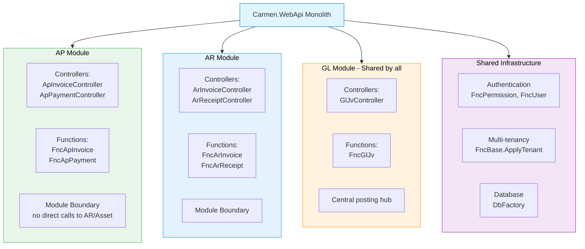

# Carmen.NET Design Patterns & Architecture Guide

**Document Version:** 1.0
**Last Updated:** October 6, 2025
**Target Audience:** Software Architects, Senior Developers
**Prerequisites:** Code Structure Guide, .NET Framework experience

---

## Table of Contents

1. [Architectural Patterns](#architectural-patterns)
2. [Creational Patterns](#creational-patterns)
3. [Structural Patterns](#structural-patterns)
4. [Behavioral Patterns](#behavioral-patterns)
5. [Data Access Patterns](#data-access-patterns)
6. [Security Patterns](#security-patterns)
7. [Anti-Patterns to Avoid](#anti-patterns-to-avoid)
8. [Refactoring Recommendations](#refactoring-recommendations)

---

## 1. Architectural Patterns

### 1.1 Modular Monolith Pattern

**Context:** Carmen.NET organizes 11 business modules (AP, AR, GL, Asset, Income, Tax, Bank, Master Data, Income Tax, Config, Account) within a single deployable application.

**Implementation:**



**Advantages:**
- **Deployment Simplicity:** Single IIS application deployment
- **Consistent Transaction Management:** ACID across modules using DB transactions
- **Shared Infrastructure:** Common auth, logging, tenant isolation
- **Performance:** In-process calls, no network overhead

**Disadvantages:**
- **Coupling Risk:** Modules can bypass boundaries and call each other directly
- **Scalability:** Cannot scale individual modules independently
- **Technology Lock-in:** All modules must use same .NET Framework version

**Best Practices:**
```csharp
// ✅ CORRECT: Cross-module communication via GL
public async Task<int> PostApInvoiceAsync(ParamApInvoice param)
{
    // 1. Create AP invoice
    var invhSeq = await FncApInvoice.CreateAsync(dbFac, param);

    // 2. Post to GL (cross-module via FncGlJv)
    if (param.IsPosted)
    {
        var glJvParam = MapApInvoiceToGlJv(param);
        await FncGlJv.CreateAsync(dbFac, glJvParam);  // ✅ Via shared GL module
    }

    return invhSeq;
}

// ❌ WRONG: Direct cross-module controller calls
var arController = new ArInvoiceController();
var arResult = await arController.GetById(123);  // NEVER DO THIS
```

### 1.2 Layered Architecture Pattern

**Layers:**


**Example:**

```csharp
// ========== PRESENTATION LAYER ==========
// File: Carmen.WebApi/Controllers/ApInvoiceController.cs
[HttpPost]
[Route("api/apInvoice")]
public async Task<IHttpActionResult> Create(ParamApInvoice param)
{
    try
    {
        // 1. Authentication check (Authorize attribute)
        // 2. Permission check
        var permission = await FncPermission.GetPermissionInfoByPermissionNameAsync("AP.Invoice");
        if (!permission.Create) return JsonResultForbidden("", "AP.Invoice", "Create");

        // 3. Delegate to business logic layer
        var dbFac = DbFactory.CarmenDbFactory();
        var invhSeq = await FncApInvoice.CreateAsync(dbFac, param);  // ← Business layer call

        // 4. Return HTTP result
        return JsonAddOk(invhSeq);
    }
    catch (Exception e)
    {
        LogHttpResult.Error(e);
        return JsonResultInternalError(e);
    }
}

// ========== BUSINESS LOGIC LAYER ==========
// File: Carmen.WebApi/Functions/FncApInvoice.cs
public static class FncApInvoice
{
    public static async Task<int> CreateAsync(IDbFactory dbFac, ParamApInvoice param)
    {
        // 1. Validation
        await ValidateApInvoiceAsync(dbFac, param);

        // 2. Business calculations
        var totalAmount = param.Amount + param.TaxAmount - param.WhtAmount;
        var dueDate = CalculateDueDate(param.InvoiceDate, param.PaymentTerms);

        // 3. Data access layer call
        using (var db = dbFac.GetConnection())
        {
            var invhSeq = await InsertInvoiceHeaderAsync(db, param, totalAmount, dueDate);
            await InsertInvoiceLinesAsync(db, invhSeq, param.Lines);

            return invhSeq;
        }
    }

    // Business rule validation
    private static async Task ValidateApInvoiceAsync(IDbFactory dbFac, ParamApInvoice param)
    {
        // Check vendor exists
        var vendorExists = await FncVendor.ExistsAsync(dbFac, param.VendorCode);
        if (!vendorExists)
            throw new BusinessException("VENDOR_NOT_FOUND", $"Vendor {param.VendorCode} not found");

        // Check duplicate invoice
        var duplicate = await CheckDuplicateAsync(dbFac, param.VendorCode, param.InvoiceNumber);
        if (duplicate)
            throw new BusinessException("DUPLICATE_INVOICE", "Invoice already exists");

        // Validate amounts
        if (param.Amount <= 0)
            throw new BusinessException("INVALID_AMOUNT", "Amount must be > 0");
    }

    // ========== DATA ACCESS LAYER ==========
    private static async Task<int> InsertInvoiceHeaderAsync(
        IDbConnection db,
        ParamApInvoice param,
        decimal totalAmount,
        DateTime dueDate)
    {
        var sql = @"
            INSERT INTO AP_INVOICE_H (
                TenantCode, InvoiceNumber, InvoiceDate, DueDate,
                VendorCode, Amount, TaxAmount, WhtAmount, TotalAmount,
                Status, CreatedBy, CreatedDate
            ) VALUES (
                @TenantCode, @InvoiceNumber, @InvoiceDate, @DueDate,
                @VendorCode, @Amount, @TaxAmount, @WhtAmount, @TotalAmount,
                @Status, @CreatedBy, @CreatedDate
            );
            SELECT CAST(SCOPE_IDENTITY() as int);";

        return await db.ExecuteScalarAsync<int>(sql, new
        {
            TenantCode = FncBase.CurrentTenantCode,
            param.InvoiceNumber,
            param.InvoiceDate,
            DueDate = dueDate,
            param.VendorCode,
            param.Amount,
            param.TaxAmount,
            param.WhtAmount,
            TotalAmount = totalAmount,
            Status = "Draft",
            CreatedBy = FncBase.CurrentUser,
            CreatedDate = DateTime.Now
        });
    }
}
```

**Benefits:**
- **Separation of Concerns:** Each layer has a single responsibility
- **Testability:** Business logic can be tested without HTTP layer
- **Maintainability:** Changes to UI don't affect business rules

**Rules:**
- Controllers MUST NOT contain SQL queries
- Functions MUST NOT reference HTTP classes (IHttpActionResult, HttpContext)
- Database layer MUST NOT contain business validation

---

## 2. Creational Patterns

### 2.1 Factory Pattern (DbFactory)

**Purpose:** Create database connections with proper configuration

**Implementation:**

```csharp
// File: Carmen.WebApi/Connection/DbFactory.cs
public class DbFactory : IDbFactory
{
    private QueryFactory Db { get; set; }
    public UriQueryString Qs { get; set; }
    public ViewUserLogin CurrentUser => FncBase.GetCurrentUserLogin();

    // ===== Factory Methods =====

    // Create Carmen DB connection for current user
    public static DbFactory CarmenDbFactory(int queryTimeOut = 300)
    {
        var connection = MySqlConn.ConnectionCarmenCurrentUser();
        var compiler = new MariaDbCompiler();
        var db = new QueryFactory(connection, compiler)
        {
            Logger = compiled => LogQuery(compiled),
            QueryTimeout = queryTimeOut
        };

        return new DbFactory(db)
        {
            Qs = new UriQueryString()
        };
    }

    // Create Admin DB connection
    public static DbFactory AdminDbFactory(string adminToken, int queryTimeOut = 300)
    {
        var connection = MySqlConn.ConnectionAdmin(adminToken);
        var compiler = new MariaDbCompiler();
        // ... similar setup
    }

    // Create connection for specific tenant
    public static async Task<DbFactory> CarmenFactoryAsync(
        string adminToken,
        string tenant,
        int queryTimeOut = 300)
    {
        var connection = await MySqlConn.ConnectionCarmenAsync(adminToken, tenant);
        // ... similar setup
    }
}
```

**Usage:**

```csharp
// In Controllers
public async Task<IHttpActionResult> GetList()
{
    var dbFac = DbFactory.CarmenDbFactory();  // Factory method
    var result = await FncApInvoice.GetListAsync(dbFac, dbFac.Qs);
    return JsonResultOk(result);
}

// For multi-tenant operations
var dbFac = await DbFactory.CarmenFactoryAsync(adminToken, "TENANT001");
```

**Benefits:**
- **Centralized Configuration:** All DB settings in one place
- **Consistent Logging:** Query logging applied automatically
- **Multi-Tenancy Support:** Easy tenant switching
- **Connection String Management:** Abstract away connection details

### 2.2 Singleton Pattern (Static Function Classes)

**Purpose:** Provide stateless business logic functions accessible globally

**Implementation:**

```csharp
// File: Carmen.WebApi/Functions/FncBase.cs
public class FncBase  // Not static class, but used as singleton
{
    public static Logger LogConnStr = LogManager.LogFactory.GetLogger("Connection");
    public static Logger LogQueryFac = LogManager.LogFactory.GetLogger("Query");

    // Static fields for current context
    private static AsyncLocal<string> _currentTenantCode = new AsyncLocal<string>();
    private static AsyncLocal<ViewUserLogin> _currentUser = new AsyncLocal<ViewUserLogin>();

    public static string CurrentTenantCode
    {
        get => _currentTenantCode.Value;
        set => _currentTenantCode.Value = value;
    }

    public static ViewUserLogin CurrentUser
    {
        get => _currentUser.Value ?? GetCurrentUserLogin();
        set => _currentUser.Value = value;
    }

    // Shared utility methods
    public static void ApplyTenantIfUseTenant(string useTenant)
    {
        if (!string.IsNullOrEmpty(useTenant))
        {
            CurrentTenantCode = useTenant;
        }
    }

    public static ViewUserLogin GetCurrentUserLogin()
    {
        var principal = Thread.CurrentPrincipal;
        // Extract user from JWT claims...
        return userLogin;
    }
}

// File: Carmen.WebApi/Functions/FncApInvoice.cs
public static class FncApInvoice  // Pure static class
{
    // All methods are static - no instance required
    public static async Task<ViewApInvoice> GetByIdAsync(IDbFactory dbFac, int invhSeq)
    {
        // Implementation...
    }

    public static async Task<int> CreateAsync(IDbFactory dbFac, ParamApInvoice param)
    {
        // Implementation...
    }
}
```

**Usage:**

```csharp
// No instantiation needed
var invoice = await FncApInvoice.GetByIdAsync(dbFac, 123);
var invhSeq = await FncApInvoice.CreateAsync(dbFac, param);

// Access shared state
FncBase.ApplyTenantIfUseTenant("TENANT001");
var currentUser = FncBase.CurrentUser;
```

**Benefits:**
- **No Object Overhead:** No `new` keyword required
- **Global Access:** Available everywhere in the application
- **Thread Safety:** AsyncLocal for thread-isolated state

**Drawbacks:**
- **Testing Difficulty:** Hard to mock static methods
- **Hidden Dependencies:** Not explicit in method signatures

---

## 3. Structural Patterns

### 3.1 Repository Pattern (Implicit)

**Context:** Carmen.NET doesn't use explicit Repository interfaces, but Functions serve as repositories

**Implicit Repository:**

```csharp
// Traditional Repository Pattern (NOT used in Carmen.NET)
public interface IApInvoiceRepository
{
    Task<ApInvoice> GetByIdAsync(int id);
    Task<List<ApInvoice>> GetAllAsync();
    Task<int> CreateAsync(ApInvoice invoice);
}

// Carmen.NET Approach: Static Function Class = Repository
public static class FncApInvoice  // Acts as repository
{
    // Query methods
    public static async Task<ViewApInvoice> GetByIdAsync(IDbFactory dbFac, int invhSeq) { }
    public static async Task<ViewPagedResult<ViewApInvoice>> GetListAsync(IDbFactory dbFac, UriQueryString qs) { }

    // Command methods
    public static async Task<int> CreateAsync(IDbFactory dbFac, ParamApInvoice param) { }
    public static async Task<bool> UpdateAsync(IDbFactory dbFac, int invhSeq, ParamApInvoice param) { }
    public static async Task<bool> DeleteAsync(IDbFactory dbFac, int invhSeq) { }

    // Business operations
    public static async Task<bool> ApproveAsync(IDbFactory dbFac, int invhSeq, string approver) { }
    public static async Task<bool> PostAsync(IDbFactory dbFac, int invhSeq) { }
}
```

**CQRS-like Separation (Emerging Pattern):**

```csharp
// Query side - Optimized for reads
public static async Task<ViewPagedResult<ViewApInvoice>> GetListAsync(
    IDbFactory dbFac,
    UriQueryString qs)
{
    using (var db = dbFac.GetConnection())
    {
        // Use SqlKata for flexible queries
        var query = new Query("AP_INVOICE_H AS H")
            .LeftJoin("VENDOR AS V", "V.VendorCode", "H.VendorCode")
            .Select("H.*", "V.VendorName")
            .Where("H.TenantCode", FncBase.CurrentTenantCode);

        // Dynamic filtering
        if (!string.IsNullOrEmpty(qs.Filter))
        {
            query.WhereContains("H.InvoiceNumber", qs.Filter)
                 .OrWhereContains("V.VendorName", qs.Filter);
        }

        var sql = dbFac.Compiler.Compile(query.Paginate(qs.Page, qs.PageSize));
        var data = await db.QueryAsync<ViewApInvoice>(sql.Sql, sql.NamedBindings);

        return new ViewPagedResult<ViewApInvoice> { Data = data.ToList(), ... };
    }
}

// Command side - Enforces business rules
public static async Task<int> CreateAsync(IDbFactory dbFac, ParamApInvoice param)
{
    using (var db = dbFac.GetConnection())
    using (var transaction = db.BeginTransaction())
    {
        try
        {
            // Validation
            await ValidateAsync(dbFac, param);

            // Insert header
            var invhSeq = await InsertHeaderAsync(db, param, transaction);

            // Insert lines
            foreach (var line in param.Lines)
            {
                await InsertLineAsync(db, invhSeq, line, transaction);
            }

            // GL posting (if applicable)
            if (param.IsPosted)
            {
                await PostToGlAsync(db, invhSeq, transaction);
            }

            transaction.Commit();
            return invhSeq;
        }
        catch
        {
            transaction.Rollback();
            throw;
        }
    }
}
```

### 3.2 Adapter Pattern (Query Builder)

**Purpose:** Adapt SqlKata query builder to different SQL dialects (MariaDB/MySQL/SQL Server)

**Implementation:**

```csharp
// File: Carmen.WebApi/Connection/DbFactory.cs
private static DbFactory MyDbFactory(IDbConnection connection, Compiler compiler, int queryTimeOut = 300)
{
    var db = new QueryFactory(connection, compiler)  // Compiler = Adapter
    {
        Logger = compiled => FncBase.LogQueryFac.Trace(compiled),
        QueryTimeout = queryTimeOut
    };

    return new DbFactory(db);
}

public static DbFactory MyDbFactory(IDbConnection connection, int queryTimeOut = 300)
{
    var compiler = new MariaDbCompiler();  // ← Adapter for MariaDB
    return MyDbFactory(connection, compiler, queryTimeOut);
}

// For SQL Server (if needed)
public static DbFactory SqlServerFactory(IDbConnection connection)
{
    var compiler = new SqlServerCompiler();  // ← Adapter for SQL Server
    return MyDbFactory(connection, compiler);
}
```

**Usage:**

```csharp
// Same query code works across databases
var query = new Query("AP_INVOICE_H")
    .Select("*")
    .Where("TenantCode", "TENANT001")
    .OrderByDesc("InvoiceDate");

// Compiled to MariaDB SQL
var mariaDbSql = new MariaDbCompiler().Compile(query);
// Result: SELECT * FROM `AP_INVOICE_H` WHERE `TenantCode` = @p0 ORDER BY `InvoiceDate` DESC

// Compiled to SQL Server SQL
var sqlServerSql = new SqlServerCompiler().Compile(query);
// Result: SELECT * FROM [AP_INVOICE_H] WHERE [TenantCode] = @p0 ORDER BY [InvoiceDate] DESC
```

### 3.3 Facade Pattern (BaseApiController)

**Purpose:** Provide simplified interface for common HTTP responses

**Implementation:**

```csharp
// File: Carmen.WebApi/Controllers/BaseApiController.cs
public class BaseApiController : ApiController
{
    // Facade methods for HTTP responses
    protected internal virtual JsonTextActionResult JsonResultOk(JObject data)
    {
        return new JsonTextActionResult(data, HttpStatusCode.OK);
    }

    protected internal virtual JsonTextActionResult JsonAddOk(int id)
    {
        return JsonResultOk($"{id}", "Add Success".UiString("Result.Add.Ok"));
    }

    protected internal virtual JsonTextActionResult JsonUpdateOk()
    {
        return JsonResultOk("Update OK", "Success".UiString("Result.Update.Ok"));
    }

    protected internal virtual JsonTextActionResult JsonDeleteOk()
    {
        return JsonResultOk("Delete OK", "Success".UiString("Result.Delete.Ok"));
    }

    protected internal virtual JsonTextActionResult JsonResultForbidden(
        string userMessage = "Access Denied.",
        string permissionName = "",
        string permissionAction = "")
    {
        var apiResponse = new ApiReturnResponse(403)
        {
            Code = "PERMISSION_DENIED",
            Success = false,
            Message = userMessage,
            Permission = permissionName,
            Action = permissionAction
        };

        return new JsonTextActionResult(apiResponse, HttpStatusCode.Forbidden);
    }

    protected internal virtual JsonTextActionResult JsonResultInternalError(Exception e)
    {
        var apiResponse = new ApiReturnResponse(500)
        {
            Code = "INTERNAL_ERROR",
            Success = false,
            Message = e.Message,
            StackTrace = e.StackTrace  // Only in development
        };

        return new JsonTextActionResult(apiResponse, HttpStatusCode.InternalServerError);
    }
}
```

**Usage:**

```csharp
// In derived controllers
public class ApInvoiceController : BaseApiController
{
    [HttpPost]
    public async Task<IHttpActionResult> Create(ParamApInvoice param)
    {
        try
        {
            var permission = await FncPermission.GetPermissionInfoByPermissionNameAsync("AP.Invoice");

            // Simplified permission check
            if (!permission.Create)
                return JsonResultForbidden("", "AP.Invoice", "Create");  // ← Facade method

            var dbFac = DbFactory.CarmenDbFactory();
            var invhSeq = await FncApInvoice.CreateAsync(dbFac, param);

            return JsonAddOk(invhSeq);  // ← Facade method
        }
        catch (BusinessException be)
        {
            return JsonResultBusinessError(be);  // ← Facade method
        }
        catch (Exception e)
        {
            LogHttpResult.Error(e);
            return JsonResultInternalError(e);  // ← Facade method
        }
    }
}
```

**Benefits:**
- **Consistency:** All controllers return same JSON structure
- **Reduced Boilerplate:** No manual JSON serialization in controllers
- **Centralized i18n:** User messages localized in one place

---

## 4. Behavioral Patterns

### 4.1 Strategy Pattern (Permission Checks)

**Purpose:** Encapsulate different permission checking strategies

**Implementation:**

```csharp
// File: Carmen.WebApi/Functions/FncPermission.cs
public static class FncPermission
{
    // Permission strategy interface (implicit)
    public static async Task<IPermissionStore> GetPermissionInfoByPermissionNameAsync(string permissionName)
    {
        var dbFac = DbFactory.CarmenDbFactory();
        var currentUser = FncBase.CurrentUser;

        using (var db = dbFac.GetConnection())
        {
            // Strategy 1: Check user-specific permissions
            var userPermission = await db.Query("USER_PERMISSION")
                .Where("UserId", currentUser.UserId)
                .Where("PermissionName", permissionName)
                .Where("TenantCode", FncBase.CurrentTenantCode)
                .FirstOrDefaultAsync<IPermissionStore>();

            if (userPermission != null)
                return userPermission;  // User-level override

            // Strategy 2: Check role-based permissions
            var rolePermission = await db.Query("ROLE_PERMISSION AS RP")
                .Join("USER_ROLE AS UR", "UR.RoleId", "RP.RoleId")
                .Where("UR.UserId", currentUser.UserId)
                .Where("RP.PermissionName", permissionName)
                .Where("RP.TenantCode", FncBase.CurrentTenantCode)
                .FirstOrDefaultAsync<IPermissionStore>();

            if (rolePermission != null)
                return rolePermission;  // Role-level permission

            // Strategy 3: Default deny
            return new PermissionStore
            {
                PermissionName = permissionName,
                View = false,
                Create = false,
                Update = false,
                Delete = false,
                Approve = false
            };
        }
    }
}
```

**Usage:**

```csharp
// In controllers
var permission = await FncPermission.GetPermissionInfoByPermissionNameAsync("AP.Invoice");

if (!permission.View) return JsonResultForbidden("", "AP.Invoice", "View");
if (!permission.Create) return JsonResultForbidden("", "AP.Invoice", "Create");
if (!permission.Approve) return JsonResultForbidden("", "AP.Invoice", "Approve");
```

### 4.2 Template Method Pattern (CRUD Operations)

**Purpose:** Define skeleton of CRUD operations, let subclasses override specific steps

**Implementation:**

```csharp
// Base template (conceptual - not explicitly coded)
public abstract class CrudTemplate
{
    // Template method
    public async Task<int> CreateAsync(IDbFactory dbFac, TParam param)
    {
        // 1. Validate (can be overridden)
        await ValidateAsync(dbFac, param);

        // 2. Transform (can be overridden)
        var entity = MapParamToEntity(param);

        // 3. Insert (must be implemented)
        var id = await InsertAsync(dbFac, entity);

        // 4. Post-process (can be overridden)
        await OnCreatedAsync(dbFac, id, param);

        return id;
    }

    protected abstract Task ValidateAsync(IDbFactory dbFac, TParam param);
    protected abstract TEntity MapParamToEntity(TParam param);
    protected abstract Task<int> InsertAsync(IDbFactory dbFac, TEntity entity);
    protected virtual Task OnCreatedAsync(IDbFactory dbFac, int id, TParam param) => Task.CompletedTask;
}

// Concrete implementation (actual pattern in Carmen.NET)
public static class FncApInvoice
{
    public static async Task<int> CreateAsync(IDbFactory dbFac, ParamApInvoice param)
    {
        // 1. Validate (step can vary by entity)
        await ValidateApInvoiceAsync(dbFac, param);

        // 2. Transform
        var totalAmount = param.Amount + param.TaxAmount - param.WhtAmount;
        var dueDate = CalculateDueDate(param.InvoiceDate, param.PaymentTerms);

        // 3. Insert
        var invhSeq = await InsertHeaderAsync(dbFac, param, totalAmount, dueDate);
        await InsertLinesAsync(dbFac, invhSeq, param.Lines);

        // 4. Post-process (step can vary by entity)
        if (param.IsPosted)
        {
            await PostToGlAsync(dbFac, invhSeq);
        }

        return invhSeq;
    }

    // Steps that vary by entity
    private static async Task ValidateApInvoiceAsync(IDbFactory dbFac, ParamApInvoice param)
    {
        // AP-specific validation
        var vendorExists = await FncVendor.ExistsAsync(dbFac, param.VendorCode);
        if (!vendorExists)
            throw new BusinessException("VENDOR_NOT_FOUND");

        // Check three-way match if PO exists
        if (!string.IsNullOrEmpty(param.PoNumber))
        {
            await ValidateThreeWayMatchAsync(dbFac, param);
        }
    }
}

public static class FncArInvoice
{
    public static async Task<int> CreateAsync(IDbFactory dbFac, ParamArInvoice param)
    {
        // 1. Validate (AR-specific)
        await ValidateArInvoiceAsync(dbFac, param);

        // 2. Transform
        var totalAmount = param.Amount + param.TaxAmount;

        // 3. Insert
        var invhSeq = await InsertHeaderAsync(dbFac, param, totalAmount);
        await InsertLinesAsync(dbFac, invhSeq, param.Lines);

        // 4. Post-process (AR-specific)
        if (param.ContractSeq > 0)
        {
            await UpdateContractBalanceAsync(dbFac, param.ContractSeq, totalAmount);
        }

        return invhSeq;
    }

    // AR-specific validation
    private static async Task ValidateArInvoiceAsync(IDbFactory dbFac, ParamArInvoice param)
    {
        var customerExists = await FncCustomer.ExistsAsync(dbFac, param.CustomerCode);
        if (!customerExists)
            throw new BusinessException("CUSTOMER_NOT_FOUND");

        // Check credit limit
        await CheckCreditLimitAsync(dbFac, param.CustomerCode, param.Amount);
    }
}
```

---

## 5. Data Access Patterns

### 5.1 Unit of Work Pattern (Database Transactions)

**Purpose:** Group multiple database operations into a single transaction

**Implementation:**

```csharp
public static async Task<int> CreateApInvoiceWithPaymentAsync(
    IDbFactory dbFac,
    ParamApInvoice invoiceParam,
    ParamApPayment paymentParam)
{
    using (var db = dbFac.GetConnection())
    using (var transaction = db.BeginTransaction())  // ← Unit of Work
    {
        try
        {
            // Operation 1: Create invoice
            var invhSeq = await FncApInvoice.CreateAsync(dbFac, invoiceParam);

            // Operation 2: Create payment
            paymentParam.InvhSeq = invhSeq;
            var pyhSeq = await FncApPayment.CreateAsync(dbFac, paymentParam);

            // Operation 3: Update invoice status
            await UpdateInvoiceStatusAsync(db, invhSeq, "Paid", transaction);

            // Operation 4: Post to GL
            await FncGlJv.CreateAsync(dbFac, MapToGlJv(invoiceParam, paymentParam));

            // Commit all or nothing
            transaction.Commit();
            return invhSeq;
        }
        catch (Exception e)
        {
            transaction.Rollback();  // Rollback all operations
            LogHttpResult.Error(e);
            throw;
        }
    }
}
```

**Best Practices:**
```csharp
// ✅ GOOD: Transaction scope clearly defined
using (var transaction = db.BeginTransaction())
{
    // All operations
    transaction.Commit();
}

// ❌ BAD: Transaction spans multiple functions
public async Task CreateInvoiceAsync()
{
    using (var transaction = db.BeginTransaction())
    {
        await SomeOtherFunctionAsync();  // Transaction leaks to other function
        transaction.Commit();
    }
}
```

### 5.2 Query Object Pattern (SqlKata Integration)

**Purpose:** Build complex queries programmatically

**Implementation:**

```csharp
public static async Task<ViewPagedResult<ViewApInvoice>> GetListAsync(
    IDbFactory dbFac,
    UriQueryString qs)
{
    using (var db = dbFac.GetConnection())
    {
        // Build base query
        var query = new Query("AP_INVOICE_H AS H")
            .LeftJoin("VENDOR AS V", "V.VendorCode", "H.VendorCode")
            .LeftJoin("ACCOUNT_CODE AS AC", "AC.AccountCode", "H.AccountCode")
            .Select(
                "H.*",
                "V.VendorName",
                "AC.AccountName"
            )
            .Where("H.TenantCode", FncBase.CurrentTenantCode);

        // Apply filters dynamically
        if (!string.IsNullOrEmpty(qs.Filter))
        {
            query.Where(q =>
            {
                q.WhereContains("H.InvoiceNumber", qs.Filter)
                 .OrWhereContains("V.VendorName", qs.Filter)
                 .OrWhereContains("H.Description", qs.Filter);
            });
        }

        if (qs.StartDate.HasValue)
        {
            query.WhereDate("H.InvoiceDate", ">=", qs.StartDate.Value);
        }

        if (qs.EndDate.HasValue)
        {
            query.WhereDate("H.InvoiceDate", "<=", qs.EndDate.Value);
        }

        if (!string.IsNullOrEmpty(qs.Status))
        {
            query.Where("H.Status", qs.Status);
        }

        // Apply sorting
        if (!string.IsNullOrEmpty(qs.SortBy))
        {
            if (qs.SortDesc)
                query.OrderByDesc(qs.SortBy);
            else
                query.OrderBy(qs.SortBy);
        }
        else
        {
            query.OrderByDesc("H.CreatedDate");  // Default sort
        }

        // Get total count
        var totalRows = await db.ExecuteScalarAsync<int>(
            dbFac.Compiler.Compile(query.AsCount()).Sql
        );

        // Apply pagination
        var sql = dbFac.Compiler.Compile(query.Paginate(qs.Page, qs.PageSize));

        // Execute query
        var data = await db.QueryAsync<ViewApInvoice>(sql.Sql, sql.NamedBindings);

        return new ViewPagedResult<ViewApInvoice>
        {
            Data = data.ToList(),
            TotalRows = totalRows,
            Page = qs.Page,
            PageSize = qs.PageSize
        };
    }
}
```

**Benefits:**
- **Type Safety:** Compile-time checking of table/column names
- **SQL Injection Protection:** Parameterized queries automatically
- **Database Portability:** Same code works across SQL dialects
- **Reusability:** Query fragments can be composed

---

## 6. Security Patterns

### 6.1 Multi-Tenancy Row-Level Security Pattern

**Purpose:** Ensure users can only access data for their tenant

**Implementation:**

```csharp
// File: Carmen.WebApi/Functions/FncBase.cs
public class FncBase
{
    // Thread-safe tenant context
    private static AsyncLocal<string> _currentTenantCode = new AsyncLocal<string>();

    public static string CurrentTenantCode
    {
        get => _currentTenantCode.Value ?? GetTenantFromToken();
        set => _currentTenantCode.Value = value;
    }

    public static void ApplyTenantIfUseTenant(string useTenant)
    {
        if (!string.IsNullOrEmpty(useTenant))
        {
            CurrentTenantCode = useTenant;
        }
    }

    private static string GetTenantFromToken()
    {
        var principal = Thread.CurrentPrincipal;
        return principal.GetClaim<string>("Tenant");
    }
}

// In every query
public static async Task<ViewApInvoice> GetByIdAsync(IDbFactory dbFac, int invhSeq)
{
    using (var db = dbFac.GetConnection())
    {
        var query = new Query("AP_INVOICE_H")
            .Select("*")
            .Where("InvhSeq", invhSeq)
            .Where("TenantCode", FncBase.CurrentTenantCode);  // ← CRITICAL: Always filter by tenant

        var sql = dbFac.Compiler.Compile(query);
        return await db.QueryFirstOrDefaultAsync<ViewApInvoice>(sql.Sql, sql.NamedBindings);
    }
}

// In all insert/update operations
public static async Task<int> CreateAsync(IDbFactory dbFac, ParamApInvoice param)
{
    var sql = @"
        INSERT INTO AP_INVOICE_H (
            TenantCode,  -- ← CRITICAL: Always insert tenant code
            InvoiceNumber,
            InvoiceDate,
            ...
        ) VALUES (
            @TenantCode,
            @InvoiceNumber,
            @InvoiceDate,
            ...
        )";

    return await db.ExecuteScalarAsync<int>(sql, new
    {
        TenantCode = FncBase.CurrentTenantCode,  // ← From current context
        param.InvoiceNumber,
        param.InvoiceDate,
        ...
    });
}
```

**Security Checklist:**
- [ ] All SELECT queries filter by `TenantCode`
- [ ] All INSERT operations include `TenantCode`
- [ ] All UPDATE operations filter by `TenantCode` in WHERE clause
- [ ] All DELETE operations filter by `TenantCode` in WHERE clause
- [ ] JOIN queries check `TenantCode` on all tables
- [ ] No raw SQL bypasses tenant filtering

### 6.2 Permission-Based Access Control Pattern

**Purpose:** Enforce RBAC permissions on all operations

**Implementation:**

```csharp
// Standard permission check in controllers
[HttpPost]
[Route("api/apInvoice")]
public async Task<IHttpActionResult> Create(ParamApInvoice param)
{
    try
    {
        // 1. Check permission BEFORE any business logic
        var permission = await FncPermission.GetPermissionInfoByPermissionNameAsync("AP.Invoice");

        if (!permission.Create)
            return JsonResultForbidden("", "AP.Invoice", "Create");

        // 2. Proceed with operation
        var dbFac = DbFactory.CarmenDbFactory();
        var invhSeq = await FncApInvoice.CreateAsync(dbFac, param);

        return JsonAddOk(invhSeq);
    }
    catch (Exception e)
    {
        LogHttpResult.Error(e);
        return JsonResultInternalError(e);
    }
}

// Fine-grained approval permission
[HttpPut]
[Route("api/apInvoice/{invhSeq}/approve")]
public async Task<IHttpActionResult> Approve(int invhSeq, ParamApproval param)
{
    var permission = await FncPermission.GetPermissionInfoByPermissionNameAsync("AP.Invoice");

    // Check specific action permission
    if (!permission.Approve)
        return JsonResultForbidden("", "AP.Invoice", "Approve");

    // Additional business rule: Check approval amount threshold
    var invoice = await FncApInvoice.GetByIdAsync(dbFac, invhSeq);

    if (invoice.TotalAmount > 10000 && !CurrentUser.IsManager)
    {
        return JsonResultForbidden("Amount exceeds approval limit");
    }

    await FncApInvoice.ApproveAsync(dbFac, invhSeq, param.Approver);
    return JsonUpdateOk();
}
```

**Permission Matrix:**

| Permission | View | Create | Update | Delete | Approve |
|------------|------|--------|--------|--------|---------|
| AP.Invoice | ✓ | ✓ | ✓ | ✓ | ✓ |
| AP.Payment | ✓ | ✓ | ✓ | ✓ | ✓ |
| AR.Invoice | ✓ | ✓ | ✓ | ✓ | ✓ |
| GL.JV | ✓ | ✓ | ✓ | ✓ | ✓ |

---

## 7. Anti-Patterns to Avoid

### 7.1 God Object Anti-Pattern

**❌ BAD:**
```csharp
// 10,000+ line class with all business logic
public static class FncEverything
{
    public static async Task CreateApInvoice() { /* 500 lines */ }
    public static async Task CreateArInvoice() { /* 500 lines */ }
    public static async Task ProcessPayment() { /* 500 lines */ }
    public static async Task PostToGl() { /* 500 lines */ }
    // ... 20 more methods
}
```

**✅ GOOD:**
```csharp
// Separate by domain
public static class FncApInvoice { /* AP invoice logic only */ }
public static class FncArInvoice { /* AR invoice logic only */ }
public static class FncPayment { /* Payment logic only */ }
public static class FncGlJv { /* GL posting logic only */ }
```

### 7.2 Magic Numbers Anti-Pattern

**❌ BAD:**
```csharp
if (invoice.Status == "1") { }  // What does "1" mean?
if (payment.Amount > 50000) { }  // Why 50000?
```

**✅ GOOD:**
```csharp
// Use enums
if (invoice.Status == ApInvoiceStatus.Approved) { }

// Use named constants
private const decimal MANAGER_APPROVAL_LIMIT = 50000m;
if (payment.Amount > MANAGER_APPROVAL_LIMIT) { }
```

### 7.3 Anemic Domain Model Anti-Pattern

**Context:** Carmen.NET suffers from this - models have no behavior

**❌ Current (Anemic):**
```csharp
// Model has no behavior
public class ViewApInvoice
{
    public int InvhSeq { get; set; }
    public decimal Amount { get; set; }
    public decimal TaxAmount { get; set; }
    public decimal WhtAmount { get; set; }
    public decimal TotalAmount { get; set; }  // Should be calculated
}

// All logic in static functions
public static class FncApInvoice
{
    public static decimal CalculateTotalAmount(ViewApInvoice invoice)
    {
        return invoice.Amount + invoice.TaxAmount - invoice.WhtAmount;
    }
}
```

**✅ Better (Rich Domain Model):**
```csharp
// Model with behavior
public class ApInvoice
{
    public int InvhSeq { get; set; }
    public decimal Amount { get; private set; }
    public decimal TaxAmount { get; private set; }
    public decimal WhtAmount { get; private set; }

    // Calculated property (no setter)
    public decimal TotalAmount => Amount + TaxAmount - WhtAmount;

    // Business methods
    public void AddTax(decimal taxRate)
    {
        TaxAmount = Amount * taxRate;
    }

    public void ApplyWithholding(decimal whtRate)
    {
        WhtAmount = Amount * whtRate;
    }

    public bool CanBeApproved()
    {
        return Status == ApInvoiceStatus.PendingApproval
            && TotalAmount > 0
            && !string.IsNullOrEmpty(VendorCode);
    }
}
```

---

## 8. Refactoring Recommendations

### 8.1 Introduce Dependency Injection

**Current State:**
```csharp
public async Task<IHttpActionResult> GetList()
{
    var dbFac = DbFactory.CarmenDbFactory();  // Tight coupling
    var result = await FncApInvoice.GetListAsync(dbFac, qs);
    return JsonResultOk(result);
}
```

**Recommended:**
```csharp
public class ApInvoiceController : BaseApiController
{
    private readonly IDbFactory _dbFactory;
    private readonly IApInvoiceService _apInvoiceService;

    public ApInvoiceController(IDbFactory dbFactory, IApInvoiceService apInvoiceService)
    {
        _dbFactory = dbFactory;
        _apInvoiceService = apInvoiceService;
    }

    public async Task<IHttpActionResult> GetList()
    {
        var result = await _apInvoiceService.GetListAsync(qs);
        return JsonResultOk(result);
    }
}

// Register in Startup.cs
services.AddScoped<IDbFactory, DbFactory>();
services.AddScoped<IApInvoiceService, ApInvoiceService>();
```

### 8.2 Extract Interfaces for Testing

**Current State:**
```csharp
// Cannot mock static methods
public static class FncApInvoice
{
    public static async Task<int> CreateAsync(IDbFactory dbFac, ParamApInvoice param) { }
}

// Hard to test
[Test]
public async Task TestCreateInvoice()
{
    // Cannot mock FncApInvoice.CreateAsync() ❌
}
```

**Recommended:**
```csharp
// Interface
public interface IApInvoiceService
{
    Task<int> CreateAsync(ParamApInvoice param);
    Task<ViewApInvoice> GetByIdAsync(int invhSeq);
}

// Implementation
public class ApInvoiceService : IApInvoiceService
{
    private readonly IDbFactory _dbFactory;

    public ApInvoiceService(IDbFactory dbFactory)
    {
        _dbFactory = dbFactory;
    }

    public async Task<int> CreateAsync(ParamApInvoice param)
    {
        // Implementation...
    }
}

// Testable
[Test]
public async Task TestCreateInvoice()
{
    // Mock service
    var mockService = new Mock<IApInvoiceService>();
    mockService.Setup(s => s.CreateAsync(It.IsAny<ParamApInvoice>()))
               .ReturnsAsync(123);

    var controller = new ApInvoiceController(mockDbFactory, mockService.Object);
    var result = await controller.Create(new ParamApInvoice());

    Assert.IsTrue(result is JsonTextActionResult);
}
```

### 8.3 Separate Query and Command Models (CQRS)

**Current State:**
```csharp
// Same model for read and write
public class ParamApInvoice
{
    public string InvoiceNumber { get; set; }
    public decimal Amount { get; set; }
    // ... 30 more properties
}

public static async Task<ViewApInvoice> GetByIdAsync(int invhSeq) { }
public static async Task<int> CreateAsync(ParamApInvoice param) { }  // Uses all 30 properties
public static async Task<bool> UpdateAsync(int invhSeq, ParamApInvoice param) { }  // Only 5 properties needed
```

**Recommended:**
```csharp
// Query models (optimized for reads)
public class ApInvoiceListQuery
{
    public string Filter { get; set; }
    public DateTime? StartDate { get; set; }
    public DateTime? EndDate { get; set; }
    public string Status { get; set; }
    public int Page { get; set; }
    public int PageSize { get; set; }
}

// Command models (optimized for writes)
public class CreateApInvoiceCommand
{
    public string InvoiceNumber { get; set; }
    public DateTime InvoiceDate { get; set; }
    public string VendorCode { get; set; }
    public decimal Amount { get; set; }
    // ... only properties needed for creation
}

public class UpdateApInvoiceStatusCommand
{
    public int InvhSeq { get; set; }
    public string Status { get; set; }
    public string UpdatedBy { get; set; }
    // Only 3 properties instead of 30
}

// Separate handlers
public async Task<ViewPagedResult<ViewApInvoice>> Handle(ApInvoiceListQuery query) { }
public async Task<int> Handle(CreateApInvoiceCommand command) { }
public async Task Handle(UpdateApInvoiceStatusCommand command) { }
```

---

## Summary

Carmen.NET implements a mix of classic and modern design patterns:

**Architectural Patterns:**
- ✅ Modular Monolith (11 business modules)
- ✅ Layered Architecture (Presentation → Business → Data)

**Creational Patterns:**
- ✅ Factory Pattern (DbFactory)
- ✅ Singleton Pattern (Static function classes)

**Structural Patterns:**
- ✅ Implicit Repository Pattern (Functions as repositories)
- ✅ Adapter Pattern (SqlKata query builder)
- ✅ Facade Pattern (BaseApiController)

**Behavioral Patterns:**
- ✅ Strategy Pattern (Permission checks)
- ✅ Template Method Pattern (CRUD operations)

**Data Access Patterns:**
- ✅ Unit of Work Pattern (Database transactions)
- ✅ Query Object Pattern (SqlKata)

**Security Patterns:**
- ✅ Multi-Tenancy Row-Level Security
- ✅ Permission-Based Access Control (RBAC)

**Refactoring Opportunities:**
- ⚠️ Introduce Dependency Injection (.NET 8 migration)
- ⚠️ Extract Interfaces for testing
- ⚠️ Separate CQRS models
- ⚠️ Migrate from Anemic to Rich Domain Models

**Next Steps:**
- Review [Code Structure Guide](code-structure-guide.md) for implementation details
- Study [Database Schema Documentation](database-schema-guide.md) for data model
- Consult [Testing Guide](testing-guide.md) for pattern testing
- Reference [ADRs](../architecture/architecture-decision-records.md) for pattern decisions

---

**Document Status:** ✅ Complete
**For Support:** Contact development team or solution architect
