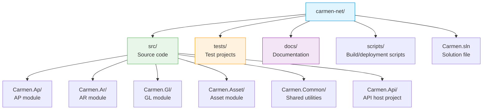
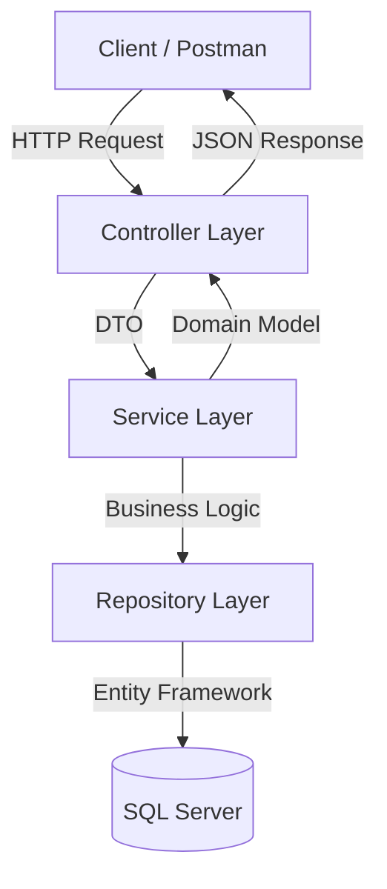

# Carmen.NET Developer Onboarding Guide

**Document Version**: 1.0
**Last Updated**: 2025-10-06
**Status**: Phase 5 - Developer Documentation
**Target**: New Developers (Day 1-30)

---

## Welcome to Carmen.NET!

This guide will help you get up and running with the Carmen.NET ERP system development environment in **less than 2 days**.

**What You'll Learn**:
- Development environment setup (Day 1, ~4 hours)
- Codebase structure and navigation (Day 1-2, ~8 hours)
- Common development tasks (Day 2-5, ~16 hours)
- Best practices and coding standards (Ongoing)

---

## Table of Contents

1. [Prerequisites](#prerequisites)
2. [Day 1: Environment Setup](#day-1-environment-setup)
3. [Day 2-5: Codebase Familiarization](#day-2-5-codebase-familiarization)
4. [Week 2-4: First Contributions](#week-2-4-first-contributions)
5. [Reference Materials](#reference-materials)

---

## Prerequisites

### Required Knowledge

| Skill | Level | Resources |
|-------|-------|-----------|
| **C#** | Intermediate+ | LINQ, async/await, OOP |
| **ASP.NET Web API** | Intermediate | REST, routing, controllers |
| **Entity Framework** | Beginner+ | LINQ to Entities, DbContext |
| **SQL Server** | Beginner+ | T-SQL, stored procedures |
| **Git** | Beginner+ | Clone, branch, commit, push |

### Recommended Knowledge

- TypeScript/JavaScript (for frontend work)
- Financial/accounting concepts (AP, AR, GL basics)
- Multi-tenant architecture patterns
- JWT authentication

---

## Day 1: Environment Setup

**Goal**: Get development environment running and build the project successfully

**Time**: ~4 hours

### Step 1: Install Development Tools (60 min)

#### 1.1 Visual Studio 2022

```powershell
# Download from: https://visualstudio.microsoft.com/downloads/
# Required Workloads:
- ASP.NET and web development
- .NET desktop development
- Data storage and processing
```

**Recommended Extensions**:
- ReSharper or Visual Studio IntelliCode
- Git Extensions or GitKraken
- SQL Server Management Studio
- Postman (for API testing)

#### 1.2 SQL Server 2019+

```powershell
# Download SQL Server Developer Edition (free)
https://www.microsoft.com/en-us/sql-server/sql-server-downloads

# Install SQL Server Management Studio (SSMS)
https://docs.microsoft.com/en-us/sql/ssms/download-sql-server-management-studio-ssms
```

#### 1.3 Git

```powershell
# Download from: https://git-scm.com/downloads
# Verify installation
git --version
```

#### 1.4 Node.js (for frontend work)

```powershell
# Download LTS version from: https://nodejs.org/
# Verify installation
node --version
npm --version
```

---

### Step 2: Clone Repository (15 min)

```powershell
# Navigate to your workspace
cd C:\Projects

# Clone the repository
git clone https://your-git-server.com/carmen/carmen-net.git
cd carmen-net

# Create your development branch
git checkout -b dev/yourname/onboarding
```

**Repository Structure**:


---

### Step 3: Database Setup (45 min)

#### 3.1 Restore Development Database

```sql
-- Open SQL Server Management Studio
-- Connect to: localhost

-- Create development database
CREATE DATABASE Carmen_Dev;

-- Restore from backup (if available)
RESTORE DATABASE Carmen_Dev
FROM DISK = 'C:\Backup\Carmen_Dev.bak'
WITH MOVE 'Carmen_Data' TO 'C:\SQL\Carmen_Dev.mdf',
     MOVE 'Carmen_Log' TO 'C:\SQL\Carmen_Dev_Log.ldf';

-- OR run creation scripts
USE Carmen_Dev;
GO
-- Execute schema creation scripts from /database/schema/
```

#### 3.2 Seed Development Data

```sql
-- Run seed data scripts
USE Carmen_Dev;
GO

-- Execute seed scripts in order:
-- 1. Master data
:r database/seed/01-master-data.sql

-- 2. Sample tenants
:r database/seed/02-tenants.sql

-- 3. Sample users
:r database/seed/03-users.sql

-- 4. Sample transactions
:r database/seed/04-sample-data.sql
```

**Default Development Credentials**:
```
Tenant Code: DEV001
Username: admin@dev.com
Password: Dev@123456

Username: ap.clerk@dev.com
Password: Dev@123456

Username: ar.clerk@dev.com
Password: Dev@123456
```

---

### Step 4: Configure Application (30 min)

#### 4.1 Update Connection String

**File**: `src/Carmen.Api/Web.config`

```xml
<connectionStrings>
  <add name="CarmenContext"
       connectionString="Server=localhost;Database=Carmen_Dev;Integrated Security=true;"
       providerName="System.Data.SqlClient" />
</connectionStrings>
```

#### 4.2 Configure App Settings

**File**: `src/Carmen.Api/Web.config`

```xml
<appSettings>
  <!-- JWT Settings -->
  <add key="JwtSecret" value="YourDevelopmentSecretKeyMinimum32Characters" />
  <add key="JwtIssuer" value="https://localhost:44300" />
  <add key="JwtAudience" value="https://localhost:44300" />
  <add key="JwtExpirationMinutes" value="60" />

  <!-- Multi-Tenant Settings -->
  <add key="UseTenant" value="true" />

  <!-- Environment -->
  <add key="Environment" value="Development" />
  <add key="EnableSwagger" value="true" />
</appSettings>
```

---

### Step 5: Build and Run (30 min)

#### 5.1 Restore NuGet Packages

```powershell
# In Visual Studio Package Manager Console
Update-Package -reinstall

# Or using dotnet CLI
dotnet restore
```

#### 5.2 Build Solution

```powershell
# In Visual Studio
Build → Build Solution (Ctrl+Shift+B)

# Or using dotnet CLI
dotnet build Carmen.sln
```

**Expected Output**:
```
Build succeeded.
    0 Warning(s)
    0 Error(s)
```

#### 5.3 Run Application

```powershell
# Press F5 in Visual Studio
# Or
dotnet run --project src/Carmen.Api/Carmen.Api.csproj
```

**Application should start**:
```
API running at: https://localhost:44300
Swagger UI: https://localhost:44300/swagger
```

---

### Step 6: Verify Setup (30 min)

#### 6.1 Test API Endpoint

**Using Postman**:

```http
POST https://localhost:44300/api/account/login
Content-Type: application/json

{
  "email": "admin@dev.com",
  "password": "Dev@123456",
  "tenantCode": "DEV001"
}
```

**Expected Response**:
```json
{
  "success": true,
  "data": {
    "accessToken": "eyJhbGciOiJIUzI1NiIsInR5cCI6IkpXVCJ9...",
    "refreshToken": "...",
    "expiresIn": 3600,
    "user": {
      "id": 1,
      "email": "admin@dev.com",
      "name": "System Administrator"
    }
  }
}
```

#### 6.2 Test Protected Endpoint

```http
GET https://localhost:44300/api/ap/invoice/list
Authorization: Bearer {accessToken}
```

**Expected Response**:
```json
{
  "success": true,
  "data": {
    "items": [],
    "totalCount": 0,
    "page": 1,
    "pageSize": 20
  }
}
```

#### 6.3 Verify Swagger UI

Navigate to: `https://localhost:44300/swagger`

**Expected**: Interactive API documentation with 351+ endpoints

---

## ✅ Day 1 Checklist

- [ ] Visual Studio 2022 installed with required workloads
- [ ] SQL Server and SSMS installed
- [ ] Git installed and configured
- [ ] Repository cloned successfully
- [ ] Development database created and seeded
- [ ] Application configured (connection string, app settings)
- [ ] Solution builds without errors
- [ ] Application runs and Swagger UI loads
- [ ] Login API works and returns JWT token
- [ ] Protected endpoint accepts Bearer token
- [ ] Familiarized with codebase structure

**If all items checked**: ✅ Environment setup complete! Ready for Day 2.

---

## Day 2-5: Codebase Familiarization

**Goal**: Understand codebase structure, common patterns, and make first small change

**Time**: ~16 hours over 4 days

### Day 2: Codebase Structure (4 hours)

#### Solution Architecture

```
Carmen.NET Solution (Modular Monolith)
│
├── Carmen.Ap (AP Module)
│   ├── Controllers/          # API endpoints
│   ├── Services/             # Business logic
│   ├── Repositories/         # Data access
│   ├── Models/               # Domain models
│   └── DTOs/                 # Data transfer objects
│
├── Carmen.Ar (AR Module)
│   └── [same structure as AP]
│
├── Carmen.Gl (GL Module)
│   └── [same structure as AP]
│
├── Carmen.Asset (Asset Module)
│   └── [same structure as AP]
│
├── Carmen.Common (Shared)
│   ├── Auth/                 # JWT, permissions
│   ├── Exceptions/           # Custom exceptions
│   ├── Extensions/           # C# extensions
│   ├── Filters/              # API filters
│   ├── Helpers/              # Utility classes
│   └── Models/               # Base models
│
└── Carmen.Api (Host)
    ├── Controllers/          # Account, config
    ├── App_Start/            # Startup config
    └── Web.config            # Configuration
```

#### Layered Architecture



**Flow Example** (Create AP Invoice):
```
1. POST /api/ap/invoice/create
2. ApInvoiceController.CreateInvoice(ApInvoiceCreateRequest dto)
3. ApInvoiceService.CreateInvoiceAsync(dto)
   ├── Validate invoice data
   ├── Check permissions (AP.Invoice.Create)
   ├── Apply tenant filter (TenantCode)
   ├── Calculate tax (WHT, VAT)
   └── Save to repository
4. ApInvoiceRepository.Add(invoiceHeader)
5. DbContext.SaveChanges()
6. Return ApInvoiceResponse
```

---

### Day 3: Common Patterns (4 hours)

#### Pattern 1: Repository Pattern

**Purpose**: Data access abstraction

**Example**: `Carmen.Ap/Repositories/ApInvoiceRepository.cs`

```csharp
public class ApInvoiceRepository : Repository<ApInvoiceHeader>
{
    public ApInvoiceRepository(ApContext context) : base(context)
    {
    }

    public IQueryable<ApInvoiceHeader> GetPendingApproval()
    {
        return GetAll()
            .Where(x => x.Status == "PendingApproval")
            .OrderBy(x => x.InvoiceDate);
    }

    public async Task<ApInvoiceHeader> GetWithDetailsAsync(int id)
    {
        return await GetAll()
            .Include(x => x.Lines)
            .Include(x => x.Vendor)
            .FirstOrDefaultAsync(x => x.Id == id);
    }
}
```

#### Pattern 2: Service Pattern

**Purpose**: Business logic encapsulation

**Example**: `Carmen.Ap/Services/ApInvoiceService.cs`

```csharp
public class ApInvoiceService
{
    private readonly ApInvoiceRepository _repository;
    private readonly ITaxCalculator _taxCalculator;
    private readonly IPermissionService _permission;

    public async Task<ApInvoiceResponse> CreateInvoiceAsync(ApInvoiceCreateRequest request)
    {
        // 1. Permission check
        _permission.RequirePermission("AP.Invoice.Create");

        // 2. Validation
        ValidateInvoiceRequest(request);

        // 3. Business logic
        var invoice = MapToEntity(request);
        invoice.TenantCode = _currentTenant.TenantCode;
        invoice.Status = "Draft";
        invoice.CreatedBy = _currentUser.UserId;
        invoice.CreatedDate = DateTime.Now;

        // 4. Calculate tax
        invoice.TaxAmount = _taxCalculator.CalculateVAT(invoice.Amount);
        invoice.WhtAmount = _taxCalculator.CalculateWHT(invoice.Amount, invoice.VendorCode);

        // 5. Save
        _repository.Add(invoice);
        await _repository.SaveChangesAsync();

        // 6. Return DTO
        return MapToResponse(invoice);
    }
}
```

#### Pattern 3: DTO Pattern

**Purpose**: Data transfer between layers

**Example**: `Carmen.Ap/DTOs/ApInvoiceCreateRequest.cs`

```csharp
public class ApInvoiceCreateRequest
{
    [Required]
    [StringLength(50)]
    public string InvoiceNumber { get; set; }

    [Required]
    public DateTime InvoiceDate { get; set; }

    [Required]
    public DateTime DueDate { get; set; }

    [Required]
    [StringLength(20)]
    public string VendorCode { get; set; }

    [StringLength(500)]
    public string Description { get; set; }

    [Required]
    [Range(0.01, double.MaxValue)]
    public decimal Amount { get; set; }

    public List<ApInvoiceLineRequest> Lines { get; set; }
}
```

#### Pattern 4: Multi-Tenant Filtering

**Purpose**: Automatic tenant isolation

**Example**: `Carmen.Common/Services/FncBase.cs`

```csharp
protected void ApplyTenantIfUseTenant<T>(ref IQueryable<T> query)
    where T : TenantEntity
{
    if (UseTenant)
    {
        var tenantCode = _currentTenant.TenantCode;
        query = query.Where(x => x.TenantCode == tenantCode);
    }
}

// Usage in repository
public override IQueryable<ApInvoiceHeader> GetAll()
{
    var query = base.GetAll();
    ApplyTenantIfUseTenant(ref query);
    return query;
}
```

---

### Day 4: Testing & Debugging (4 hours)

#### Running Tests

```powershell
# Run all tests
dotnet test

# Run specific test project
dotnet test tests/Carmen.Ap.Tests/

# Run specific test class
dotnet test --filter ClassName=ApInvoiceServiceTests

# Run with code coverage
dotnet test /p:CollectCoverage=true
```

#### Debugging Tips

**1. Breakpoint in Controller**:
```csharp
[HttpPost("create")]
public async Task<IActionResult> CreateInvoice([FromBody] ApInvoiceCreateRequest request)
{
    // Set breakpoint here (F9)
    var result = await _service.CreateInvoiceAsync(request);
    return Ok(result);
}
```

**2. SQL Profiler** (see actual queries):
```sql
-- In SSMS → Tools → SQL Server Profiler
-- Monitor queries while debugging
```

**3. Check Logs**:
```csharp
// Application logs in:
C:\Logs\Carmen\carmen-{date}.log

// Look for errors/exceptions
tail -f C:\Logs\Carmen\carmen-20251006.log
```

#### Common Debugging Scenarios

**Issue**: "Unauthorized" response
```
Solution: Check JWT token is included in Authorization header
Verify: User has required permission in token claims
```

**Issue**: No data returned
```
Solution: Check tenant filter is applying correctly
Verify: TenantCode in token matches data TenantCode
```

**Issue**: Validation error
```
Solution: Check DTO validation attributes
Verify: Request body matches DTO structure
```

---

### Day 5: First Code Change (4 hours)

#### Exercise 1: Add a New Property

**Goal**: Add `Reference` field to AP Invoice

**Steps**:

**1. Database Migration**:
```sql
ALTER TABLE AP_INVOICE_H
ADD Reference NVARCHAR(50) NULL;
```

**2. Update Entity Model**:
```csharp
// Carmen.Ap/Models/ApInvoiceHeader.cs
public class ApInvoiceHeader : TenantEntity
{
    // ... existing properties

    [StringLength(50)]
    public string Reference { get; set; }  // ← Add this
}
```

**3. Update DTO**:
```csharp
// Carmen.Ap/DTOs/ApInvoiceCreateRequest.cs
public class ApInvoiceCreateRequest
{
    // ... existing properties

    [StringLength(50)]
    public string Reference { get; set; }  // ← Add this
}
```

**4. Update Mapping**:
```csharp
// Carmen.Ap/Services/ApInvoiceService.cs
private ApInvoiceHeader MapToEntity(ApInvoiceCreateRequest request)
{
    return new ApInvoiceHeader
    {
        // ... existing mappings
        Reference = request.Reference  // ← Add this
    };
}
```

**5. Test**:
```http
POST /api/ap/invoice/create
{
  "invoiceNumber": "INV-001",
  "reference": "PO-12345",  ← New field
  "amount": 1000,
  ...
}
```

---

## Week 2-4: First Contributions

**Goal**: Make meaningful contributions to the codebase

### Week 2: Bug Fixes

**Recommended Tasks**:
1. Fix validation issues in DTOs
2. Improve error messages
3. Add missing field validations
4. Fix null reference exceptions

**Example Bug Fix**:
```csharp
// Before (bug)
public async Task<ApInvoice> GetInvoiceAsync(int id)
{
    return await _repository.GetByIdAsync(id);  // ← Might return null
}

// After (fixed)
public async Task<ApInvoice> GetInvoiceAsync(int id)
{
    var invoice = await _repository.GetByIdAsync(id);
    if (invoice == null)
        throw new NotFoundException($"Invoice {id} not found");

    return invoice;
}
```

### Week 3: Small Features

**Recommended Tasks**:
1. Add new API endpoint
2. Implement new filter criteria
3. Add export functionality
4. Implement soft delete

**Example Feature** (Add filter by date range):
```csharp
// Add to ApInvoiceRepository
public IQueryable<ApInvoiceHeader> GetByDateRange(DateTime from, DateTime to)
{
    return GetAll()
        .Where(x => x.InvoiceDate >= from && x.InvoiceDate <= to)
        .OrderBy(x => x.InvoiceDate);
}

// Add to ApInvoiceController
[HttpGet("list/by-date")]
public async Task<IActionResult> GetByDateRange(
    [FromQuery] DateTime from,
    [FromQuery] DateTime to)
{
    var invoices = await _service.GetByDateRangeAsync(from, to);
    return Ok(invoices);
}
```

### Week 4: Code Reviews

**Participate in Code Reviews**:
1. Review pull requests
2. Provide constructive feedback
3. Learn from senior developers
4. Ask questions

**Code Review Checklist**:
- [ ] Code follows project conventions
- [ ] DTOs have proper validation
- [ ] Business logic in service layer (not controller)
- [ ] Tenant filtering applied
- [ ] Permission checks present
- [ ] Unit tests included
- [ ] No hardcoded values
- [ ] Error handling implemented
- [ ] SQL injection prevention (use parameterized queries)
- [ ] Documentation updated

---

## Common Development Tasks

### Task 1: Create New API Endpoint

**Scenario**: Add endpoint to get invoice by number

```csharp
// 1. Add to Repository
public async Task<ApInvoiceHeader> GetByInvoiceNumberAsync(string invoiceNumber)
{
    return await GetAll()
        .FirstOrDefaultAsync(x => x.InvoiceNumber == invoiceNumber);
}

// 2. Add to Service
public async Task<ApInvoiceResponse> GetByInvoiceNumberAsync(string invoiceNumber)
{
    var invoice = await _repository.GetByInvoiceNumberAsync(invoiceNumber);
    if (invoice == null)
        throw new NotFoundException($"Invoice {invoiceNumber} not found");

    return MapToResponse(invoice);
}

// 3. Add to Controller
[HttpGet("by-number/{invoiceNumber}")]
[Permission("AP.Invoice.View")]
public async Task<IActionResult> GetByInvoiceNumber(string invoiceNumber)
{
    var result = await _service.GetByInvoiceNumberAsync(invoiceNumber);
    return Ok(result);
}
```

### Task 2: Add Validation Rule

**Scenario**: Invoice date cannot be in future

```csharp
// In Service
private void ValidateInvoiceRequest(ApInvoiceCreateRequest request)
{
    if (request.InvoiceDate > DateTime.Today)
        throw new ValidationException("Invoice date cannot be in the future");

    if (request.DueDate < request.InvoiceDate)
        throw new ValidationException("Due date must be after invoice date");
}
```

### Task 3: Add Permission Check

**Scenario**: Only managers can approve invoices >$10,000

```csharp
public async Task ApproveInvoiceAsync(int id)
{
    var invoice = await _repository.GetByIdAsync(id);

    // Basic permission
    _permission.RequirePermission("AP.Invoice.Approve");

    // Amount-based permission
    if (invoice.Amount > 10000)
    {
        _permission.RequirePermission("AP.Invoice.ApproveHighValue");
    }

    invoice.Status = "Approved";
    await _repository.SaveChangesAsync();
}
```

---

## Best Practices & Coding Standards

### Naming Conventions

```csharp
// Classes: PascalCase
public class ApInvoiceService { }

// Methods: PascalCase
public async Task<ApInvoice> GetInvoiceAsync(int id) { }

// Properties: PascalCase
public string InvoiceNumber { get; set; }

// Private fields: _camelCase
private readonly IRepository _repository;

// Parameters: camelCase
public void ProcessInvoice(int invoiceId, string status) { }

// Constants: UPPER_CASE
private const string DEFAULT_STATUS = "Draft";
```

### Code Organization

```csharp
public class ApInvoiceService
{
    // 1. Private fields
    private readonly IRepository _repository;
    private readonly IMapper _mapper;

    // 2. Constructor
    public ApInvoiceService(IRepository repository, IMapper mapper)
    {
        _repository = repository;
        _mapper = mapper;
    }

    // 3. Public methods
    public async Task<ApInvoice> CreateAsync(ApInvoiceRequest request)
    {
        // ...
    }

    // 4. Private helper methods
    private void ValidateRequest(ApInvoiceRequest request)
    {
        // ...
    }
}
```

### Error Handling

```csharp
// DO: Use specific exceptions
if (invoice == null)
    throw new NotFoundException($"Invoice {id} not found");

if (!_permission.HasPermission("AP.Invoice.View"))
    throw new UnauthorizedException("Permission denied");

if (invoice.Amount <= 0)
    throw new ValidationException("Amount must be greater than zero");

// DON'T: Catch and swallow exceptions
try
{
    await _repository.SaveChangesAsync();
}
catch { } // ← Never do this!
```

### Async/Await

```csharp
// DO: Use async for I/O operations
public async Task<ApInvoice> GetInvoiceAsync(int id)
{
    return await _repository.GetByIdAsync(id);
}

// DON'T: Mix sync and async
public async Task<ApInvoice> GetInvoice(int id)
{
    return _repository.GetById(id); // ← Wrong! Not async
}

// DON'T: Use .Result or .Wait()
var invoice = _repository.GetByIdAsync(id).Result; // ← Deadlock risk!
```

---

## Troubleshooting Guide

### Issue: Build Fails

**Error**: "Could not find part of the path"
```
Solution: Clean and rebuild
1. Clean Solution (Build → Clean Solution)
2. Delete bin/ and obj/ folders
3. Rebuild Solution
```

**Error**: "Missing NuGet packages"
```
Solution: Restore packages
Update-Package -reinstall
```

### Issue: Database Connection

**Error**: "Cannot connect to server"
```
Solution: Check connection string
1. Verify SQL Server is running
2. Check server name in Web.config
3. Test connection in SSMS
```

**Error**: "Login failed for user"
```
Solution: Check authentication
1. Use Integrated Security or SQL auth
2. Verify user permissions on database
```

### Issue: Application Runtime

**Error**: 401 Unauthorized
```
Solution: Check JWT token
1. Verify Authorization header format: "Bearer {token}"
2. Check token expiration
3. Verify permission in token claims
```

**Error**: 500 Internal Server Error
```
Solution: Check logs
1. Review application logs
2. Check SQL Profiler for database errors
3. Enable detailed errors in Web.config
```

---

## Reference Materials

### Documentation
- **Architecture Decision Records**: `/docs/architecture/architecture-decision-records.md`
- **API Reference**: `/docs/api/api-reference.md`
- **Permission Matrix**: `/docs/requirements/permission-matrix.md`
- **Database Schema**: `/docs/database/schema-documentation.md`

### Code Examples
- **AP Invoice CRUD**: `/src/Carmen.Ap/Controllers/ApInvoiceController.cs`
- **AR Receipt**: `/src/Carmen.Ar/Controllers/ArReceiptController.cs`
- **GL Journal Entry**: `/src/Carmen.Gl/Controllers/GlJvController.cs`

### Testing
- **Unit Tests**: `/tests/Carmen.Ap.Tests/Services/ApInvoiceServiceTests.cs`
- **Integration Tests**: `/tests/Carmen.Api.Tests/Controllers/ApInvoiceControllerTests.cs`

### Tools
- **Postman Collection**: `/docs/api/carmen-api-postman-collection.json`
- **Database Scripts**: `/database/schema/` and `/database/seed/`

---

## Getting Help

### Internal Resources

**Slack Channels**:
- `#carmen-dev` - General development questions
- `#carmen-support` - Bug reports and issues
- `#carmen-architecture` - Architecture discussions

**Team Contacts**:
- **Tech Lead**: tech.lead@company.com
- **Senior Developer**: senior.dev@company.com
- **DBA**: dba@company.com

### Code Review Process

1. Create feature branch: `feature/yourname/description`
2. Make changes and commit
3. Push to remote
4. Create Pull Request
5. Request review from senior developer
6. Address feedback
7. Merge when approved

### Pair Programming

**Schedule pairing sessions**:
- Week 1-2: Daily 1-hour sessions
- Week 3-4: 2-3 times per week
- Month 2+: As needed

---

## 30-Day Milestones

### Week 1
- ✅ Environment setup complete
- ✅ Successfully built and run application
- ✅ Understand codebase structure
- ✅ Made first small code change

### Week 2
- ✅ Fixed 2-3 simple bugs
- ✅ Added unit tests
- ✅ Participated in code review
- ✅ Understand common patterns

### Week 3
- ✅ Implemented small feature
- ✅ Added new API endpoint
- ✅ Comfortable with debugging
- ✅ Contributing to discussions

### Week 4
- ✅ Independently implement features
- ✅ Provide code review feedback
- ✅ Help onboard next new developer
- ✅ Fully productive team member

---

## Conclusion

**Congratulations!** You've completed the Carmen.NET onboarding process.

**You should now be able to**:
- ✅ Set up and run development environment
- ✅ Navigate the codebase confidently
- ✅ Implement new features
- ✅ Fix bugs and write tests
- ✅ Follow coding standards and best practices
- ✅ Participate in code reviews
- ✅ Contribute meaningfully to the team

**Next Steps**:
1. Review **Architecture Decision Records** for design context
2. Study **Business Workflows** to understand domain
3. Explore **Advanced Topics** (caching, performance, security)
4. Mentor the next new developer

**Welcome to the team!** 🎉

---

**Document Owner**: Development Team Lead
**Review Cycle**: Quarterly (update with new practices)
**Last Updated**: 2025-10-06
**Feedback**: Submit suggestions to #carmen-dev
