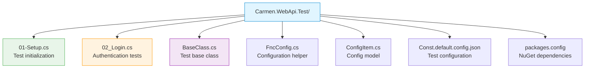

# Carmen.NET Testing Guide

**Document Version:** 1.0
**Last Updated:** October 6, 2025
**Target Audience:** QA Engineers, Developers, Test Automation Engineers
**Prerequisites:** Code Structure Guide, Developer Onboarding Guide

---

## Table of Contents

1. [Testing Strategy](#testing-strategy)
2. [Test Infrastructure](#test-infrastructure)
3. [Unit Testing](#unit-testing)
4. [Integration Testing](#integration-testing)
5. [API Testing](#api-testing)
6. [End-to-End Testing](#end-to-end-testing)
7. [Test Data Management](#test-data-management)
8. [Testing Best Practices](#testing-best-practices)
9. [CI/CD Integration](#cicd-integration)

---

## 1. Testing Strategy

### Testing Pyramid

Carmen.NET follows a **testing pyramid** approach with emphasis on unit tests:

```
                /\
               /  \
              /E2E \           ← 10% (Manual + Automated)
             /------\
            /  API   \         ← 20% (Integration Tests)
           /----------\
          / Unit Tests \       ← 70% (Fast, Isolated)
         /--------------\
```

**Current State vs. Target:**

| Layer | Current Coverage | Target Coverage | Priority |
|-------|-----------------|-----------------|----------|
| **Unit Tests** | ~5% | 70% | 🔴 Critical |
| **Integration Tests** | ~15% | 20% | 🟡 Medium |
| **API Tests** | ~10% | 20% | 🟡 Medium |
| **E2E Tests** | ~5% | 10% | 🟢 Low |

### Test Types

**1. Unit Tests**
- **Purpose**: Test individual methods/functions in isolation
- **Scope**: Single class/function
- **Duration**: < 100ms per test
- **Dependencies**: Mocked
- **Framework**: xUnit

**2. Integration Tests**
- **Purpose**: Test component interactions
- **Scope**: Database + Business Logic
- **Duration**: < 2s per test
- **Dependencies**: Real database (test environment)
- **Framework**: xUnit + Test Database

**3. API Tests**
- **Purpose**: Test HTTP endpoints
- **Scope**: Controller → Function → Database
- **Duration**: < 3s per test
- **Dependencies**: Real API + Test Database
- **Framework**: xUnit + Carmen.Api.Client

**4. E2E Tests**
- **Purpose**: Test complete user workflows
- **Scope**: Full application stack
- **Duration**: < 30s per test
- **Dependencies**: Full environment
- **Framework**: Selenium/Playwright (Future)

---

## 2. Test Infrastructure

### Test Projects

**Carmen.WebApi.Test**
- **Location**: `/Carmen.WebApi.Test/`
- **Purpose**: API integration tests
- **Framework**: xUnit 2.4.1
- **Target**: .NET Framework 4.6.2

**Project Structure:**


### NuGet Packages

**Testing Frameworks:**
```xml
<!-- Core Testing -->
<package id="xunit" version="2.4.1" />
<package id="xunit.runner.visualstudio" version="2.4.2" />
<package id="xunit.runner.console" version="2.4.1" />
<package id="Xunit.Extensions.Ordering" version="1.4.5" />

<!-- Assertions & Mocking -->
<package id="xunit.assert" version="2.4.1" />
<!-- Future: Moq for mocking -->
<!-- Future: FluentAssertions for readable assertions -->

<!-- API Client -->
<package id="Carmen.Api.Client" />
<package id="Newtonsoft.Json" version="12.0.3" />
```

### Test Configuration

**File:** `Const.default.config.json`

```json
{
  "BaseUrl": "https://localhost:44301",
  "AdminToken": "your-admin-token",
  "CarmenTenant": "TENANT001",
  "SuperUserUserName": "admin@example.com",
  "SuperUserPassword": "P@ssw0rd123",
  "TestVendorCode": "V001",
  "TestCustomerCode": "C001"
}
```

**Environment Variables:**
```bash
# For CI/CD
export CARMEN_TEST_BASE_URL="https://test.carmen.com"
export CARMEN_TEST_ADMIN_TOKEN="admin-token-here"
export CARMEN_TEST_TENANT="TENANT_TEST"
```

---

## 3. Unit Testing

### Unit Test Structure

**Naming Convention:**
```
{ClassName}Tests.cs
{MethodName}_Should{ExpectedBehavior}_When{Condition}
```

**Example:**
```csharp
// File: FncApInvoiceTests.cs
using Xunit;
using Carmen.WebApi.Functions;
using Carmen.Models;

namespace Carmen.WebApi.Tests.Functions
{
    public class FncApInvoiceTests
    {
        [Fact]
        public void CalculateTotalAmount_ShouldIncludeTax_WhenTaxAmountProvided()
        {
            // Arrange
            var invoice = new ParamApInvoice
            {
                Amount = 1000m,
                TaxAmount = 70m,    // 7% VAT
                WhtAmount = 30m     // 3% WHT
            };

            // Act
            var totalAmount = FncApInvoice.CalculateTotalAmount(invoice);

            // Assert
            Assert.Equal(1040m, totalAmount);  // 1000 + 70 - 30
        }

        [Fact]
        public void CalculateDueDate_ShouldAddDays_WhenPaymentTermsIsNet30()
        {
            // Arrange
            var invoiceDate = new DateTime(2025, 10, 1);
            var paymentTerms = "NET30";

            // Act
            var dueDate = FncApInvoice.CalculateDueDate(invoiceDate, paymentTerms);

            // Assert
            Assert.Equal(new DateTime(2025, 10, 31), dueDate);
        }

        [Theory]
        [InlineData(0)]
        [InlineData(-100)]
        public void CreateAsync_ShouldThrowException_WhenAmountIsZeroOrNegative(decimal amount)
        {
            // Arrange
            var param = new ParamApInvoice { Amount = amount };
            var dbFac = CreateMockDbFactory();

            // Act & Assert
            Assert.ThrowsAsync<BusinessException>(
                async () => await FncApInvoice.CreateAsync(dbFac, param)
            );
        }
    }
}
```

### Mocking with Moq (Recommended)

**Setup:**
```bash
dotnet add package Moq --version 4.18.4
```

**Example:**
```csharp
using Moq;
using Carmen.WebApi.Connection;

public class FncApInvoiceTests
{
    private Mock<IDbFactory> CreateMockDbFactory()
    {
        var mockDbFactory = new Mock<IDbFactory>();
        var mockDb = new Mock<QueryFactory>();

        mockDbFactory.Setup(f => f.GetConnection())
                     .Returns(mockDb.Object);

        return mockDbFactory;
    }

    [Fact]
    public async Task GetByIdAsync_ShouldReturnInvoice_WhenInvoiceExists()
    {
        // Arrange
        var mockDbFactory = CreateMockDbFactory();
        var expectedInvoice = new ViewApInvoice
        {
            InvhSeq = 123,
            InvoiceNumber = "INV-001"
        };

        mockDbFactory.Setup(f => f.Db.Query("apinvh")
                     .Where("InvhSeq", 123)
                     .FirstOrDefaultAsync<ViewApInvoice>())
                     .ReturnsAsync(expectedInvoice);

        // Act
        var result = await FncApInvoice.GetByIdAsync(mockDbFactory.Object, 123);

        // Assert
        Assert.NotNull(result);
        Assert.Equal("INV-001", result.InvoiceNumber);
    }
}
```

### Testing Patterns

**AAA Pattern (Arrange-Act-Assert):**
```csharp
[Fact]
public void TestMethod()
{
    // Arrange - Set up test data and dependencies
    var input = "test data";
    var expected = "expected output";

    // Act - Execute the method under test
    var actual = MethodUnderTest(input);

    // Assert - Verify the result
    Assert.Equal(expected, actual);
}
```

**Theory Tests (Data-Driven):**
```csharp
[Theory]
[InlineData("NET15", 15)]
[InlineData("NET30", 30)]
[InlineData("NET60", 60)]
[InlineData("NET90", 90)]
public void GetPaymentTermsDays_ShouldReturnCorrectDays(string terms, int expectedDays)
{
    var result = FncBase.GetPaymentTermsDays(terms);
    Assert.Equal(expectedDays, result);
}
```

---

## 4. Integration Testing

### Integration Test Setup

**Test Database:**
```sql
-- Create test database
CREATE DATABASE Carmen_Test;

-- Run schema scripts
SOURCE Carmen.WebApi/App_Data/InstallScriptCarmen/Pre/01-Table/02-Create-Table.sql;

-- Insert test data
SOURCE Carmen.WebApi/App_Data/InstallScriptCarmen/Pre/01-Table/03-Add-InitialData.sql;
```

**Connection String:**
```csharp
// File: IntegrationTestBase.cs
public class IntegrationTestBase : IDisposable
{
    protected IDbFactory DbFactory { get; private set; }
    protected string TenantCode => "TEST001";

    public IntegrationTestBase()
    {
        // Use test database
        var connectionString = "Server=localhost;Database=Carmen_Test;Uid=root;Pwd=password;";
        var connection = new MySqlConnection(connectionString);
        DbFactory = DbFactory.MyDbFactory(connection);

        // Set test tenant context
        FncBase.CurrentTenantCode = TenantCode;
    }

    public void Dispose()
    {
        // Cleanup: Rollback transactions or delete test data
        CleanupTestData();
    }

    protected void CleanupTestData()
    {
        using (var db = DbFactory.GetConnection())
        {
            db.Execute("DELETE FROM apinvh WHERE TenantCode = @TenantCode", new { TenantCode });
            db.Execute("DELETE FROM appyh WHERE TenantCode = @TenantCode", new { TenantCode });
        }
    }
}
```

### Integration Test Example

```csharp
// File: ApInvoiceIntegrationTests.cs
using Xunit;
using Carmen.WebApi.Functions;
using Carmen.Models;

namespace Carmen.WebApi.Tests.Integration
{
    public class ApInvoiceIntegrationTests : IntegrationTestBase
    {
        [Fact]
        public async Task CreateAsync_ShouldInsertInvoice_WhenDataIsValid()
        {
            // Arrange
            var param = new ParamApInvoice
            {
                InvoiceNumber = "TEST-INV-001",
                InvoiceDate = DateTime.Now,
                VendorCode = "V001",
                Amount = 1000m,
                TaxAmount = 70m,
                WhtAmount = 0m,
                Lines = new List<ParamApInvoiceLine>
                {
                    new ParamApInvoiceLine
                    {
                        LineNum = 1,
                        Description = "Test Item",
                        Amount = 1000m,
                        AccountCode = "5000-01-10-00"
                    }
                }
            };

            // Act
            var invhSeq = await FncApInvoice.CreateAsync(DbFactory, param);

            // Assert
            Assert.True(invhSeq > 0);

            // Verify in database
            var invoice = await FncApInvoice.GetByIdAsync(DbFactory, invhSeq);
            Assert.NotNull(invoice);
            Assert.Equal("TEST-INV-001", invoice.InvoiceNumber);
            Assert.Equal(1070m, invoice.TotalAmount);  // 1000 + 70
        }

        [Fact]
        public async Task CreateAsync_ShouldThrowException_WhenVendorNotFound()
        {
            // Arrange
            var param = new ParamApInvoice
            {
                VendorCode = "INVALID_VENDOR",
                Amount = 1000m
            };

            // Act & Assert
            var ex = await Assert.ThrowsAsync<BusinessException>(
                async () => await FncApInvoice.CreateAsync(DbFactory, param)
            );

            Assert.Equal("VENDOR_NOT_FOUND", ex.Code);
        }

        [Fact]
        public async Task UpdateAsync_ShouldModifyInvoice_WhenStatusIsDraft()
        {
            // Arrange - Create invoice first
            var invhSeq = await CreateTestInvoiceAsync();

            var updateParam = new ParamApInvoice
            {
                InvoiceNumber = "TEST-INV-001-UPDATED",
                Amount = 2000m,
                TaxAmount = 140m
            };

            // Act
            var result = await FncApInvoice.UpdateAsync(DbFactory, invhSeq, updateParam);

            // Assert
            Assert.True(result);

            var updatedInvoice = await FncApInvoice.GetByIdAsync(DbFactory, invhSeq);
            Assert.Equal(2140m, updatedInvoice.TotalAmount);
        }

        private async Task<int> CreateTestInvoiceAsync()
        {
            var param = new ParamApInvoice
            {
                InvoiceNumber = "TEST-INV-001",
                InvoiceDate = DateTime.Now,
                VendorCode = "V001",
                Amount = 1000m,
                Lines = new List<ParamApInvoiceLine>
                {
                    new ParamApInvoiceLine { Amount = 1000m, AccountCode = "5000-01-10-00" }
                }
            };

            return await FncApInvoice.CreateAsync(DbFactory, param);
        }
    }
}
```

---

## 5. API Testing

### API Test Infrastructure

**Current Implementation:**

```csharp
// File: 02_Login.cs
using Carmen.Api.Client;
using Xunit;
using Xunit.Extensions.Ordering;

[CollectionDefinition("02-Login", DisableParallelization = true)]
[Order(2)]
[Collection("02-Login")]
public class Login : BaseClass
{
    private readonly ITestOutputHelper _output;

    public Login(ITestOutputHelper output)
    {
        _output = output;
    }

    [Order(10)]
    [Fact(DisplayName = "02-Test Login With fail username")]
    public async Task TestLoginFailUserName()
    {
        var client = new Login_Client
        {
            BaseUrl = Config.BaseUrl
        };

        var task = client.LoginAsync(
            Config.AdminToken,
            new ParamUserLogin
            {
                Tenant = Config.CarmenTenant,
                UserName = "Hack User name",
                Password = "",
                Email = "",
                Language = "en-US"
            });

        var ex = await Assert.ThrowsAsync<ApiException>(async () => await task);
        _output.WriteLine($"ex = {ex.Response}");

        Assert.Equal(401, ex.StatusCode);
        Assert.Equal("User / Password is incorrect.",
            JsonConvert.DeserializeObject<ApiReturnResponse>(ex.Response).UserMessage);
    }

    [Order(20)]
    [Fact(DisplayName = "04-Test Login Success")]
    public async Task TestLoginSuccess()
    {
        var client = new Login_Client { BaseUrl = Config.BaseUrl };

        var result = await client.LoginAsync(
            Config.AdminToken,
            new ParamUserLogin
            {
                Tenant = Config.CarmenTenant,
                UserName = Config.SuperUserUserName,
                Password = Config.SuperUserPassword,
                Email = "",
                Language = "en-US"
            });

        Assert.NotNull(result);
        Assert.NotNull(result.AccessToken);
        Assert.NotEmpty(result.AccessToken);

        // Store token for subsequent tests
        CurrentUser = result;
    }
}
```

### API Test Patterns

**CRUD Test Suite:**

```csharp
// File: ApInvoiceApiTests.cs
using Carmen.Api.Client;
using Xunit;

public class ApInvoiceApiTests : BaseClass
{
    private ApInvoice_Client _client;

    public ApInvoiceApiTests()
    {
        _client = new ApInvoice_Client { BaseUrl = Config.BaseUrl };
        _client.SetBearerToken(CurrentUser.AccessToken);
    }

    [Fact]
    public async Task GetList_ShouldReturnInvoices()
    {
        // Act
        var result = await _client.GetListAsync(tenantCode: Config.CarmenTenant);

        // Assert
        Assert.NotNull(result);
        Assert.NotNull(result.Data);
        Assert.True(result.TotalRows >= 0);
    }

    [Fact]
    public async Task GetById_ShouldReturnInvoice_WhenInvoiceExists()
    {
        // Arrange
        var invhSeq = await CreateTestInvoiceAsync();

        // Act
        var result = await _client.GetByIdAsync(invhSeq, Config.CarmenTenant);

        // Assert
        Assert.NotNull(result);
        Assert.Equal(invhSeq, result.InvhSeq);
    }

    [Fact]
    public async Task Create_ShouldReturnId_WhenDataIsValid()
    {
        // Arrange
        var param = new ParamApInvoice
        {
            InvoiceNumber = $"TEST-{Guid.NewGuid()}",
            InvoiceDate = DateTime.Now,
            VendorCode = Config.TestVendorCode,
            Amount = 1000m,
            TaxAmount = 70m,
            Lines = new List<ParamApInvoiceLine>
            {
                new ParamApInvoiceLine
                {
                    LineNum = 1,
                    Description = "Test Item",
                    Amount = 1000m,
                    AccountCode = "5000-01-10-00"
                }
            }
        };

        // Act
        var result = await _client.CreateAsync(param, Config.CarmenTenant);

        // Assert
        Assert.NotNull(result);
        Assert.True(result.Success);
        Assert.True(result.Data > 0);
    }

    [Fact]
    public async Task Create_ShouldReturnError_WhenVendorInvalid()
    {
        // Arrange
        var param = new ParamApInvoice
        {
            VendorCode = "INVALID",
            Amount = 1000m
        };

        // Act & Assert
        var ex = await Assert.ThrowsAsync<ApiException>(
            async () => await _client.CreateAsync(param, Config.CarmenTenant)
        );

        Assert.Equal(400, ex.StatusCode);
        var errorResponse = JsonConvert.DeserializeObject<ApiReturnResponse>(ex.Response);
        Assert.Equal("VENDOR_NOT_FOUND", errorResponse.Code);
    }

    [Fact]
    public async Task Update_ShouldModifyInvoice_WhenStatusIsDraft()
    {
        // Arrange
        var invhSeq = await CreateTestInvoiceAsync();
        var param = new ParamApInvoice
        {
            Amount = 2000m,
            TaxAmount = 140m
        };

        // Act
        var result = await _client.UpdateAsync(invhSeq, param, Config.CarmenTenant);

        // Assert
        Assert.True(result.Success);

        // Verify update
        var updated = await _client.GetByIdAsync(invhSeq, Config.CarmenTenant);
        Assert.Equal(2140m, updated.TotalAmount);
    }

    [Fact]
    public async Task Delete_ShouldRemoveInvoice_WhenInvoiceIsDraft()
    {
        // Arrange
        var invhSeq = await CreateTestInvoiceAsync();

        // Act
        var result = await _client.DeleteAsync(invhSeq, Config.CarmenTenant);

        // Assert
        Assert.True(result.Success);

        // Verify deletion
        await Assert.ThrowsAsync<ApiException>(
            async () => await _client.GetByIdAsync(invhSeq, Config.CarmenTenant)
        );
    }

    private async Task<int> CreateTestInvoiceAsync()
    {
        var param = new ParamApInvoice
        {
            InvoiceNumber = $"TEST-{Guid.NewGuid()}",
            InvoiceDate = DateTime.Now,
            VendorCode = Config.TestVendorCode,
            Amount = 1000m,
            Lines = new List<ParamApInvoiceLine>
            {
                new ParamApInvoiceLine { Amount = 1000m, AccountCode = "5000-01-10-00" }
            }
        };

        var result = await _client.CreateAsync(param, Config.CarmenTenant);
        return result.Data;
    }
}
```

---

## 6. End-to-End Testing

### E2E Test Framework (Future)

**Recommended: Playwright for .NET**

**Setup:**
```bash
dotnet add package Microsoft.Playwright --version 1.40.0
dotnet tool install --global Microsoft.Playwright.CLI
playwright install
```

**Example E2E Test:**

```csharp
using Microsoft.Playwright;
using Xunit;

public class ApInvoiceE2ETests : IAsyncLifetime
{
    private IPlaywright _playwright;
    private IBrowser _browser;
    private IBrowserContext _context;
    private IPage _page;

    public async Task InitializeAsync()
    {
        _playwright = await Playwright.CreateAsync();
        _browser = await _playwright.Chromium.LaunchAsync(new()
        {
            Headless = true
        });
        _context = await _browser.NewContextAsync();
        _page = await _context.NewPageAsync();
    }

    [Fact]
    public async Task UserCanCreateApInvoice()
    {
        // Navigate to login
        await _page.GotoAsync("https://localhost:44301/login");

        // Login
        await _page.FillAsync("#username", "admin@example.com");
        await _page.FillAsync("#password", "P@ssw0rd123");
        await _page.ClickAsync("button[type='submit']");

        // Wait for redirect
        await _page.WaitForURLAsync("**/dashboard");

        // Navigate to AP Invoice
        await _page.ClickAsync("text=Accounts Payable");
        await _page.ClickAsync("text=Invoices");

        // Click New Invoice
        await _page.ClickAsync("button:has-text('New Invoice')");

        // Fill invoice form
        await _page.FillAsync("#invoiceNumber", "TEST-E2E-001");
        await _page.SelectOptionAsync("#vendorCode", "V001");
        await _page.FillAsync("#amount", "1000");
        await _page.FillAsync("#taxAmount", "70");

        // Add line item
        await _page.ClickAsync("button:has-text('Add Line')");
        await _page.FillAsync("#line1-accountCode", "5000-01-10-00");
        await _page.FillAsync("#line1-amount", "1000");

        // Save
        await _page.ClickAsync("button:has-text('Save')");

        // Verify success
        await _page.WaitForSelectorAsync("text=Invoice created successfully");

        // Verify in list
        await _page.ClickAsync("text=Back to List");
        var invoiceRow = await _page.QuerySelectorAsync("text=TEST-E2E-001");
        Assert.NotNull(invoiceRow);
    }

    public async Task DisposeAsync()
    {
        await _context.CloseAsync();
        await _browser.CloseAsync();
        _playwright.Dispose();
    }
}
```

---

## 7. Test Data Management

### Test Data Setup

**Seeding Test Data:**

```csharp
// File: TestDataSeeder.cs
public class TestDataSeeder
{
    private readonly IDbFactory _dbFactory;

    public TestDataSeeder(IDbFactory dbFactory)
    {
        _dbFactory = dbFactory;
    }

    public async Task SeedAsync()
    {
        await SeedVendorsAsync();
        await SeedCustomersAsync();
        await SeedAccountsAsync();
        await SeedDepartmentsAsync();
    }

    private async Task SeedVendorsAsync()
    {
        var vendors = new[]
        {
            new { VnCode = "V001", VnName = "Test Vendor 1", TaxId = "0-1234-56789-01-2" },
            new { VnCode = "V002", VnName = "Test Vendor 2", TaxId = "0-2345-67890-12-3" }
        };

        using (var db = _dbFactory.GetConnection())
        {
            foreach (var vendor in vendors)
            {
                await db.ExecuteAsync(@"
                    INSERT INTO vendor (VnCode, VnName, TaxId)
                    VALUES (@VnCode, @VnName, @TaxId)
                    ON DUPLICATE KEY UPDATE VnName = @VnName",
                    vendor);
            }
        }
    }
}
```

### Test Data Builders

```csharp
// File: TestDataBuilders/ApInvoiceBuilder.cs
public class ApInvoiceBuilder
{
    private ParamApInvoice _invoice;

    public ApInvoiceBuilder()
    {
        _invoice = new ParamApInvoice
        {
            InvoiceNumber = $"TEST-{Guid.NewGuid().ToString().Substring(0, 8)}",
            InvoiceDate = DateTime.Now,
            VendorCode = "V001",
            Amount = 1000m,
            TaxAmount = 70m,
            WhtAmount = 0m,
            Lines = new List<ParamApInvoiceLine>()
        };
    }

    public ApInvoiceBuilder WithVendor(string vendorCode)
    {
        _invoice.VendorCode = vendorCode;
        return this;
    }

    public ApInvoiceBuilder WithAmount(decimal amount)
    {
        _invoice.Amount = amount;
        return this;
    }

    public ApInvoiceBuilder WithLine(string accountCode, decimal amount, string description = "")
    {
        _invoice.Lines.Add(new ParamApInvoiceLine
        {
            LineNum = _invoice.Lines.Count + 1,
            AccountCode = accountCode,
            Amount = amount,
            Description = description
        });
        return this;
    }

    public ParamApInvoice Build()
    {
        return _invoice;
    }
}

// Usage
var invoice = new ApInvoiceBuilder()
    .WithVendor("V001")
    .WithAmount(2000m)
    .WithLine("5000-01-10-00", 1000m, "Office Supplies")
    .WithLine("5100-01-10-00", 1000m, "Software License")
    .Build();
```

---

## 8. Testing Best Practices

### Do's

✅ **Write Tests First (TDD)**
```csharp
// 1. Write failing test
[Fact]
public void CalculateTotalAmount_ShouldIncludeTax()
{
    var result = FncApInvoice.CalculateTotalAmount(1000m, 70m, 0m);
    Assert.Equal(1070m, result);
}

// 2. Implement method
public static decimal CalculateTotalAmount(decimal amount, decimal tax, decimal wht)
{
    return amount + tax - wht;
}

// 3. Test passes
```

✅ **Test One Thing Per Test**
```csharp
// ✅ GOOD
[Fact]
public void CreateAsync_ShouldThrowException_WhenAmountIsZero()
{
    // Test only amount validation
}

[Fact]
public void CreateAsync_ShouldThrowException_WhenVendorNotFound()
{
    // Test only vendor existence
}

// ❌ BAD
[Fact]
public void CreateAsync_ShouldValidateEverything()
{
    // Tests multiple conditions
}
```

✅ **Use Descriptive Test Names**
```csharp
// ✅ GOOD
[Fact]
public void GetByIdAsync_ShouldReturnNull_WhenInvoiceDoesNotExist()

// ❌ BAD
[Fact]
public void Test1()
```

✅ **Isolate Tests**
```csharp
// Each test should clean up after itself
public void Dispose()
{
    CleanupTestData();
}
```

### Don'ts

❌ **Don't Test Framework Code**
```csharp
// ❌ BAD - Testing Entity Framework
[Fact]
public void EntityFramework_ShouldSaveData()
{
    var entity = new ApInvh();
    context.ApInvh.Add(entity);
    context.SaveChanges();
}
```

❌ **Don't Use Real Production Data**
```csharp
// ❌ BAD
var vendor = await db.Query("vendor").Where("VnCode", "REAL_VENDOR").First();

// ✅ GOOD
var vendor = CreateTestVendor("V001");
```

❌ **Don't Ignore Flaky Tests**
```csharp
// ❌ BAD
[Fact(Skip = "Flaky test")]
public void SometimesFailsTest() { }

// ✅ GOOD - Fix the root cause
[Fact]
public void ReliableTest()
{
    // Add proper waits, mocks, or test data setup
}
```

---

## 9. CI/CD Integration

### GitHub Actions Workflow

```yaml
# .github/workflows/test.yml
name: Run Tests

on:
  push:
    branches: [main, develop]
  pull_request:
    branches: [main, develop]

jobs:
  test:
    runs-on: windows-latest

    services:
      mysql:
        image: mysql:5.7
        env:
          MYSQL_ROOT_PASSWORD: password
          MYSQL_DATABASE: Carmen_Test
        ports:
          - 3306:3306

    steps:
      - uses: actions/checkout@v3

      - name: Setup .NET
        uses: actions/setup-dotnet@v3
        with:
          dotnet-version: '4.6.2'

      - name: Restore dependencies
        run: dotnet restore

      - name: Build
        run: dotnet build --no-restore

      - name: Run Unit Tests
        run: dotnet test --no-build --verbosity normal --filter "Category=Unit"

      - name: Run Integration Tests
        run: dotnet test --no-build --verbosity normal --filter "Category=Integration"
        env:
          CARMEN_TEST_CONNECTION_STRING: "Server=localhost;Database=Carmen_Test;Uid=root;Pwd=password;"

      - name: Generate Test Report
        uses: dorny/test-reporter@v1
        if: always()
        with:
          name: Test Results
          path: '**/*.trx'
          reporter: dotnet-trx
```

### Test Categories

```csharp
// Categorize tests for selective running
[Trait("Category", "Unit")]
public class UnitTests { }

[Trait("Category", "Integration")]
public class IntegrationTests { }

[Trait("Category", "E2E")]
public class E2ETests { }

[Trait("Category", "Smoke")]
public class SmokeTests { }
```

**Run Specific Categories:**
```bash
# Run only unit tests
dotnet test --filter "Category=Unit"

# Run integration and E2E tests
dotnet test --filter "Category=Integration|Category=E2E"

# Run smoke tests only
dotnet test --filter "Category=Smoke"
```

---

## Summary

Carmen.NET testing infrastructure:

**✅ Implemented:**
- xUnit framework setup
- API integration tests
- Test configuration management
- Ordered test execution

**🟡 Partially Implemented:**
- Unit tests (minimal coverage)
- Integration tests (basic examples)
- Test data management

**🔴 Recommended:**
- Increase unit test coverage to 70%
- Implement mocking with Moq
- Add integration test suite
- Implement E2E tests with Playwright
- Set up CI/CD pipeline with automated testing
- Implement code coverage reporting (target: 80%+)

**Next Steps:**
- Review [Code Structure Guide](code-structure-guide.md) for code organization
- Study [Design Patterns Guide](design-patterns-guide.md) for testable patterns
- Consult [Developer Onboarding Guide](developer-onboarding-guide.md) for environment setup
- Reference [Functional Requirements](../requirements/functional-requirements.md) for test scenarios

---

**Document Status:** ✅ Complete
**For Support:** Contact QA team or development team
