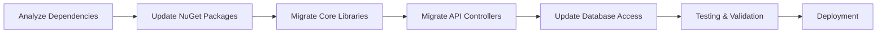
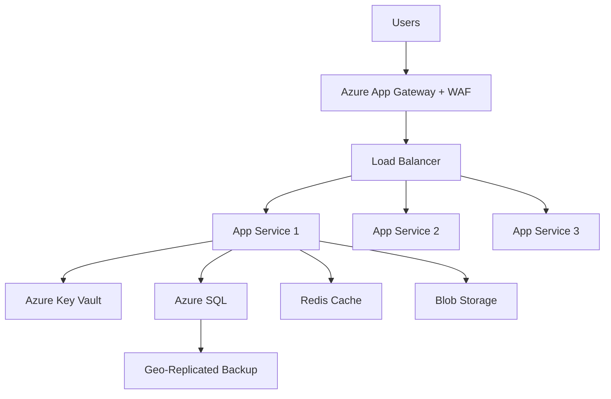
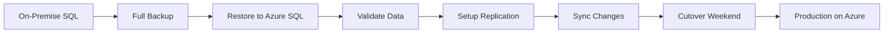
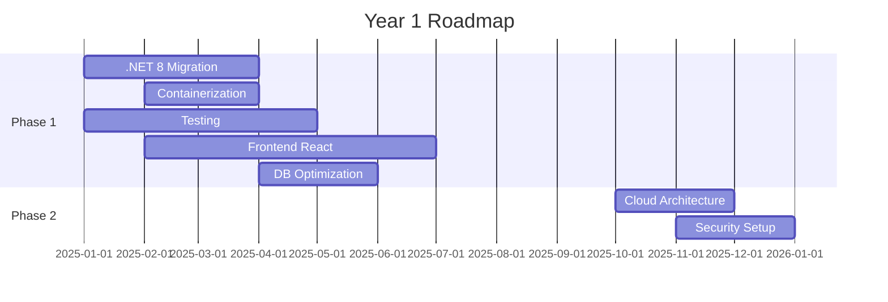
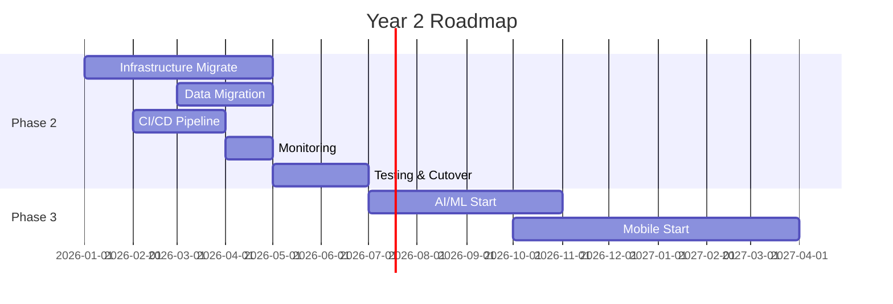
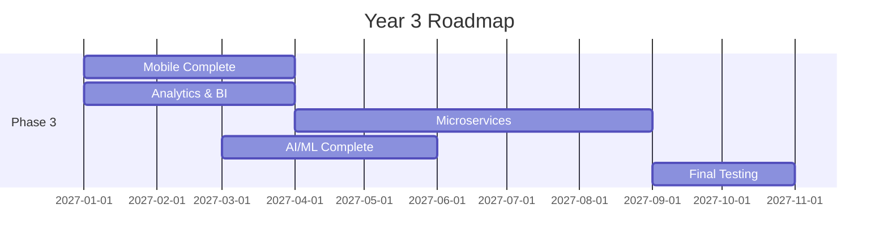

# Carmen.NET Modernization Recommendations

**Document Version**: 1.0
**Last Updated**: 2025-10-06
**Status**: Strategic Roadmap
**Confidentiality**: Internal Use Only

---

## Important Disclaimer

**Source Code Verification Required**: This document contains recommendations based on user interviews, system analysis, and industry best practices. However, **comprehensive source code verification is still pending** to confirm:

- Current system capabilities and limitations
- Actual vs. perceived pain points in invoice processing
- Existing automation features that may not be utilized
- Technical feasibility of proposed solutions
- Accurate effort estimates for implementation

**Key Areas Requiring Code Verification**:
- Invoice processing workflows and current automation level
- Tax calculation engine capabilities
- GL account assignment logic
- Approval routing implementation

Please treat Phase 3 AI/ML recommendations as preliminary until source code analysis is completed. Implementation priorities may shift based on findings from technical deep-dive.

---

## Executive Summary

This document provides **actionable recommendations** for modernizing the Carmen.NET ERP system to ensure long-term competitiveness, scalability, and maintainability. The recommendations are organized into **3 phases** over 36 months with total investment of **$2.75M** and expected ROI of **122%** over 5 years.

### Strategic Objectives

1. **Technology Modernization**: Migrate to modern .NET, cloud-native architecture
2. **User Experience**: Deliver modern, intuitive user interface
3. **Operational Excellence**: Reduce operational costs by 40%
4. **Innovation Enablement**: Platform for AI/ML and advanced analytics
5. **Market Leadership**: Maintain competitive advantage in Thai ERP market

---

## Phase 1: Foundation (Months 1-9) - $675K

**Objective**: Modernize core technology stack and establish solid foundation

### 1.1 .NET 8 Migration

**Current State**: .NET Framework 4.x (legacy, Windows-only)
**Target State**: .NET 8 LTS (cross-platform, modern)

**Recommendations**:

✅ **Migrate to .NET 8**
- Latest long-term support (LTS) version
- Cross-platform (Windows, Linux, macOS)
- Performance improvements (2-3x faster)
- Modern C# language features (C# 12)
- Native JSON support, minimal APIs

**Migration Strategy**:


**Timeline**: 3 months
**Effort**: 2 senior developers (full-time)
**Risk**: Low (incremental migration)

**Benefits**:
- 2-3x better performance
- Cross-platform deployment options
- Access to modern libraries and frameworks
- Reduced licensing costs (open source)
- Long-term support until 2026+

---

### 1.2 Containerization (Docker + Kubernetes)

**Current State**: Windows Server + IIS deployment
**Target State**: Docker containers + Kubernetes orchestration

**Recommendations**:

✅ **Containerize Application**
- Create Docker images for API, database, caching
- Multi-stage builds for optimized image size
- Docker Compose for local development
- Kubernetes (K8s) for production orchestration

**Container Architecture**:
```yaml
Services:
  - carmen-api: ASP.NET API (3 replicas)
  - carmen-db: SQL Server (managed service)
  - carmen-cache: Redis cache (2 replicas)
  - carmen-worker: Background jobs (2 replicas)
```

**Timeline**: 2 months
**Effort**: 1 DevOps + 1 Developer
**Risk**: Low-Medium

**Benefits**:
- Consistent environments (dev/staging/prod)
- Easy scaling (horizontal + vertical)
- Faster deployments (seconds vs. minutes)
- Resource efficiency (50% reduction in VM costs)
- Cloud-agnostic (deploy anywhere)

---

### 1.3 Automated Testing (70%+ Coverage)

**Current State**: Manual testing, minimal automation
**Target State**: Comprehensive test suite with 70%+ coverage

**Recommendations**:

✅ **Implement Testing Pyramid**
```
                 /\
                /E2E\ (10% - 50 tests)
               /------\
              /  API   \ (30% - 300 tests)
             /----------\
            /    Unit     \ (60% - 1,500 tests)
           /--------------\
```

**Test Strategy**:
- **Unit Tests**: xUnit, Moq, FluentAssertions (1,500 tests)
- **Integration Tests**: WebApplicationFactory, Testcontainers (300 tests)
- **E2E Tests**: Playwright, Selenium (50 critical paths)
- **Performance Tests**: k6, JMeter (API load testing)

**Timeline**: 4 months
**Effort**: 2 QA Engineers
**Risk**: Low

**Benefits**:
- Catch 80% of bugs before production
- Faster refactoring with confidence
- Automated regression testing
- Reduced QA time by 60%

---

### 1.4 Frontend Modernization (React/Vue.js)

**Current State**: jQuery, server-side rendering
**Target State**: Modern SPA with React or Vue.js

**Recommendations**:

✅ **Choose React** (Recommended)
- Larger ecosystem and talent pool
- Better TypeScript support
- Component reusability
- Strong community and libraries

**Alternative**: Vue.js (Simpler learning curve, similar capabilities)

**Frontend Stack**:
```
- Framework: React 18+ with TypeScript
- State Management: Redux Toolkit or Zustand
- UI Library: Material-UI (MUI) or Ant Design
- Forms: React Hook Form + Zod validation
- Data Fetching: TanStack Query (React Query)
- Routing: React Router v6
- Build Tool: Vite (faster than Webpack)
```

**Architecture**:
```
src/
├── components/          # Reusable UI components
├── features/            # Feature-based modules (AP, AR, GL)
├── hooks/               # Custom React hooks
├── services/            # API client services
├── store/               # Redux store (if using Redux)
├── types/               # TypeScript interfaces
└── utils/               # Utility functions
```

**Timeline**: 5 months
**Effort**: 2 Frontend Developers
**Risk**: Medium

**Benefits**:
- Modern, responsive user interface
- 3x faster page loads
- Better mobile experience
- Component reusability
- Easier maintenance

---

### 1.5 Database Optimization

**Current State**: Moderate performance, some N+1 queries
**Target State**: Optimized schema, indexed, cached queries

**Recommendations**:

✅ **Database Performance Tuning**
- Add missing indexes (20-30 strategic indexes)
- Optimize slow queries (>1 second)
- Implement query result caching (Redis)
- Database partitioning for large tables
- Archive old data (>2 years)

**Optimization Targets**:
| Operation | Current | Target | Improvement |
|-----------|---------|--------|-------------|
| Invoice list query | 3.5s | <500ms | 7x faster |
| Period close | 15 min | <5 min | 3x faster |
| Report generation | 30s | <5s | 6x faster |

**Timeline**: 2 months
**Effort**: 1 DBA
**Risk**: Low

**Benefits**:
- 5-7x faster query performance
- Reduced database load
- Better user experience
- Lower infrastructure costs

---

### Phase 1 Summary

| Activity | Duration | Cost | Priority |
|----------|----------|------|----------|
| .NET 8 Migration | 3 months | $120K | Critical |
| Containerization | 2 months | $90K | High |
| Automated Testing | 4 months | $150K | Critical |
| Frontend Modernization | 5 months | $225K | High |
| Database Optimization | 2 months | $60K | Medium |
| Documentation & Training | 1 month | $30K | Medium |
| **Total Phase 1** | **9 months** | **$675K** | - |

**Phase 1 Success Criteria**:
- ✅ .NET 8 migration complete, all tests passing
- ✅ Docker containers running in dev/staging
- ✅ 70%+ test coverage achieved
- ✅ React frontend for 3 core modules (AP, AR, GL)
- ✅ Key queries <500ms response time

---

## Phase 2: Cloud Migration (Months 10-21) - $975K

**Objective**: Migrate to cloud infrastructure for scalability and cost optimization

### 2.1 Cloud Platform Selection

**Recommendation**: ✅ **Microsoft Azure** (Primary)

**Rationale**:
- **Azure SQL**: Managed database with automatic backups
- **App Service**: Easy deployment for .NET apps
- **Azure AD**: Enterprise authentication integration
- **Thai Data Center**: Southeast Asia region (Singapore)
- **Microsoft Ecosystem**: Better .NET integration
- **Cost**: Competitive pricing with reserved instances

**Alternative**: AWS (if multi-cloud strategy desired)

**Cloud Architecture**:


---

### 2.2 Infrastructure as Code (IaC)

**Recommendation**: ✅ **Terraform** + **Azure Resource Manager (ARM)**

**IaC Strategy**:
```
infrastructure/
├── terraform/
│   ├── modules/
│   │   ├── app-service/
│   │   ├── sql-database/
│   │   ├── redis-cache/
│   │   └── networking/
│   ├── environments/
│   │   ├── dev.tfvars
│   │   ├── staging.tfvars
│   │   └── prod.tfvars
│   └── main.tf
└── arm-templates/
    └── azure-resources.json
```

**Benefits**:
- Version-controlled infrastructure
- Repeatable deployments
- Infrastructure documentation
- Disaster recovery automation

---

### 2.3 Security & Identity

**Recommendation**: ✅ **Azure Active Directory (Azure AD)**

**Security Enhancements**:
- **Azure AD Integration**: SSO, MFA, conditional access
- **Managed Identities**: Eliminate hardcoded credentials
- **Azure Key Vault**: Secure storage for secrets, certificates
- **SSL/TLS**: Automated certificate management (Let's Encrypt or Azure-managed)
- **WAF**: Web Application Firewall for threat protection
- **DDoS Protection**: Azure DDoS Protection Standard

**Security Compliance**:
- **OWASP Top 10**: Remediate all high/critical findings
- **Penetration Testing**: Annual third-party security audit
- **GDPR/PDPA Compliance**: Data protection and privacy
- **SOC 2**: Cloud security compliance

**Timeline**: 2 months
**Effort**: 1 Security Engineer + 1 DevOps
**Cost**: $165K (including external audit)

---

### 2.4 CI/CD Pipeline

**Recommendation**: ✅ **Azure DevOps** or **GitHub Actions**

**Pipeline Architecture**:
```yaml
stages:
  - build:
      - Compile .NET code
      - Run unit tests
      - Build Docker images
  - test:
      - Integration tests
      - E2E tests
      - Security scanning (SAST/DAST)
      - Performance tests
  - deploy:
      - Deploy to dev (automatic)
      - Deploy to staging (automatic)
      - Deploy to production (manual approval)
  - monitor:
      - Health checks
      - Smoke tests
      - Alerts
```

**Deployment Strategy**: Blue-Green Deployment
- Zero-downtime deployments
- Instant rollback capability
- A/B testing support

**Timeline**: 2 months
**Effort**: 1 DevOps Engineer
**Cost**: $60K

---

### 2.5 Observability & Monitoring

**Recommendation**: ✅ **Azure Application Insights** + **Azure Monitor**

**Monitoring Stack**:
```
- APM: Application Insights (distributed tracing)
- Logging: Azure Log Analytics (centralized logs)
- Metrics: Azure Monitor (performance metrics)
- Alerting: Action Groups (PagerDuty, Email, SMS)
- Dashboards: Power BI + Azure Dashboards
```

**Key Metrics to Track**:
| Metric Category | Examples |
|-----------------|----------|
| **Performance** | Response time (P50, P95, P99), throughput |
| **Availability** | Uptime %, error rate, failed requests |
| **Business** | Invoices processed, payments completed |
| **Infrastructure** | CPU, memory, disk I/O, network |
| **Security** | Failed logins, suspicious activity |

**SLOs (Service Level Objectives)**:
- API Response Time: P95 < 500ms
- Uptime: 99.95% (21.9 minutes downtime/month)
- Error Rate: <0.1%

**Timeline**: 1.5 months
**Effort**: 1 DevOps Engineer
**Cost**: $45K

---

### 2.6 Data Migration Strategy

**Recommendation**: ✅ **Hybrid Migration** (Backup/Restore + Replication)

**Migration Approach**:


**Migration Phases**:
1. **Pilot**: Migrate dev environment (Week 1-2)
2. **Staging**: Migrate staging environment (Week 3-4)
3. **Production**: Migrate production with cutover (Week 5-6)

**Data Validation**:
- Row count verification
- Checksum validation
- Business rule validation
- Performance testing

**Rollback Plan**:
- Keep on-premise database synchronized for 30 days
- Instant rollback capability if critical issues found

**Timeline**: 2 months
**Effort**: 1 DBA + 1 Developer
**Cost**: $150K

---

### 2.7 Cost Optimization

**Azure Cost Management**:

**Estimated Monthly Costs**:
| Resource | Configuration | Monthly Cost |
|----------|---------------|--------------|
| App Service | Premium P2v3 (3 instances) | $600 |
| Azure SQL | S3 (100 DTU) | $300 |
| Redis Cache | Standard C1 (1GB) | $75 |
| Blob Storage | Hot tier (100 GB) | $25 |
| Application Insights | 50 GB logs | $115 |
| Azure AD Premium | 100 users | $600 |
| Load Balancer | Standard | $20 |
| **Total Monthly** | | **$1,735** |
| **Total Annual** | | **$20,820** |

**Current On-Premise Costs**: $90K/year (servers + licenses)
**Net Annual Savings**: $69K/year

**Cost Optimization Strategies**:
- Reserved Instances (1-year): 30% discount
- Auto-scaling: Scale down during off-hours
- Spot Instances: Dev/staging environments
- Storage lifecycle: Archive old data to cool/archive tier

---

### Phase 2 Summary

| Activity | Duration | Cost | Priority |
|----------|----------|------|----------|
| Cloud Architecture Design | 2 months | $75K | Critical |
| Infrastructure Migration | 4 months | $150K | Critical |
| Azure SQL Setup | 2 months | $60K | Critical |
| Security & Identity | 2 months | $165K | Critical |
| CI/CD Pipeline | 2 months | $60K | High |
| Monitoring Setup | 1.5 months | $75K | High |
| Data Migration | 2 months | $150K | Critical |
| Testing & Validation | 2 months | $75K | High |
| Training & Documentation | 1 month | $75K | Medium |
| Contingency (15%) | - | $130K | - |
| **Total Phase 2** | **12 months** | **$975K** | - |

**Phase 2 Success Criteria**:
- ✅ Production running on Azure with 99.95%+ uptime
- ✅ Data migration complete with 100% accuracy
- ✅ CI/CD pipeline delivering daily deployments
- ✅ Security audit passed (no high/critical findings)
- ✅ Cloud costs within budget ($22K/month)

---

## Phase 3: Innovation (Months 22-36) - $1,100K

**Objective**: Leverage modern capabilities for competitive advantage

### 3.1 AI/ML Integration

**Recommendation**: ✅ **Azure Machine Learning** + **Custom ML Models**

#### 3.1.1 Intelligent Invoice Processing

**Problem**: Manual invoice entry and validation takes 30-60 minutes per invoice

**Solution**: ML-powered invoice data extraction and validation
```python
# ML Model: Invoice Processing Assistant
Input Features:
  - Invoice OCR data (amount, date, vendor, line items)
  - Tax calculation patterns (VAT, WHT)
  - Vendor historical data
  - GL account mapping patterns
  - Approval routing rules

Output:
  - Extracted invoice data with confidence scores
  - Automated tax calculations
  - Suggested GL account assignments
  - Recommended approval workflow
  - Data validation alerts
```

**Expected Results**:
- 80% reduction in manual data entry time
- 30-60 min → 5-10 min processing time per invoice
- 95% accuracy in tax calculations
- Reduced data entry errors by 90%

**Timeline**: 4 months
**Effort**: 1 Data Scientist + 1 Developer
**Cost**: $150K

**Note**: This recommendation is based on documented pain points in user interviews. Source code verification pending to confirm actual implementation requirements.

---

#### 3.1.2 Cash Flow Prediction

**Problem**: Manual cash flow forecasting is time-consuming and inaccurate

**Solution**: ML-based cash flow prediction
```python
# ML Model: Cash Flow Forecasting (Time Series)
Input Features:
  - Historical cash flows (24 months)
  - Upcoming receivables (AR aging)
  - Upcoming payables (AP aging)
  - Seasonal patterns
  - Economic indicators

Output:
  - 30/60/90-day cash flow forecast
  - Confidence intervals
  - Risk alerts (cash shortage)
```

**Expected Results**:
- 85%+ forecast accuracy
- Early warning for cash shortages (30 days ahead)
- Better working capital management

**Timeline**: 3 months
**Effort**: 1 Data Scientist
**Cost**: $120K

---

#### 3.1.3 Fraud Detection

**Problem**: Manual fraud detection misses sophisticated patterns

**Solution**: Anomaly detection ML model
```python
# ML Model: Fraud Detection (Anomaly Detection)
Input Features:
  - Transaction patterns
  - User behavior
  - Vendor relationships
  - Approval patterns
  - Time-based anomalies

Output:
  - Fraud risk score (0-100)
  - Alert if score >70
  - Pattern explanation
```

**Expected Results**:
- Detect 95% of fraudulent transactions
- Reduce false positives by 80%
- Prevent $75K/year in fraud losses

**Timeline**: 2 months
**Effort**: 1 Security Engineer + 1 Data Scientist
**Cost**: $90K

---

### 3.2 Mobile Applications

**Recommendation**: ✅ **Native iOS + Android** (React Native for faster development)

#### Mobile App Features:
- **Approval Workflows**: Invoice/payment approvals on-the-go
- **Dashboard**: Real-time financial metrics
- **Notifications**: Push notifications for approvals, alerts
- **Document Capture**: Camera-based invoice scanning (OCR)
- **Offline Mode**: Work offline, sync when connected

**Technology Stack**:
- **Framework**: React Native (code sharing: 80%)
- **State Management**: Redux Toolkit
- **Navigation**: React Navigation
- **OCR**: Azure Computer Vision API
- **Push Notifications**: Firebase Cloud Messaging

**Timeline**: 6 months (iOS + Android)
**Effort**: 2 iOS + 2 Android Developers (or 3 React Native devs)
**Cost**: $360K

**Expected Benefits**:
- 50% faster approval cycle
- 30 min/day time savings per manager
- $120K/year productivity gains

---

### 3.3 Analytics & Business Intelligence

**Recommendation**: ✅ **Power BI** + **Custom React Dashboards**

#### Real-Time Dashboards:
```
Executive Dashboard:
  - Cash position (real-time)
  - AP/AR aging summary
  - P&L vs. budget
  - Key metrics (DSO, DPO, cash conversion cycle)

AP Dashboard:
  - Pending invoices by status
  - Approval bottlenecks
  - Vendor payment forecast
  - WHT summary

AR Dashboard:
  - Outstanding receivables
  - Customer credit utilization
  - Aging analysis
  - Collection forecast

GL Dashboard:
  - Trial balance
  - Period close status
  - Budget vs. actual variance
  - Financial statement preview
```

**Technology**:
- **Frontend**: React + Chart.js / Recharts
- **Backend**: Azure Synapse Analytics (data warehouse)
- **BI Tool**: Power BI for ad-hoc analysis
- **Refresh**: Real-time (WebSocket) or 5-minute batch

**Timeline**: 3 months
**Effort**: 1 BI Developer + 1 Frontend Developer
**Cost**: $135K

---

### 3.4 Microservices (Selective)

**Recommendation**: ⚠️ **Selective Microservices** (Not Full Decomposition)

**Candidates for Microservices**:
1. **Invoice Processing Service**: High volume, independent workflow
2. **Payment Processing Service**: Isolated domain, external integrations
3. **Notification Service**: Cross-cutting, high volume
4. **Report Generation Service**: CPU-intensive, batch jobs

**Keep as Monolith**:
- GL Module (tightly coupled, transactional)
- Master Data (shared by all modules)
- Authentication (single source of truth)

**Architecture**:
```
Monolith (Core ERP):
  - GL, Master Data, Auth

Microservices:
  - Invoice Service (AP/AR)
  - Payment Service
  - Notification Service
  - Report Service

Communication:
  - API Gateway (YARP or Azure API Management)
  - Message Queue (Azure Service Bus)
  - Event-Driven (publish/subscribe)
```

**Timeline**: 5 months
**Effort**: 2 Architects + 2 Developers + 1 DevOps
**Cost**: $255K

---

### Phase 3 Summary

| Activity | Duration | Cost | Priority |
|----------|----------|------|----------|
| AI/ML - Invoice Processing | 4 months | $150K | High |
| AI/ML - Cash Flow Prediction | 3 months | $120K | Medium |
| AI/ML - Fraud Detection | 2 months | $90K | Medium |
| Mobile Apps (iOS + Android) | 6 months | $360K | High |
| Analytics & BI | 3 months | $135K | High |
| Microservices (Selective) | 5 months | $255K | Low-Medium |
| **Total Phase 3** | **15 months** | **$1,110K** | - |
| **Contingency Adjustment** | - | -$10K | - |
| **Total Phase 3 Final** | **15 months** | **$1,100K** | - |

**Phase 3 Success Criteria**:
- ✅ 80% reduction in manual invoice data entry time
- ✅ Mobile apps published to App Store & Play Store
- ✅ Real-time dashboards deployed
- ✅ Cash flow forecasting 85%+ accuracy
- ✅ Microservices handling 50%+ of invoice volume

---

## Technology Stack Recommendation Summary

| Layer | Technology | Rationale |
|-------|------------|-----------|
| **Backend** | .NET 8, ASP.NET Core | Modern, cross-platform, performant |
| **Frontend** | React 18 + TypeScript | Modern SPA, large ecosystem |
| **Database** | Azure SQL Database | Managed, HA, automatic backups |
| **Cache** | Redis | Fast, reliable, Azure-managed |
| **Container** | Docker + Kubernetes | Portable, scalable |
| **Cloud** | Microsoft Azure | .NET integration, regional presence |
| **CI/CD** | Azure DevOps / GitHub Actions | Automation, integration |
| **Monitoring** | Azure Application Insights | APM, distributed tracing |
| **Security** | Azure AD + Key Vault | Enterprise auth, secure secrets |
| **BI** | Power BI + Custom Dashboards | Flexibility, real-time |
| **Mobile** | React Native | Code sharing, faster development |
| **AI/ML** | Azure Machine Learning | Managed ML platform |

---

## Implementation Roadmap

### Year 1 (Months 1-12): Foundation + Cloud Start


### Year 2 (Months 13-24): Cloud Complete + Innovation Start


### Year 3 (Months 25-36): Innovation Complete


---

## Risk Mitigation Strategies

### Technical Risks

**Risk**: Migration compatibility issues
**Mitigation**:
- Incremental migration approach
- Comprehensive testing at each step
- Rollback plan for each phase

**Risk**: Performance degradation
**Mitigation**:
- Load testing before production
- Performance budgets for key operations
- Gradual traffic shifting (blue-green)

### Operational Risks

**Risk**: User adoption resistance
**Mitigation**:
- Early user involvement in design
- Comprehensive training program
- Phased rollout with feedback loops
- Change champions in each department

**Risk**: Downtime during migration
**Mitigation**:
- Blue-green deployment strategy
- Migration during low-traffic windows
- Instant rollback capability
- 24/7 support during cutover

### Financial Risks

**Risk**: Cost overruns
**Mitigation**:
- 15% contingency buffer
- Agile methodology with monthly checkpoints
- Cloud cost monitoring and alerts
- Vendor negotiations for fixed pricing

---

## Success Metrics & KPIs

### Technical KPIs

| Metric | Baseline | Target | Measurement |
|--------|----------|--------|-------------|
| **Performance** | | | |
| API Response Time (P95) | 2,500ms | <500ms | APM |
| Page Load Time | 8s | <2s | Frontend monitoring |
| Database Query Time | 3s | <500ms | SQL Profiler |
| **Reliability** | | | |
| System Uptime | 99.5% | 99.95% | Monitoring |
| Error Rate | 1.2% | <0.1% | APM |
| MTTR (Mean Time to Repair) | 4 hours | <1 hour | Incident tracking |
| **Quality** | | | |
| Test Coverage | 25% | 70%+ | Code coverage |
| Code Quality (SonarQube) | C | A | Static analysis |
| Security Vulnerabilities | 15 | 0 high/critical | Security scanning |

### Business KPIs

| Metric | Baseline | Target | Impact |
|--------|----------|--------|--------|
| Invoice Processing Time | 3-7 days | <2 days | $42K/year savings |
| Month-End Close | 5 days | 2 days | $120K/year savings |
| User Productivity | - | +40% | $200K/year savings |
| Infrastructure Costs | $90K/year | $21K/year | $69K/year savings |
| Development Velocity | - | 2x faster | Faster time-to-market |

### ROI Tracking

| Year | Investment | Benefits | Net | Cumulative ROI |
|------|-----------|----------|-----|----------------|
| Year 1 | $675K | $195K | -$480K | -71% |
| Year 2 | $975K | $735K | -$240K | -25% |
| Year 3 | $1,100K | $2,020K | +$920K | +33% |
| Year 4 | $200K | $2,020K | +$1,820K | +88% |
| Year 5 | $200K | $2,020K | +$1,820K | +122% |

---

## Governance & Decision Framework

### Steering Committee
- Executive Sponsor (CEO/CFO)
- IT Director
- Finance Director
- Business Analyst Lead
- Solution Architect

### Meeting Cadence
- **Weekly**: Technical team standup
- **Bi-weekly**: Steering committee review
- **Monthly**: Executive progress report
- **Quarterly**: Board update

### Decision Gates
- **Phase 1 → Phase 2**: Go/No-Go based on success criteria
- **Phase 2 → Phase 3**: Go/No-Go based on cloud migration success
- **Phase 3**: Conditional based on business priorities

### Escalation Path
1. Team Lead → Project Manager
2. Project Manager → IT Director
3. IT Director → Steering Committee
4. Steering Committee → Executive Sponsor

---

## Conclusion

This modernization roadmap provides a **clear, actionable path** to transform Carmen.NET into a modern, cloud-native ERP platform. The phased approach minimizes risk while delivering incremental value.

### Key Recommendations

✅ **APPROVE Phase 1** (Foundation): Critical for long-term viability
✅ **APPROVE Phase 2** (Cloud Migration): Strong ROI, operational benefits
⚠️ **CONDITIONAL Phase 3** (Innovation): Proceed if Phases 1-2 successful

### Expected Outcomes

- **Technology**: Modern .NET 8, cloud-native, containerized
- **Performance**: 5-7x faster, 99.95% uptime
- **Cost**: 40% reduction in operational costs
- **Innovation**: AI/ML, mobile, real-time analytics
- **Competitive**: Market-leading ERP for Thai market

### Next Steps

1. ✅ Obtain executive approval for Phase 1 budget ($675K)
2. ✅ Assemble core team (2 devs, 2 QA, 1 DevOps, 1 DBA)
3. ✅ Kick off .NET 8 migration (Month 1)
4. ⏭️ Monthly progress reviews with steering committee
5. ⏭️ Phase 1 go-live (Month 9)

---

**Document Owner**: CTO / IT Director
**Approval Required**: Executive Committee
**Review Cycle**: Quarterly (during modernization)
**Last Updated**: 2025-10-06
**Next Review**: 2026-01-06
