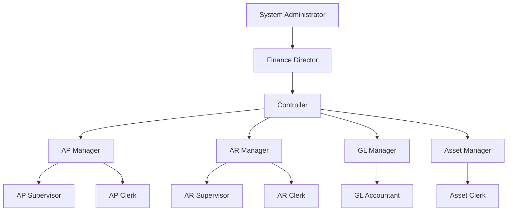

# Carmen.NET Permission Matrix

**Document Version**: 1.0
**Last Updated**: 2025-10-06
**Status**: Phase 5 - Business Analyst Documentation

---

## Overview

This document defines the **Role-Based Access Control (RBAC)** permission structure for Carmen.NET ERP system. The permission matrix maps user roles to specific permissions across all 11 modules.

**Permission Format**: `{Module}.{Entity}.{Action}`

**Example**: `AP.Invoice.Approve` = Accounts Payable → Invoice → Approve action

---

## Permission Categories

### Action Types

| Action | Description | CRUD |
|--------|-------------|------|
| **View** | Read/view records | R |
| **Create** | Create new records | C |
| **Update** | Modify existing records | U |
| **Delete** | Delete records | D |
| **Approve** | Approve workflow items | - |
| **Reject** | Reject workflow items | - |
| **Post** | Post to GL | - |
| **Close** | Close periods | - |
| **Export** | Export data | - |
| **Import** | Import data | - |

### Module Codes

| Code | Module | Description |
|------|--------|-------------|
| **AP** | Accounts Payable | Vendor invoices and payments |
| **AR** | Accounts Receivable | Customer invoices and receipts |
| **GL** | General Ledger | Chart of accounts, journal entries |
| **ASSET** | Asset Management | Fixed assets lifecycle |
| **INCOME** | Income Module | Non-standard revenue |
| **TAX** | Tax Management | WHT, VAT calculations |
| **BANK** | Bank Management | Reconciliation, statements |
| **MASTER** | Master Data | Reference data |
| **CONFIG** | Configuration | System settings |
| **INCOMETAX** | Income Tax | Income tax calculations |
| **ACCOUNT** | Account Management | User administration |

---

## Standard User Roles

### Role Hierarchy



### Role Descriptions

| Role | Description | Responsibilities |
|------|-------------|------------------|
| **System Administrator** | Full system access | System configuration, user management |
| **Finance Director** | Executive oversight | All modules, approve high-value transactions |
| **Controller** | Financial controller | Month-end close, GL postings, approvals |
| **AP Manager** | AP department head | AP operations, high-value approvals |
| **AP Supervisor** | AP team lead | Medium-value approvals, workflow management |
| **AP Clerk** | AP data entry | Invoice entry, payment processing |
| **AR Manager** | AR department head | AR operations, credit management |
| **AR Supervisor** | AR team lead | Invoice generation, receipt processing |
| **AR Clerk** | AR data entry | Invoice entry, receipt entry |
| **GL Manager** | GL department head | GL operations, period close |
| **GL Accountant** | GL data entry | Journal entries, reconciliations |
| **Asset Manager** | Asset department head | Asset acquisitions, disposals |
| **Asset Clerk** | Asset data entry | Asset registration, depreciation |
| **Tax Officer** | Tax compliance | Tax calculations, filing |
| **Auditor** | Internal/external audit | Read-only access, reporting |

---

## Accounts Payable (AP) Permissions

### AP Module Permission Matrix

| Permission | SysAdmin | Finance Dir | Controller | AP Mgr | AP Sup | AP Clerk | Auditor |
|------------|----------|-------------|------------|--------|--------|----------|---------|
| **Vendor** | | | | | | | |
| AP.Vendor.View | ✅ | ✅ | ✅ | ✅ | ✅ | ✅ | ✅ |
| AP.Vendor.Create | ✅ | ✅ | ✅ | ✅ | ✅ | ✅ | ❌ |
| AP.Vendor.Update | ✅ | ✅ | ✅ | ✅ | ✅ | ✅ | ❌ |
| AP.Vendor.Delete | ✅ | ✅ | ✅ | ✅ | ❌ | ❌ | ❌ |
| AP.Vendor.Approve | ✅ | ✅ | ✅ | ✅ | ❌ | ❌ | ❌ |
| **Purchase Order** | | | | | | | |
| AP.PO.View | ✅ | ✅ | ✅ | ✅ | ✅ | ✅ | ✅ |
| AP.PO.Create | ✅ | ✅ | ✅ | ✅ | ✅ | ✅ | ❌ |
| AP.PO.Update | ✅ | ✅ | ✅ | ✅ | ✅ | ✅ | ❌ |
| AP.PO.Delete | ✅ | ✅ | ✅ | ✅ | ✅ | ❌ | ❌ |
| AP.PO.Approve | ✅ | ✅ | ✅ | ✅ | ✅ | ❌ | ❌ |
| **Receiving** | | | | | | | |
| AP.Receiving.View | ✅ | ✅ | ✅ | ✅ | ✅ | ✅ | ✅ |
| AP.Receiving.Create | ✅ | ✅ | ✅ | ✅ | ✅ | ✅ | ❌ |
| AP.Receiving.Update | ✅ | ✅ | ✅ | ✅ | ✅ | ✅ | ❌ |
| AP.Receiving.Delete | ✅ | ✅ | ✅ | ✅ | ❌ | ❌ | ❌ |
| **Invoice** | | | | | | | |
| AP.Invoice.View | ✅ | ✅ | ✅ | ✅ | ✅ | ✅ | ✅ |
| AP.Invoice.Create | ✅ | ✅ | ✅ | ✅ | ✅ | ✅ | ❌ |
| AP.Invoice.Update | ✅ | ✅ | ✅ | ✅ | ✅ | ✅ | ❌ |
| AP.Invoice.Delete | ✅ | ✅ | ✅ | ✅ | ✅ | ❌ | ❌ |
| AP.Invoice.Approve | ✅ | ✅ | ✅ | ✅ | ✅ | ❌ | ❌ |
| AP.Invoice.Post | ✅ | ✅ | ✅ | ✅ | ❌ | ❌ | ❌ |
| **Payment** | | | | | | | |
| AP.Payment.View | ✅ | ✅ | ✅ | ✅ | ✅ | ✅ | ✅ |
| AP.Payment.Create | ✅ | ✅ | ✅ | ✅ | ✅ | ✅ | ❌ |
| AP.Payment.Update | ✅ | ✅ | ✅ | ✅ | ✅ | ✅ | ❌ |
| AP.Payment.Delete | ✅ | ✅ | ✅ | ✅ | ❌ | ❌ | ❌ |
| AP.Payment.Approve | ✅ | ✅ | ✅ | ✅ | ✅ | ❌ | ❌ |
| AP.Payment.Post | ✅ | ✅ | ✅ | ✅ | ❌ | ❌ | ❌ |
| **WHT** | | | | | | | |
| AP.WHT.View | ✅ | ✅ | ✅ | ✅ | ✅ | ✅ | ✅ |
| AP.WHT.Create | ✅ | ✅ | ✅ | ✅ | ✅ | ✅ | ❌ |
| AP.WHT.Update | ✅ | ✅ | ✅ | ✅ | ✅ | ✅ | ❌ |
| AP.WHT.Export | ✅ | ✅ | ✅ | ✅ | ✅ | ❌ | ✅ |

**Total AP Permissions**: 30

---

## Accounts Receivable (AR) Permissions

### AR Module Permission Matrix

| Permission | SysAdmin | Finance Dir | Controller | AR Mgr | AR Sup | AR Clerk | Auditor |
|------------|----------|-------------|------------|--------|--------|----------|---------|
| **Customer** | | | | | | | |
| AR.Customer.View | ✅ | ✅ | ✅ | ✅ | ✅ | ✅ | ✅ |
| AR.Customer.Create | ✅ | ✅ | ✅ | ✅ | ✅ | ✅ | ❌ |
| AR.Customer.Update | ✅ | ✅ | ✅ | ✅ | ✅ | ✅ | ❌ |
| AR.Customer.Delete | ✅ | ✅ | ✅ | ✅ | ❌ | ❌ | ❌ |
| AR.Customer.Approve | ✅ | ✅ | ✅ | ✅ | ❌ | ❌ | ❌ |
| **Contract** | | | | | | | |
| AR.Contract.View | ✅ | ✅ | ✅ | ✅ | ✅ | ✅ | ✅ |
| AR.Contract.Create | ✅ | ✅ | ✅ | ✅ | ✅ | ✅ | ❌ |
| AR.Contract.Update | ✅ | ✅ | ✅ | ✅ | ✅ | ✅ | ❌ |
| AR.Contract.Delete | ✅ | ✅ | ✅ | ✅ | ❌ | ❌ | ❌ |
| AR.Contract.Approve | ✅ | ✅ | ✅ | ✅ | ✅ | ❌ | ❌ |
| **Invoice** | | | | | | | |
| AR.Invoice.View | ✅ | ✅ | ✅ | ✅ | ✅ | ✅ | ✅ |
| AR.Invoice.Create | ✅ | ✅ | ✅ | ✅ | ✅ | ✅ | ❌ |
| AR.Invoice.Update | ✅ | ✅ | ✅ | ✅ | ✅ | ✅ | ❌ |
| AR.Invoice.Delete | ✅ | ✅ | ✅ | ✅ | ✅ | ❌ | ❌ |
| AR.Invoice.Approve | ✅ | ✅ | ✅ | ✅ | ✅ | ❌ | ❌ |
| AR.Invoice.Post | ✅ | ✅ | ✅ | ✅ | ❌ | ❌ | ❌ |
| **Receipt** | | | | | | | |
| AR.Receipt.View | ✅ | ✅ | ✅ | ✅ | ✅ | ✅ | ✅ |
| AR.Receipt.Create | ✅ | ✅ | ✅ | ✅ | ✅ | ✅ | ❌ |
| AR.Receipt.Update | ✅ | ✅ | ✅ | ✅ | ✅ | ✅ | ❌ |
| AR.Receipt.Delete | ✅ | ✅ | ✅ | ✅ | ❌ | ❌ | ❌ |
| AR.Receipt.Approve | ✅ | ✅ | ✅ | ✅ | ✅ | ❌ | ❌ |
| AR.Receipt.Post | ✅ | ✅ | ✅ | ✅ | ❌ | ❌ | ❌ |
| **Credit Note** | | | | | | | |
| AR.CreditNote.View | ✅ | ✅ | ✅ | ✅ | ✅ | ✅ | ✅ |
| AR.CreditNote.Create | ✅ | ✅ | ✅ | ✅ | ✅ | ❌ | ❌ |
| AR.CreditNote.Update | ✅ | ✅ | ✅ | ✅ | ✅ | ❌ | ❌ |
| AR.CreditNote.Approve | ✅ | ✅ | ✅ | ✅ | ❌ | ❌ | ❌ |
| AR.CreditNote.Post | ✅ | ✅ | ✅ | ✅ | ❌ | ❌ | ❌ |

**Total AR Permissions**: 27

---

## General Ledger (GL) Permissions

### GL Module Permission Matrix

| Permission | SysAdmin | Finance Dir | Controller | GL Mgr | GL Acct | Auditor |
|------------|----------|-------------|------------|--------|---------|---------|
| **Chart of Accounts** | | | | | | |
| GL.Account.View | ✅ | ✅ | ✅ | ✅ | ✅ | ✅ |
| GL.Account.Create | ✅ | ✅ | ✅ | ✅ | ❌ | ❌ |
| GL.Account.Update | ✅ | ✅ | ✅ | ✅ | ❌ | ❌ |
| GL.Account.Delete | ✅ | ✅ | ✅ | ❌ | ❌ | ❌ |
| **Journal Voucher** | | | | | | |
| GL.JV.View | ✅ | ✅ | ✅ | ✅ | ✅ | ✅ |
| GL.JV.Create | ✅ | ✅ | ✅ | ✅ | ✅ | ❌ |
| GL.JV.Update | ✅ | ✅ | ✅ | ✅ | ✅ | ❌ |
| GL.JV.Delete | ✅ | ✅ | ✅ | ✅ | ❌ | ❌ |
| GL.JV.Approve | ✅ | ✅ | ✅ | ✅ | ❌ | ❌ |
| GL.JV.Post | ✅ | ✅ | ✅ | ✅ | ❌ | ❌ |
| **Period** | | | | | | |
| GL.Period.View | ✅ | ✅ | ✅ | ✅ | ✅ | ✅ |
| GL.Period.Create | ✅ | ✅ | ✅ | ❌ | ❌ | ❌ |
| GL.Period.Update | ✅ | ✅ | ✅ | ❌ | ❌ | ❌ |
| GL.Period.Close | ✅ | ✅ | ✅ | ❌ | ❌ | ❌ |
| GL.Period.Reopen | ✅ | ✅ | ✅ | ❌ | ❌ | ❌ |
| **Allocation JV** | | | | | | |
| GL.AllocationJV.View | ✅ | ✅ | ✅ | ✅ | ✅ | ✅ |
| GL.AllocationJV.Create | ✅ | ✅ | ✅ | ✅ | ❌ | ❌ |
| GL.AllocationJV.Update | ✅ | ✅ | ✅ | ✅ | ❌ | ❌ |
| GL.AllocationJV.Post | ✅ | ✅ | ✅ | ✅ | ❌ | ❌ |
| **Reports** | | | | | | |
| GL.Report.View | ✅ | ✅ | ✅ | ✅ | ✅ | ✅ |
| GL.Report.Export | ✅ | ✅ | ✅ | ✅ | ✅ | ✅ |

**Total GL Permissions**: 21

---

## Asset Management Permissions

### Asset Module Permission Matrix

| Permission | SysAdmin | Finance Dir | Controller | Asset Mgr | Asset Clerk | Auditor |
|------------|----------|-------------|------------|-----------|-------------|---------|
| **Asset Register** | | | | | | |
| ASSET.Register.View | ✅ | ✅ | ✅ | ✅ | ✅ | ✅ |
| ASSET.Register.Create | ✅ | ✅ | ✅ | ✅ | ✅ | ❌ |
| ASSET.Register.Update | ✅ | ✅ | ✅ | ✅ | ✅ | ❌ |
| ASSET.Register.Delete | ✅ | ✅ | ✅ | ✅ | ❌ | ❌ |
| ASSET.Register.Approve | ✅ | ✅ | ✅ | ✅ | ❌ | ❌ |
| **Disposal** | | | | | | |
| ASSET.Disposal.View | ✅ | ✅ | ✅ | ✅ | ✅ | ✅ |
| ASSET.Disposal.Create | ✅ | ✅ | ✅ | ✅ | ✅ | ❌ |
| ASSET.Disposal.Update | ✅ | ✅ | ✅ | ✅ | ✅ | ❌ |
| ASSET.Disposal.Approve | ✅ | ✅ | ✅ | ✅ | ❌ | ❌ |
| ASSET.Disposal.Post | ✅ | ✅ | ✅ | ✅ | ❌ | ❌ |
| **Depreciation** | | | | | | |
| ASSET.Depreciation.View | ✅ | ✅ | ✅ | ✅ | ✅ | ✅ |
| ASSET.Depreciation.Calculate | ✅ | ✅ | ✅ | ✅ | ❌ | ❌ |
| ASSET.Depreciation.Post | ✅ | ✅ | ✅ | ✅ | ❌ | ❌ |
| **Category** | | | | | | |
| ASSET.Category.View | ✅ | ✅ | ✅ | ✅ | ✅ | ✅ |
| ASSET.Category.Create | ✅ | ✅ | ✅ | ✅ | ❌ | ❌ |
| ASSET.Category.Update | ✅ | ✅ | ✅ | ✅ | ❌ | ❌ |

**Total Asset Permissions**: 16

---

## System Administration Permissions

### Admin Module Permission Matrix

| Permission | SysAdmin | Finance Dir | Controller |
|------------|----------|-------------|------------|
| **User Management** | | | |
| ACCOUNT.User.View | ✅ | ✅ | ✅ |
| ACCOUNT.User.Create | ✅ | ✅ | ❌ |
| ACCOUNT.User.Update | ✅ | ✅ | ❌ |
| ACCOUNT.User.Delete | ✅ | ❌ | ❌ |
| ACCOUNT.User.ResetPassword | ✅ | ✅ | ❌ |
| **Role Management** | | | |
| ACCOUNT.Role.View | ✅ | ✅ | ✅ |
| ACCOUNT.Role.Create | ✅ | ❌ | ❌ |
| ACCOUNT.Role.Update | ✅ | ❌ | ❌ |
| ACCOUNT.Role.Delete | ✅ | ❌ | ❌ |
| **Tenant Management** | | | |
| ACCOUNT.Tenant.View | ✅ | ❌ | ❌ |
| ACCOUNT.Tenant.Create | ✅ | ❌ | ❌ |
| ACCOUNT.Tenant.Update | ✅ | ❌ | ❌ |
| **System Configuration** | | | |
| CONFIG.System.View | ✅ | ✅ | ✅ |
| CONFIG.System.Update | ✅ | ❌ | ❌ |
| **Master Data** | | | |
| MASTER.Department.View | ✅ | ✅ | ✅ |
| MASTER.Department.Create | ✅ | ✅ | ✅ |
| MASTER.Department.Update | ✅ | ✅ | ✅ |
| MASTER.Project.View | ✅ | ✅ | ✅ |
| MASTER.Project.Create | ✅ | ✅ | ✅ |
| MASTER.Project.Update | ✅ | ✅ | ✅ |

**Total Admin Permissions**: 20

---

## Permission Summary by Role

### System Administrator
- **Total Permissions**: 120+ (all permissions)
- **Modules**: All modules (full access)
- **Special**: User management, system configuration, tenant management
- **Restrictions**: None

### Finance Director
- **Total Permissions**: 100+
- **Modules**: All financial modules (AP, AR, GL, Asset, Income, Tax)
- **Special**: High-value approvals, period close, financial reporting
- **Restrictions**: Cannot create/delete tenants, limited system configuration

### Controller
- **Total Permissions**: 80+
- **Modules**: AP, AR, GL, Asset (approve and post)
- **Special**: Period close, GL postings, month-end activities
- **Restrictions**: Cannot manage users/roles, limited master data changes

### AP Manager
- **Total Permissions**: 35+
- **Modules**: AP module (full CRUD + approve)
- **Special**: Invoice approval, payment approval, vendor management
- **Restrictions**: Cannot post to GL, limited access to other modules

### AP Supervisor
- **Total Permissions**: 30+
- **Modules**: AP module (CRUD + limited approve)
- **Special**: Medium-value approvals, workflow management
- **Restrictions**: Cannot post to GL, cannot approve high-value items

### AP Clerk
- **Total Permissions**: 20+
- **Modules**: AP module (CRUD only)
- **Special**: Data entry, document preparation
- **Restrictions**: Cannot approve, cannot post, cannot delete

### AR Manager
- **Total Permissions**: 32+
- **Modules**: AR module (full CRUD + approve)
- **Special**: Invoice approval, credit management, customer setup
- **Restrictions**: Cannot post to GL, limited access to other modules

### AR Supervisor
- **Total Permissions**: 27+
- **Modules**: AR module (CRUD + limited approve)
- **Special**: Invoice generation, receipt processing
- **Restrictions**: Cannot post to GL, limited approval authority

### AR Clerk
- **Total Permissions**: 18+
- **Modules**: AR module (CRUD only)
- **Special**: Data entry, receipt processing
- **Restrictions**: Cannot approve, cannot post, cannot delete

### GL Manager
- **Total Permissions**: 25+
- **Modules**: GL module (full access)
- **Special**: Period close, JV approval, account management
- **Restrictions**: Cannot modify chart of accounts structure

### GL Accountant
- **Total Permissions**: 15+
- **Modules**: GL module (CRUD only)
- **Special**: Journal entry, reconciliations
- **Restrictions**: Cannot approve, cannot post, cannot close periods

### Asset Manager
- **Total Permissions**: 18+
- **Modules**: Asset module (full access)
- **Special**: Asset approval, disposal approval, depreciation
- **Restrictions**: Cannot post depreciation to GL

### Asset Clerk
- **Total Permissions**: 12+
- **Modules**: Asset module (CRUD only)
- **Special**: Asset registration, data maintenance
- **Restrictions**: Cannot approve, cannot calculate depreciation

### Tax Officer
- **Total Permissions**: 15+
- **Modules**: Tax module (full access)
- **Special**: Tax calculations, WHT/VAT filing
- **Restrictions**: Read-only in other modules

### Auditor
- **Total Permissions**: 40+ (read-only)
- **Modules**: All modules (view and export only)
- **Special**: Full reporting access, export capabilities
- **Restrictions**: No create/update/delete/approve/post permissions

---

## Approval Workflows by Amount

### AP Invoice Approval Hierarchy

| Amount Range | Approver Level | Role | Required |
|--------------|----------------|------|----------|
| $0 - $1,000 | Level 1 | AP Supervisor | Optional |
| $1,001 - $10,000 | Level 1 | AP Manager | Required |
| $10,001 - $50,000 | Level 2 | Controller | Required |
| $50,001 - $250,000 | Level 3 | Finance Director | Required |
| $250,001+ | Level 4 | CEO + Finance Director | Required (both) |

### AR Invoice Approval Hierarchy

| Amount Range | Approver Level | Role | Required |
|--------------|----------------|------|----------|
| $0 - $5,000 | Level 1 | AR Supervisor | Optional |
| $5,001 - $25,000 | Level 1 | AR Manager | Required |
| $25,001 - $100,000 | Level 2 | Controller | Required |
| $100,001+ | Level 3 | Finance Director | Required |

### Payment Approval Hierarchy

| Amount Range | Approver Level | Role | Required |
|--------------|----------------|------|----------|
| $0 - $5,000 | Level 1 | AP Supervisor | Required |
| $5,001 - $25,000 | Level 2 | AP Manager | Required |
| $25,001 - $100,000 | Level 3 | Controller | Required |
| $100,001+ | Level 4 | Finance Director | Required |

---

## Permission Implementation

### JWT Token Claims

**Token Structure**:
```json
{
  "sub": "user123",
  "email": "user@tenant.com",
  "tenantCode": "TENANT001",
  "roles": ["AP.Manager"],
  "permissions": [
    "AP.Invoice.View",
    "AP.Invoice.Create",
    "AP.Invoice.Update",
    "AP.Invoice.Approve",
    "AP.Payment.View",
    "AP.Payment.Create"
  ],
  "exp": 1735689600
}
```

### Authorization Filter

**Implementation**:
```csharp
[Authorize]
[Permission("AP.Invoice.Approve")]
public async Task<IActionResult> ApproveInvoice(int id)
{
    // Permission checked automatically via filter
    // User must have "AP.Invoice.Approve" in token
}
```

### Permission Checking

**Service Layer**:
```csharp
public class PermissionService
{
    public bool HasPermission(string permission)
    {
        var userPermissions = _tokenService.GetPermissions();
        return userPermissions.Contains(permission);
    }

    public bool HasAnyPermission(params string[] permissions)
    {
        var userPermissions = _tokenService.GetPermissions();
        return permissions.Any(p => userPermissions.Contains(p));
    }

    public bool HasAllPermissions(params string[] permissions)
    {
        var userPermissions = _tokenService.GetPermissions();
        return permissions.All(p => userPermissions.Contains(p));
    }
}
```

---

## Security Best Practices

### Principle of Least Privilege
- ✅ Grant minimum permissions required for job function
- ✅ Review permissions quarterly
- ✅ Remove permissions when role changes
- ✅ Audit high-privilege accounts monthly

### Segregation of Duties
- ✅ Separate create and approve permissions
- ✅ Separate approve and post permissions
- ✅ Separate data entry and reconciliation
- ✅ Prevent same user from initiating and approving

### Permission Auditing
- ✅ Log all permission checks
- ✅ Alert on failed authorization attempts
- ✅ Review high-privilege activity
- ✅ Quarterly permission reviews

### Role Management
- ✅ Use role templates for consistency
- ✅ Document role definitions
- ✅ Limit custom permissions
- ✅ Review roles quarterly

---

## Appendix: Complete Permission List

### Accounts Payable (30 permissions)
```
AP.Vendor.View, Create, Update, Delete, Approve
AP.PO.View, Create, Update, Delete, Approve
AP.Receiving.View, Create, Update, Delete
AP.Invoice.View, Create, Update, Delete, Approve, Post
AP.Payment.View, Create, Update, Delete, Approve, Post
AP.WHT.View, Create, Update, Export
```

### Accounts Receivable (27 permissions)
```
AR.Customer.View, Create, Update, Delete, Approve
AR.Contract.View, Create, Update, Delete, Approve
AR.Invoice.View, Create, Update, Delete, Approve, Post
AR.Receipt.View, Create, Update, Delete, Approve, Post
AR.CreditNote.View, Create, Update, Approve, Post
```

### General Ledger (21 permissions)
```
GL.Account.View, Create, Update, Delete
GL.JV.View, Create, Update, Delete, Approve, Post
GL.Period.View, Create, Update, Close, Reopen
GL.AllocationJV.View, Create, Update, Post
GL.Report.View, Export
```

### Asset Management (16 permissions)
```
ASSET.Register.View, Create, Update, Delete, Approve
ASSET.Disposal.View, Create, Update, Approve, Post
ASSET.Depreciation.View, Calculate, Post
ASSET.Category.View, Create, Update
```

### System Administration (20 permissions)
```
ACCOUNT.User.View, Create, Update, Delete, ResetPassword
ACCOUNT.Role.View, Create, Update, Delete
ACCOUNT.Tenant.View, Create, Update
CONFIG.System.View, Update
MASTER.Department.View, Create, Update
MASTER.Project.View, Create, Update
```

**Total Unique Permissions**: 114

---

**Document Owner**: Business Analyst + Security Team
**Review Cycle**: Quarterly
**Last Updated**: 2025-10-06
**Next Review**: 2026-01-06
