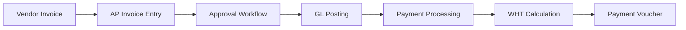
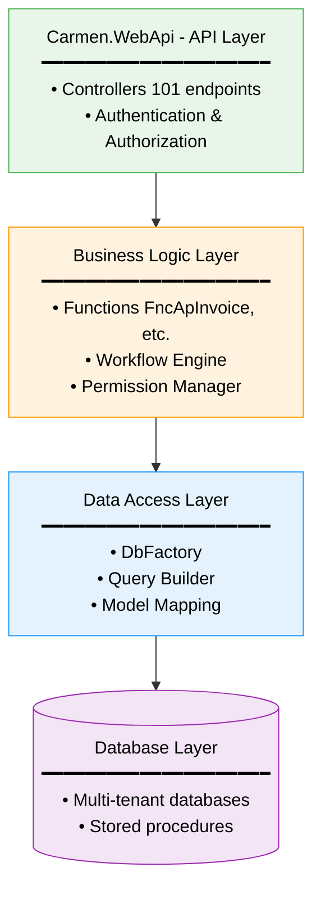
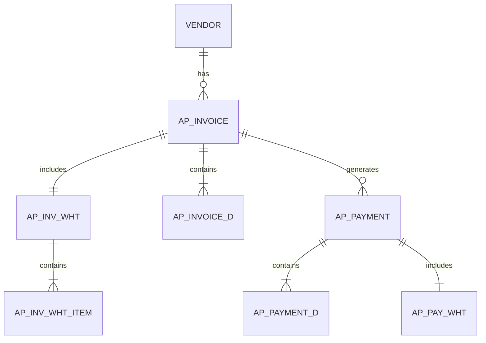
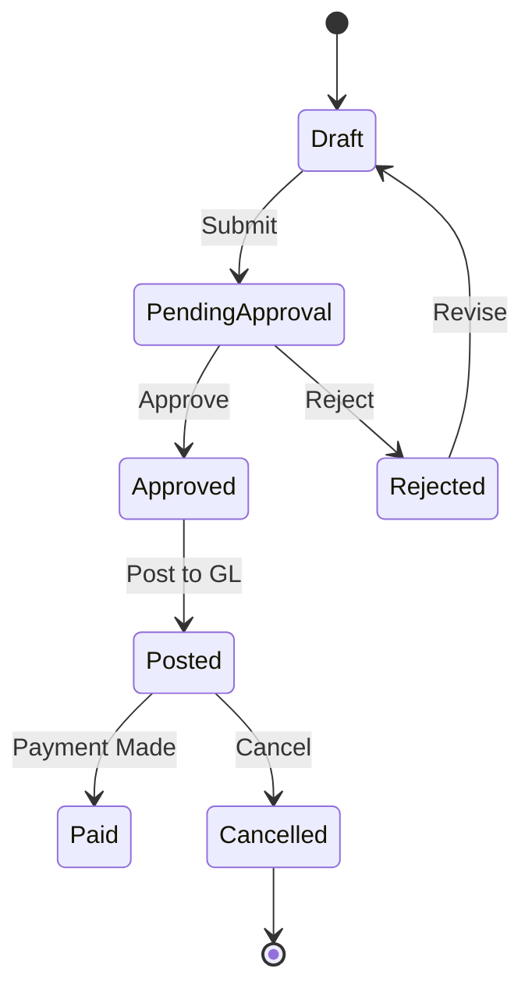
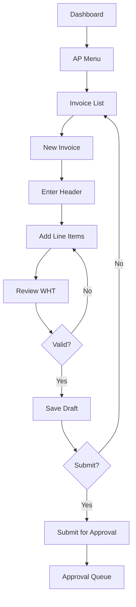

# Carmen.NET Reverse Engineering Documentation Guide

## Overview

This guide outlines best practices for documenting the Carmen.NET ERP system for different stakeholder groups during reverse engineering efforts.

---

## Documentation Strategy by Audience

### 1. **Stakeholders (Business Executives & Decision Makers)**

**Purpose**: Strategic understanding, ROI justification, risk assessment

#### Required Documents:

**1.1 Executive Summary** (`executive-summary.md`)
- **System Purpose**: What the system does (1-2 paragraphs)
- **Business Value**: Key capabilities and benefits
- **Module Overview**: High-level module list with business functions
- **Technology Stack**: Platform overview (non-technical)
- **Key Metrics**:
  - Number of modules
  - Transaction types supported
  - User roles/permissions
  - Integration capabilities
- **Risk Assessment**: Technical debt, dependencies, maintenance needs
- **Modernization Roadmap**: High-level upgrade path

**Format**:
- Visual diagrams (module relationships)
- Bullet points and tables
- Non-technical language
- **Length**: 3-5 pages

**Example Structure**:
```markdown
## Executive Summary
Carmen.NET is a multi-tenant financial ERP managing:
- 11 core business modules
- 78+ functional areas
- 600+ business entities
- Multi-currency, multi-company operations

## Business Capabilities
✓ Accounts Payable/Receivable
✓ General Ledger & Financial Reporting
✓ Fixed Asset Management
✓ Tax Compliance (VAT/WHT)
✓ Multi-tenant SaaS Architecture

## Strategic Considerations
- Built on .NET Framework (legacy platform)
- 101 API endpoints (well-structured)
- Role-based security (enterprise-ready)
- Recommended: Modernization to .NET 8+
```

---

**1.2 Business Process Flows** (`business-processes.md`)
- **Purpose**: Show how business operations flow through the system
- **Content**:
  - AP Invoice-to-Payment workflow
  - AR Invoice-to-Cash workflow
  - Asset lifecycle management
  - Period-end closing process
  - Tax filing workflows
- **Format**: Flowcharts, swim-lane diagrams
- **Tools**: Mermaid diagrams, Visio, Lucidchart

**Example**:


---

**1.3 ROI & Cost-Benefit Analysis** (`roi-analysis.md`)
- **Current State**: Maintenance costs, technical debt
- **Future State**: Modernization benefits
- **Migration Effort**: Time and resource estimates
- **Risk Mitigation**: Phased approach recommendations

---

### 2. **Solution Architects (SA)**

**Purpose**: System architecture, integration patterns, technical decisions

#### Required Documents:

**2.1 System Architecture Document** (`architecture/system-architecture.md`)
- **High-Level Architecture**:
  - 3-tier architecture diagram
  - API layer (ASP.NET Web API)
  - Business logic layer (Functions)
  - Data access layer (EF/ADO.NET)
  - Database schema overview
- **Technology Stack**:
  - .NET Framework version
  - Database (SQL Server/Oracle/MySQL)
  - Authentication (OAuth/JWT tokens)
  - Swagger/NSwag for API docs
- **Deployment Architecture**:
  - Web server requirements
  - Database server specs
  - Load balancing strategy
  - Multi-tenant isolation mechanism
- **Integration Architecture**:
  - File-based integration
  - Database integration
  - Web API integration
  - Banking interfaces

**Example**:
```markdown
## Architecture Overview

### Layered Architecture


```

### Key Architectural Patterns
- **Multi-tenancy**: Tenant isolation via connection string switching
- **Repository Pattern**: DbFactory abstraction
- **DTO Pattern**: Param* models for requests, View* for responses
- **Interface Segregation**: 325 interface definitions
```

---

**2.2 Data Architecture Document** (`architecture/data-architecture.md`)
- **Entity Relationship Diagrams** (ERD):
  - Core modules: AP, AR, GL, Asset
  - Master data relationships
  - Transaction data flows
- **Database Schema**:
  - Table structures (inferred from models)
  - Primary/foreign key relationships
  - Index recommendations
- **Data Model Patterns**:
  - Header-Detail pattern (InvH/InvD)
  - Audit trail pattern
  - Dimension allocation pattern
- **Data Volume Estimates**:
  - Transaction table sizes
  - Archive/purge strategies

**Example**:
```markdown
## AP Module ERD


```

---

**2.3 Integration Architecture** (`architecture/integration-architecture.md`)
- **Integration Patterns**:
  - REST API specifications
  - File import/export formats (CSV, Excel)
  - Database-to-database sync
  - Banking file formats
- **API Contract Documentation**:
  - Endpoint catalog
  - Request/response schemas
  - Authentication flows
  - Rate limiting/throttling
- **External System Interfaces**:
  - Payment gateways
  - Bank reconciliation systems
  - Tax authority portals
  - Third-party accounting systems

---

**2.4 Security Architecture** (`architecture/security-architecture.md`)
- **Authentication Mechanisms**:
  - Login flow analysis
  - Token-based authentication (JWT)
  - Session management
- **Authorization Model**:
  - Role-based access control (RBAC)
  - Permission matrix by module
  - Data-level security (tenant isolation)
- **Security Controls**:
  - Input validation patterns
  - SQL injection prevention
  - XSS protection
  - Encryption (Carmen.Crypto usage)
- **Compliance Requirements**:
  - Audit logging (`EnumLogAction`)
  - Data retention policies
  - GDPR/privacy considerations

---

**2.5 Non-Functional Requirements** (`architecture/nfr-requirements.md`)
- **Performance Requirements**:
  - Response time targets
  - Concurrent user capacity
  - Database query optimization needs
- **Scalability Requirements**:
  - Horizontal vs vertical scaling
  - Multi-tenant scaling strategy
- **Availability & Reliability**:
  - Uptime SLAs
  - Disaster recovery
  - Backup strategies
- **Maintainability**:
  - Code quality metrics
  - Technical debt assessment
  - Refactoring priorities

---

### 3. **Business Analysts (BA)**

**Purpose**: Business rules, workflows, functional specifications

#### Required Documents:

**3.1 Functional Requirements Document** (`requirements/functional-requirements.md`)
- **Module-by-Module Breakdown**:
  - AP Module: Invoice processing, payment workflows, WHT calculation
  - AR Module: Billing, receipts, collections
  - GL Module: Journal entries, period management, allocations
  - Asset Module: Registration, depreciation, disposal
  - Income Module: Revenue recognition
- **Business Rules**:
  - Tax calculation rules
  - Approval workflows
  - Validation rules
  - Period-end closing rules
- **User Stories** (reverse-engineered):
  - "As an AP clerk, I can enter vendor invoices with WHT..."
  - "As a finance manager, I can approve invoices over $10,000..."

**Example**:
```markdown
## AP Invoice Processing

### Business Rules
1. **Invoice Entry**
   - Must have valid vendor code
   - Invoice date cannot be future-dated
   - Must select tax type (VAT/Non-VAT)
   - Multi-currency invoices require exchange rate

2. **WHT Calculation**
   - Auto-calculate based on WHT condition rules
   - WHT type determines tax rate
   - Generate WHT certificate reference

3. **Approval Workflow**
   - Amount < $5,000: Auto-approve
   - Amount $5,000-$50,000: Department manager approval
   - Amount > $50,000: Finance director approval

4. **GL Posting**
   - Post to expense account (Dr)
   - Post to vendor payable (Cr)
   - Post WHT payable (Cr)
   - Dimension allocation required for cost centers
```

---

**3.2 Workflow Documentation** (`workflows/`)
- **Process Flows**:
  - `workflows/ap-invoice-workflow.md`
  - `workflows/ar-billing-workflow.md`
  - `workflows/period-close-workflow.md`
  - `workflows/asset-disposal-workflow.md`
- **Approval Matrices**:
  - Who can approve what
  - Escalation rules
  - Delegation rules
- **State Transitions**:
  - Status flow diagrams
  - Valid status transitions
  - Reversal/cancellation logic

**Example**:
```markdown
## AP Invoice Status Workflow



### Status Transitions
| From Status | To Status | Trigger | Permission |
|-------------|-----------|---------|------------|
| Draft | PendingApproval | User submits | AP.Invoice.Submit |
| PendingApproval | Approved | Manager approves | AP.Invoice.Approve |
| Approved | Posted | System posts | AP.Invoice.Post |
```

---

**3.3 Business Rules Catalog** (`business-rules/`)
- **Validation Rules**:
  - Field-level validations
  - Cross-field validations
  - Business logic constraints
- **Calculation Rules**:
  - Tax calculations
  - Depreciation formulas
  - Exchange rate application
  - Allocation formulas
- **Configuration Rules**:
  - Period status rules
  - Document numbering rules
  - Multi-company rules

---

**3.4 User Role & Permission Matrix** (`requirements/permission-matrix.md`)
- **Role Definitions**:
  - AP Clerk, AP Manager, Finance Director
  - AR Clerk, Collections Manager
  - Accountant, Senior Accountant, Controller
- **Permission Mapping**:
  - Module access rights
  - CRUD permissions by role
  - Special function permissions (approve, post, close period)
- **Data Access Rules**:
  - Department-level access
  - Company-level access
  - Tenant-level access

**Example**:
```markdown
## Permission Matrix

| Role | Module | View | Create | Edit | Delete | Approve | Post |
|------|--------|------|--------|------|--------|---------|------|
| AP Clerk | AP.Invoice | ✓ | ✓ | ✓ | ✗ | ✗ | ✗ |
| AP Manager | AP.Invoice | ✓ | ✓ | ✓ | ✓ | ✓ | ✗ |
| Accountant | AP.Invoice | ✓ | ✗ | ✗ | ✗ | ✗ | ✓ |
| Finance Director | AP.Invoice | ✓ | ✓ | ✓ | ✓ | ✓ | ✓ |
```

---

**3.5 Data Dictionary** (`requirements/data-dictionary.md`)
- **Field Definitions**:
  - Field name, type, length
  - Business meaning
  - Valid values/ranges
  - Required vs optional
- **Code Tables**:
  - Lookup values
  - Enumeration mappings
  - Status codes

**Example**:
```markdown
## AP Invoice Fields

| Field | Type | Length | Required | Description |
|-------|------|--------|----------|-------------|
| VnCode | string | 20 | Yes | Vendor code (FK to Vendor master) |
| InvhDate | DateTime | - | Yes | Invoice transaction date |
| InvhInvNo | string | 50 | Yes | Vendor invoice number |
| InvhDueDate | DateTime | - | Yes | Payment due date |
| InvhCredit | int | - | Yes | Credit term days (0-365) |
| CurCode | string | 3 | Yes | Currency code (ISO 4217) |
| CurRate | decimal | 18,6 | Yes | Exchange rate (base currency = 1) |
| InvhTaxT1 | EnumTaxType | - | Yes | Tax type: VAT, NonVAT, Exempt |
```

---

### 4. **Senior Developers**

**Purpose**: Code structure, patterns, technical implementation, APIs

#### Required Documents:

**4.1 Code Structure Guide** (`development/code-structure.md`)
- **Project Organization**:
  - Solution structure (11 projects)
  - Folder hierarchy
  - Naming conventions
  - File organization patterns
- **Dependency Map**:
  - Project references
  - NuGet packages
  - External libraries
- **Build & Deployment**:
  - Build configuration
  - Environment-specific settings
  - Deployment checklist

**Example**:
```markdown
## Solution Structure

### Projects
1. **Carmen.Models** - Data models and entities
2. **Carmen.Enum** - Business enumerations
3. **Carmen.Utils** - Utility libraries
4. **Carmen.Query** - Query builder and helpers
5. **Carmen.WebApi** - REST API controllers
6. **Carmen.Crypto** - Encryption services
7. **Carmen.LicenseApi** - License validation
8. **Carmen.Api.Client** - Generated API client
9. **Carmen.Models.Interface** - Interface definitions
10. **Carmen.Models.InterfaceList** - Interface list models
11. **Carmen.Models.Version** - Versioning support

### Key Dependencies
- Newtonsoft.Json - JSON serialization
- Swashbuckle - Swagger/OpenAPI
- NSwag - API client generation
- Entity Framework (inferred)

### Naming Conventions
- Controllers: `[Entity]Controller.cs`
- Models: `[Entity].cs`
- Detail models: `[Entity]D.cs`
- View models: `View[Entity].cs`
- Parameters: `Param[Entity].cs`
- Interfaces: `I[Entity].cs`
```

---

**4.2 API Reference Documentation** (`api/api-reference.md`)
- **Endpoint Catalog**:
  - Group by module (AP, AR, GL, etc.)
  - HTTP methods
  - Route patterns
  - Request/response schemas
- **Authentication**:
  - How to obtain tokens
  - Token refresh flow
  - Permission requirements
- **Error Handling**:
  - Error response format
  - HTTP status codes
  - Error code catalog
- **Rate Limiting & Throttling**:
  - Request limits
  - Retry strategies

**Example**:
```markdown
## AP Invoice API

### Search Invoices
```http
POST /api/apInvoice/search
Authorization: Bearer {token}
Content-Type: application/json
```

**Request Body**:
```json
{
  "page": 1,
  "pageSize": 20,
  "filters": [
    {
      "field": "VnCode",
      "operator": "eq",
      "value": "VN001"
    }
  ],
  "orderBy": "InvhDate desc"
}
```

**Response** (200 OK):
```json
{
  "data": [...],
  "total": 150,
  "page": 1,
  "pageSize": 20
}
```

**Permissions**: `AP.Invoice.View`
```

---

**4.3 Design Patterns & Best Practices** (`development/design-patterns.md`)
- **Identified Patterns**:
  - Repository pattern (DbFactory)
  - DTO pattern (Param*/View* models)
  - Factory pattern (DbFactory)
  - Strategy pattern (ConnectionProvider)
- **Code Conventions**:
  - Async/await usage
  - Exception handling patterns
  - Logging patterns
  - Transaction management
- **Anti-Patterns Found**:
  - Code smells
  - Technical debt areas
  - Refactoring opportunities

**Example**:
```markdown
## Common Patterns

### Controller Pattern
All controllers follow this structure:
1. Log request
2. Apply tenant context
3. Check permissions
4. Execute business logic
5. Return standardized response

### DTO Pattern
- **Request**: Use `Param*` models
- **Response**: Use `View*` models
- **Internal**: Use domain models

### Error Handling
```csharp
try {
    // Business logic
    return this.JsonResultOk(result);
} catch (Exception e) {
    LogHttpResult.Error(e);
    return this.JsonResultInternalError(e);
}
```

### Async Pattern
All I/O operations use `async`/`await`:
```csharp
public async Task<IHttpActionResult> GetList(...)
{
    var result = await FncApInvoice.GetListAsync(...);
    return this.JsonResultOk(result);
}
```
```

---

**4.4 Database Schema Documentation** (`database/schema-documentation.md`)
- **Table Structures**:
  - Inferred from model classes
  - Field types and constraints
  - Relationships (FK mappings)
- **Stored Procedures**:
  - Procedure catalog
  - Parameters and usage
  - Business logic embedded in DB
- **Views**:
  - Database views
  - View purposes
- **Indexing Strategy**:
  - Recommended indexes
  - Query optimization notes

**Example**:
```markdown
## AP_INVOICE Table

### Structure (inferred from ApInvoice model)
```sql
CREATE TABLE AP_INVOICE (
    VnCode NVARCHAR(20) NOT NULL,
    InvhDate DATETIME NOT NULL,
    InvhDesc NVARCHAR(500),
    InvhSource NVARCHAR(50),
    InvhInvNo NVARCHAR(50) NOT NULL,
    InvhInvDate DATETIME,
    InvhDueDate DATETIME,
    InvhCredit INT,
    InvhRef NVARCHAR(100),
    CurCode NVARCHAR(3) NOT NULL,
    CurRate DECIMAL(18,6) NOT NULL,
    InvhTaxT1 INT NOT NULL, -- EnumTaxType
    -- Additional fields...
    CONSTRAINT FK_AP_INVOICE_Vendor FOREIGN KEY (VnCode)
        REFERENCES VENDOR(VnCode)
)
```

### Relationships
- **Parent**: VENDOR (1:M)
- **Children**:
  - AP_INVOICE_D (detail lines)
  - AP_INV_WHT (withholding tax)

### Indexes Recommended
- IX_AP_INVOICE_VnCode
- IX_AP_INVOICE_InvhDate
- IX_AP_INVOICE_InvhInvNo
```

---

**4.5 Testing Guide** (`development/testing-guide.md`)
- **Test Structure**:
  - Existing test projects
  - Test coverage areas
  - Missing test coverage
- **Testing Patterns**:
  - Unit test examples
  - Integration test setup
  - API testing approach
- **Test Data**:
  - Test data setup
  - Mock data patterns
  - Database seeding

---

**4.6 Troubleshooting Guide** (`development/troubleshooting.md`)
- **Common Issues**:
  - Multi-tenant context issues
  - Permission errors
  - Database connection problems
- **Debug Techniques**:
  - Logging locations
  - Debug flags
  - Trace analysis
- **Performance Issues**:
  - Known bottlenecks
  - Query optimization
  - Caching strategies

---

### 5. **UI/UX Designers**

**Purpose**: User interface patterns, screen flows, user experience

#### Required Documents:

**5.1 UI Component Inventory** (`design/ui-components.md`)
- **Screen Catalog**:
  - List of all screens/views
  - Screen purpose
  - User roles who access
- **UI Patterns**:
  - List/grid views
  - Forms (create/edit)
  - Modal dialogs
  - Navigation patterns
- **Component Library**:
  - Buttons, inputs, dropdowns
  - Data grids/tables
  - Charts and visualizations
  - Widgets (dashboard)

**Example**:
```markdown
## AP Invoice Screen

### Screen Type: Master-Detail Form

#### Components
- **Header Section**:
  - Vendor lookup (dropdown with search)
  - Invoice date picker
  - Invoice number (text input)
  - Currency selector
  - Exchange rate (calculated field)

- **Detail Grid**:
  - Editable grid for line items
  - Columns: Account, Description, Amount, Tax
  - Add/remove row buttons
  - Sub-total calculations

- **WHT Section**:
  - WHT type selector
  - Auto-calculated WHT amount
  - WHT certificate number

- **Actions**:
  - Save draft
  - Submit for approval
  - Cancel
  - Print preview
```

---

**5.2 Screen Flow Diagrams** (`design/screen-flows.md`)
- **User Journeys**:
  - AP clerk invoice entry journey
  - Manager approval flow
  - Accountant posting flow
- **Navigation Maps**:
  - Menu structure
  - Breadcrumb trails
  - Screen transitions
- **Modal & Dialog Flows**:
  - Lookup dialogs
  - Confirmation dialogs
  - Error messages

**Example**:
```markdown
## AP Invoice Entry Flow


```

---

**5.3 Design System Documentation** (`design/design-system.md`)
- **Visual Design**:
  - Color palette (extracted from CSS/themes)
  - Typography
  - Spacing and layout grids
  - Icons and imagery
- **Interaction Patterns**:
  - Button states (hover, active, disabled)
  - Form validation feedback
  - Loading states
  - Success/error messages
- **Responsive Behavior**:
  - Breakpoints
  - Mobile adaptations
  - Tablet considerations

---

**5.4 Accessibility Documentation** (`design/accessibility.md`)
- **WCAG Compliance**:
  - Current accessibility level
  - Accessibility issues found
  - Remediation recommendations
- **Keyboard Navigation**:
  - Tab order
  - Keyboard shortcuts
  - Focus management
- **Screen Reader Support**:
  - ARIA labels
  - Alt text for images
  - Semantic HTML usage

---

**5.5 User Personas** (`design/user-personas.md`)
- **Role-Based Personas**:
  - AP Clerk: High-volume data entry, speed critical
  - Finance Manager: Approval focus, dashboard insights
  - Accountant: Accuracy focus, detailed reporting
- **Usage Patterns**:
  - Typical tasks per role
  - Frequency of use
  - Pain points (reverse-engineered from UI)

---

## Documentation Tooling Recommendations

### Diagramming Tools
- **Mermaid**: Inline diagrams in Markdown (flowcharts, ERD, sequence)
- **PlantUML**: UML diagrams (class, component, deployment)
- **Draw.io/Diagrams.net**: General purpose diagramming
- **Lucidchart**: Collaborative cloud-based diagrams

### API Documentation
- **Swagger UI**: Interactive API exploration (already in project)
- **Postman**: API testing and documentation
- **ReDoc**: Alternative Swagger renderer

### Code Documentation
- **DocFX**: .NET documentation generator
- **Doxygen**: Multi-language code documentation
- **Sandcastle**: .NET API reference docs

### Knowledge Base
- **Confluence**: Enterprise wiki
- **GitBook**: Developer-friendly documentation
- **MkDocs**: Static site from Markdown
- **Docusaurus**: Documentation website framework

---

## Documentation Process

### Phase 1: Discovery (Weeks 1-2)
1. **Inventory**: Catalog all controllers, models, enums
2. **Dependency Analysis**: Map project dependencies
3. **Database Reverse Engineering**: Generate ERD from models
4. **API Catalog**: Extract all endpoints from controllers

### Phase 2: Analysis (Weeks 3-4)
5. **Business Rule Extraction**: Analyze controller logic for rules
6. **Workflow Mapping**: Trace status transitions and approvals
7. **Security Analysis**: Document permission checks
8. **Integration Points**: Identify external interfaces

### Phase 3: Documentation (Weeks 5-8)
9. **Write Audience-Specific Docs**: Per templates above
10. **Create Diagrams**: Architecture, ERD, workflows
11. **Generate API Docs**: Enhance Swagger with examples
12. **Code Comments**: Add inline documentation

### Phase 4: Validation (Weeks 9-10)
13. **Stakeholder Review**: Validate business process docs
14. **Technical Review**: SA and dev team validation
15. **User Testing**: Validate UI flows with actual users
16. **Gap Analysis**: Identify undocumented areas

### Phase 5: Maintenance
17. **Version Control**: Keep docs in Git with code
18. **CI/CD Integration**: Auto-generate API docs
19. **Change Log**: Document system evolution
20. **Regular Updates**: Schedule quarterly reviews

---

## Documentation Templates

### Template Structure
```
docs/
├── executive/
│   ├── executive-summary.md
│   ├── business-processes.md
│   └── roi-analysis.md
├── architecture/
│   ├── system-architecture.md
│   ├── data-architecture.md
│   ├── integration-architecture.md
│   ├── security-architecture.md
│   └── nfr-requirements.md
├── requirements/
│   ├── functional-requirements.md
│   ├── permission-matrix.md
│   └── data-dictionary.md
├── workflows/
│   ├── ap-invoice-workflow.md
│   ├── ar-billing-workflow.md
│   └── period-close-workflow.md
├── business-rules/
│   ├── validation-rules.md
│   ├── calculation-rules.md
│   └── configuration-rules.md
├── api/
│   ├── api-reference.md
│   ├── authentication-guide.md
│   └── integration-guide.md
├── development/
│   ├── code-structure.md
│   ├── design-patterns.md
│   ├── testing-guide.md
│   └── troubleshooting.md
├── database/
│   ├── schema-documentation.md
│   ├── stored-procedures.md
│   └── data-migration.md
├── design/
│   ├── ui-components.md
│   ├── screen-flows.md
│   ├── design-system.md
│   ├── accessibility.md
│   └── user-personas.md
└── operations/
    ├── deployment-guide.md
    ├── monitoring-guide.md
    └── disaster-recovery.md
```

---

## Best Practices Summary

### For All Documentation:

1. **Version Control**: All docs in Git alongside code
2. **Markdown Format**: Easy to diff, review, and maintain
3. **Living Documents**: Update with code changes
4. **Searchable**: Use consistent terminology and tags
5. **Visual**: Use diagrams liberally (worth 1000 words)
6. **Examples**: Provide real code/data examples
7. **Cross-References**: Link related documents
8. **Change Log**: Track document evolution
9. **Review Cycle**: Regular validation with stakeholders
10. **Accessibility**: Ensure docs are accessible to all

### Documentation Anti-Patterns to Avoid:

❌ **Avoid**:
- Massive single-document dumps
- Out-of-sync code and docs
- Tribal knowledge (undocumented)
- Technical jargon for business docs
- Business speak for technical docs
- Stale screenshots
- Broken links
- No examples or context

✅ **Do**:
- Modular, audience-specific documents
- Automated doc generation where possible
- Clear ownership and maintenance
- Plain language for each audience
- Current, validated content
- Interactive diagrams
- Working examples
- Regular updates

---

## Success Metrics

### Documentation Quality Metrics:
- **Coverage**: % of code with documentation
- **Freshness**: Days since last update
- **Accuracy**: Validation pass rate
- **Usability**: Time to find information
- **Completeness**: Checklist completion rate

### Stakeholder Satisfaction:
- **Executives**: Can make strategic decisions
- **Architects**: Can design new features
- **BAs**: Can write new requirements
- **Developers**: Can modify/extend code
- **Designers**: Can create consistent UI

---

## Recommended Tools for Carmen.NET

### Reverse Engineering Tools:
1. **Visual Studio**: Code navigation and dependency graphs
2. **ReSharper**: Code analysis and architecture diagrams
3. **NDepend**: Code metrics and dependency analysis
4. **Entity Framework Power Tools**: Database schema reverse engineering
5. **Swagger Inspector**: API testing and documentation
6. **SQL Server Management Studio**: Database documentation
7. **Mermaid Live Editor**: Quick diagram creation
8. **Postman**: API collection and documentation

### Auto-Documentation:
- **DocFX**: Generate API reference from XML comments
- **Swagger/NSwag**: Already in use - enhance with examples
- **SchemaGenerator**: Database schema docs
- **PlantUML**: Architecture diagrams from text

---

## Next Steps for Carmen.NET

### Immediate Actions (Week 1):
1. ✅ **Complete**: System overview (done)
2. ✅ **Complete**: Module structure (done)
3. ⏳ **Todo**: Executive summary for stakeholders
4. ⏳ **Todo**: Architecture diagrams (system, data, integration)
5. ⏳ **Todo**: API reference enhancement

### Short-term (Weeks 2-4):
6. Business process flows (top 10 workflows)
7. Permission matrix extraction
8. Database ERD generation
9. Code structure guide
10. Developer onboarding guide

### Medium-term (Weeks 5-8):
11. Complete functional requirements per module
12. Security architecture documentation
13. UI component inventory
14. Testing guide and coverage analysis
15. Deployment and operations guide

### Long-term (Ongoing):
16. Maintain living documentation
17. Automated doc generation in CI/CD
18. Knowledge transfer sessions
19. Documentation review cycles
20. Continuous improvement

---

## Conclusion

Effective reverse engineering documentation requires:
- **Multi-audience approach**: Different docs for different roles
- **Layered detail**: High-level to deep technical
- **Visual communication**: Diagrams over walls of text
- **Practical examples**: Real code and data samples
- **Maintenance plan**: Keep docs current with code

This guide provides the framework - customize based on your specific needs and priorities.
