# Carmen.NET System Overview

## Executive Summary

**Carmen.NET** is a comprehensive accounting and financial ERP (Enterprise Resource Planning) system built with .NET/C# that provides enterprise-grade financial management capabilities including accounts payable/receivable, general ledger, asset management, and multi-tenant support.

---

## Core Modules

### 1. Accounts Payable (AP) Management

**Invoice Processing**
- `ApInvoice`: Invoice header and main details
- `ApInvoiceD`: Invoice detail lines
- Invoice status tracking and workflow
- Multi-currency invoice support with exchange rates

**Payment Management**
- `ApPayment`: Payment processing and tracking
- `ApPaymentType`: Payment method categorization
- Payment procedure workflows (`ApProcedure`)

**Withholding Tax (WHT)**
- `ApInvWht`: Withholding tax header information
- `ApInvWhtItem`: Individual WHT line items
- `ApWhtCondition`: Tax condition rules
- Automated tax calculation based on conditions

**Vendor Management**
- Vendor code tracking (`VnCode`)
- Vendor-specific payment terms
- Credit management

**Controllers**:
- `ApInvoiceController`: Invoice CRUD operations
- `ApPaymentController`: Payment processing
- `ApPaymentTypeController`: Payment type management
- `ApProcedureController`: Procedure workflows
- `ApWhtConditionController`: Tax condition rules

---

### 2. Accounts Receivable (AR)

**Invoice Management**
- Customer invoice generation
- Invoice status tracking (`EnumArInvoiceStatus`)
- Payment collection management
- Aging reports and collections

**Income Tracking**
- Income status management (`EnumIncomeStatus`)
- Revenue recognition

---

### 3. General Ledger (GL)

**Account Management**
- `AccountCodeController`: Chart of accounts maintenance
- Account code hierarchy
- GL standard types (`EnumGlStandardType`)
- Credit/Debit classification (`EnumGlCrOrDr`)

**Period Management**
- Fiscal period status tracking (`EnumGlPeriodStatus`)
- Period opening and closing
- Year-end processing

**Posting & Transactions**
- GL status tracking (`EnumGlStatus`)
- Posting separators (`EnumPostingSeparator`)
- Multi-dimensional posting

---

### 4. Asset Management

**Asset Tracking**
- Asset registration and tracking
- Pre-asset status management (`EnumPreAssetStatus`)
- Asset auto-ID formatting (`EnumAssetAutoIdFormat`)
- Asset deletion history (`EnumAssetDeleteHisAt`)

**Depreciation & Amortization**
- Amortization type handling (`EnumTypeOfAmortize`)
- Asset calculation utilities (`AssetCalculation`)
- Automated depreciation schedules

**Asset Disposal**
- Disposal type classification (`EnumDisposalType`)
- Disposal date tracking (`EnumDisposalAtDate`)
- Asset write-off management

---

### 5. Tax Management

**Tax Types**
- VAT/Sales tax (`EnumTaxType`, `EnumVatSource`)
- Withholding tax (`EnumWhtSource`)
- Tax condition rules
- Withholding tax display options (`EnumShowWithholdingTaxAt`)

**Tax Calculation**
- Automated tax computation
- Multi-rate tax support
- Tax reporting and filing

---

### 6. Multi-Dimensional Accounting

**Dimension Management**
- Cost center tracking
- Department codes (`WhtDeptCode`)
- Project codes
- Dimension types (`EnumDimensionType`)
- Module-specific dimensions (`EnumDimensionModule`)
- `DimensionList`: Hierarchical dimension structures

---

## Technical Architecture

### Project Structure

```mermaid
graph TD
    Root["Carmen.NET/"]

    Root --> Models["Carmen.Models/<br/>Data models & business entities<br/>(600+ model files)"]
    Root --> WebApi["Carmen.WebApi/<br/>REST API layer"]
    Root --> Enum["Carmen.Enum/<br/>Business enumerations"]
    Root --> Utils["Carmen.Utils/<br/>Utility libraries<br/>(30+ utility files)"]
    Root --> Query["Carmen.Query/<br/>Database query handling"]
    Root --> Crypto["Carmen.Crypto/<br/>Encryption services"]
    Root --> License["Carmen.LicenseApi/<br/>Licensing system"]
    Root --> ApiClient["Carmen.Api.Client/<br/>API client library"]
    Root --> Interface["Carmen.Models.Interface/<br/>Interface definitions"]
    Root --> InterfaceList["Carmen.Models.InterfaceList/"]
    Root --> Version["Carmen.Models.Version/<br/>Versioning support"]

    Models --> ApInvoice["ApInvoice.cs"]
    Models --> ApInvWht["ApInvWht.cs"]
    Models --> ApInvWhtItem["ApInvWhtItem.cs"]
    Models --> MoreModels["..."]

    WebApi --> Controllers["Controllers/"]
    WebApi --> Areas["Areas/"]

    Controllers --> ApInvoiceCtrl["ApInvoiceController.cs"]
    Controllers --> ApPaymentCtrl["ApPaymentController.cs"]
    Controllers --> AccountCodeCtrl["AccountCodeController.cs"]

    Areas --> Management["Management/"]
    Areas --> Support["Support/"]

    Enum --> EnumTax["EnumTaxType.cs"]
    Enum --> EnumGl["EnumGlStatus.cs"]
    Enum --> EnumWorkflow["EnumWorkflowModule.cs"]

    Utils --> Amount["AmountUtils.cs"]
    Utils --> Asset["AssetCalculation.cs"]
    Utils --> Date["DateExtension.cs"]
    Utils --> MoreUtils["..."]

    Query --> UriQuery["UriQueryString.cs"]
    Query --> ViewPaged["ViewPagedResult.cs"]
    Query --> Condition["Condition.cs"]

    Crypto --> Encryption["Encryption/"]
    Crypto --> Decryption["Decryption/"]

    style Root fill:#e1f5ff
    style Models fill:#fff4e1
    style WebApi fill:#e8f5e9
    style Enum fill:#f3e5f5
    style Utils fill:#fff9c4
```



---

### Key Architectural Features

**Multi-Tenant Architecture**
- Tenant isolation via `useTenant` parameter
- Tenant-specific data segregation
- Cross-tenant reporting capabilities

**Security & Permissions**
- Role-based access control (RBAC)
- Permission validation per operation (`FncPermission`)
- Module-level permissions (e.g., "AP.Invoice")
- Action-level permissions (View, Create, Update, Delete)

**Workflow & Approval**
- Workflow module support (`EnumWorkflowModule`)
- Approval code tracking (`EnumWorkflowApproveCode`)
- Multi-level approval chains
- Status-based workflow progression

**API Design**
- RESTful API with Swagger documentation
- Async/await pattern throughout
- Standardized response formats (`ApiReturnResponse`)
- Query string filtering (`UriQueryString`)
- Paged results (`ViewPagedResult`)

**Data Access**
- Database factory pattern (`DbFactory.CarmenDbFactory()`)
- Connection provider abstraction (`EnumConnectionProvider`)
- Query builder support

**Integration Capabilities**
- Interface type support (`EnumInterfaceType`)
  - File-based interfaces
  - Database interfaces
  - Web API interfaces
  - Data bank interfaces
- Document type mapping (`EnumInterfaceDocType`)
- Interface mapping configuration (`IInterfaceMapping`)
- Account code mapping (`IAccCodeFromTo`)
- Excel export parameters (`ExcelParam`)

**Localization & Multi-Currency**
- Currency code support (`CurCode`)
- Exchange rate management (`CurRate`, `EnumExchageRateType`)
- Multi-language support
- Regional tax compliance

**Audit & Logging**
- Log action tracking (`EnumLogAction`)
- Request logging (`LogHttpRequest`)
- Result logging (`LogHttpResult`)
- Error tracking and reporting

**Comments & Documentation**
- Comment module system (`EnumCommentModule`)
- In-code documentation support
- Remark fields (`WhtRemark1`, `WhtRemark2`)

---

## Technology Stack

**Backend**
- .NET Framework/C#
- ASP.NET Web API
- Entity Framework (implied)
- Newtonsoft.Json for JSON serialization

**API Documentation**
- Swagger/Swashbuckle for API documentation
- NSwag for API client generation (`Carmen.Api.Client.nswag`)

**Security**
- OAuth/Authorization attributes
- Custom crypto library (`Carmen.Crypto`)
- Base64 encoding utilities

**Data Format**
- JSON for API communication
- CSV helper utilities
- Excel integration support
- Data table extensions

---

## Key Business Enumerations

### Financial Status
- `EnumGlStatus`: General ledger transaction status
- `EnumGlPeriodStatus`: Accounting period status
- `EnumArInvoiceStatus`: AR invoice lifecycle status
- `EnumIncomeStatus`: Revenue recognition status

### Transaction Types
- `EnumTaxType`: Tax classification
- `EnumGlStandardType`: Standard GL entry types
- `EnumGlCrOrDr`: Credit or Debit indicator
- `EnumDisposalType`: Asset disposal methods

### Configuration
- `EnumLicenseType`: System licensing
- `EnumMailProfile`: Email configuration
- `EnumFieldType`: Dynamic field types
- `EnumNavigate`: Navigation patterns
- `EnumLookup`: Lookup value sources

---

## Data Models

### Invoice Model Example
```csharp
public class ApInvoice : IApInvoice
{
    public string VnCode { get; set; }          // Vendor code
    public DateTime InvhDate { get; set; }      // Invoice date
    public string InvhDesc { get; set; }        // Description
    public string InvhInvNo { get; set; }       // Invoice number
    public DateTime InvhDueDate { get; set; }   // Due date
    public int InvhCredit { get; set; }         // Credit terms
    public string CurCode { get; set; }         // Currency
    public decimal CurRate { get; set; }        // Exchange rate
    public EnumTaxType InvhTaxT1 { get; set; }  // Tax type
    public ApInvWht InvWht { get; set; }        // WHT info
    public DimensionList DimHList { get; set; } // Dimensions
}
```

### Withholding Tax Model
```csharp
public class ApInvWht : IApInvWht
{
    public string WhtTypeCode { get; set; }           // WHT type
    public decimal WhtTotalAmt { get; set; }          // Total amount
    public string WhtDeptCode { get; set; }           // Department
    public string WhtRemark1 { get; set; }            // Remark 1
    public string WhtRemark2 { get; set; }            // Remark 2
    public string WhtNo { get; set; }                 // WHT number
    public string WhtTaxCr { get; set; }              // Tax credit
    public Collection<ApInvWhtItem> Items { get; set; } // Line items
}
```

---

## API Patterns

### Standard Controller Pattern
```csharp
[HttpPost]
[Authorize]
[Route("api/apInvoice/search")]
[SwaggerConsumes("application/json")]
[SwaggerProduces("application/json")]
[SwaggerResponse(HttpStatusCode.OK, "OK", typeof(ViewPagedResult<ViewApInvoice>))]
public async Task<IHttpActionResult> Search(UriQueryString qs, string useTenant = "")
{
    // 1. Logging
    LogHttpRequest.Info($"{this.GetType().Name} : Search");

    // 2. Tenant handling
    FncBase.ApplyTenantIfUseTenant(useTenant);

    // 3. Permission check
    var permission = await FncPermission.GetPermissionInfoByPermissionNameAsync("AP.Invoice");
    if (!permission.View) return this.JsonResultForbidden("", "AP.Invoice", "View");

    // 4. Database operation
    var dbFac = DbFactory.CarmenDbFactory();
    dbFac.Qs = qs;
    var l = await FncApInvoice.GetListAsync(dbFac, dbFac.Qs);

    // 5. Response
    var r = JObject.FromObject(l);
    return this.JsonResultOk(r);
}
```

---

## Utility Libraries

**Amount & Math**
- `AmountUtils`: Financial calculations
- `MathUtils`: Mathematical operations
- `DecimalUtils`: Decimal precision handling

**Date & Time**
- `DateExtension`: Date manipulation
- `MinDateTimeConverter`: JSON date conversion

**String & Data**
- `StringUtils`, `StringExtension`: String operations
- `Base64Utils`: Encoding/decoding
- `Hash`: Hashing utilities

**Collections & Objects**
- `ListExtension`, `CollectionExtension`: Collection helpers
- `EnumerableExtensions`: LINQ extensions
- `ObjectExtension`, `ObjectCompare`: Object operations

**File & Data**
- `FileUtils`: File operations
- `CsvHelper`: CSV import/export
- `ImageHelper`: Image processing
- `DataTableExtension`: DataTable operations

**Search & Query**
- `SearchHelper`: Search functionality
- `PermissionUtils`: Permission utilities
- `DynamicUtils`: Dynamic object handling

**Conversion & Serialization**
- `ConvertUtils`: Type conversion
- `JsonSerializerSettingsDataTableFormat`: JSON configuration

**Specialized**
- `AssetCalculation`: Asset depreciation calculations
- `RandomGenerator`: Random value generation
- `VersionsComparer`: Version comparison

---

## License & Deployment

**Licensing System**
- `Carmen.LicenseApi`: License validation service
- `EnumLicenseType`: License type enumeration
- License validation and enforcement

**Web Applications**
- `Carmen.WebApi`: Main API application
- `Carmen.WebLicense`: License management portal
- `CarmenExcelAddIn`: Excel integration add-in

**Testing**
- `Carmen.WebApi.Test`: API test suite
- Test configuration management
- Base test classes

---

## Use Cases

### Primary Use Cases

1. **Vendor Invoice Processing**
   - Receive and record vendor invoices
   - Calculate and track withholding taxes
   - Apply multi-dimensional cost allocation
   - Support multi-currency transactions

2. **Payment Management**
   - Process vendor payments
   - Track payment status
   - Manage payment methods and terms
   - Generate payment vouchers

3. **Financial Reporting**
   - Generate GL reports
   - Track account balances
   - Period-end closing
   - Multi-dimensional reporting

4. **Asset Lifecycle Management**
   - Register new assets
   - Calculate depreciation
   - Process asset disposals
   - Track asset history

5. **Tax Compliance**
   - Calculate and track VAT
   - Manage withholding tax obligations
   - Generate tax reports
   - Support tax filing requirements

6. **Multi-Tenant Operations**
   - Manage multiple legal entities
   - Segregate data by tenant
   - Cross-tenant reporting
   - Tenant-specific configurations

---

## Integration Points

**Interface Types Supported**
- File-based imports/exports
- Database-to-database integration
- Web API integration
- Data bank connectivity

**Excel Integration**
- Excel add-in for data entry
- Export to Excel functionality
- Excel template support

**External Systems**
- Banking interfaces
- Payment gateways
- Tax authority systems
- Third-party accounting systems

---

## Summary

Carmen.NET is a **full-featured financial ERP system** designed for:
- Multi-entity organizations requiring consolidated financial management
- Businesses with complex approval workflows
- Companies operating in multiple currencies
- Organizations requiring detailed cost center tracking
- Enterprises needing comprehensive tax compliance
- Multi-tenant SaaS deployments

The system provides **enterprise-grade capabilities** with robust security, extensive configurability, and comprehensive API access for integration scenarios.
