# Carmen.NET Screen Flow Diagrams

**Document Version:** 1.0
**Last Updated:** October 6, 2025
**Target Audience:** UI/UX Designers, Product Managers, Business Analysts
**Prerequisites:** Functional Requirements, UI Component Inventory

---

## Table of Contents

1. [Overview](#overview)
2. [Core User Journeys](#core-user-journeys)
3. [AP Module Flows](#ap-module-flows)
4. [AR Module Flows](#ar-module-flows)
5. [GL Module Flows](#gl-module-flows)
6. [Asset Module Flows](#asset-module-flows)
7. [Admin Flows](#admin-flows)

---

## 1. Overview

### Navigation Architecture

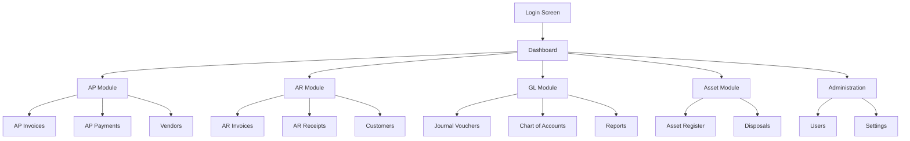

### Screen Types

| Type | Purpose | Example |
|------|---------|---------|
| **List Screen** | Browse, search, filter entities | AP Invoice List |
| **Detail Screen** | View entity details | Invoice Detail |
| **Form Screen** | Create/edit entities | New Invoice Form |
| **Wizard Screen** | Multi-step process | Invoice Approval Workflow |
| **Report Screen** | View reports and analytics | AP Aging Report |

---

## 2. Core User Journeys

### 2.1 Login Flow

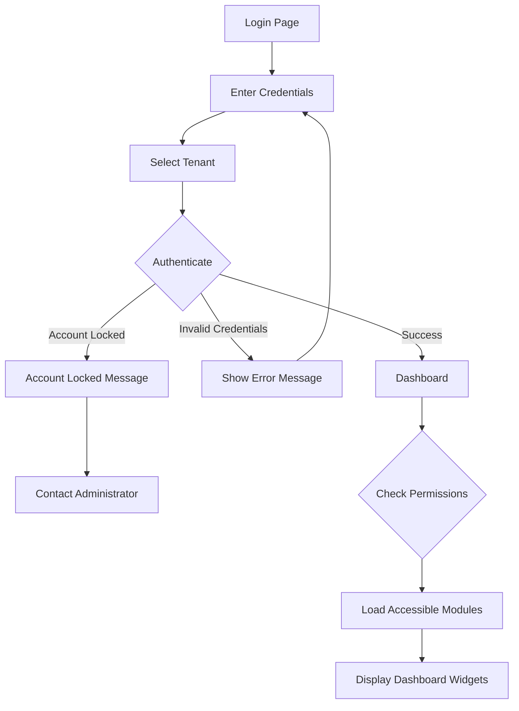

**Screens:**
1. **Login Screen**
   - Username/Email input
   - Password input
   - Tenant selector (dropdown)
   - Remember me checkbox
   - Login button
   - Forgot password link

2. **Dashboard Screen**
   - Welcome message with user name
   - Tenant display
   - Quick access cards (AP, AR, GL, Asset)
   - Recent activity widget
   - Pending approvals widget
   - Key metrics (outstanding invoices, overdue payments)

---

### 2.2 Dashboard Navigation

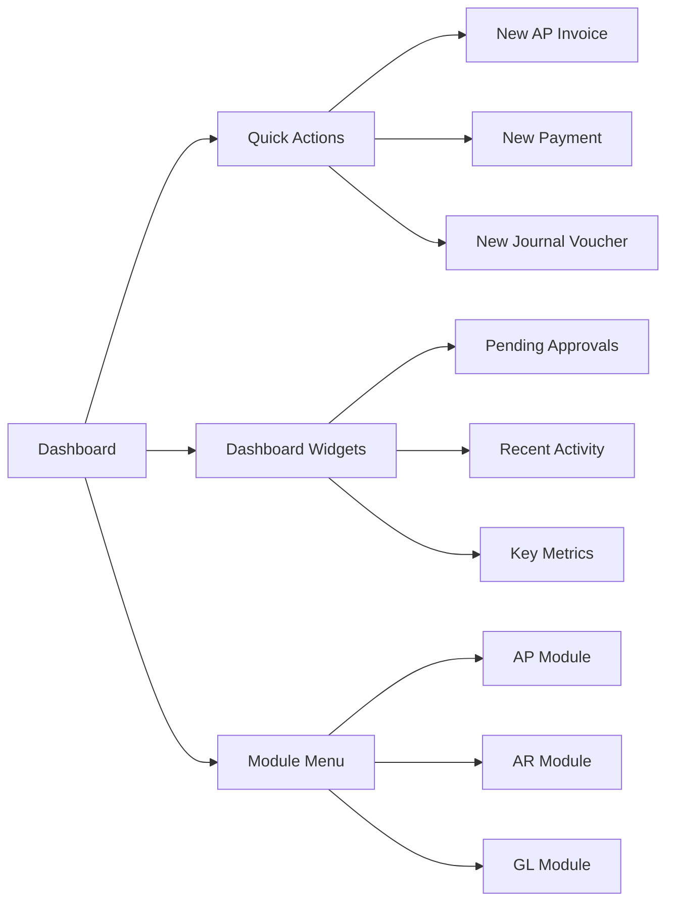

---

## 3. AP Module Flows

### 3.1 AP Invoice Creation Flow

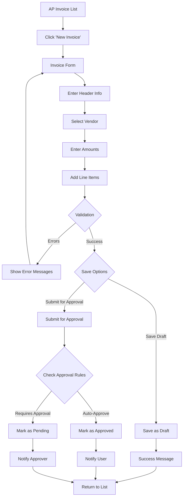

**Screens:**

1. **AP Invoice List Screen**
   - Header: "Accounts Payable > Invoices"
   - Search bar
   - Filters: Status, Date Range, Vendor
   - Action buttons: New Invoice, Import, Export
   - Data table with columns:
     - Invoice Number
     - Invoice Date
     - Vendor Name
     - Amount
     - Status Badge
     - Actions (View, Edit, Delete)
   - Pagination controls

2. **AP Invoice Form Screen**
   - Header: "New AP Invoice" or "Edit Invoice: INV-2025-001"
   - Breadcrumbs: Dashboard > AP > Invoices > New

   **Section 1: Invoice Details**
   - Invoice Number (auto-generated or manual)
   - Invoice Date (date picker)
   - Due Date (calculated or manual)
   - Vendor Selector (autocomplete)
   - Description (textarea)

   **Section 2: Amounts**
   - Amount (currency input)
   - Tax Type Selector (VAT, WHT)
   - Tax Amount (calculated or manual)
   - WHT Amount (calculated or manual)
   - Total Amount (calculated, readonly)

   **Section 3: Line Items**
   - Editable data grid
   - Columns: Line #, Description, GL Account, Department, Amount
   - Add Line button
   - Delete Line action
   - Line totals validation message

   **Section 4: Attachments** (tab or accordion)
   - File upload area (drag-and-drop)
   - Uploaded files list

   **Action Buttons:**
   - Save Draft (outlined button)
   - Submit for Approval (primary button)
   - Cancel (text button)

3. **AP Invoice Detail Screen**
   - Header: "Invoice: INV-2025-001"
   - Status Badge (prominent)
   - Tabs:
     - Details (invoice information)
     - Line Items (read-only table)
     - Payment History (linked payments)
     - Attachments (download links)
     - Audit Log (timeline)

   **Actions:**
   - Edit (if status = Draft)
   - Approve (if pending + permission)
   - Reject (if pending + permission)
   - Post to GL (if approved + permission)
   - Print (PDF generation)
   - Delete (if draft)

---

### 3.2 AP Invoice Approval Flow

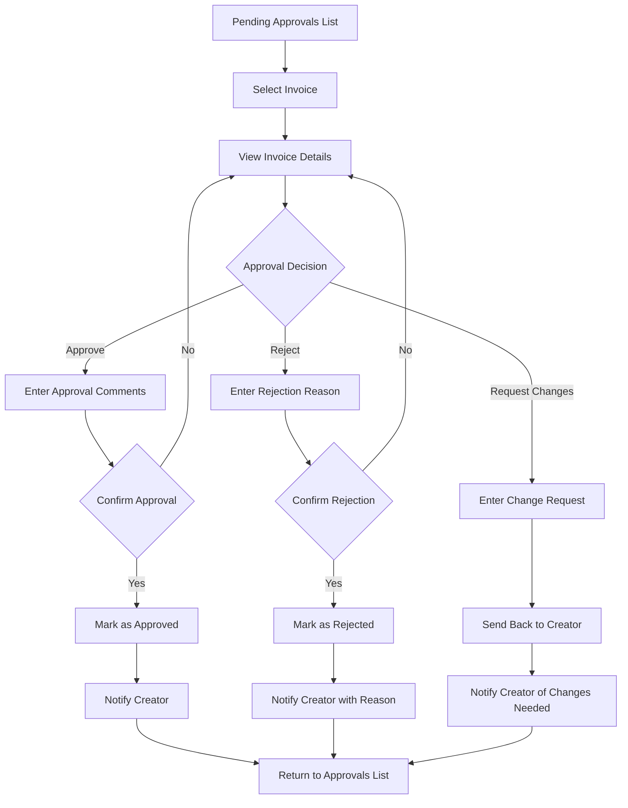

**Screens:**

**Pending Approvals Screen**
- Filtered list showing only pending items
- Approval amount thresholds display
- Quick actions: Approve All, Reject All

---

### 3.3 AP Payment Processing Flow

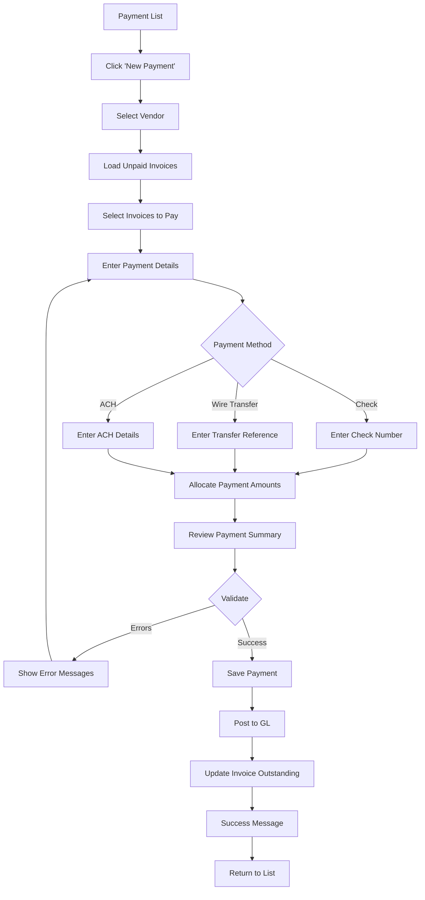

---

## 4. AR Module Flows

### 4.1 AR Invoice Creation Flow

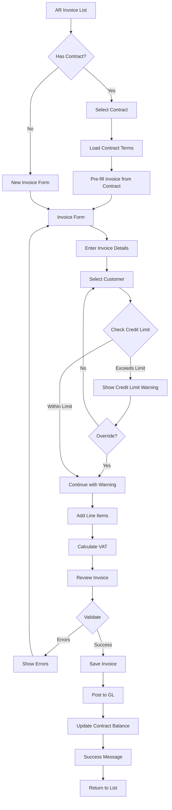

---

### 4.2 AR Receipt Application Flow

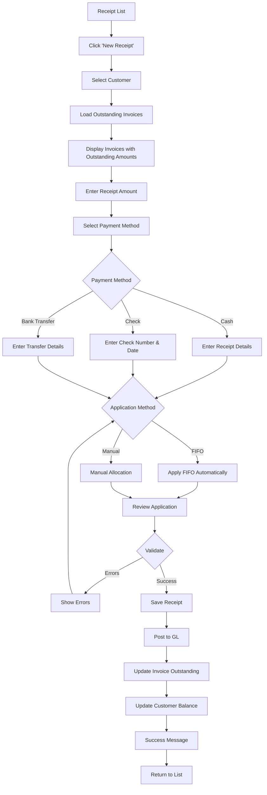

---

## 5. GL Module Flows

### 5.1 Journal Voucher Creation Flow

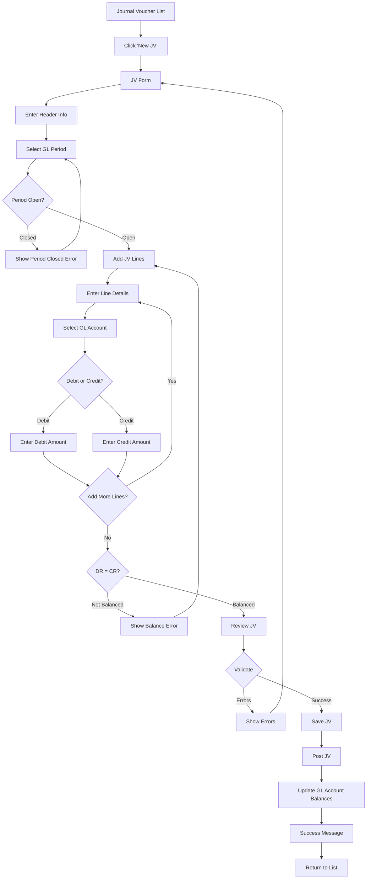

**Screens:**

**Journal Voucher Form Screen**
- Header: "New Journal Voucher"

**Section 1: JV Header**
- JV Number (auto-generated)
- JV Date (date picker with period validation)
- Period Selector (FY 2025 - Period 10)
- Description (textarea)
- JV Type (Manual, Recurring, Reversing)

**Section 2: JV Lines**
- Editable data grid with running totals
- Columns:
  - Line # (auto)
  - GL Account (autocomplete)
  - Description
  - Department (optional)
  - Debit Amount
  - Credit Amount

**Summary:**
- Total Debit: THB 10,000.00
- Total Credit: THB 10,000.00
- Difference: THB 0.00 ✓ (Balanced)

**Action Buttons:**
- Save Draft
- Save & Post (primary)
- Cancel

---

### 5.2 GL Period Close Flow

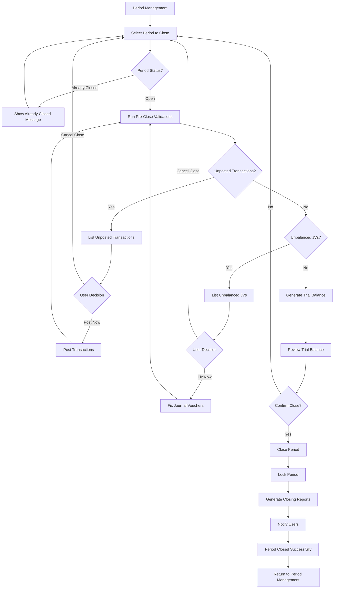

---

## 6. Asset Module Flows

### 6.1 Asset Registration Flow

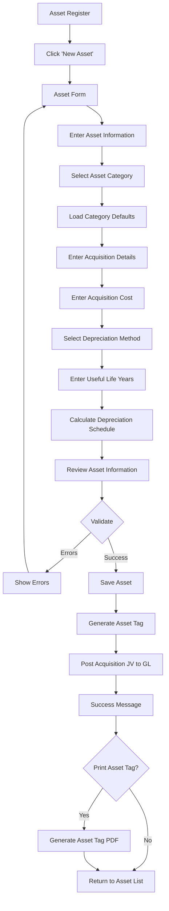

---

### 6.2 Monthly Depreciation Flow

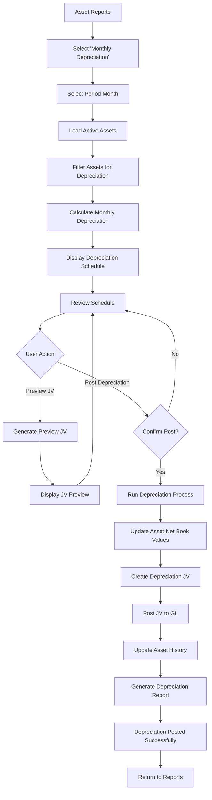

---

## 7. Admin Flows

### 7.1 User Management Flow

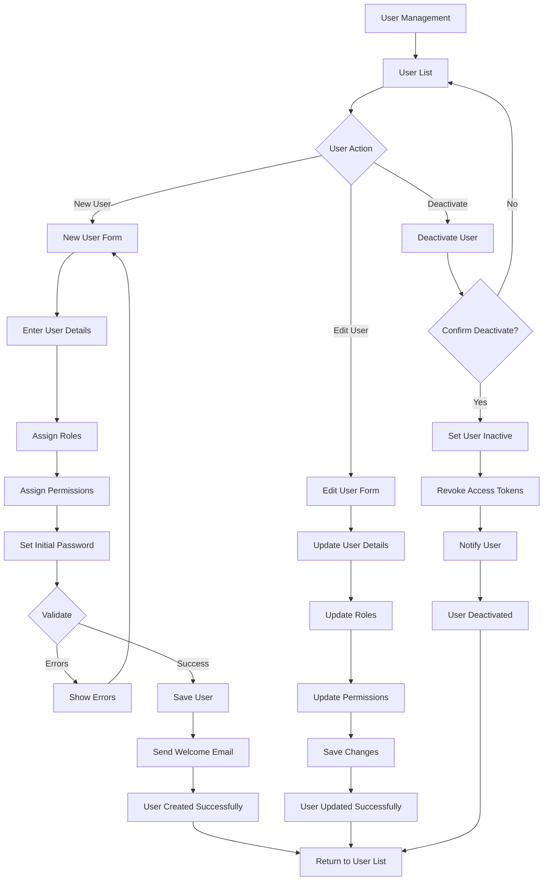

---

### 7.2 System Settings Flow

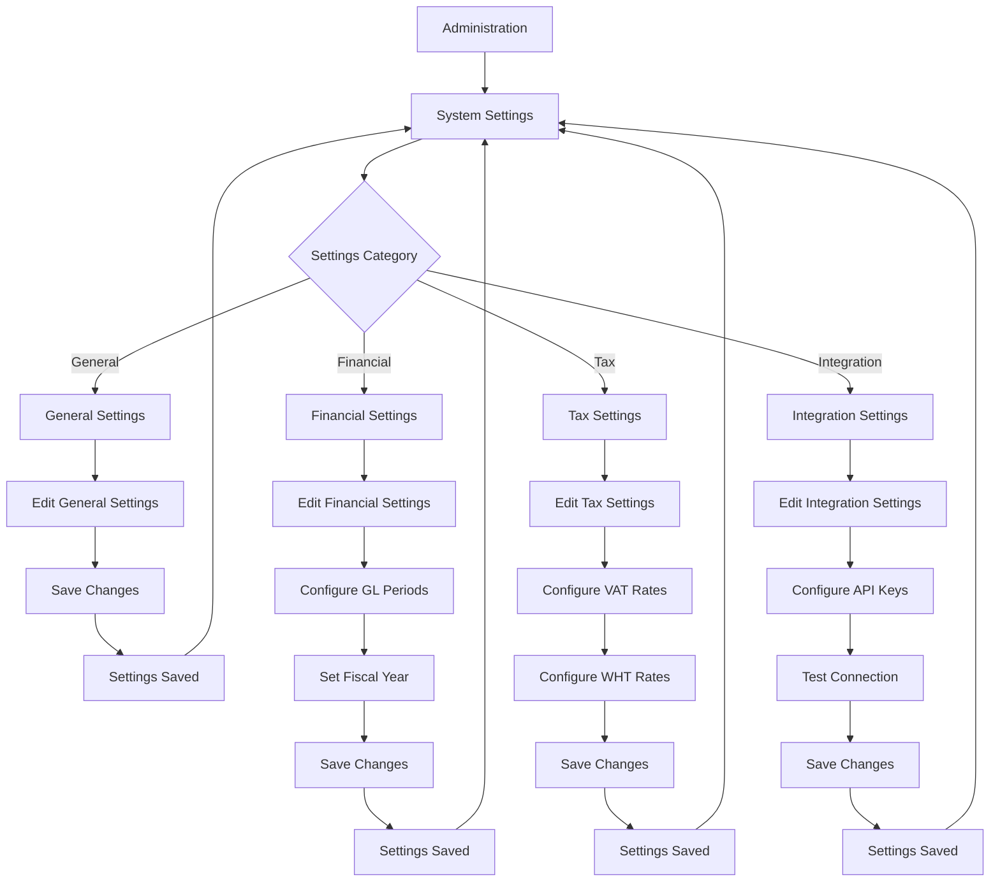

---

## Summary

Carmen.NET Screen Flow Documentation:

**✅ Documented:**
- 15+ user journey flows
- 7 module-specific workflows
- 30+ screen definitions
- Navigation architecture

**📊 Key Flows:**
1. **AP Module** (3 flows): Invoice Creation, Approval, Payment Processing
2. **AR Module** (2 flows): Invoice Creation, Receipt Application
3. **GL Module** (2 flows): Journal Voucher Creation, Period Close
4. **Asset Module** (2 flows): Asset Registration, Depreciation
5. **Admin** (2 flows): User Management, System Settings

**🎯 Design Patterns:**
- List → Detail → Form pattern
- Multi-step wizards for complex processes
- Approval workflows with status transitions
- Validation checkpoints at critical steps
- Success/error feedback loops

**📱 Responsive Considerations:**
- Desktop: Full multi-column layouts
- Tablet: Adaptive 2-column layouts
- Mobile: Single-column stacked layouts
- Touch-friendly targets (44x44px minimum)

**Next Steps:**
- Implement flows in frontend framework
- Conduct usability testing
- Gather user feedback
- Iterate on design based on analytics

---

**Document Status:** ✅ Complete
**For Support:** Contact UI/UX team or product management
