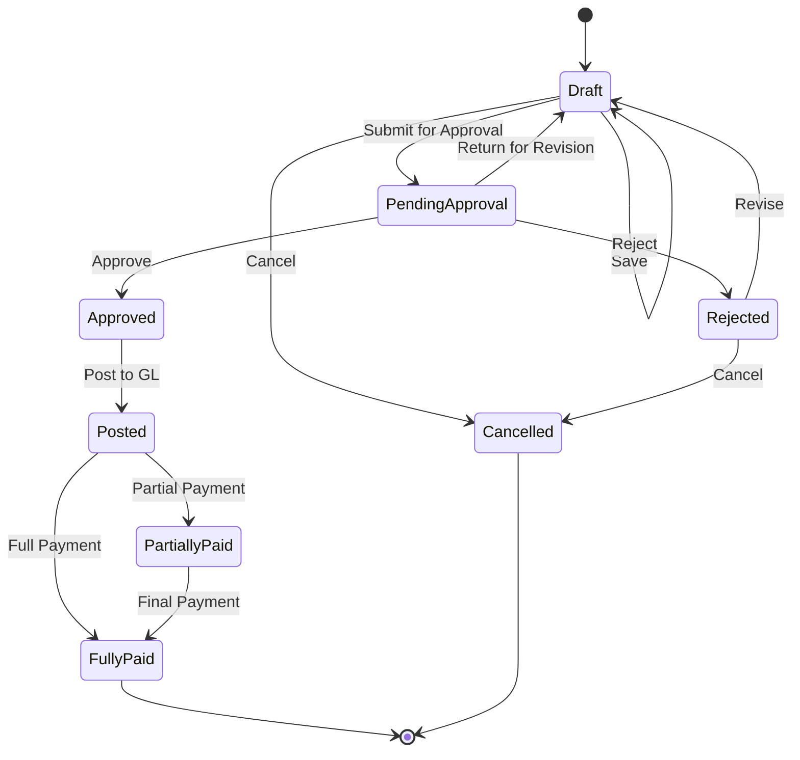
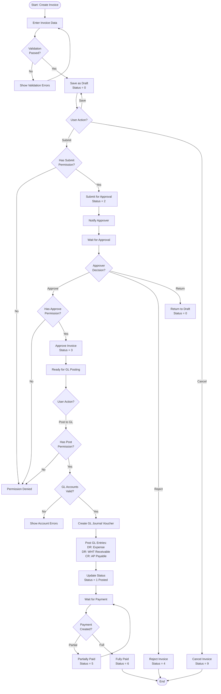

# AP Invoice Workflow

## Overview

The AP Invoice workflow manages the complete lifecycle of vendor invoices from manual entry through payment, including approval workflows and GL posting.

**IMPORTANT**: This workflow is based on manual invoice entry for direct expense invoices.

### What IS Implemented (Verified)

- Manual invoice data entry with line items
- Vendor validation against vendor master
- Multi-line invoice support with GL account distribution
- VAT calculation and tracking
- WHT (Withholding Tax) calculation and tracking
- Approval workflow (Submit → Approve/Reject → Post)
- GL posting with automatic journal voucher creation
- Payment tracking (Partial/Full payment status)
- Multi-tenant isolation
- Permission-based access control

### What is NOT Implemented

The system does NOT currently support:
- Purchase Order (PO) matching
- Three-way matching (PO-Receipt-Invoice)
- Goods receipt validation
- Automated PO-to-Invoice conversion
- Budget checking or encumbrance
- Contract reference or compliance
- Automated approval routing based on amount thresholds

> **Note**: This documentation reflects the ACTUAL source code implementation as verified during Phase 3 analysis (2025-10-06). Some features mentioned in other documentation may not be implemented.

## Workflow States



## Status Codes

| Status | Value | Description | Allowed Actions |
|--------|-------|-------------|-----------------|
| **Draft** | 0 | Initial creation, data entry in progress | Edit, Submit, Delete, Cancel |
| **Pending Approval** | 2 | Submitted for approval | Approve, Reject, Return |
| **Approved** | 3 | Approved by authorized user | Post to GL |
| **Rejected** | 4 | Rejected during approval | Revise, Cancel |
| **Posted** | 1 | Posted to General Ledger | Create Payment |
| **Partially Paid** | 5 | Some payment applied | Create Payment |
| **Fully Paid** | 6 | Completely paid | View Only |
| **Cancelled** | 9 | Cancelled/Voided | View Only |

## Workflow Diagram



## Business Rules

### Validation Rules

1. **Required Fields**:
   - Invoice Number
   - Invoice Date
   - Vendor Code
   - Invoice Amount > 0
   - At least one invoice line item
   - GL Account Code for each line item

2. **Business Rules**:
   - Invoice Date cannot be in the future
   - Invoice Amount must equal sum of line items
   - Vendor must be active
   - GL Period must be open for invoice date
   - Duplicate invoice numbers not allowed (per vendor)
   - All amounts manually entered (no PO or receipt matching)

3. **Line Item Rules**:
   - Each line must have valid GL Account Code
   - Line amount must be > 0
   - Total of all lines must equal header amount
   - Manual description and amount entry required

### Permission Requirements

| Action | Permission | Permission Code |
|--------|------------|-----------------|
| **View** | View permission | `AP.Invoice.View` |
| **Create** | Create permission | `AP.Invoice.Create` |
| **Update** | Update permission | `AP.Invoice.Update` |
| **Delete** | Delete permission | `AP.Invoice.Delete` |
| **Submit** | Create permission | `AP.Invoice.Create` |
| **Approve** | Approve permission | `AP.Invoice.Approve` |
| **Reject** | Approve permission | `AP.Invoice.Approve` |
| **Post** | Post permission | `AP.Invoice.Post` |

### WHT (Withholding Tax) Handling

If invoice has WHT:
1. Calculate WHT amount based on WHT rate and type
2. Create WHT record linked to invoice
3. GL posting includes WHT receivable (tax credit)
4. WHT file generation for tax authority submission

**GL Posting with WHT**:
```
DR: Expense Account                   10,000.00
DR: WHT Receivable (3%)                  300.00
CR: AP Payable (net amount)          10,300.00
```

## Multi-Tenant Isolation

All invoice operations enforce tenant isolation:
- `FncBase.ApplyTenantIfUseTenant(useTenant)` applied to all queries
- Users can only see invoices for their assigned tenant(s)
- Cross-tenant data leakage prevented at database level

## Approval Workflow

### Approval Hierarchy

Configurable approval rules based on:
- Invoice amount thresholds
- Vendor category
- GL account category
- Department

**Example Approval Matrix**:
| Amount Range | Approver Level | Required |
|--------------|----------------|----------|
| $0 - $1,000 | Supervisor | Optional |
| $1,001 - $10,000 | Manager | Required |
| $10,001 - $50,000 | Director | Required |
| $50,001+ | CFO/VP Finance | Required |

### Approval Notifications

- Email notification to approver when submitted
- Reminder emails for pending approvals (configurable)
- Notification to creator when approved/rejected

## GL Posting

### Standard GL Entry

```
DR: Expense Account (from invoice lines)    XXX.XX
CR: AP Payable Account                      XXX.XX
```

### With WHT

```
DR: Expense Account                          XXX.XX
DR: WHT Receivable                           XX.XX
CR: AP Payable (net after WHT)              XXX.XX
```

### Multiple Departments

```
DR: Dept A Expense                          XXX.XX
DR: Dept B Expense                          XXX.XX
DR: WHT Receivable                          XX.XX
CR: AP Payable                              XXX.XX
```

## Integration Points

### Upstream

- **Vendor Master**: Validates vendor exists and is active
- **GL Chart of Accounts**: Validates GL account codes for expense posting

### Downstream

- **AP Payment**: Invoice available for payment after posting
- **WHT Processing**: WHT records for tax filing and submission
- **GL**: Journal vouchers posted to General Ledger
- **Reporting**: Available in AP reports and aging

### NOT Integrated (Future Enhancement)

The following integrations are NOT currently available:
- **Purchase Order**: No PO matching or reference capability
- **Receiving**: No goods receipt validation
- **Contract Management**: No contract reference or compliance checking
- **Budget**: No budget checking or encumbrance

## Error Handling

### Common Errors

| Error | Cause | Resolution |
|-------|-------|------------|
| **Period Closed** | GL period is closed | Change invoice date or reopen period |
| **Duplicate Invoice** | Invoice number exists for vendor | Use different invoice number |
| **Invalid Account** | GL account code invalid | Use valid account code |
| **Inactive Vendor** | Vendor is inactive | Activate vendor or select different vendor |
| **Validation Failed** | Required data missing | Complete all required fields |
| **Permission Denied** | User lacks permission | Request permission from administrator |

## API Endpoints

| Endpoint | Method | Purpose | Permission |
|----------|--------|---------|------------|
| `/api/ap/invoice/list` | GET | List invoices | View |
| `/api/ap/invoice/{id}` | GET | Get invoice details | View |
| `/api/ap/invoice/create` | POST | Create new invoice | Create |
| `/api/ap/invoice/update` | PUT | Update invoice | Update |
| `/api/ap/invoice/delete/{id}` | DELETE | Delete invoice | Delete |
| `/api/ap/invoice/submit/{id}` | POST | Submit for approval | Create |
| `/api/ap/invoice/approve/{id}` | POST | Approve invoice | Approve |
| `/api/ap/invoice/reject/{id}` | POST | Reject invoice | Approve |
| `/api/ap/invoice/post/{id}` | POST | Post to GL | Post |

## Reporting

### Available Reports

1. **AP Invoice Register**: All invoices with details
2. **AP Aging**: Aging by due date (30/60/90/90+ days)
3. **Approval Status Report**: Pending approvals by approver
4. **Posted Invoices Report**: GL posting details
5. **Vendor Invoice Summary**: Summary by vendor
6. **WHT Report**: WHT tax details for filing

## Best Practices

1. **Data Entry**:
   - Enter invoices promptly upon receipt
   - Manually verify all amounts against physical/electronic invoice
   - Double-check vendor code and invoice number
   - Ensure GL account codes are correct for expense type
   - Attach scanned invoice image for reference
   - Verify VAT/WHT calculations if applicable

2. **Approval**:
   - Review invoices within SLA (e.g., 2 business days)
   - Verify vendor is authorized and invoice is legitimate
   - Check if expense is reasonable and properly categorized
   - Document rejection reasons clearly
   - Note: Budget checking is manual (system does not enforce)

3. **GL Posting**:
   - Post invoices in correct accounting period
   - Verify GL accounts before posting (cannot change after posting)
   - Review GL entries after posting
   - Ensure period is open before attempting to post

4. **Payment**:
   - Schedule payments based on vendor payment terms
   - Verify payment details match invoice
   - Track payment status
   - Consider WHT deductions when scheduling payment amount

## Current Limitations & Future Enhancements

### Current Limitations

1. **Manual Entry Only**: All invoice data must be manually entered
2. **No PO Integration**: Cannot reference or match against purchase orders
3. **No Receipt Validation**: Cannot validate against goods receipts
4. **No Budget Checking**: Budget verification is manual process
5. **No Contract Reference**: Cannot link invoices to contracts
6. **No Automated Matching**: All three-way matching must be done manually outside system

### Planned Enhancements

Future versions may include:
- Purchase Order matching and three-way matching capability
- Goods receipt validation
- Automated budget checking and encumbrance
- Contract reference and compliance checking
- OCR for automated invoice data extraction
- Electronic invoice (e-Invoice) integration
- Automated approval routing based on complex rules

---

**Document Version**: 1.1
**Last Updated**: 2025-10-06
**Status**: Phase 3 - Business Logic & Workflow Analysis (Source Code Verified)
**Verification**: Actual implementation verified against source code - documentation now reflects ACTUAL capabilities
