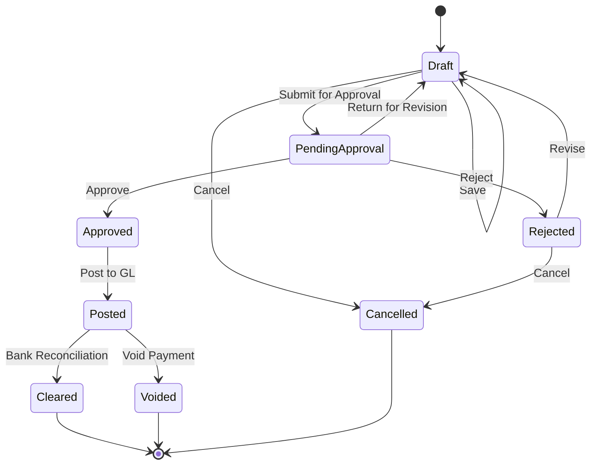

# AP Payment Workflow

## Overview

The AP Payment workflow manages the payment process for vendor invoices, from payment creation through bank reconciliation, including payment approval workflows and GL posting.

## Workflow States



## Status Codes

| Status | Value | Description | Allowed Actions |
|--------|-------|-------------|--------------------|
| **Draft** | 0 | Initial creation, data entry in progress | Edit, Submit, Delete, Cancel |
| **Pending Approval** | 2 | Submitted for approval | Approve, Reject, Return |
| **Approved** | 3 | Approved by authorized user | Post to GL |
| **Rejected** | 4 | Rejected during approval | Revise, Cancel |
| **Posted** | 1 | Posted to General Ledger | Clear, Void |
| **Cleared** | 5 | Reconciled with bank statement | View Only |
| **Voided** | 8 | Payment voided/cancelled | View Only |
| **Cancelled** | 9 | Cancelled before posting | View Only |

## Workflow Diagram

```mermaid
flowchart TD
    Start([Start: Create Payment]) --> SelectInvoices[Select Invoices to Pay]
    SelectInvoices --> ValidateInvoices{Invoices<br/>Valid?}

    ValidateInvoices -->|No| ShowErrors[Show Validation Errors]
    ShowErrors --> SelectInvoices

    ValidateInvoices -->|Yes| EnterPayment[Enter Payment Details]
    EnterPayment --> SelectMethod{Payment<br/>Method?}

    SelectMethod -->|Check| EnterCheck[Enter Check Number]
    SelectMethod -->|Wire| EnterWire[Enter Wire Details]
    SelectMethod -->|ACH| EnterACH[Enter ACH Details]

    EnterCheck --> CalculateAmounts
    EnterWire --> CalculateAmounts
    EnterACH --> CalculateAmounts

    CalculateAmounts[Calculate Total Amount<br/>Apply Discounts/WHT] --> ValidatePayment{Validation<br/>Passed?}

    ValidatePayment -->|No| ShowPaymentErrors[Show Validation Errors]
    ShowPaymentErrors --> EnterPayment

    ValidatePayment -->|Yes| SaveDraft[Save as Draft<br/>Status = 0]
    SaveDraft --> CheckSubmit{User Action?}

    CheckSubmit -->|Save| SaveDraft
    CheckSubmit -->|Submit| CheckPermission{Has Submit<br/>Permission?}
    CheckSubmit -->|Cancel| CancelPayment[Cancel Payment<br/>Status = 9]

    CheckPermission -->|No| Forbidden[Permission Denied]
    CheckPermission -->|Yes| SubmitApproval[Submit for Approval<br/>Status = 2]

    SubmitApproval --> NotifyApprover[Notify Approver]
    NotifyApprover --> WaitApproval[Wait for Approval]

    WaitApproval --> ApproverAction{Approver<br/>Decision?}

    ApproverAction -->|Approve| CheckApprovePermission{Has Approve<br/>Permission?}
    ApproverAction -->|Reject| RejectPayment[Reject Payment<br/>Status = 4]
    ApproverAction -->|Return| ReturnDraft[Return to Draft<br/>Status = 0]

    CheckApprovePermission -->|No| Forbidden
    CheckApprovePermission -->|Yes| ApprovePayment[Approve Payment<br/>Status = 3]

    ApprovePayment --> ReadyPost[Ready for GL Posting]
    ReadyPost --> PostAction{User Action?}

    PostAction -->|Post to GL| CheckPostPermission{Has Post<br/>Permission?}

    CheckPostPermission -->|No| Forbidden
    CheckPostPermission -->|Yes| ValidateBankAccount{Bank Account<br/>Valid?}

    ValidateBankAccount -->|No| ShowAccountError[Show Account Errors]
    ValidateBankAccount -->|Yes| CreateGLJV[Create GL Journal Voucher]

    CreateGLJV --> PostGLEntries[Post GL Entries:<br/>DR: AP Payable<br/>CR: Bank Account<br/>CR: WHT Payable if applicable]

    PostGLEntries --> UpdateInvoices[Update Invoice Status<br/>to Paid/Partially Paid]
    UpdateInvoices --> UpdateStatus[Update Payment Status<br/>Status = 1 Posted]

    UpdateStatus --> GenerateDoc[Generate Payment Document:<br/>Check/Wire/ACH]

    GenerateDoc --> WaitClearing[Wait for Bank Reconciliation]

    WaitClearing --> BankAction{Bank<br/>Action?}

    BankAction -->|Reconcile| MarkCleared[Mark as Cleared<br/>Status = 5]
    BankAction -->|Void| VoidPayment[Void Payment<br/>Status = 8]

    MarkCleared --> End([End])
    VoidPayment --> ReverseGL[Reverse GL Entries]
    ReverseGL --> UpdateInvoicesVoid[Revert Invoice Status]
    UpdateInvoicesVoid --> End
    CancelPayment --> End
    RejectPayment --> End
```



## Business Rules

### Validation Rules

1. **Required Fields**:
   - Payment Date
   - Bank Account
   - Payment Method
   - At least one invoice selected
   - Payment Amount > 0

2. **Business Rules**:
   - Payment Date cannot be in the future
   - Bank Account must be active
   - GL Period must be open for payment date
   - Selected invoices must be posted (Status = 1, 5)
   - Payment amount cannot exceed total invoice balances
   - Check numbers must be unique per bank account
   - Vendor bank details required for Wire/ACH

3. **Payment Calculation Rules**:
   - Payment Amount = Sum of Invoice Amounts
   - Apply early payment discounts if applicable
   - Calculate WHT if not already withheld on invoice
   - Net Payment = Gross Amount - Discounts - WHT

### Permission Requirements

| Action | Permission | Permission Code |
|--------|------------|--------------------|
| **View** | View permission | `AP.Payment.View` |
| **Create** | Create permission | `AP.Payment.Create` |
| **Update** | Update permission | `AP.Payment.Update` |
| **Delete** | Delete permission | `AP.Payment.Delete` |
| **Submit** | Create permission | `AP.Payment.Create` |
| **Approve** | Approve permission | `AP.Payment.Approve` |
| **Reject** | Approve permission | `AP.Payment.Approve` |
| **Post** | Post permission | `AP.Payment.Post` |
| **Void** | Void permission | `AP.Payment.Void` |
| **Reconcile** | Reconcile permission | `AP.Payment.Reconcile` |

### Payment Methods

#### Check Payment
- Check number assignment (manual or auto-generated)
- Check printing integration
- Check void tracking
- Stop payment capabilities

#### Wire Transfer
- Beneficiary bank details (SWIFT/BIC, IBAN)
- Wire reference number
- Wire fee handling
- International wire support

#### ACH/EFT
- Routing number validation
- Account number encryption
- ACH batch file generation
- Settlement date tracking

## Multi-Tenant Isolation

All payment operations enforce tenant isolation:
- `FncBase.ApplyTenantIfUseTenant(useTenant)` applied to all queries
- Users can only see payments for their assigned tenant(s)
- Cross-tenant data leakage prevented at database level

## Approval Workflow

### Approval Hierarchy

Configurable approval rules based on:
- Payment amount thresholds
- Vendor category
- Payment method
- Bank account

**Example Approval Matrix**:
| Amount Range | Approver Level | Required |
|--------------|----------------|----------|
| $0 - $5,000 | AP Supervisor | Optional |
| $5,001 - $25,000 | AP Manager | Required |
| $25,001 - $100,000 | Controller | Required |
| $100,001+ | CFO | Required |

### Approval Notifications

- Email notification to approver when submitted
- Reminder emails for pending approvals (configurable)
- Notification to creator when approved/rejected
- Alert to Finance when high-value payment approved

## GL Posting

### Standard Payment Entry

```
DR: AP Payable Account                      XXX.XX
CR: Bank Account                            XXX.XX
```

### Payment with WHT Withholding

```
DR: AP Payable Account                      XXX.XX
CR: Bank Account (net payment)              XXX.XX
CR: WHT Payable Account                      XX.XX
```

### Payment with Early Payment Discount

```
DR: AP Payable Account                      XXX.XX
CR: Bank Account (discounted amount)        XXX.XX
CR: Purchase Discount Received               XX.XX
```

### Multiple Invoices Payment

```
DR: AP Payable (Invoice 1)                  XXX.XX
DR: AP Payable (Invoice 2)                  XXX.XX
DR: AP Payable (Invoice 3)                  XXX.XX
CR: Bank Account                            XXX.XX
```

## Integration Points

### Upstream

- **AP Invoice**: Payment references posted invoices
- **Vendor Master**: Validates vendor and bank details
- **Bank Account Master**: Validates bank account and balance
- **GL Period**: Validates period is open

### Downstream

- **Bank Reconciliation**: Payments cleared against bank statements
- **Cash Flow Reporting**: Payment data for cash forecasting
- **GL**: Journal vouchers posted to General Ledger
- **Vendor Reporting**: Payment history and aging

## Error Handling

### Common Errors

| Error | Cause | Resolution |
|-------|-------|------------|
| **Period Closed** | GL period is closed | Change payment date or reopen period |
| **Insufficient Balance** | Bank account balance too low | Select different bank account or split payment |
| **Invoice Already Paid** | Invoice fully paid | Remove invoice from payment |
| **Invalid Bank Account** | Bank account inactive/invalid | Select valid bank account |
| **Duplicate Check Number** | Check number already used | Use different check number |
| **Permission Denied** | User lacks permission | Request permission from administrator |
| **Void Not Allowed** | Payment already cleared | Cannot void cleared payment |

## API Endpoints

| Endpoint | Method | Purpose | Permission |
|----------|--------|---------|------------|
| `/api/ap/payment/list` | GET | List payments | View |
| `/api/ap/payment/{id}` | GET | Get payment details | View |
| `/api/ap/payment/create` | POST | Create new payment | Create |
| `/api/ap/payment/update` | PUT | Update payment | Update |
| `/api/ap/payment/delete/{id}` | DELETE | Delete payment | Delete |
| `/api/ap/payment/submit/{id}` | POST | Submit for approval | Create |
| `/api/ap/payment/approve/{id}` | POST | Approve payment | Approve |
| `/api/ap/payment/reject/{id}` | POST | Reject payment | Approve |
| `/api/ap/payment/post/{id}` | POST | Post to GL | Post |
| `/api/ap/payment/void/{id}` | POST | Void payment | Void |
| `/api/ap/payment/reconcile/{id}` | POST | Mark as cleared | Reconcile |
| `/api/ap/payment/print-check/{id}` | GET | Print check | View |

## Bank Reconciliation

### Reconciliation Process

1. **Import Bank Statement**: Import transactions from bank
2. **Match Payments**: Auto-match payments by amount/date/reference
3. **Manual Matching**: Review and manually match unmatched items
4. **Mark Cleared**: Update payment status to Cleared (Status = 5)
5. **Generate Report**: Bank reconciliation report with outstanding items

### Clearing Rules

- Payment date within bank statement date range
- Payment amount matches bank transaction amount
- Reference number matches (check number, wire reference)
- Bank account matches statement account
- Payment must be Posted (Status = 1)

## Payment Void/Reversal

### Void Conditions

- Payment must be Posted (Status = 1), not yet cleared
- Must have Void permission
- GL period must be open
- Cannot void if part of closed period

### Void Process

1. Change payment status to Voided (Status = 8)
2. Create reversing GL journal voucher
3. Update invoice payment status (revert to unpaid/partially paid)
4. Create audit trail record
5. Notify stakeholders of void

## Reporting

### Available Reports

1. **Payment Register**: All payments with details
2. **Cash Disbursement Journal**: Daily/weekly/monthly cash outflows
3. **Check Register**: All check payments with status
4. **Payment by Vendor**: Payment history by vendor
5. **Bank Account Activity**: Payments by bank account
6. **Pending Approvals**: Payments awaiting approval
7. **Uncleared Payments**: Posted but not yet cleared

## Best Practices

1. **Payment Processing**:
   - Process payments in batches for efficiency
   - Verify vendor bank details before processing
   - Apply early payment discounts when available
   - Maintain check number sequence

2. **Approval**:
   - Review payments within SLA (e.g., 1 business day)
   - Verify budget availability before approval
   - Document rejection reasons clearly
   - Monitor high-value payments closely

3. **GL Posting**:
   - Post payments in correct accounting period
   - Verify GL accounts before posting
   - Review GL entries after posting
   - Reconcile bank accounts monthly

4. **Bank Reconciliation**:
   - Reconcile bank accounts within 5 business days of statement
   - Investigate and resolve outstanding items promptly
   - Document reconciliation adjustments
   - Maintain audit trail

5. **Security**:
   - Segregate duties (creator vs. approver)
   - Restrict void permission to supervisors
   - Monitor duplicate payments
   - Encrypt bank account details

---

**Document Version**: 1.0
**Last Updated**: 2025-10-06
**Status**: Phase 3 - Business Logic & Workflow Analysis
