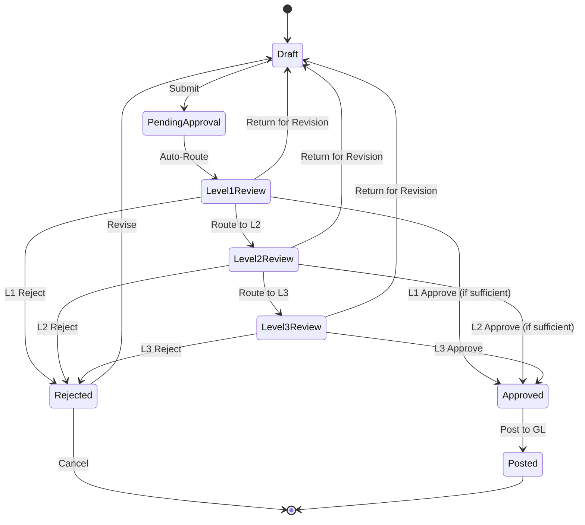
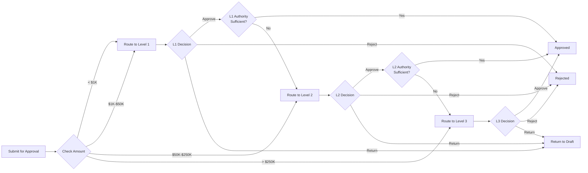

# Approval Workflows and Authorization Matrix

## Overview

This document defines the approval workflows, authorization hierarchies, and approval matrices used across all Carmen.NET modules.

## Approval Workflow Architecture

### Core Approval States



## Approval Hierarchy Principles

### 1. Amount-Based Approval

Approval levels determined by transaction amount thresholds:
- **Level 1**: Supervisor/Manager approval for routine transactions
- **Level 2**: Department Head/Controller approval for material transactions
- **Level 3**: Executive (CFO/CEO) approval for significant transactions

### 2. Segregation of Duties (SoD)

- **Creator ≠ Approver**: Transaction creator cannot approve own transactions
- **Single Approver Rule**: One person cannot approve at multiple levels
- **Dual Control**: High-value transactions require multiple approvers

### 3. Delegation of Authority

- Temporary delegation during absence
- Authority limits clearly defined
- Delegation audit trail maintained
- Automatic expiration of delegation

## AP Module Approval Matrix

### AP Invoice Approval

| Amount Range | Approver Level | Title | Auto-Approve | Required |
|--------------|----------------|-------|--------------|----------|
| $0 - $1,000 | Level 1 | AP Supervisor | Yes | Optional |
| $1,001 - $10,000 | Level 1 | AP Manager | No | Required |
| $10,001 - $50,000 | Level 2 | Controller | No | Required |
| $50,001 - $250,000 | Level 3 | CFO | No | Required |
| $250,001+ | Level 3 | CFO + CEO | No | Required (Both) |

**Special Approval Rules**:
- **Capital Expenditures >$100K**: Requires Budget Manager + CFO
- **New Vendor (First Invoice)**: Requires Purchasing Manager
- **Vendor Master Changes**: Requires AP Manager approval
- **Duplicate Invoice Warning**: Requires override approval

### AP Payment Approval

| Amount Range | Approver Level | Title | Auto-Approve | Required |
|--------------|----------------|-------|--------------|----------|
| $0 - $5,000 | Level 1 | AP Supervisor | Yes | Optional |
| $5,001 - $25,000 | Level 1 | AP Manager | No | Required |
| $25,001 - $100,000 | Level 2 | Controller | No | Required |
| $100,001 - $500,000 | Level 3 | CFO | No | Required |
| $500,001+ | Level 3 | CFO + Treasury | No | Required (Both) |

**Special Approval Rules**:
- **Wire Transfers >$50K**: Requires dual authorization (Controller + CFO)
- **International Payments**: Requires Treasury Manager approval
- **Backdated Payments**: Requires Controller approval
- **Payment Voids**: Requires AP Manager approval

## AR Module Approval Matrix

### AR Invoice Approval

| Amount Range | Approver Level | Title | Auto-Approve | Required |
|--------------|----------------|-------|--------------|----------|
| $0 - $5,000 | Level 1 | AR Clerk | Yes | Optional |
| $5,001 - $25,000 | Level 1 | AR Manager | No | Required |
| $25,001 - $100,000 | Level 2 | Finance Manager | No | Required |
| $100,001 - $500,000 | Level 3 | CFO | No | Required |
| $500,001+ | Level 3 | CFO + CEO | No | Required (Both) |

**Special Approval Rules**:
- **Credit Memos >$10K**: Requires AR Manager + Sales Manager
- **Write-Offs**: Requires CFO approval regardless of amount
- **Backdated Invoices**: Requires Finance Manager approval
- **Manual Invoices (no contract)**: Requires AR Manager approval

### AR Receipt Approval

| Amount Range | Approver Level | Title | Auto-Approve | Required |
|--------------|----------------|-------|--------------|----------|
| $0 - $10,000 | Level 1 | AR Clerk | Yes | Optional |
| $10,001 - $50,000 | Level 1 | AR Manager | No | Required |
| $50,001 - $200,000 | Level 2 | Finance Manager | No | Required |
| $200,001+ | Level 3 | CFO | No | Required |

**Special Approval Rules**:
- **Overpayments >$5K**: Requires AR Manager approval
- **Manual Receipt Application**: Requires AR Supervisor approval
- **Bounced Check Write-Off**: Requires CFO approval
- **Receipt Voids**: Requires AR Manager approval

## GL Module Approval Matrix

### GL Journal Voucher Approval

| Amount Range | Approver Level | Title | Auto-Approve | Required |
|--------------|----------------|-------|--------------|----------|
| $0 - $5,000 | Level 1 | Accounting Supervisor | Yes | Optional |
| $5,001 - $25,000 | Level 1 | Accounting Manager | No | Required |
| $25,001 - $100,000 | Level 2 | Controller | No | Required |
| $100,001+ | Level 3 | CFO | No | Required |

**Special Approval Rules**:
- **Adjusting Entries**: Requires Controller approval
- **Reclassification Entries**: Requires Accounting Manager approval
- **Prior Period Adjustments**: Requires CFO approval
- **Write-Offs/Reserves**: Requires CFO approval

### GL Period Close Approval

| Action | Approver | Required |
|--------|----------|----------|
| **Initiate Period Close** | Controller | Yes |
| **Override Close Warnings** | Controller | Yes |
| **Execute Period Close** | Controller | Yes |
| **Reopen Same Month** | Controller | Yes |
| **Reopen Prior Month** | CFO | Yes |
| **Reopen Prior Quarter** | CFO + Audit Committee | Yes |
| **Reopen Prior Year** | Board of Directors | Yes |

## Asset Module Approval Matrix

### Asset Acquisition Approval

| Amount Range | Approver Level | Title | Auto-Approve | Required |
|--------------|----------------|-------|--------------|----------|
| $0 - $5,000 | Level 1 | Department Manager | Yes | Optional |
| $5,001 - $25,000 | Level 1 | Asset Manager | No | Required |
| $25,001 - $100,000 | Level 2 | Controller | No | Required |
| $100,001 - $500,000 | Level 3 | CFO | No | Required |
| $500,001+ | Level 3 | CFO + CEO + Board | No | Required (All) |

**Special Approval Rules**:
- **Capital Budget Approval**: Required for all CapEx >$10K
- **Lease vs. Buy Decision**: Requires CFO approval for leases >$50K
- **Asset Category Change**: Requires Asset Manager approval

### Asset Disposal Approval

| NBV Range | Approver Level | Title | Auto-Approve | Required |
|-----------|----------------|-------|--------------|----------|
| $0 - $5,000 | Level 1 | Department Manager | Yes | Optional |
| $5,001 - $25,000 | Level 1 | Asset Manager | No | Required |
| $25,001 - $100,000 | Level 2 | Controller | No | Required |
| $100,001+ | Level 3 | CFO | No | Required |

**Special Approval Rules**:
- **All Write-Offs**: Require management approval regardless of amount
- **All Donations**: Require Tax/Legal review + CFO approval
- **Material Losses**: Require CFO approval
- **Related Party Sales**: Require Board approval

### Asset Transfer Approval

| Action | Approver | Required |
|--------|----------|----------|
| **Inter-Department Transfer** | Asset Manager | Optional |
| **Inter-Location Transfer** | Asset Manager | Required |
| **Inter-Company Transfer** | Controller | Required |
| **Custody Change** | Department Manager | Required |

## Budget Approval Matrix

### Budget Preparation

| Budget Type | Approver Level | Approval Sequence |
|-------------|----------------|-------------------|
| **Department Budget** | Level 1: Department Manager → Level 2: Division Head | Required |
| **Capital Budget** | Level 1: Asset Manager → Level 2: CFO → Level 3: Board | Required |
| **Annual Operating Budget** | Level 1: Department Heads → Level 2: CFO → Level 3: CEO → Board | Required |
| **Budget Revisions** | Level 2: CFO | Required |
| **Budget Transfers** | Level 1: Controller | Required if <$10K, Level 2: CFO if ≥$10K |

## Approval Workflow Configuration

### Routing Rules

**Automatic Routing**:


### Escalation Rules

**Time-Based Escalation**:
- **Level 1**: 24 hours → Escalate to Level 2
- **Level 2**: 48 hours → Escalate to Level 3
- **Level 3**: 72 hours → Notify CFO/CEO

**Business Rules**:
- Escalation only during business days
- Notifications sent to approver and escalation recipient
- Escalation audit trail maintained
- Manual escalation override allowed

### Approval Notifications

**Email Notifications**:
1. **Submission**: Notify assigned approver
2. **Pending Reminder**: Daily reminder for pending approvals
3. **Escalation**: Notify escalation recipient
4. **Approval**: Notify creator and next-level approver (if needed)
5. **Rejection**: Notify creator with rejection reason
6. **Return**: Notify creator for revision

**Dashboard Notifications**:
- Real-time approval queue
- Aging analysis of pending approvals
- SLA breach warnings
- Approval volume metrics

## Approval Audit Trail

### Logged Information

For each approval action:
```json
{
  "transactionId": "AP-INV-2024-12345",
  "transactionType": "AP Invoice",
  "transactionAmount": 50000.00,
  "submittedBy": "john.doe",
  "submittedDate": "2025-10-01T10:30:00Z",
  "approvalLevel": 2,
  "approver": "jane.controller",
  "approvalAction": "Approved",
  "approvalDate": "2025-10-01T14:45:00Z",
  "approvalComments": "Verified with PO#12345",
  "ipAddress": "192.168.1.100",
  "sessionId": "sess_abc123"
}
```

### Audit Reports

1. **Approval History Report**: All approvals by transaction
2. **Approver Activity Report**: Activity by approver
3. **Approval Aging Report**: Time to approve by level
4. **Exception Report**: Rejected and returned transactions
5. **Delegation Report**: Delegated authority usage
6. **SLA Compliance Report**: Approval SLA metrics

## Delegation of Authority

### Delegation Configuration

**Delegation Setup**:
- **Delegator**: Original approver delegating authority
- **Delegate**: Person receiving approval authority
- **Effective Date**: Start date of delegation
- **End Date**: Expiration date of delegation
- **Scope**: Specific modules or all modules
- **Amount Limit**: Maximum approval authority delegated

**Delegation Rules**:
- Cannot delegate to subordinate who reports to delegator
- Cannot delegate higher than delegator's own authority
- Maximum delegation period: 30 days
- Delegation requires manager approval
- Automatic expiration and notification

**Delegation Audit**:
```json
{
  "delegationId": "DEL-2024-001",
  "delegator": "jane.controller",
  "delegate": "bob.manager",
  "effectiveDate": "2025-10-15",
  "endDate": "2025-10-30",
  "scope": "AP Module",
  "maxAmount": 100000.00,
  "approvedBy": "cfo",
  "status": "Active"
}
```

## Best Practices

### For Transaction Creators

1. **Complete Documentation**: Attach all supporting documents before submission
2. **Accurate Descriptions**: Provide clear transaction descriptions and justifications
3. **Verify Amounts**: Double-check amounts and calculations
4. **Select Correct Approver**: Route to appropriate approver based on amount and type
5. **Timely Submission**: Submit transactions with adequate time for approval

### For Approvers

1. **Timely Review**: Review and approve within SLA (24-48 hours)
2. **Thorough Verification**: Verify supporting documentation and business justification
3. **Clear Communication**: Provide clear rejection reasons or revision requests
4. **Delegation Management**: Set up delegation before planned absences
5. **Escalation Awareness**: Escalate unusual transactions or concerns promptly

### For System Administrators

1. **Regular Review**: Review and update approval matrices quarterly
2. **User Training**: Train users on approval workflows and requirements
3. **Monitor SLAs**: Track and report approval SLA compliance
4. **Audit Compliance**: Ensure approval audit trail is complete
5. **System Optimization**: Optimize routing rules and notifications based on usage

## API Endpoints

| Endpoint | Method | Purpose |
|----------|--------|---------|
| `/api/approval/queue` | GET | Get pending approvals for user |
| `/api/approval/{id}` | GET | Get approval details |
| `/api/approval/approve/{id}` | POST | Approve transaction |
| `/api/approval/reject/{id}` | POST | Reject transaction |
| `/api/approval/return/{id}` | POST | Return for revision |
| `/api/approval/delegate` | POST | Set up delegation |
| `/api/approval/history/{transactionId}` | GET | Get approval history |
| `/api/approval/matrix` | GET | Get approval matrix configuration |

---

**Document Version**: 1.0
**Last Updated**: 2025-10-06
**Status**: Phase 3 - Business Logic & Workflow Analysis
