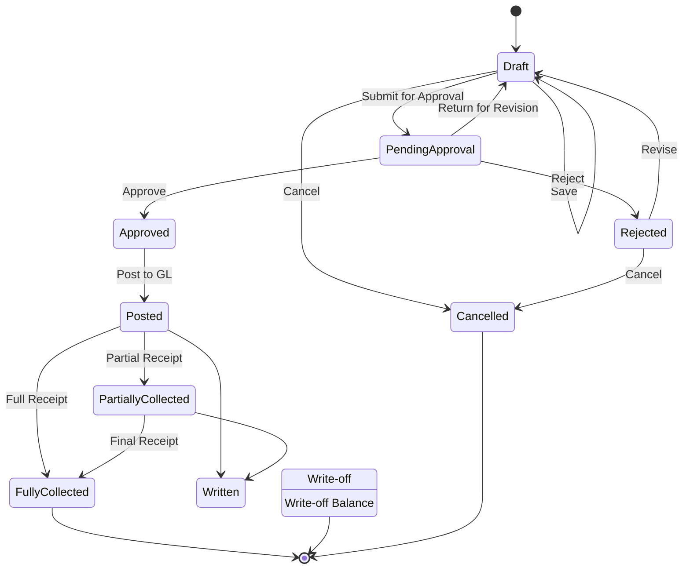
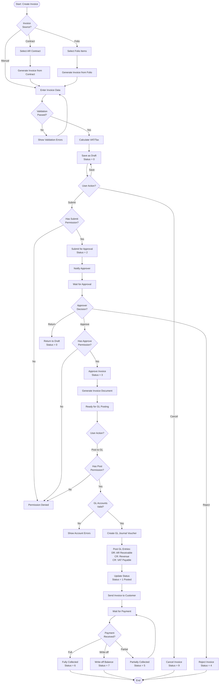

# AR Invoice Workflow

## Overview

The AR Invoice workflow manages the complete lifecycle of customer invoices from creation through payment collection, including billing approval workflows and GL posting.

## Workflow States



## Status Codes

| Status | Value | Description | Allowed Actions |
|--------|-------|-------------|--------------------|
| **Draft** | 0 | Initial creation, data entry in progress | Edit, Submit, Delete, Cancel |
| **Pending Approval** | 2 | Submitted for approval | Approve, Reject, Return |
| **Approved** | 3 | Approved by authorized user | Post to GL |
| **Rejected** | 4 | Rejected during approval | Revise, Cancel |
| **Posted** | 1 | Posted to General Ledger | Create Receipt, Write-off |
| **Partially Collected** | 5 | Some payment received | Create Receipt, Write-off |
| **Fully Collected** | 6 | Completely paid | View Only |
| **Written Off** | 7 | Balance written off | View Only |
| **Cancelled** | 9 | Cancelled/Voided | View Only |

## Workflow Diagram



## Business Rules

### Validation Rules

1. **Required Fields**:
   - Invoice Number
   - Invoice Date
   - Customer Code
   - Due Date
   - Invoice Amount > 0
   - At least one invoice line item

2. **Business Rules**:
   - Invoice Date cannot be in the future
   - Due Date must be >= Invoice Date
   - Invoice Amount must equal sum of line items + tax
   - Customer must be active
   - GL Period must be open for invoice date
   - Duplicate invoice numbers not allowed (per customer)
   - Credit limit check (optional, configurable)

3. **Line Item Rules**:
   - Each line must have valid GL Revenue Account Code
   - Line amount must be > 0
   - Total of all lines must equal header amount (before tax)
   - Unit price and quantity must be consistent

### Permission Requirements

| Action | Permission | Permission Code |
|--------|------------|--------------------|
| **View** | View permission | `AR.Invoice.View` |
| **Create** | Create permission | `AR.Invoice.Create` |
| **Update** | Update permission | `AR.Invoice.Update` |
| **Delete** | Delete permission | `AR.Invoice.Delete` |
| **Submit** | Create permission | `AR.Invoice.Create` |
| **Approve** | Approve permission | `AR.Invoice.Approve` |
| **Reject** | Approve permission | `AR.Invoice.Approve` |
| **Post** | Post permission | `AR.Invoice.Post` |

### VAT/Tax Handling

If invoice subject to VAT:
1. Calculate VAT based on VAT rate and type
2. Create VAT record linked to invoice
3. GL posting includes VAT payable
4. VAT filing integration for tax authority

**GL Posting with VAT**:
```
DR: AR Receivable (gross amount)           11,700.00
CR: Revenue Account                        10,000.00
CR: VAT Payable (17%)                       1,700.00
```

## Multi-Tenant Isolation

All invoice operations enforce tenant isolation:
- `FncBase.ApplyTenantIfUseTenant(useTenant)` applied to all queries
- Users can only see invoices for their assigned tenant(s)
- Cross-tenant data leakage prevented at database level

## Approval Workflow

### Approval Hierarchy

Configurable approval rules based on:
- Invoice amount thresholds
- Customer category
- GL revenue account category
- Department

**Example Approval Matrix**:
| Amount Range | Approver Level | Required |
|--------------|----------------|----------|
| $0 - $5,000 | AR Clerk | Optional |
| $5,001 - $25,000 | AR Manager | Required |
| $25,001 - $100,000 | Finance Manager | Required |
| $100,001+ | CFO | Required |

### Approval Notifications

- Email notification to approver when submitted
- Reminder emails for pending approvals (configurable)
- Notification to creator when approved/rejected
- Alert to AR team when invoice posted

## GL Posting

### Standard GL Entry

```
DR: AR Receivable Account                  XXX.XX
CR: Revenue Account (from invoice lines)   XXX.XX
```

### With VAT

```
DR: AR Receivable Account                  XXX.XX
CR: Revenue Account                        XXX.XX
CR: VAT Payable                             XX.XX
```

### Multiple Revenue Categories

```
DR: AR Receivable Account                  XXX.XX
CR: Product Revenue                        XXX.XX
CR: Service Revenue                        XXX.XX
CR: VAT Payable                             XX.XX
```

## Invoice Sources

### Manual Invoice
- Direct data entry by AR staff
- Line-by-line item entry
- Manual calculation with validation

### Contract-Based Invoice
- Generated from AR Contract
- Automatic billing based on contract terms
- Recurring invoice support (monthly, quarterly, annual)
- Contract milestone billing

### Folio-Based Invoice
- Generated from AR Folio items
- Consolidate multiple charges
- Hotel/hospitality billing patterns
- Service charge aggregation

## Integration Points

### Upstream

- **AR Contract**: Invoice generated from contract terms
- **AR Folio**: Invoice generated from folio charges
- **Customer Master**: Validates customer exists and is active
- **Product/Service Master**: Validates items and pricing

### Downstream

- **AR Receipt**: Invoice available for payment receipt
- **AR Aging**: Invoice aging and collection tracking
- **GL**: Journal vouchers posted to General Ledger
- **Revenue Recognition**: Revenue reporting and analysis
- **Tax Filing**: VAT/tax records for authority submission

## Credit Management

### Credit Limit Check

Optional credit limit validation before posting:
1. Calculate customer outstanding balance
2. Add new invoice amount
3. Compare against credit limit
4. Warning if exceeds limit (may block posting based on configuration)

### Credit Terms

- Payment terms definition (Net 30, Net 60, etc.)
- Early payment discount configuration
- Late payment penalty calculation
- Automatic aging category assignment

## Invoice Adjustments

### Credit Note
- Reduces invoice balance
- Can be partial or full credit
- Requires approval workflow
- Creates reversing GL entries

### Debit Note
- Increases invoice balance
- Additional charges or corrections
- Requires approval workflow
- Creates additional GL entries

## Error Handling

### Common Errors

| Error | Cause | Resolution |
|-------|-------|------------|
| **Period Closed** | GL period is closed | Change invoice date or reopen period |
| **Duplicate Invoice** | Invoice number exists for customer | Use different invoice number |
| **Invalid Account** | GL revenue account invalid | Use valid account code |
| **Inactive Customer** | Customer is inactive | Activate customer or select different customer |
| **Validation Failed** | Required data missing | Complete all required fields |
| **Permission Denied** | User lacks permission | Request permission from administrator |
| **Credit Limit Exceeded** | Invoice exceeds customer credit limit | Request credit limit increase or split invoice |

## API Endpoints

| Endpoint | Method | Purpose | Permission |
|----------|--------|---------|------------|
| `/api/ar/invoice/list` | GET | List invoices | View |
| `/api/ar/invoice/{id}` | GET | Get invoice details | View |
| `/api/ar/invoice/create` | POST | Create new invoice | Create |
| `/api/ar/invoice/update` | PUT | Update invoice | Update |
| `/api/ar/invoice/delete/{id}` | DELETE | Delete invoice | Delete |
| `/api/ar/invoice/submit/{id}` | POST | Submit for approval | Create |
| `/api/ar/invoice/approve/{id}` | POST | Approve invoice | Approve |
| `/api/ar/invoice/reject/{id}` | POST | Reject invoice | Approve |
| `/api/ar/invoice/post/{id}` | POST | Post to GL | Post |
| `/api/ar/invoice/generate-pdf/{id}` | GET | Generate invoice PDF | View |

## Reporting

### Available Reports

1. **AR Invoice Register**: All invoices with details
2. **AR Aging**: Aging by due date (30/60/90/90+ days)
3. **Revenue Analysis**: Revenue by product/service/customer
4. **Approval Status Report**: Pending approvals by approver
5. **Posted Invoices Report**: GL posting details
6. **Customer Invoice Summary**: Summary by customer
7. **VAT Report**: VAT details for filing
8. **Collection Efficiency**: DSO and collection metrics

## Best Practices

1. **Invoice Creation**:
   - Generate invoices promptly per contract terms
   - Verify pricing and discounts before posting
   - Attach supporting documents (contracts, delivery notes)
   - Use consistent invoice numbering

2. **Approval**:
   - Review invoices within SLA (e.g., 1 business day)
   - Verify customer credit status before approval
   - Document rejection reasons clearly
   - Monitor high-value invoices

3. **GL Posting**:
   - Post invoices in correct accounting period
   - Verify GL revenue accounts before posting
   - Review GL entries after posting
   - Match revenue recognition principles

4. **Collection**:
   - Send invoices immediately after posting
   - Follow up on overdue invoices per aging schedule
   - Monitor Days Sales Outstanding (DSO)
   - Escalate collection issues promptly

5. **Customer Service**:
   - Respond to invoice queries within 24 hours
   - Provide detailed invoice breakdown when requested
   - Process credit notes promptly for valid disputes
   - Maintain professional communication

---

**Document Version**: 1.0
**Last Updated**: 2025-10-06
**Status**: Phase 3 - Business Logic & Workflow Analysis
