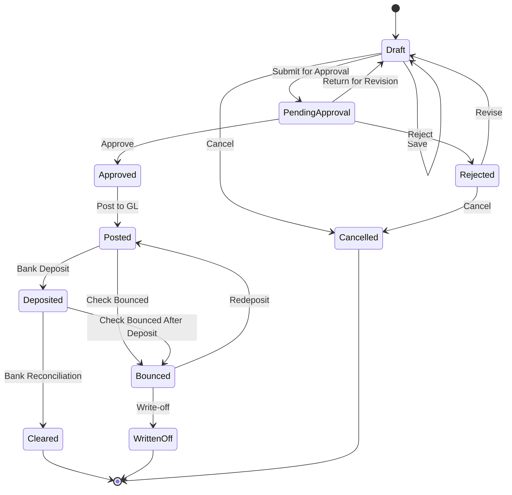

# AR Receipt Workflow

## Overview

The AR Receipt workflow manages the customer payment receipt process from payment collection through bank deposit reconciliation, including receipt approval workflows and GL posting.

## Workflow States



## Status Codes

| Status | Value | Description | Allowed Actions |
|--------|-------|-------------|--------------------|
| **Draft** | 0 | Initial creation, data entry in progress | Edit, Submit, Delete, Cancel |
| **Pending Approval** | 2 | Submitted for approval | Approve, Reject, Return |
| **Approved** | 3 | Approved by authorized user | Post to GL, Deposit |
| **Rejected** | 4 | Rejected during approval | Revise, Cancel |
| **Posted** | 1 | Posted to General Ledger | Deposit, Mark Bounced |
| **Deposited** | 5 | Deposited to bank | Clear, Mark Bounced |
| **Cleared** | 6 | Reconciled with bank statement | View Only |
| **Bounced** | 7 | Check/payment bounced | Redeposit, Write-off |
| **Written Off** | 8 | Bad debt written off | View Only |
| **Cancelled** | 9 | Cancelled before posting | View Only |

## Workflow Diagram

```mermaid
flowchart TD
    Start([Start: Receive Payment]) --> SelectPaymentMethod{Payment<br/>Method?}

    SelectPaymentMethod -->|Cash| EnterCash[Enter Cash Details]
    SelectPaymentMethod -->|Check| EnterCheck[Enter Check Details]
    SelectPaymentMethod -->|Wire| EnterWire[Enter Wire Transfer Details]
    SelectPaymentMethod -->|Credit Card| EnterCard[Enter Card Details]

    EnterCash --> SelectInvoices
    EnterCheck --> SelectInvoices
    EnterWire --> SelectInvoices
    EnterCard --> SelectInvoices

    SelectInvoices[Select Invoices to Apply] --> ValidateInvoices{Invoices<br/>Valid?}

    ValidateInvoices -->|No| ShowErrors[Show Validation Errors]
    ShowErrors --> SelectInvoices

    ValidateInvoices -->|Yes| ApplyPayment[Apply Payment to Invoices]
    ApplyPayment --> CalculateBalance{Payment<br/>Applied?}

    CalculateBalance -->|Exact Match| AllApplied[All Payment Applied]
    CalculateBalance -->|Overpayment| CreateCredit[Create Customer Credit]
    CalculateBalance -->|Underpayment| PartialApply[Partial Application]

    AllApplied --> ValidateReceipt
    CreateCredit --> ValidateReceipt
    PartialApply --> ValidateReceipt

    ValidateReceipt{Validation<br/>Passed?} -->|No| ShowReceiptErrors[Show Validation Errors]
    ShowReceiptErrors --> SelectInvoices

    ValidateReceipt -->|Yes| SaveDraft[Save as Draft<br/>Status = 0]
    SaveDraft --> CheckSubmit{User Action?}

    CheckSubmit -->|Save| SaveDraft
    CheckSubmit -->|Submit| CheckPermission{Has Submit<br/>Permission?}
    CheckSubmit -->|Cancel| CancelReceipt[Cancel Receipt<br/>Status = 9]

    CheckPermission -->|No| Forbidden[Permission Denied]
    CheckPermission -->|Yes| SubmitApproval[Submit for Approval<br/>Status = 2]

    SubmitApproval --> NotifyApprover[Notify Approver]
    NotifyApprover --> WaitApproval[Wait for Approval]

    WaitApproval --> ApproverAction{Approver<br/>Decision?}

    ApproverAction -->|Approve| CheckApprovePermission{Has Approve<br/>Permission?}
    ApproverAction -->|Reject| RejectReceipt[Reject Receipt<br/>Status = 4]
    ApproverAction -->|Return| ReturnDraft[Return to Draft<br/>Status = 0]

    CheckApprovePermission -->|No| Forbidden
    CheckApprovePermission -->|Yes| ApproveReceipt[Approve Receipt<br/>Status = 3]

    ApproveReceipt --> ReadyPost[Ready for GL Posting]
    ReadyPost --> PostAction{User Action?}

    PostAction -->|Post to GL| CheckPostPermission{Has Post<br/>Permission?}

    CheckPostPermission -->|No| Forbidden
    CheckPostPermission -->|Yes| ValidateAccounts{GL Accounts<br/>Valid?}

    ValidateAccounts -->|No| ShowAccountError[Show Account Errors]
    ValidateAccounts -->|Yes| CreateGLJV[Create GL Journal Voucher]

    CreateGLJV --> PostGLEntries[Post GL Entries:<br/>DR: Bank/Cash Account<br/>CR: AR Receivable<br/>DR/CR: Discount if applicable]

    PostGLEntries --> UpdateInvoices[Update Invoice Status<br/>to Paid/Partially Paid]
    UpdateInvoices --> UpdateStatus[Update Receipt Status<br/>Status = 1 Posted]

    UpdateStatus --> GenerateReceipt[Generate Receipt Document]
    GenerateReceipt --> WaitDeposit[Wait for Bank Deposit]

    WaitDeposit --> DepositAction{Deposit<br/>Action?}

    DepositAction -->|Deposit| MarkDeposited[Mark as Deposited<br/>Status = 5]
    DepositAction -->|Bounced| MarkBounced[Mark as Bounced<br/>Status = 7]

    MarkDeposited --> WaitClearing[Wait for Bank Reconciliation]

    WaitClearing --> BankAction{Bank<br/>Action?}

    BankAction -->|Reconcile| MarkCleared[Mark as Cleared<br/>Status = 6]
    BankAction -->|Bounced| MarkBounced

    MarkBounced --> ReverseGL[Reverse GL Entries]
    ReverseGL --> RevertInvoices[Revert Invoice Status]
    RevertInvoices --> BouncedDecision{Resolution?}

    BouncedDecision -->|Redeposit| EnterCheck
    BouncedDecision -->|Write-off| WriteOff[Write-off<br/>Status = 8]

    MarkCleared --> End([End])
    WriteOff --> End
    CancelReceipt --> End
    RejectReceipt --> End
```



## Business Rules

### Validation Rules

1. **Required Fields**:
   - Receipt Date
   - Receipt Number
   - Customer Code
   - Payment Method
   - Payment Amount > 0
   - Bank Account (for non-cash payments)
   - At least one invoice selected

2. **Business Rules**:
   - Receipt Date cannot be in the future
   - Customer must be active
   - GL Period must be open for receipt date
   - Selected invoices must be posted (Status = 1, 5)
   - Total applied amount cannot exceed payment amount
   - Check number must be unique (per customer)
   - Duplicate receipt numbers not allowed

3. **Payment Application Rules**:
   - Applied Amount <= Invoice Outstanding Balance
   - Earliest invoices applied first (FIFO) by default
   - Manual application override allowed
   - Overpayment creates customer credit balance
   - Payment discount validation if applicable

### Permission Requirements

| Action | Permission | Permission Code |
|--------|------------|--------------------|
| **View** | View permission | `AR.Receipt.View` |
| **Create** | Create permission | `AR.Receipt.Create` |
| **Update** | Update permission | `AR.Receipt.Update` |
| **Delete** | Delete permission | `AR.Receipt.Delete` |
| **Submit** | Create permission | `AR.Receipt.Create` |
| **Approve** | Approve permission | `AR.Receipt.Approve` |
| **Reject** | Approve permission | `AR.Receipt.Approve` |
| **Post** | Post permission | `AR.Receipt.Post` |
| **Deposit** | Deposit permission | `AR.Receipt.Deposit` |
| **Reconcile** | Reconcile permission | `AR.Receipt.Reconcile` |

### Payment Methods

#### Cash Receipt
- Physical cash collection
- Petty cash integration
- Daily cash reconciliation
- Cash deposit slip generation

#### Check Receipt
- Check number recording
- Check date validation
- Bank and branch details
- Post-dated check handling
- Check bounce management

#### Wire Transfer
- Bank reference number
- Transfer date
- Sender bank details
- Wire fee handling
- International transfer support

#### Credit Card
- Card type (Visa, Mastercard, etc.)
- Last 4 digits (PCI compliance)
- Authorization code
- Merchant fees
- Chargeback handling

#### Electronic Payment (ACH/EFT)
- Transaction reference
- Settlement date
- Bank routing information
- Payment gateway integration

## Multi-Tenant Isolation

All receipt operations enforce tenant isolation:
- `FncBase.ApplyTenantIfUseTenant(useTenant)` applied to all queries
- Users can only see receipts for their assigned tenant(s)
- Cross-tenant data leakage prevented at database level

## Approval Workflow

### Approval Hierarchy

Configurable approval rules based on:
- Receipt amount thresholds
- Payment method
- Customer category
- Unusual payment patterns

**Example Approval Matrix**:
| Amount Range | Approver Level | Required |
|--------------|----------------|----------|
| $0 - $10,000 | AR Clerk | Optional |
| $10,001 - $50,000 | AR Manager | Required |
| $50,001 - $200,000 | Finance Manager | Required |
| $200,001+ | CFO | Required |

### Special Approval Cases

- Overpayments requiring credit creation
- Payments to write-off bad debts
- Manual payment application overrides
- Backdated receipts (prior period)

## GL Posting

### Standard Receipt Entry

```
DR: Bank Account                           XXX.XX
CR: AR Receivable Account                 XXX.XX
```

### Receipt with Payment Discount

```
DR: Bank Account (net received)           XXX.XX
DR: Sales Discount Given                   XX.XX
CR: AR Receivable Account                 XXX.XX
```

### Multiple Invoice Application

```
DR: Bank Account                           XXX.XX
CR: AR Receivable (Invoice 1)             XXX.XX
CR: AR Receivable (Invoice 2)             XXX.XX
CR: AR Receivable (Invoice 3)             XXX.XX
```

### Credit Card Receipt with Merchant Fee

```
DR: Bank Account (net after fee)          XXX.XX
DR: Credit Card Merchant Fee               XX.XX
CR: AR Receivable                         XXX.XX
```

## Payment Application Strategies

### FIFO (First In, First Out)
- Apply to oldest invoices first
- Default application method
- Reduces aged receivables

### Manual Application
- User selects specific invoices
- Allows strategic application
- Requires additional approval

### Automatic Application
- System matches by invoice number or reference
- Batch processing support
- Exception handling for mismatches

## Integration Points

### Upstream

- **AR Invoice**: Receipt applied to posted invoices
- **Customer Master**: Validates customer and payment terms
- **Bank Account Master**: Validates bank account
- **GL Period**: Validates period is open

### Downstream

- **Bank Reconciliation**: Receipts cleared against bank statements
- **Cash Flow Reporting**: Receipt data for cash forecasting
- **Customer Aging**: Updates outstanding balances
- **GL**: Journal vouchers posted to General Ledger
- **Collection Reports**: Receipt history and trends

## Check Bounce Handling

### Bounce Detection

- Bank notification of dishonored check
- NSF (Non-Sufficient Funds)
- Account closed
- Stop payment
- Signature mismatch

### Bounce Process

1. Mark receipt as Bounced (Status = 7)
2. Create reversing GL journal voucher
3. Revert invoice payment status
4. Create bounce fee charge (optional)
5. Notify AR team and sales
6. Update customer credit status

### Recovery Actions

- Contact customer for replacement payment
- Redeposit check if NSF temporary
- Write-off if uncollectible
- Legal action if warranted
- Update customer risk rating

## Bank Deposit Management

### Deposit Process

1. **Prepare Deposit**: Group receipts by bank account and date
2. **Generate Deposit Slip**: List all checks and cash
3. **Physical Deposit**: Take to bank
4. **Record Deposit**: Update system with bank reference
5. **Mark Deposited**: Change status to Deposited (Status = 5)

### Deposit Reconciliation

- Match deposit slip total to bank confirmation
- Verify all items cleared
- Investigate discrepancies
- Handle partial clearances

## Error Handling

### Common Errors

| Error | Cause | Resolution |
|-------|-------|------------|
| **Period Closed** | GL period is closed | Change receipt date or reopen period |
| **Duplicate Receipt Number** | Receipt number already used | Use different receipt number |
| **Invalid Bank Account** | Bank account inactive/invalid | Select valid bank account |
| **Invoice Already Paid** | Invoice fully paid | Remove invoice or adjust amount |
| **Customer Inactive** | Customer is inactive | Activate customer or verify customer code |
| **Permission Denied** | User lacks permission | Request permission from administrator |
| **Overpayment Not Allowed** | Payment exceeds invoice total | Enable credit creation or adjust amount |
| **Check Already Deposited** | Check number duplicate | Verify check number |

## API Endpoints

| Endpoint | Method | Purpose | Permission |
|----------|--------|---------|------------|
| `/api/ar/receipt/list` | GET | List receipts | View |
| `/api/ar/receipt/{id}` | GET | Get receipt details | View |
| `/api/ar/receipt/create` | POST | Create new receipt | Create |
| `/api/ar/receipt/update` | PUT | Update receipt | Update |
| `/api/ar/receipt/delete/{id}` | DELETE | Delete receipt | Delete |
| `/api/ar/receipt/submit/{id}` | POST | Submit for approval | Create |
| `/api/ar/receipt/approve/{id}` | POST | Approve receipt | Approve |
| `/api/ar/receipt/reject/{id}` | POST | Reject receipt | Approve |
| `/api/ar/receipt/post/{id}` | POST | Post to GL | Post |
| `/api/ar/receipt/deposit/{id}` | POST | Mark as deposited | Deposit |
| `/api/ar/receipt/reconcile/{id}` | POST | Mark as cleared | Reconcile |
| `/api/ar/receipt/bounce/{id}` | POST | Mark check as bounced | Update |
| `/api/ar/receipt/print/{id}` | GET | Print receipt | View |

## Reporting

### Available Reports

1. **Receipt Register**: All receipts with details
2. **Cash Receipt Journal**: Daily/weekly/monthly cash inflows
3. **Bank Deposit Report**: Deposits by bank and date
4. **Receipt by Customer**: Receipt history by customer
5. **Payment Method Analysis**: Receipts by payment method
6. **Undeposited Receipts**: Posted but not yet deposited
7. **Bounced Check Report**: All bounced checks with status
8. **Collection Effectiveness**: DSO trends and collection metrics

## Best Practices

1. **Receipt Processing**:
   - Record receipts daily for accurate cash position
   - Verify payment details before posting
   - Apply payments to correct invoices
   - Generate receipt documents for customers

2. **Approval**:
   - Review receipts within SLA (e.g., same day)
   - Verify unusual payment patterns
   - Investigate large overpayments
   - Monitor payment method trends

3. **Bank Deposit**:
   - Deposit checks daily to minimize bounce risk
   - Separate deposits by bank account
   - Reconcile deposit slip with bank confirmation
   - Follow up on deposit discrepancies

4. **Bank Reconciliation**:
   - Reconcile daily receipts with bank statements
   - Clear receipts within 2 business days
   - Investigate uncleared items promptly
   - Maintain audit trail

5. **Customer Service**:
   - Provide receipt confirmation promptly
   - Update customers on payment application
   - Handle bounced check situations professionally
   - Maintain positive customer relationships

---

**Document Version**: 1.0
**Last Updated**: 2025-10-06
**Status**: Phase 3 - Business Logic & Workflow Analysis
