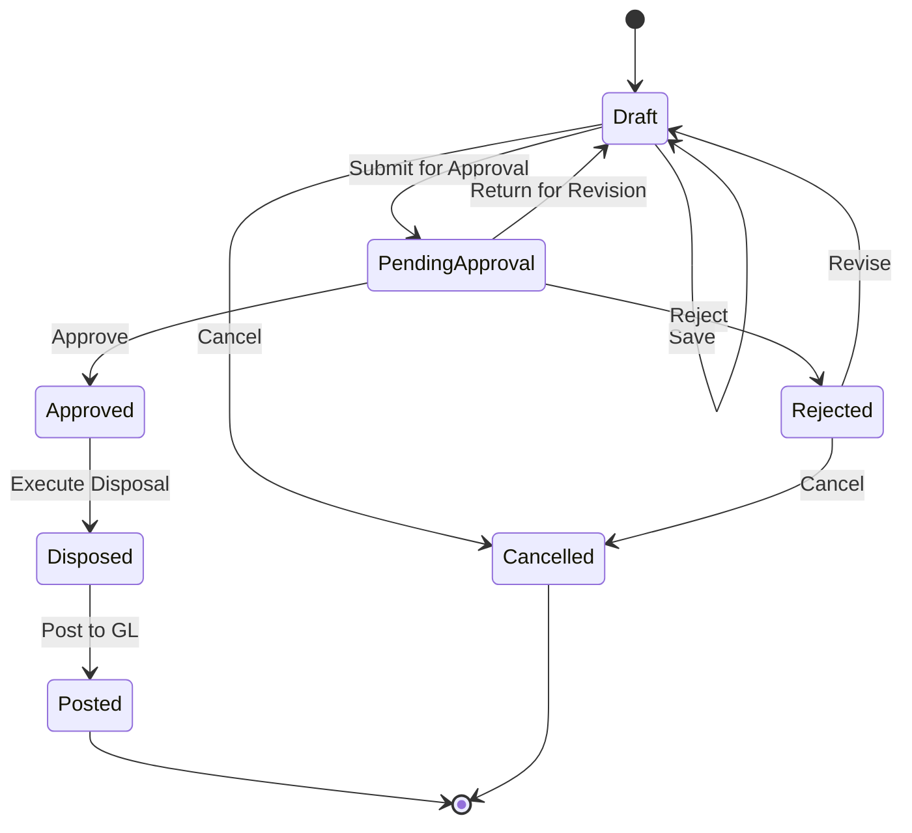

# Asset Disposal Workflow

## Overview

The Asset Disposal workflow manages the complete lifecycle of asset retirement, from disposal initiation through GL posting of gains/losses and asset register updates.

## Workflow States



## Status Codes

| Status | Value | Description | Allowed Actions |
|--------|-------|-------------|--------------------|
| **Draft** | 0 | Initial creation, disposal planning | Edit, Submit, Delete, Cancel |
| **Pending Approval** | 2 | Submitted for approval | Approve, Reject, Return |
| **Approved** | 3 | Approved by authorized user | Execute disposal |
| **Rejected** | 4 | Rejected during approval | Revise, Cancel |
| **Disposed** | 5 | Asset physically disposed | Post to GL |
| **Posted** | 1 | Posted to General Ledger | View Only |
| **Cancelled** | 9 | Cancelled before disposal | View Only |

## Workflow Diagram

```mermaid
flowchart TD
    Start([Start: Initiate Asset Disposal]) --> SelectAsset[Select Asset to Dispose]
    SelectAsset --> ValidateAsset{Asset<br/>Valid?}

    ValidateAsset -->|No| ShowAssetError[Show Asset Errors]
    ShowAssetError --> SelectAsset

    ValidateAsset -->|Yes| EnterDetails[Enter Disposal Details]
    EnterDetails --> SelectMethod{Disposal<br/>Method?}

    SelectMethod -->|Sale| EnterSale[Enter Sale Details:<br/>Sale Price, Buyer, Payment Terms]
    SelectMethod -->|Scrap| EnterScrap[Enter Scrap Details:<br/>Scrap Value, Disposal Cost]
    SelectMethod -->|Trade-In| EnterTradeIn[Enter Trade-In Details:<br/>Trade Value, New Asset]
    SelectMethod -->|Donation| EnterDonation[Enter Donation Details:<br/>Recipient, Fair Market Value]
    SelectMethod -->|Write-Off| EnterWriteOff[Enter Write-Off Details:<br/>Reason, Authorization]

    EnterSale --> CalculateGainLoss
    EnterScrap --> CalculateGainLoss
    EnterTradeIn --> CalculateGainLoss
    EnterDonation --> CalculateGainLoss
    EnterWriteOff --> CalculateGainLoss

    CalculateGainLoss[Calculate Gain/Loss on Disposal:<br/>NBV, Proceeds, Disposal Costs] --> ValidateDisposal{Validation<br/>Passed?}

    ValidateDisposal -->|No| ShowErrors[Show Validation Errors]
    ShowErrors --> EnterDetails

    ValidateDisposal -->|Yes| SaveDraft[Save as Draft<br/>Status = 0]
    SaveDraft --> CheckSubmit{User Action?}

    CheckSubmit -->|Save| SaveDraft
    CheckSubmit -->|Submit| CheckPermission{Has Submit<br/>Permission?}
    CheckSubmit -->|Cancel| CancelDisposal[Cancel Disposal<br/>Status = 9]

    CheckPermission -->|No| Forbidden[Permission Denied]
    CheckPermission -->|Yes| CheckValue{Disposal<br/>Value?}

    CheckValue -->|< Threshold| AutoApprove[Auto-Approve<br/>Status = 3]
    CheckValue -->|≥ Threshold| SubmitApproval[Submit for Approval<br/>Status = 2]

    SubmitApproval --> NotifyApprover[Notify Approver]
    NotifyApprover --> WaitApproval[Wait for Approval]

    WaitApproval --> ApproverAction{Approver<br/>Decision?}

    ApproverAction -->|Approve| CheckApprovePermission{Has Approve<br/>Permission?}
    ApproverAction -->|Reject| RejectDisposal[Reject Disposal<br/>Status = 4]
    ApproverAction -->|Return| ReturnDraft[Return to Draft<br/>Status = 0]

    CheckApprovePermission -->|No| Forbidden
    CheckApprovePermission -->|Yes| ApproveDisposal[Approve Disposal<br/>Status = 3]

    AutoApprove --> ReadyDispose
    ApproveDisposal --> ReadyDispose[Ready for Physical Disposal]

    ReadyDispose --> ExecuteAction{Execute<br/>Disposal?}

    ExecuteAction -->|Yes| PhysicalDisposal[Execute Physical Disposal]
    PhysicalDisposal --> UpdateAssetLocation[Update Asset Location/Status]

    UpdateAssetLocation --> ReceiveProceeds{Proceeds<br/>Received?}
    ReceiveProceeds -->|Yes| RecordProceeds[Record Cash/AR Receipt]
    ReceiveProceeds -->|No| NoProceedsNote[Note: No Proceeds]

    RecordProceeds --> MarkDisposed
    NoProceedsNote --> MarkDisposed[Mark as Disposed<br/>Status = 5]

    MarkDisposed --> ReadyPost[Ready for GL Posting]
    ReadyPost --> PostAction{Post to GL?}

    PostAction -->|Yes| CheckPostPermission{Has Post<br/>Permission?}

    CheckPostPermission -->|No| Forbidden
    CheckPostPermission -->|Yes| ValidateAccounts{GL Accounts<br/>Valid?}

    ValidateAccounts -->|No| ShowAccountError[Show Account Errors]
    ValidateAccounts -->|Yes| CalculateFinal[Calculate Final Amounts:<br/>Accumulated Depreciation,<br/>Net Book Value,<br/>Proceeds,<br/>Gain/Loss]

    CalculateFinal --> CreateGLJV[Create GL Journal Voucher]

    CreateGLJV --> PostGLEntries[Post GL Entries:<br/>DR: Accumulated Depreciation<br/>DR: Loss on Disposal OR CR: Gain<br/>DR: Cash/AR if sale<br/>CR: Asset Cost]

    PostGLEntries --> UpdateAssetRegister[Update Asset Register:<br/>Status = Disposed,<br/>Disposal Date,<br/>Final NBV = 0]

    UpdateAssetRegister --> UpdateStatus[Update Disposal Status<br/>Status = 1 Posted]

    UpdateStatus --> GenerateReport[Generate Disposal Report]
    GenerateReport --> End([End])

    CancelDisposal --> End
    RejectDisposal --> End
```



## Business Rules

### Validation Rules

1. **Required Fields**:
   - Asset Code
   - Disposal Date
   - Disposal Method
   - Disposal Reason
   - Authorization (if required)

2. **Business Rules**:
   - Asset must be active (not already disposed)
   - Disposal Date >= Asset Acquisition Date
   - Disposal Date <= Current Date
   - Asset must not have pending transactions
   - GL Period must be open for disposal date
   - Depreciation must be current up to disposal date

3. **Disposal Calculation Rules**:
   - **Asset Cost**: Original acquisition cost
   - **Accumulated Depreciation**: Total depreciation up to disposal date
   - **Net Book Value (NBV)**: Asset Cost - Accumulated Depreciation
   - **Proceeds**: Sale price or trade-in value (net of disposal costs)
   - **Gain on Disposal**: Proceeds > NBV
   - **Loss on Disposal**: Proceeds < NBV

### Permission Requirements

| Action | Permission | Permission Code |
|--------|------------|--------------------|
| **View** | View permission | `Asset.Disposal.View` |
| **Create** | Create permission | `Asset.Disposal.Create` |
| **Update** | Update permission | `Asset.Disposal.Update` |
| **Delete** | Delete permission | `Asset.Disposal.Delete` |
| **Submit** | Create permission | `Asset.Disposal.Create` |
| **Approve** | Approve permission | `Asset.Disposal.Approve` |
| **Reject** | Approve permission | `Asset.Disposal.Approve` |
| **Execute Disposal** | Execute permission | `Asset.Disposal.Execute` |
| **Post** | Post permission | `Asset.Disposal.Post` |

### Disposal Methods

#### Sale
- Sale to third party
- Competitive bidding
- Private treaty sale
- Auction

**Required Details**:
- Buyer information
- Sale price
- Payment terms
- Sale documentation

#### Scrap
- Asset no longer usable
- Salvage value recovery
- Disposal costs

**Required Details**:
- Scrap value (if any)
- Disposal/removal costs
- Scrap dealer details

#### Trade-In
- Exchange for new asset
- Trade-in allowance
- Net payment calculation

**Required Details**:
- New asset details
- Trade-in value
- Net payment amount
- Dealer information

#### Donation
- Charitable donation
- Tax deduction eligible
- Fair market value determination

**Required Details**:
- Recipient organization
- Fair market value
- Tax receipt requirements
- Donation approval

#### Write-Off
- Asset lost, stolen, or destroyed
- No proceeds expected
- Insurance claim handling

**Required Details**:
- Write-off reason
- Police/insurance reports
- Management authorization
- Insurance claim details

## Multi-Tenant Isolation

All disposal operations enforce tenant isolation:
- `FncBase.ApplyTenantIfUseTenant(useTenant)` applied to all queries
- Users can only see disposals for their assigned tenant(s)
- Cross-tenant data leakage prevented at database level

## Approval Workflow

### Approval Hierarchy

Configurable approval rules based on:
- Asset original cost
- Net book value
- Disposal method
- Gain/loss amount

**Example Approval Matrix**:
| NBV Range | Approver Level | Required |
|-----------|----------------|----------|
| $0 - $5,000 | Department Manager | Optional |
| $5,001 - $25,000 | Asset Manager | Required |
| $25,001 - $100,000 | Controller | Required |
| $100,001+ | CFO | Required |

**Special Approval Cases**:
- All write-offs require management approval
- Donations require tax/legal review
- Material losses require CFO approval
- Related party sales require board approval

## GL Posting

### Sale with Gain

```
DR: Cash/AR (proceeds)                    12,000.00
DR: Accumulated Depreciation              48,000.00
CR: Asset Cost                            60,000.00
CR: Gain on Disposal                          0.00
```

### Sale with Loss

```
DR: Cash/AR (proceeds)                     8,000.00
DR: Accumulated Depreciation              48,000.00
DR: Loss on Disposal                       4,000.00
CR: Asset Cost                            60,000.00
```

### Scrap with Disposal Cost

```
DR: Cash (scrap value)                       500.00
DR: Accumulated Depreciation              48,000.00
DR: Loss on Disposal                       6,500.00
DR: Disposal Expense                       5,000.00
CR: Asset Cost                            60,000.00
```

### Write-Off (Total Loss)

```
DR: Accumulated Depreciation              48,000.00
DR: Loss on Disposal                      12,000.00
CR: Asset Cost                            60,000.00
```

### Trade-In

```
DR: New Asset (fair value)                75,000.00
DR: Accumulated Depreciation (old)        48,000.00
DR: Loss on Trade-In                       2,000.00
CR: Asset Cost (old)                      60,000.00
CR: Cash (net payment)                    65,000.00
```

## Depreciation Handling

### Depreciation to Disposal Date

1. **Calculate Final Depreciation**: Pro-rate depreciation to disposal date
2. **Post Final Depreciation**: Record last depreciation entry
3. **Update Accumulated Depreciation**: Reflect total depreciation
4. **Calculate Final NBV**: Asset Cost - Total Accumulated Depreciation

### Disposal in Mid-Period

**Option 1: Full Month Depreciation**
- Take full month depreciation if disposed after 15th
- No depreciation if disposed before 15th

**Option 2: Pro-Rata Depreciation**
- Calculate exact days used in disposal month
- Depreciation = (Daily Rate × Days Used)

**Option 3: No Depreciation in Disposal Month**
- Use previous month-end NBV
- Simpler but less accurate

## Integration Points

### Upstream

- **Asset Register**: Asset master data and history
- **Asset Category**: Depreciation method and GL accounts
- **Asset Location**: Physical location tracking
- **Depreciation Schedule**: Current depreciation status

### Downstream

- **GL**: Journal vouchers for disposal gains/losses
- **AR (if sale)**: Accounts receivable for outstanding proceeds
- **Cash Management**: Cash receipt from sale/scrap
- **Tax Reporting**: Capital gains/losses for tax filing
- **Asset Reporting**: Disposal register and analytics

## Error Handling

### Common Errors

| Error | Cause | Resolution |
|-------|-------|------------|
| **Asset Not Found** | Invalid asset code | Verify asset code |
| **Asset Already Disposed** | Asset status = Disposed | Cannot dispose twice |
| **Period Closed** | GL period is closed | Change disposal date or reopen period |
| **Depreciation Not Current** | Missing depreciation entries | Run depreciation up to disposal date |
| **Invalid Disposal Date** | Date before acquisition | Use valid date >= acquisition date |
| **Permission Denied** | User lacks permission | Request permission from administrator |
| **Pending Transactions** | Unposted asset transactions | Post or delete pending transactions |
| **Invalid GL Account** | GL account not set | Configure asset category GL accounts |

## API Endpoints

| Endpoint | Method | Purpose | Permission |
|----------|--------|---------|------------|
| `/api/asset/disposal/list` | GET | List disposals | View |
| `/api/asset/disposal/{id}` | GET | Get disposal details | View |
| `/api/asset/disposal/create` | POST | Create new disposal | Create |
| `/api/asset/disposal/update` | PUT | Update disposal | Update |
| `/api/asset/disposal/delete/{id}` | DELETE | Delete disposal | Delete |
| `/api/asset/disposal/submit/{id}` | POST | Submit for approval | Create |
| `/api/asset/disposal/approve/{id}` | POST | Approve disposal | Approve |
| `/api/asset/disposal/reject/{id}` | POST | Reject disposal | Approve |
| `/api/asset/disposal/execute/{id}` | POST | Execute physical disposal | Execute |
| `/api/asset/disposal/post/{id}` | POST | Post to GL | Post |
| `/api/asset/disposal/calculate/{assetId}` | GET | Calculate gain/loss estimate | View |

## Reporting

### Available Reports

1. **Disposal Register**: All asset disposals with details
2. **Gain/Loss Summary**: Gains and losses by period
3. **Disposal by Method**: Analysis by disposal type
4. **Disposal by Department**: Departmental disposal activity
5. **Disposal by Category**: Asset category disposal trends
6. **Pending Disposals**: Approved but not yet executed
7. **Tax Capital Gains Report**: For tax filing purposes

## Best Practices

1. **Disposal Planning**:
   - Establish disposal policy and procedures
   - Define approval thresholds clearly
   - Maintain disposal authorization matrix
   - Document disposal reasons and decisions

2. **Depreciation Management**:
   - Ensure depreciation is current before disposal
   - Use consistent depreciation method for disposal month
   - Verify accumulated depreciation accuracy
   - Recalculate if asset revalued

3. **Approval Process**:
   - Review disposal requests within SLA (e.g., 3 business days)
   - Verify asset condition and disposal reason
   - Check for alternative uses before approval
   - Obtain competitive bids for high-value sales

4. **Physical Disposal**:
   - Verify asset location before disposal
   - Document asset condition with photos
   - Obtain disposal receipts and documentation
   - Update asset location tracking immediately

5. **GL Posting**:
   - Verify all GL accounts before posting
   - Review gain/loss calculations for reasonableness
   - Post disposals in correct accounting period
   - Retain supporting documentation for audit

6. **Compliance**:
   - Follow environmental disposal regulations
   - Comply with data destruction requirements
   - Maintain disposal audit trail
   - Retain disposal documentation per policy (e.g., 7 years)

---

**Document Version**: 1.0
**Last Updated**: 2025-10-06
**Status**: Phase 3 - Business Logic & Workflow Analysis
