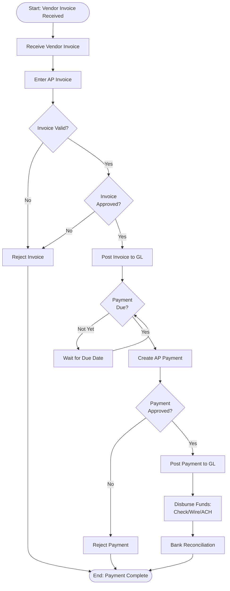
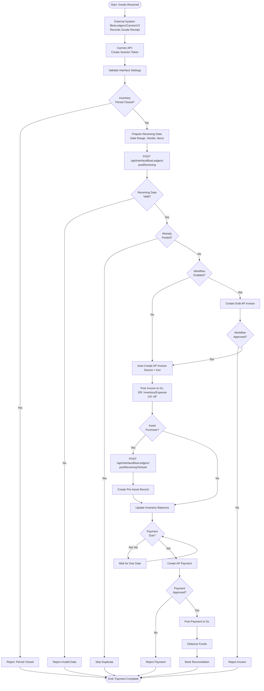
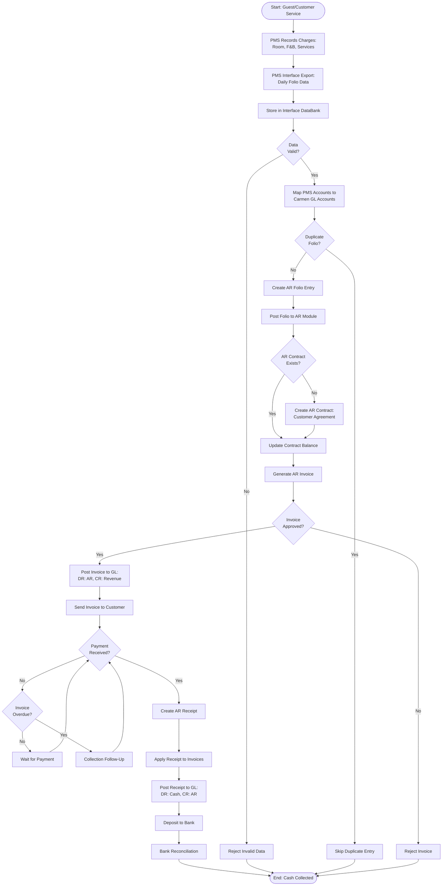
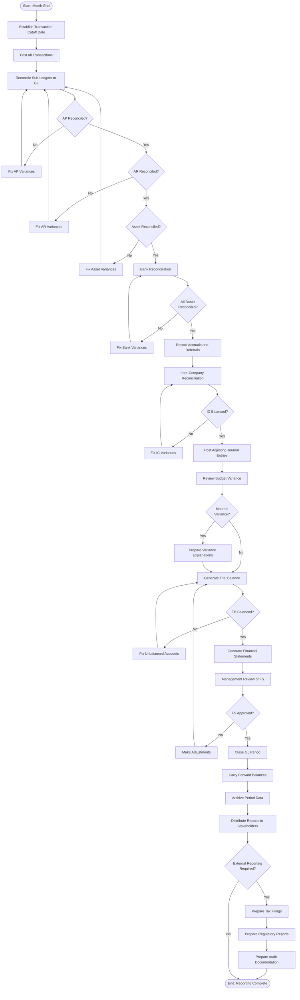
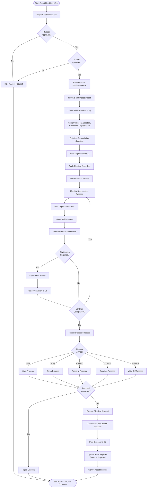
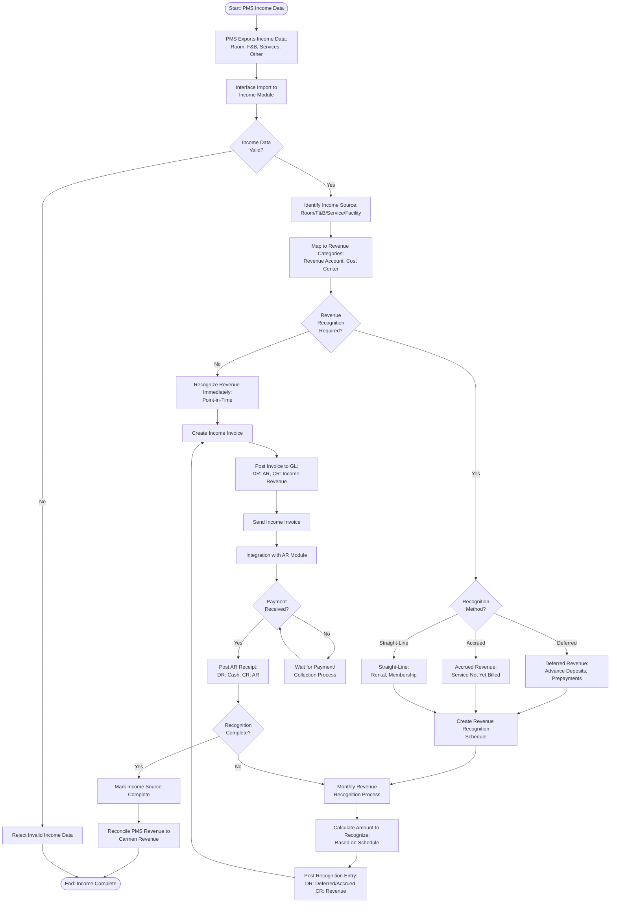
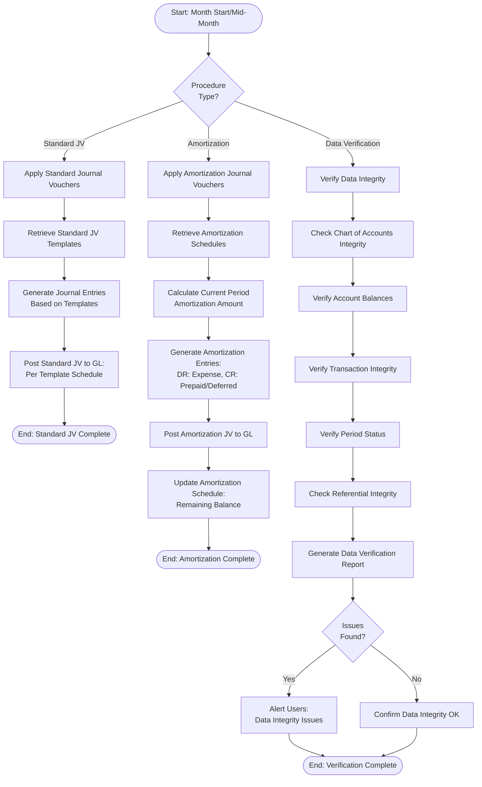
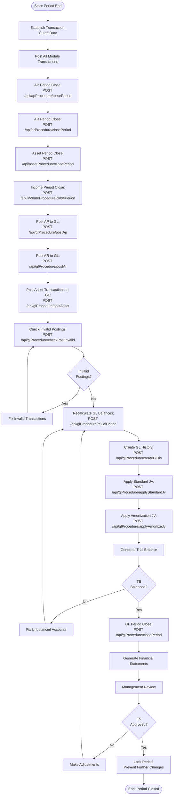
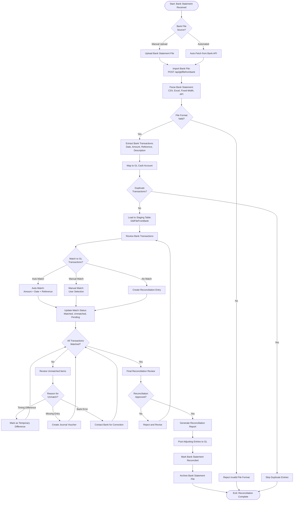
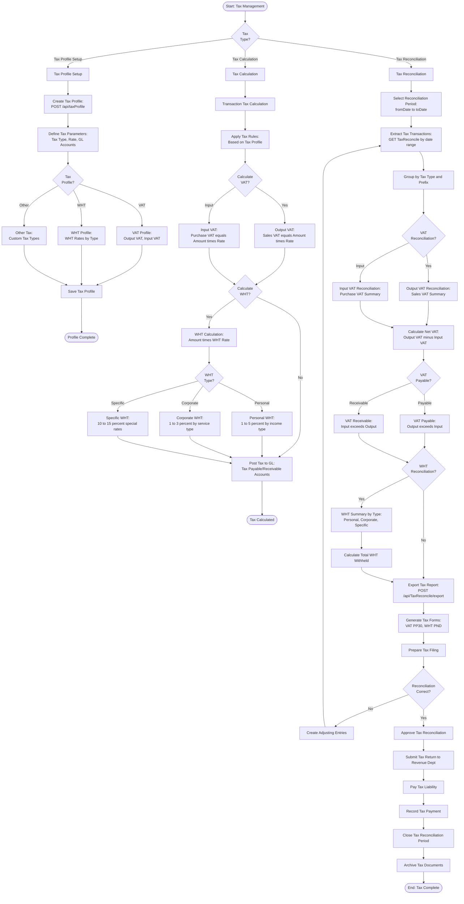

# Business Process Flows

> **Note**: This document has been corrected based on source code verification. Carmen.NET implements a direct invoice-to-pay workflow without Purchase Orders (PO) or Goods Receiving (GR). The system does not support three-way matching.

## Overview

This document describes the end-to-end business processes in Carmen.NET, covering the complete lifecycle from initial transaction through financial reporting.

## Procure-to-Pay (P2P) Process

### Overview
Vendor invoice-to-payment process with two invoice entry methods:
1. **Manual Entry**: Direct AP invoice entry by users (no PO/GR required)
2. **Automated Entry**: Third-party inventory system integration (Receiving → Invoice)



### Key Integration Points

| Step | System | Data Flow |
|------|--------|-----------|
| **Vendor Invoice Entry** | AP Module | Invoice → Validation |
| **AP Invoice** | AP Module | Invoice → GL Posting |
| **AP Payment** | AP Module | Payment → Bank Account |
| **Bank Reconciliation** | Cash Management | Bank Statement → GL |

### Controls and Validation

- **Invoice Validation**: Verify vendor, amount, and account coding
- **Approval Limits**: Invoice and payment approval based on amount thresholds
- **Duplicate Detection**: Prevent duplicate invoice entry (vendor + invoice number)
- **Payment Terms**: Enforce payment terms and discount periods
- **Segregation of Duties**: Different users for creation, approval, payment

## P2P Integration: Third-Party Receiving-to-Invoice

### Overview
Automated AP invoice creation from third-party inventory management systems (BlueLedgers, CarmenV3).



### Integration Details

**Supported Third-Party Systems**:
- **BlueLedgers**: Inventory management system
- **CarmenV3**: Legacy Carmen system integration

**API Endpoints**:
```
POST /api/interfaceBlueLedgers/postReceiving
POST /api/interfaceBlueLedgers/postReceivingToAsset
POST /api/interfaceBlueLedgers/setting
GET  /api/interfaceBlueLedgers/getSessionToken
```

**Data Flow**:
```
External Inventory System (BlueLedgers)
  ↓ (Goods Receipt Data: Date Range, Vendor, Items)
Carmen Interface API (Session Token Auth)
  ↓ (Validation: Period Check, Duplicate Check)
AP Invoice Auto-Creation (Source: Invt)
  ↓ (Workflow Approval if enabled)
GL Posting (DR: Inventory/Expense, CR: AP)
  ↓ (Optional: Asset Creation)
AP Payment Processing
```

### Key Integration Points

| Step | System | Data Flow |
|------|--------|-----------|
| **Goods Receipt** | BlueLedgers/CarmenV3 | Receiving Data → Carmen API |
| **Session Authentication** | Carmen Interface API | Token-based authentication |
| **Period Validation** | Carmen Inventory | Check closed inventory periods |
| **Invoice Creation** | Carmen AP Module | Auto-create from receiving data |
| **Workflow Processing** | Carmen Workflow Engine | Optional approval workflow |
| **GL Posting** | Carmen GL Module | Inventory/Expense → AP |
| **Asset Creation** | Carmen Asset Module | Pre-asset from receiving |

### Integration Parameters

**ParamPostReceiving**:
```json
{
  "fromDate": "2025-01-01",
  "toDate": "2025-01-31",
  "forceUpdate": false
}
```

**Settings Configuration**:
- `CheckPeriodInventoryCloseBeforePost`: Validate inventory period status
- `SessionToken`: API authentication token
- `WorkflowEnabled`: Enable/disable approval workflow

### Controls and Validation

- **Session Authentication**: Token-based API security
- **Period Check**: Prevent posting to closed inventory periods
- **Duplicate Prevention**: Check if receiving already posted (date range + source)
- **Workflow Integration**: Optional approval for auto-created invoices
- **Data Validation**: Verify vendor exists, items valid, amounts correct
- **Source Tracking**: Mark invoices with source = "Invt" for audit trail
- **Asset Integration**: Automatically create pre-assets for asset purchases
- **Force Update**: Override option for reprocessing (use with caution)

### Use Cases

| Use Case | Workflow |
|----------|----------|
| **Regular Goods Receipt** | BlueLedgers receiving → Auto-create AP invoice → Approve → Post to GL |
| **Asset Purchase** | BlueLedgers receiving → Auto-create AP invoice → Create pre-asset → Post to GL |
| **With Approval** | Receiving → Draft invoice → Workflow approval → Post to GL |
| **Without Approval** | Receiving → Auto-create and post invoice → Payment processing |
| **Period Closed** | Receiving → Period validation fails → Reject posting |
| **Duplicate Receipt** | Receiving → Duplicate check → Skip processing |

## PMS-to-Cash Revenue Cycle (Hospitality Industry)

> **Note**: Carmen.NET is designed for the hospitality industry and integrates with Property Management Systems (PMS). There is NO traditional Order-to-Cash process with sales quotations or sales orders. Revenue originates from PMS systems.

### Overview
Hospitality revenue cycle integrating PMS folio data through AR billing to cash collection.



### PMS Integration Details

**Supported PMS Systems**:
- Shiji (Opera)
- HotelLogix
- HotelTime
- Generic PMS (via file/API interface)

**Integration Methods**:
1. **File-Based**: CSV/JSON files exported from PMS
2. **API Integration**: Real-time API calls from PMS
3. **DataBank Storage**: Staging area for PMS data validation

**PMS Data Flow**:
```
PMS System
  ↓ (Export: Daily/Real-time)
Interface DataBank (Staging)
  ↓ (Validation & Mapping)
AR Folio Entries
  ↓ (Aggregation)
AR Invoice
  ↓ (Collection)
AR Receipt
  ↓ (Posting)
GL Revenue & Cash Accounts
```

### Key Integration Points

| Step | System | Data Flow |
|------|--------|-----------|
| **PMS Export** | External PMS | Folio Charges → Interface DataBank |
| **Account Mapping** | Interface Module | PMS Accounts → Carmen GL Accounts |
| **AR Folio** | AR Module | Folio Data → AR Transactions |
| **AR Contract** | AR Module | Customer → Billing Agreement |
| **AR Invoice** | AR Module | Folio Charges → Customer Invoice |
| **AR Receipt** | AR Module | Payment → Bank Deposit |
| **GL Posting** | GL Module | Revenue & Cash Recognition |

### Controls and Validation

- **Duplicate Detection**: Prevent duplicate folio import (FolioNo + FolioDate)
- **Account Mapping**: Validate PMS account mapping to Carmen GL accounts
- **Data Validation**: Verify customer exists, amounts are valid, dates are correct
- **Revenue Recognition**: Proper revenue recognition based on folio date
- **Collection Management**: Track aging and overdue amounts
- **Segregation of Duties**: Separate users for folio import, invoice approval, receipt posting
- **Reconciliation**: Daily reconciliation of PMS revenue to Carmen revenue

## Record-to-Report (R2R) Process

### Overview
Month-end close and financial reporting process.



### Key Integration Points

| Step | System | Data Flow |
|------|--------|-----------|
| **Sub-Ledger Reconciliation** | All Modules | Module Totals → GL Control Accounts |
| **Bank Reconciliation** | Cash Management | Bank Statement → GL Bank Account |
| **Accruals** | GL Module | Accrual Entries → P&L Accounts |
| **Financial Statements** | GL Reporting | GL Balances → FS Reports |
| **Period Close** | GL Module | Lock Period → Carry Forward |

### Controls and Validation

- **Transaction Cutoff**: All transactions dated in period must be posted
- **Sub-Ledger Reconciliation**: All module balances must equal GL control accounts
- **Bank Reconciliation**: All bank accounts must be reconciled
- **Trial Balance**: Total debits must equal total credits
- **Review and Approval**: Management must review and approve financial statements
- **Audit Trail**: Complete audit trail of all closing entries and adjustments

## Asset Lifecycle Process

### Overview
Complete asset management process from acquisition through disposal.



### Key Integration Points

| Step | System | Data Flow |
|------|--------|-----------|
| **Asset Acquisition** | AP Module | AP Invoice → Asset Register |
| **Depreciation** | Asset Module | Depreciation Schedule → GL |
| **Disposal** | Asset Module | Disposal Entry → GL |
| **Physical Verification** | Asset Module | Physical Count → Asset Register |

### Controls and Validation

- **Authorization**: Capital expenditure approval before purchase
- **Asset Tagging**: All assets must have physical tags
- **Custodian Assignment**: All assets assigned to responsible custodian
- **Depreciation Calculation**: Automatic depreciation based on category rules
- **Physical Verification**: Annual physical count and reconciliation
- **Disposal Approval**: Management approval for all disposals
- **Gain/Loss Calculation**: Accurate calculation of disposal gain/loss

## Income Module Revenue Recognition (PMS Integration)

> **Note**: Income Module in Carmen.NET is designed to handle revenue from PMS systems for hospitality businesses. It tracks income sources, revenue recognition, and generates income invoices that integrate with AR.

### Overview
Income module receives data from PMS and manages revenue recognition for various income streams (room revenue, F&B, services, facilities).



### PMS Income Data Flow

**Income Data from PMS**:
```
PMS System (Shiji/HotelLogix/HotelTime)
  ↓ (Daily Export)
Income Categories:
  - Room Revenue (Guest Stays)
  - F&B Revenue (Restaurant, Bar, Room Service)
  - Service Revenue (Spa, Laundry, Business Center)
  - Facility Revenue (Meeting Rooms, Events)
  - Other Revenue (Parking, Minibar, etc.)
  ↓
Interface DataBank (Staging)
  ↓ (Validation & Mapping)
Income Module
  ↓ (Revenue Recognition)
Income Invoice
  ↓ (AR Integration)
AR Module → GL Revenue Accounts
```

### Revenue Recognition Methods

| Method | Use Case | Example |
|--------|----------|---------|
| **Point-in-Time** | Service delivered immediately | Daily room charges, F&B sales |
| **Deferred** | Payment received in advance | Advance deposits, package bookings |
| **Accrued** | Service delivered, not yet billed | Monthly service charges |
| **Straight-Line** | Over time period | Monthly membership fees |

### Key Integration Points

| Step | System | Data Flow |
|------|--------|-----------|
| **PMS Export** | External PMS | Income Data → Interface DataBank |
| **Income Recognition** | Income Module | Income Data → Revenue Schedule |
| **Income Invoice** | Income Module | Recognized Revenue → AR Invoice |
| **AR Integration** | AR Module | Income Invoice → AR Balance |
| **GL Posting** | GL Module | Revenue Recognition → Income Accounts |
| **Payment Collection** | AR Module | AR Receipt → Cash |

### Controls and Validation

- **PMS Data Validation**: Verify income data completeness and accuracy
- **Revenue Recognition Policy**: Compliance with accounting standards (IFRS 15/ASC 606)
- **Account Mapping**: Correct mapping of PMS income categories to GL revenue accounts
- **Deferred Revenue Tracking**: Accurate tracking of advance deposits and deferred amounts
- **Accrued Revenue**: Proper accrual of revenue for services delivered but not billed
- **Reconciliation**: Daily reconciliation of PMS income to Carmen revenue
- **Segregation of Duties**: Separate users for income import, recognition, and invoice approval

---

## GL Monthly Procedures

### Overview
Recurring GL procedures executed monthly for standard journal entries, amortization, and data integrity verification.



### Standard Journal Vouchers

**Purpose**: Automate recurring monthly journal entries (rent, depreciation, accruals)

**Process**:
1. **Template Setup**: Define standard JV templates with account codes, amounts, and schedules
2. **Monthly Execution**: Run `POST /api/glProcedure/applyStandardJv` with target date
3. **Journal Generation**: System generates journal vouchers based on active templates
4. **Auto-Posting**: Journals automatically posted to GL based on template settings

**Use Cases**:
- Monthly rent expense
- Insurance amortization
- Salary accruals
- Depreciation (if not using Asset module)
- Inter-company allocations

**API Endpoint**: `POST /api/glProcedure/applyStandardJv`

### Amortization Journal Vouchers

**Purpose**: Automate prepaid expense and deferred revenue amortization

**Process**:
1. **Amortization Setup**: Define amortization schedules for prepaid/deferred items
2. **Monthly Execution**: Run `POST /api/glProcedure/applyAmortizeJv` with target date
3. **Amount Calculation**: System calculates current period amortization amount
4. **Journal Generation**: Generate amortization entries (DR: Expense, CR: Prepaid/Deferred)
5. **Schedule Update**: Update remaining balance in amortization schedule

**Use Cases**:
- Prepaid insurance amortization
- Prepaid rent amortization
- Software license amortization
- Deferred revenue recognition
- Long-term contract amortization

**API Endpoint**: `POST /api/glProcedure/applyAmortizeJv`

### Data Integrity Verification

**Purpose**: Verify GL data integrity and identify potential issues

**Process**:
1. **Run Verification**: Execute `POST /api/glProcedure/verifyData`
2. **Integrity Checks**:
   - Chart of accounts structure
   - Account balance consistency
   - Transaction referential integrity
   - Period status validation
   - Sub-ledger to GL reconciliation
3. **Issue Detection**: Identify data integrity problems
4. **Reporting**: Generate detailed verification report

**Checks Performed**:
- Orphaned transactions (missing account references)
- Unbalanced journal entries
- Invalid account codes
- Period date mismatches
- Sub-ledger to GL variances
- Duplicate transaction detection

**API Endpoint**: `POST /api/glProcedure/verifyData`

---

## Detailed Period Close Procedures

### Overview
Comprehensive period close process coordinating all modules (AP, AR, Asset, Income, GL) with specific API procedures.



### Module-Specific Period Close

**AP Period Close** (`POST /api/apProcedure/closePeriod`)
- Close all open AP invoices for the period
- Validate all invoices are posted
- Prevent new invoices dated in closed period
- Generate AP aging report
- **Required Parameter**: `closeDate` (DateTime)

**AR Period Close** (`POST /api/arProcedure/closePeriod`)
- Close all open AR invoices for the period
- Validate all receipts are posted
- Prevent new invoices/receipts dated in closed period
- Generate AR aging report
- **Required Parameter**: `closeDate` (DateTime)

**Asset Period Close** (`POST /api/assetProcedure/closePeriod`)
- Calculate and post monthly depreciation
- Process all asset acquisitions and disposals
- Update asset register balances
- Generate asset depreciation report
- **Required Parameter**: Determined by system period

**Income Period Close** (`POST /api/incomeProcedure/closePeriod`)
- Process all HMS/PMS revenue for the period
- Post income invoices to AR
- Validate revenue recognition schedules
- Generate income summary report
- **Required Parameter**: Determined by system period

**HMS Revenue Posting** (`POST /api/incomeProcedure/postHmsRevenue`)
- Post HMS/PMS revenue to income module
- Create income invoices from PMS data
- Integrate with AR module
- Used for real-time or batch HMS revenue posting

### GL Posting Procedures

**Post AP to GL** (`POST /api/glProcedure/postAp`)
- Post AP invoices and payments to GL
- Create GL journal entries for AP transactions
- Update GL control accounts
- **Required Parameters**: `fromDate`, `toDate` (DateTime)

**Post AR to GL** (`POST /api/glProcedure/postAr`)
- Post AR invoices and receipts to GL
- Create GL journal entries for AR transactions
- Update GL control accounts
- **Required Parameters**: `fromDate`, `toDate` (DateTime)

**Post Asset to GL** (`POST /api/glProcedure/postAsset`)
- Post asset acquisitions, depreciation, and disposals to GL
- Combines depreciation and disposal posting
- Update GL fixed asset accounts
- **Required Parameters**: `fromDate`, `toDate` (DateTime)
- **Optional Parameter**: `forceUpdate` (bool) - Force reposting

**Post Asset Depreciation** (`POST /api/glProcedure/postAssetDepre`)
- Post depreciation expense to GL
- **Required Parameters**: `fromDate`, `toDate` (DateTime)

**Post Asset Disposal** (`POST /api/glProcedure/postAssetDisposal`)
- Post asset disposal gain/loss to GL
- **Required Parameters**: `fromDate`, `toDate` (DateTime)

### GL Validation and Recalculation

**Check Invalid Postings** (`POST /api/glProcedure/checkPostInvalid`)
- Validate transactions before posting
- Check for unbalanced entries
- Verify account codes exist
- Validate period status
- **Required Parameter**: List of transactions to validate

**Recalculate GL Balances** (`POST /api/glProcedure/reCalPeriod`)
- Recalculate account balances from transactions
- Fix balance discrepancies
- Update period balances
- **Required Parameter**: `toDate` (DateTime)
- **Wait Mode**: Synchronous, waits for completion

**Recalculate No Wait** (`POST /api/glProcedure/reCalPeriodNoWait`)
- Same as reCalPeriod but asynchronous
- Returns immediately, processes in background
- Use for large-scale recalculations

**Create GL History** (`POST /api/glProcedure/createGlHis`)
- Create GL account history for reporting
- Generate opening balances for new period
- Archive period transactions
- **Required Parameter**: `fromDate` (DateTime)

### GL Period Close

**Close GL Period** (`POST /api/glProcedure/closePeriod`)
- Final step in period close process
- Lock period to prevent further changes
- Generate closing balances
- Create opening balances for next period
- Perform final validations

**Required Pre-conditions**:
- All module period closes complete
- All transactions posted to GL
- Trial balance balanced
- All reconciliations complete
- Management approval received

### Integration with Asset Module

**Post Asset from AP** (`POST /api/assetProcedure/postAp`)
- Create asset register entries from AP invoices
- Used when assets are purchased via AP
- Automatically transfers asset acquisitions from AP to Asset module
- Updates both AP and Asset registers

### Controls and Validation

- **Period Lock**: Prevent transactions in closed periods
- **Sequential Close**: Modules must close in correct order
- **Balance Verification**: All postings must balance (DR = CR)
- **Referential Integrity**: All account codes must exist
- **Authorization**: Period close requires proper permissions
- **Audit Trail**: Complete log of all period close activities
- **Rollback Prevention**: Closed periods cannot be reopened without special authorization

---

## Bank Reconciliation Process

### Overview
Automated bank statement import and reconciliation process matching bank transactions with GL cash accounts.



### Bank File Import Process

**Purpose**: Import bank statement files from various sources and formats

**Process**:
1. **File Upload**: Upload bank statement file via `POST /api/gblfilefrombank`
2. **Format Detection**: System detects file format (CSV, Excel, Fixed-Width, TXT, API JSON)
3. **Parsing**: Parse bank transactions from file
4. **Validation**: Validate transaction data (date, amount, reference, description)
5. **Staging**: Load transactions to GblFileFromBank staging table
6. **Matching**: Match bank transactions to GL cash transactions

**Supported Bank File Formats**:
- CSV (Comma-Separated Values)
- Excel (XLS, XLSX)
- Fixed-Width Text Files
- Tab-Delimited Files
- JSON (API imports)

**API Endpoints**:
```
POST   /api/gblfilefrombank/search
GET    /api/gblfilefrombank
GET    /api/gblfilefrombank/{id}
POST   /api/gblfilefrombank
PUT    /api/gblfilefrombank/{id}
DELETE /api/gblfilefrombank/{id}
```

### Bank Reconciliation Matching

**Auto-Matching Rules**:
1. **Exact Match**: Amount + Date + Reference all match
2. **Amount + Date**: Amount and date match (reference may differ)
3. **Amount + Reference**: Amount and reference match (date within 3 days)
4. **Fuzzy Match**: Similar amounts within tolerance (±1%) and dates within 7 days

**Manual Matching**:
- User manually selects bank transaction and GL transaction to match
- System validates match and updates both records
- Audit trail maintained for manual matches

**Reconciliation Items**:
- **Outstanding Deposits**: Deposits in transit not yet cleared by bank
- **Outstanding Checks**: Checks issued but not yet cleared
- **Bank Charges**: Bank fees, service charges, interest charges
- **Bank Credits**: Interest income, collections, direct deposits
- **Errors**: Bank errors or GL entry errors requiring correction

### Controls and Validation

- **Duplicate Detection**: Prevent duplicate bank file imports
- **File Format Validation**: Verify file format before processing
- **Transaction Validation**: Validate date, amount, reference fields
- **Auto-Match Rules**: Configurable matching tolerance and rules
- **Approval Workflow**: Reconciliation requires approval before finalization
- **Audit Trail**: Complete log of all matching and reconciliation activities
- **Period Lock**: Prevent reconciliation of closed periods

### Key Integration Points

| Step | System | Data Flow |
|------|--------|-----------|
| **Bank File Import** | GblFileFromBank | Bank Statement → Staging Table |
| **Transaction Matching** | GL Module | Bank Transactions → GL Cash Transactions |
| **Adjusting Entries** | GL Module | Reconciliation Differences → Journal Entries |
| **Reporting** | GL Reporting | Reconciliation Status → Bank Rec Report |

---

## Tax Management Process

### Overview
Comprehensive tax management process covering tax profile setup, tax calculation, and tax reconciliation/reporting for VAT and Withholding Tax (WHT).



### Tax Profile Management

**Purpose**: Configure tax rates and rules for VAT, WHT, and other taxes

**Tax Profile Types**:
1. **VAT (Value Added Tax)**
   - Output VAT: 7% on sales (Thailand standard rate)
   - Input VAT: 7% on purchases (reclaimable)
   - Exempt VAT: 0% for exempt goods/services
   - Export VAT: 0% for exports

2. **WHT (Withholding Tax)**
   - Personal Services: 1-5% depending on service type
   - Corporate Services: 1-3% depending on service type
   - Rental Income: 5% withholding
   - Professional Fees: 3% withholding
   - Interest/Dividends: 10-15% withholding

3. **Other Taxes**
   - Specific Business Tax (SBT): For certain industries
   - Stamp Duty: For legal documents
   - Custom taxes based on requirements

**API Endpoints**:
```
POST   /api/taxProfile/search
GET    /api/taxProfile
GET    /api/taxProfile/{id}
POST   /api/taxProfile
PUT    /api/taxProfile/{id}
DELETE /api/taxProfile/{id}
```

### Tax Calculation Process

**VAT Calculation**:
- **Output VAT** (Sales): `Sale Amount × VAT Rate` → Credit to VAT Payable
- **Input VAT** (Purchases): `Purchase Amount × VAT Rate` → Debit to VAT Receivable
- **Net VAT**: `Output VAT - Input VAT` → Net Payable or Receivable

**WHT Calculation**:
- **WHT Amount**: `Gross Payment × WHT Rate` → Credit to WHT Payable
- **Net Payment**: `Gross Payment - WHT Amount` → Actual amount paid to vendor
- **WHT Certificate**: Issue to vendor for tax credit claim

**Integrated Tax Calculation**:
- AP invoices: Calculate Input VAT and WHT on purchases
- AR invoices: Calculate Output VAT on sales
- GL journals: Manual tax entries for adjustments

### Tax Reconciliation Process

**Purpose**: Reconcile tax transactions, prepare tax returns, and generate tax reports

**Process Steps**:
1. **Period Selection**: Select reconciliation period (monthly for VAT, various for WHT)
2. **Transaction Extraction**: Extract all tax transactions for period
3. **Tax Grouping**: Group by tax type, tax code, and prefix
4. **Reconciliation**: Reconcile tax accounts to transaction details
5. **Report Generation**: Generate tax reconciliation reports
6. **Export**: Export tax data for government filing

**API Endpoints**:
```
POST   /api/TaxReconcile/batch
GET    /api/TaxReconcile/{frDate}/{toDate}
POST   /api/TaxReconcile/export/{frDate}/{toDate}/{overWrite}
POST   /api/TaxReconcile/search
GET    /api/TaxReconcile/{id}
GET    /api/TaxReconcile/prefix/{prefix}
POST   /api/TaxReconcile
PUT    /api/TaxReconcile/{id}
DELETE /api/TaxReconcile/{id}
GET    /api/TaxReconcile/prefix
GET    /api/TaxReconcile
```

### Tax Reporting and Filing

**VAT Reporting (PP30)**:
- Monthly VAT return (PP30 form)
- Output VAT from sales
- Input VAT from purchases
- Net VAT payable/receivable
- Due date: 15th of following month

**WHT Reporting (PND Forms)**:
- PND 1: Personal income WHT
- PND 3: Corporate income WHT
- PND 53: Special WHT (e.g., dividends, interest)
- Monthly/annual filing depending on type
- WHT certificate issuance to vendors

**Export Functionality**:
- Export reconciliation data to CSV/Excel
- Generate government-required XML format
- Prepare supporting documentation
- Batch export for multiple tax types

### Controls and Validation

- **Tax Profile Validation**: Validate tax rates and GL account mappings
- **Calculation Accuracy**: Verify tax calculations before posting
- **Reconciliation**: Monthly reconciliation of tax accounts
- **Compliance**: Ensure compliance with Thai Revenue Department requirements
- **Audit Trail**: Complete log of all tax transactions and adjustments
- **Period Lock**: Prevent changes to filed tax periods
- **WHT Certificates**: Track and issue WHT certificates to vendors
- **Filing Deadlines**: Monitor and alert for tax filing deadlines

### Key Integration Points

| Step | System | Data Flow |
|------|--------|-----------|
| **Tax Profile Setup** | Tax Module | Tax Rules → System Configuration |
| **Tax Calculation** | AP/AR/GL Modules | Transactions → Tax Amounts |
| **Tax Reconciliation** | Tax Module | Tax Transactions → Reconciliation Report |
| **Tax Filing** | Tax Module | Reconciliation Data → Government Forms |
| **Tax Payment** | GL Module | Tax Liability → Payment Entry |

---

## Key Process Metrics (KPIs)

### Procure-to-Pay (P2P)

| Metric | Target | Measurement |
|--------|--------|-------------|
| **Invoice Processing Time** | < 3 days | Receipt to posting |
| **Invoice Accuracy** | > 98% | Correct invoices / Total invoices |
| **Payment Accuracy** | > 99% | Correct payments / Total payments |
| **Early Payment Discount Capture** | > 80% | Discounts taken / Discounts available |
| **Days Payable Outstanding (DPO)** | 45-60 days | AP Balance / (COGS/365) |

### PMS-to-Cash (Revenue Cycle)

| Metric | Target | Measurement |
|--------|--------|-------------|
| **PMS Data Import Success** | > 99% | Successful imports / Total imports |
| **Folio Processing Time** | < 1 day | PMS export to AR invoice |
| **Account Mapping Accuracy** | > 99% | Correct mappings / Total transactions |
| **Invoice Accuracy** | > 98% | Correct invoices / Total invoices |
| **Days Sales Outstanding (DSO)** | < 30 days | AR Balance / (Revenue/365) |
| **Collection Effectiveness** | > 95% | Collections / Billed amount |
| **PMS-Carmen Revenue Variance** | < 1% | Variance / Total PMS revenue |

### Income Module

| Metric | Target | Measurement |
|--------|--------|-------------|
| **Revenue Recognition Accuracy** | > 99% | Correct recognition / Total recognition |
| **Deferred Revenue Balance** | Reconciled | Monthly reconciliation completion |
| **Income Invoice Processing** | < 1 day | Recognition to invoice generation |
| **AR Integration Success** | 100% | Successful AR posts / Total posts |
| **PMS Income Reconciliation** | 100% | Daily reconciliation completion |

### Record-to-Report (R2R)

| Metric | Target | Measurement |
|--------|--------|-------------|
| **Month-End Close Time** | < 5 days | Period end to close completion |
| **Reconciliation Completion** | 100% | Reconciled accounts / Total accounts |
| **Adjusting Entries** | < 10 | Number of manual adjustments |
| **Trial Balance Accuracy** | 100% | First-time balanced trial balance |
| **Report Timeliness** | 100% | On-time report delivery |
| **Audit Adjustments** | < 5 | Audit adjustments per year |

### Asset Lifecycle

| Metric | Target | Measurement |
|--------|--------|-------------|
| **Asset Utilization** | > 80% | In-service assets / Total assets |
| **Physical Verification** | 100% | Assets verified / Total assets |
| **Depreciation Accuracy** | > 99% | Correct depreciation / Total depreciation |
| **Disposal Processing Time** | < 7 days | Approval to disposal completion |
| **Asset Tracking Accuracy** | > 98% | Matched assets / Physical count |

### Bank Reconciliation

| Metric | Target | Measurement |
|--------|--------|-------------|
| **Bank Rec Completion** | 100% | Bank accounts reconciled / Total accounts |
| **Reconciliation Timeliness** | < 5 days | Days from statement date to completion |
| **Auto-Match Success Rate** | > 85% | Auto-matched transactions / Total transactions |
| **Unreconciled Items** | < 5% | Outstanding items / Total transactions |
| **Bank File Import Success** | > 99% | Successful imports / Total imports |

### Tax Management

| Metric | Target | Measurement |
|--------|--------|-------------|
| **Tax Calculation Accuracy** | > 99.5% | Correct tax calculations / Total calculations |
| **VAT Reconciliation** | 100% | Monthly VAT reconciliation completion |
| **WHT Certificate Issuance** | 100% | WHT certificates issued / WHT transactions |
| **Tax Filing Timeliness** | 100% | On-time filings / Total filings |
| **Tax Compliance** | 100% | Compliant filings / Total filings |
| **Tax Reconciliation Variance** | < 0.5% | Variance / Total tax liability |

---

**Document Version**: 4.0
**Last Updated**: 2025-10-07
**Status**: Phase 3 - Business Logic & Workflow Analysis (VERIFIED COMPLETE)

**Change Log**:
- **v4.0 (2025-10-07)**: BANK & TAX MODULES ADDED - Complete bank and tax process documentation
  - Added "Bank Reconciliation Process" section with comprehensive workflows
  - Documented bank file import process (GblFileFromBank module)
  - Added bank reconciliation matching rules (auto-match and manual match)
  - Added "Tax Management Process" section with VAT and WHT processes
  - Documented Tax Profile management (TaxProfile module)
  - Documented Tax Reconciliation process (TaxReconcile module)
  - Added Thai tax compliance documentation (PP30, PND forms)
  - 23 API endpoints documented: 6 bank + 17 tax
  - Added Bank Reconciliation KPIs
  - Added Tax Management KPIs
  - All procedures validated against source code - NO fictional processes
- **v3.0 (2025-10-07)**: COMPREHENSIVE UPDATE - Added missing procedures from source code
  - Added "GL Monthly Procedures" section (Standard JV, Amortization, Data Verification)
  - Added "Detailed Period Close Procedures" with all API endpoints
  - Documented 19 GL procedure endpoints: verifyData, closePeriod, reCalPeriod, reCalPeriodNoWait, createGlHis, postAp, postAr, postAsset, postAssetDepre, postAssetDisposal, applyStandardJv, applyAmortizeJv, checkPostInvalid
  - Documented AP, AR, Asset, and Income period close procedures
  - Added Asset postAp procedure (asset acquisition from AP)
  - Added Income postHmsRevenue procedure (HMS/PMS revenue posting)
  - All procedures validated against source code - NO fictional processes
- **v2.0 (2025-10-07)**: MAJOR CORRECTION - Removed fictional Order-to-Cash (O2C) process
  - Carmen.NET has NO sales quotations, sales orders, or traditional O2C workflow
  - System is designed for hospitality industry with PMS integration
  - Replaced O2C with accurate "PMS-to-Cash Revenue Cycle" workflow
  - Updated Income Module documentation to reflect PMS data source
  - Added PMS integration details (Shiji, HotelLogix, HotelTime)
  - Updated KPIs to reflect actual business processes
- **v1.0 (2025-10-06)**: Initial documentation with incorrect O2C assumptions
