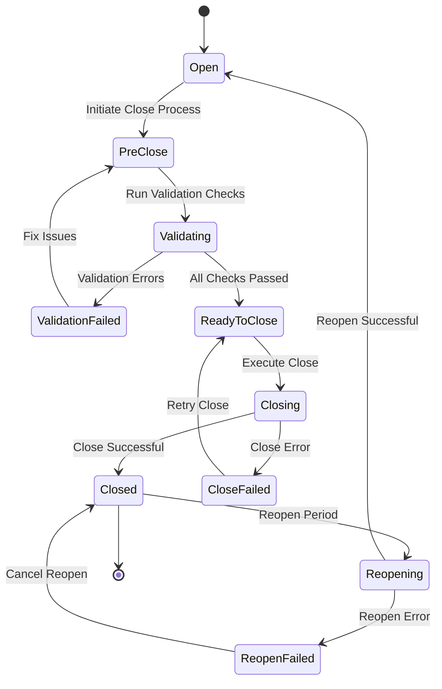
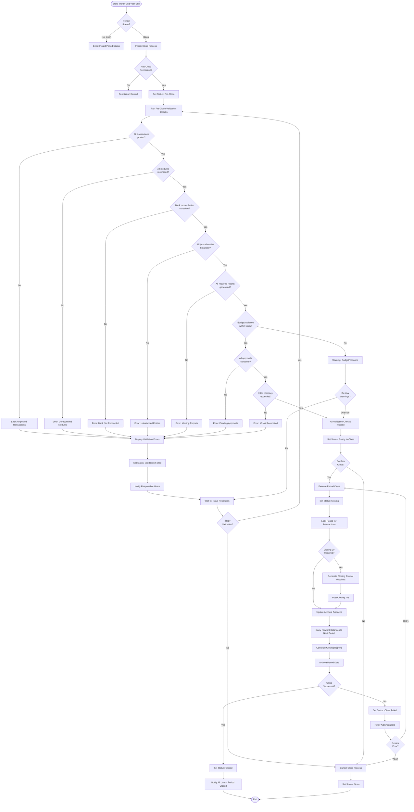
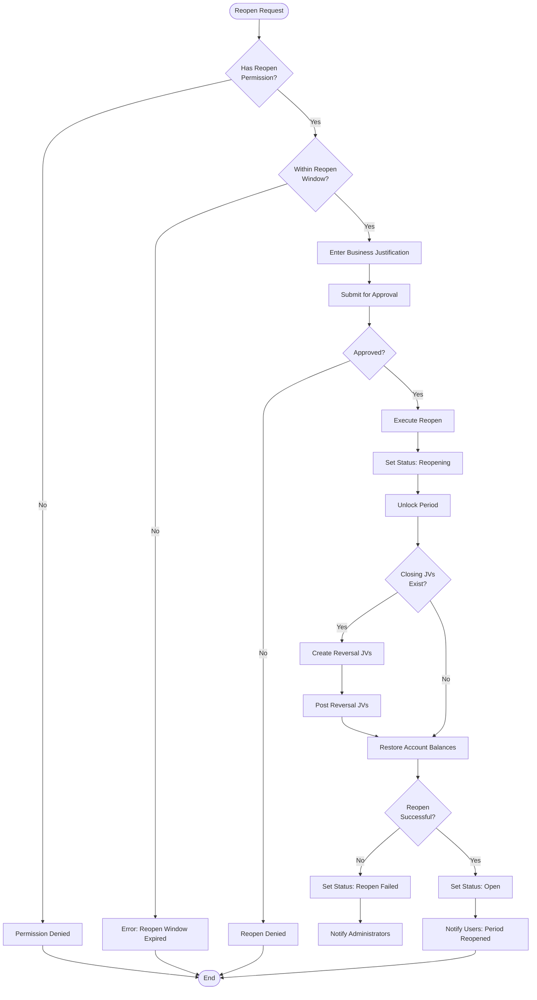

# GL Period Close Workflow

## Overview

The GL Period Close workflow manages the month-end/year-end closing process, ensuring all transactions are properly recorded, reconciled, and locked before advancing to the next accounting period.

## Workflow States



## Status Codes

| Status | Value | Description | Allowed Actions |
|--------|-------|-------------|--------------------|
| **Open** | 0 | Period is open for transactions | Post transactions, Initiate close |
| **Pre-Close** | 1 | Close process initiated, validation in progress | Run checks, Fix issues |
| **Validating** | 2 | System running validation checks | Monitor progress |
| **Validation Failed** | 3 | Validation checks failed | Review errors, Fix issues |
| **Ready to Close** | 4 | All validations passed, ready to close | Execute close |
| **Closing** | 5 | Close process executing | Monitor progress |
| **Closed** | 6 | Period closed and locked | View only, Reopen if authorized |
| **Close Failed** | 7 | Close process encountered error | Review error, Retry |
| **Reopening** | 8 | Reopen process executing | Monitor progress |
| **Reopen Failed** | 9 | Reopen process encountered error | Review error, Retry |

## Workflow Diagram



## Pre-Close Validation Checks

### Critical Validations (Must Pass)

1. **All Transactions Posted**
   - No draft or pending transactions in any module
   - All batch uploads completed
   - All interface transactions processed

2. **Module Reconciliation**
   - AP: All invoices and payments reconciled
   - AR: All invoices and receipts reconciled
   - Asset: All asset transactions posted
   - Income: All revenue transactions recorded

3. **Bank Reconciliation**
   - All bank accounts reconciled
   - Outstanding items documented
   - Reconciliation reports generated

4. **Journal Entry Balance**
   - All JVs debits = credits
   - No unbalanced entries
   - All temporary accounts cleared

5. **Approvals Complete**
   - No pending approval workflows
   - All high-value transactions approved
   - All adjustments authorized

6. **Inter-Company Reconciliation**
   - IC transactions balanced
   - IC eliminations processed
   - IC clearing accounts reconciled

### Warning Validations (Override Allowed)

1. **Budget Variance**
   - Variance >10% flagged for review
   - Department budget overruns
   - Material variance explanations

2. **Aging Analysis**
   - Excessive aged receivables
   - Excessive aged payables
   - Unusual aging patterns

3. **Reporting Compliance**
   - All scheduled reports generated
   - Management reports reviewed
   - Regulatory reports prepared

## Business Rules

### Period Close Rules

1. **Sequential Close**:
   - Periods must be closed in chronological order
   - Cannot close Period N+1 before Period N
   - Year-end close requires all months closed

2. **Transaction Cutoff**:
   - Transaction date must be within period
   - No backdated transactions after close
   - Adjusting entries require reopen

3. **Access Control**:
   - Only authorized users can close periods
   - Segregation of duties enforced
   - Close actions logged and audited

4. **Reopen Rules**:
   - Requires higher authorization than close
   - Must provide business justification
   - Limited reopen window (e.g., 5 business days)
   - Cannot reopen after external reporting

### Permission Requirements

| Action | Permission | Permission Code |
|--------|------------|--------------------|
| **View Status** | View permission | `GL.Period.View` |
| **Initiate Close** | Close permission | `GL.Period.Close` |
| **Execute Close** | Close permission | `GL.Period.Close` |
| **Reopen Period** | Reopen permission | `GL.Period.Reopen` |
| **Override Warnings** | Override permission | `GL.Period.Override` |
| **View Close Log** | Audit permission | `GL.Period.Audit` |

## GL Posting - Year-End Close

### Closing Journal Vouchers

**Close Revenue Accounts**:
```
DR: Revenue Accounts                       XXX.XX
CR: Retained Earnings                      XXX.XX
```

**Close Expense Accounts**:
```
DR: Retained Earnings                      XXX.XX
CR: Expense Accounts                       XXX.XX
```

**Close Dividend Accounts**:
```
DR: Retained Earnings                      XXX.XX
CR: Dividends Declared                     XXX.XX
```

### Balance Carry-Forward

- **Balance Sheet Accounts**: Carry forward ending balance
- **Income Statement Accounts**: Reset to zero, transfer to RE
- **Statistical Accounts**: Carry forward or reset based on configuration

## Multi-Tenant Isolation

All period close operations enforce tenant isolation:
- `FncBase.ApplyTenantIfUseTenant(useTenant)` applied to all queries
- Each tenant has independent period status
- Cross-tenant close operations not allowed
- Tenant-specific close calendars supported

## Period Reopen Process

### Reopen Workflow



### Reopen Authorization Matrix

| Reopen Scenario | Approver | Time Limit |
|----------------|----------|------------|
| **Same Month** | Controller | 5 business days |
| **Prior Month** | CFO | 10 business days |
| **Prior Quarter** | CFO + Audit Committee | 15 business days |
| **Prior Year** | Board Approval | 30 business days |

## Error Handling

### Common Errors

| Error | Cause | Resolution |
|-------|-------|------------|
| **Unposted Transactions** | Draft/pending transactions exist | Post all transactions or delete drafts |
| **Unbalanced JVs** | Debit ≠ Credit | Correct journal entries |
| **Bank Not Reconciled** | Bank reconciliation incomplete | Complete bank reconciliation |
| **Pending Approvals** | Unapproved transactions exist | Approve or reject pending items |
| **IC Not Balanced** | Inter-company mismatch | Reconcile inter-company accounts |
| **Permission Denied** | User lacks close permission | Request permission from administrator |
| **Period Sequence Error** | Prior period not closed | Close prior periods first |
| **Reopen Window Expired** | Too late to reopen | Submit exception request to CFO |

## API Endpoints

| Endpoint | Method | Purpose | Permission |
|----------|--------|---------|------------|
| `/api/gl/period/list` | GET | List all periods | View |
| `/api/gl/period/{id}` | GET | Get period details | View |
| `/api/gl/period/status/{id}` | GET | Get period status | View |
| `/api/gl/period/initiate-close/{id}` | POST | Initiate close process | Close |
| `/api/gl/period/validate/{id}` | POST | Run validation checks | Close |
| `/api/gl/period/execute-close/{id}` | POST | Execute period close | Close |
| `/api/gl/period/reopen/{id}` | POST | Reopen closed period | Reopen |
| `/api/gl/period/close-log/{id}` | GET | Get close audit log | Audit |
| `/api/gl/period/validation-report/{id}` | GET | Get validation report | View |

## Reporting

### Pre-Close Reports

1. **Trial Balance**: Verify all accounts balanced
2. **Unposted Transactions**: List all draft/pending items
3. **Bank Reconciliation Status**: All bank accounts reconciled
4. **Approval Status**: Pending approvals by module
5. **Budget Variance**: Actual vs. Budget comparison
6. **Aging Analysis**: AP/AR aging reports
7. **Inter-Company Reconciliation**: IC balances by entity

### Post-Close Reports

1. **Financial Statements**: Balance Sheet, Income Statement, Cash Flow
2. **Management Reports**: KPIs, variance analysis, trends
3. **Regulatory Reports**: Tax filings, statutory reporting
4. **Audit Trail**: All transactions posted during period
5. **Close Summary**: Close process log and timeline

## Best Practices

1. **Pre-Close Preparation**:
   - Establish close calendar with key dates
   - Communicate deadlines to all departments
   - Run validation checks daily during close window
   - Monitor outstanding items dashboard

2. **Close Execution**:
   - Follow standardized close checklist
   - Document all manual adjustments
   - Review financial statements before finalizing
   - Obtain management sign-off

3. **Quality Control**:
   - Perform month-over-month variance analysis
   - Review unusual account balances
   - Verify accruals and deferrals
   - Cross-check sub-ledger to GL reconciliation

4. **Communication**:
   - Daily status updates during close
   - Escalate issues immediately
   - Document lessons learned
   - Continuous process improvement

5. **Audit Readiness**:
   - Maintain complete audit trail
   - Store supporting documentation
   - Document close procedures
   - Retain period close reports

---

**Document Version**: 1.0
**Last Updated**: 2025-10-06
**Status**: Phase 3 - Business Logic & Workflow Analysis
