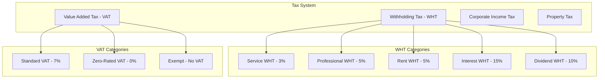
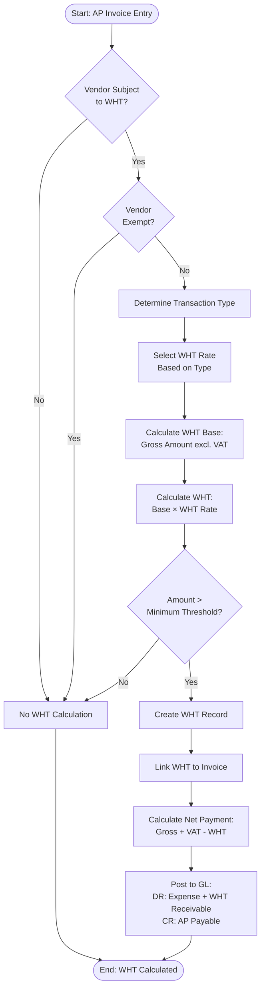
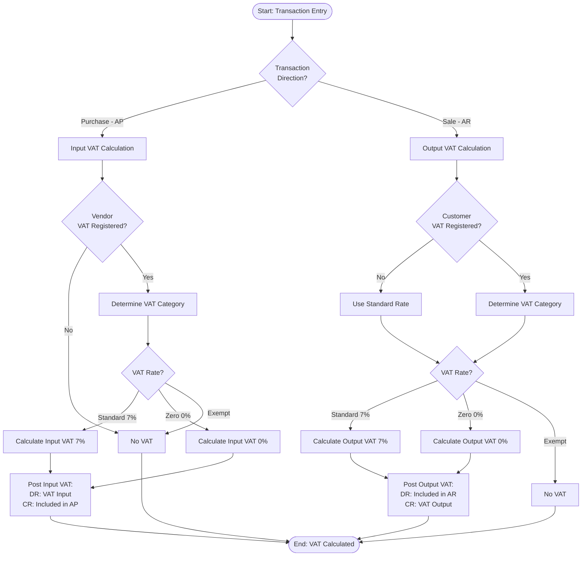
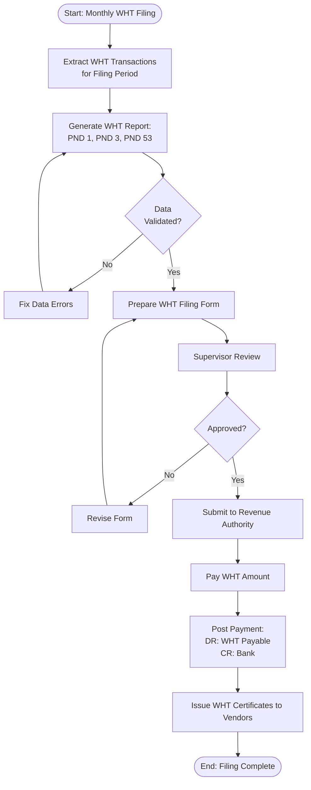
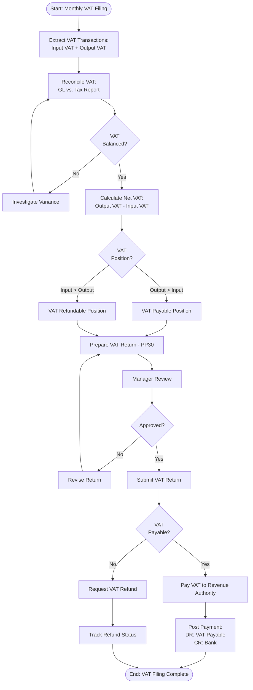

# Tax Calculation Rules and Workflows

## Overview

This document defines the tax calculation rules, withholding tax (WHT) processing, Value Added Tax (VAT) handling, and tax compliance workflows used in Carmen.NET.

## Tax System Architecture

### Tax Types Supported



## Withholding Tax (WHT) Rules

### WHT Calculation Principles

**Tax Base Determination**:
- WHT calculated on gross amount (before VAT)
- Excludes VAT from WHT base
- Includes all taxable service fees and charges

**Formula**:
```
WHT Amount = Gross Amount (excl. VAT) × WHT Rate
Net Payment = Gross Amount + VAT - WHT Amount
```

### WHT Rate Matrix

| Transaction Type | WHT Rate | Tax Code | Applies To |
|------------------|----------|----------|------------|
| **Professional Services** | 5% | WHT05 | Consultants, Advisors, Auditors |
| **Service Fees** | 3% | WHT03 | General services, Maintenance |
| **Rent** | 5% | WHT05 | Property rental, Equipment lease |
| **Interest** | 15% | WHT15 | Loan interest, Bank interest |
| **Dividend** | 10% | WHT10 | Dividend distributions |
| **Advertising** | 2% | WHT02 | Advertising and marketing services |
| **Transportation** | 1% | WHT01 | Freight and logistics services |
| **Royalty** | 5% | WHT05 | Licensing and royalty fees |

### WHT Exemption Rules

**Exempt Entities**:
- Government agencies and departments
- Charitable organizations (registered)
- Educational institutions (certified)
- Hospitals and medical facilities
- Foreign entities with tax treaty benefits

**Exemption Documentation**:
- Tax exemption certificate from revenue authority
- Valid tax ID with exemption status
- Tax treaty certificate (for foreign entities)
- Annual renewal of exemption status

### WHT Calculation Workflow



### WHT GL Posting Examples

**Service Invoice with WHT**:
```
Transaction: Professional Services
Gross Amount: 100,000.00
VAT (7%): 7,000.00
WHT (5%): 5,000.00
Net Payment: 102,000.00

GL Posting:
DR: Professional Expense                    100,000.00
DR: VAT Input                                 7,000.00
DR: WHT Receivable (Tax Asset)                5,000.00
CR: AP Payable (Net)                        112,000.00

Payment Posting:
DR: AP Payable                              112,000.00
CR: Bank Account                            102,000.00
CR: WHT Payable (to Revenue Authority)       10,000.00
```

**Rent Invoice with WHT**:
```
Transaction: Property Rent
Gross Amount: 50,000.00
VAT: Exempt
WHT (5%): 2,500.00
Net Payment: 47,500.00

GL Posting:
DR: Rent Expense                             50,000.00
DR: WHT Receivable                            2,500.00
CR: AP Payable (Net)                         52,500.00
```

## Value Added Tax (VAT) Rules

### VAT Calculation Principles

**Tax Inclusive vs. Exclusive**:
- **Tax Exclusive**: VAT calculated on net amount, added to total
- **Tax Inclusive**: VAT included in total, backed out from total

**Formula (Tax Exclusive)**:
```
VAT Amount = Net Amount × VAT Rate
Gross Amount = Net Amount + VAT Amount
```

**Formula (Tax Inclusive)**:
```
Net Amount = Gross Amount / (1 + VAT Rate)
VAT Amount = Gross Amount - Net Amount
```

### VAT Rate Matrix

| Category | VAT Rate | Tax Code | Description |
|----------|----------|----------|-------------|
| **Standard Rated** | 7% | VAT07 | Most goods and services |
| **Zero-Rated** | 0% | VAT00 | Exports, International transport, Basic foods |
| **Exempt** | N/A | EXEMPT | Financial services, Education, Healthcare |

### VAT Transaction Types

#### Input VAT (VAT Receivable)
- VAT paid on purchases (AP transactions)
- Recoverable from revenue authority
- GL Account: VAT Input / VAT Receivable (Asset)

#### Output VAT (VAT Payable)
- VAT collected on sales (AR transactions)
- Payable to revenue authority
- GL Account: VAT Output / VAT Payable (Liability)

### VAT Calculation Workflow



### VAT GL Posting Examples

**Purchase Invoice (Input VAT)**:
```
Transaction: Office Supplies Purchase
Net Amount: 10,000.00
VAT (7%): 700.00
Gross Amount: 10,700.00

GL Posting:
DR: Office Supplies Expense               10,000.00
DR: VAT Input (Recoverable)                  700.00
CR: AP Payable                            10,700.00
```

**Sales Invoice (Output VAT)**:
```
Transaction: Product Sale
Net Amount: 50,000.00
VAT (7%): 3,500.00
Gross Amount: 53,500.00

GL Posting:
DR: AR Receivable                         53,500.00
CR: Sales Revenue                         50,000.00
CR: VAT Output (Payable)                   3,500.00
```

**Zero-Rated Export**:
```
Transaction: Export Sale
Net Amount: 100,000.00
VAT (0%): 0.00
Gross Amount: 100,000.00

GL Posting:
DR: AR Receivable                        100,000.00
CR: Export Sales Revenue                 100,000.00
CR: VAT Output (0%)                            0.00
```

## Combined WHT and VAT Calculation

### Calculation Sequence

1. **Calculate VAT** on net amount
2. **Calculate WHT** on net amount (excluding VAT)
3. **Calculate Total** = Net + VAT - WHT

### Example: Service Invoice with Both WHT and VAT

```
Transaction: Professional Services
Net Amount: 100,000.00

Step 1 - Calculate VAT:
VAT (7%): 100,000.00 × 7% = 7,000.00

Step 2 - Calculate WHT:
WHT (5%): 100,000.00 × 5% = 5,000.00

Step 3 - Calculate Totals:
Gross Amount: 100,000.00 + 7,000.00 = 107,000.00
Net Payment: 107,000.00 - 5,000.00 = 102,000.00

GL Posting:
DR: Professional Expense                    100,000.00
DR: VAT Input                                 7,000.00
DR: WHT Receivable                            5,000.00
CR: AP Payable                              112,000.00

Payment:
DR: AP Payable                              112,000.00
CR: Bank Account (actual payment)           102,000.00
CR: WHT to be remitted                       10,000.00
```

## Tax Filing and Compliance

### WHT Filing Process



### WHT Filing Forms (Thailand Example)

| Form | Description | Filing Deadline | Applies To |
|------|-------------|-----------------|------------|
| **PND 1** | WHT on salary and wages | 7th of following month | Employee salaries |
| **PND 3** | WHT on payments to companies | 7th of following month | Corporate vendors |
| **PND 53** | WHT on payments to individuals | 7th of following month | Individual vendors |
| **PND 54** | Annual WHT summary | End of February | Annual reconciliation |

### VAT Filing Process



### VAT Filing Forms (Thailand Example)

| Form | Description | Filing Deadline | Applies To |
|------|-------------|-----------------|------------|
| **PP30** | Monthly VAT return | 15th of following month | All VAT registered entities |
| **PP36** | VAT return for small businesses | Quarterly | Small businesses (turnover <1.8M) |

## Tax Compliance Controls

### Validation Controls

1. **Tax Registration Validation**:
   - Verify vendor/customer tax ID format
   - Validate VAT registration status
   - Check WHT exemption certificates

2. **Rate Validation**:
   - Verify correct WHT rate applied
   - Validate VAT rate based on product/service category
   - Alert for rate changes or updates

3. **Calculation Validation**:
   - Automated calculation checks
   - Rounding validation (standard 2 decimal places)
   - Cross-check tax amounts against base amounts

4. **Filing Validation**:
   - Reconciliation of tax accounts before filing
   - Validation of filing completeness
   - Approval workflow for tax returns

### Audit Trail Requirements

**Required Documentation**:
- Original tax invoices (WHT and VAT)
- WHT certificates issued and received
- VAT tax invoices with proper format
- Tax filing forms and submission receipts
- Payment confirmations to revenue authority

**Retention Period**: 7 years minimum (or per local regulation)

## Tax Report Suite

### WHT Reports

1. **WHT Payable Report**: Summary of WHT withheld by period
2. **WHT by Vendor**: Detail of WHT by vendor and tax type
3. **WHT Certificate Register**: All WHT certificates issued
4. **WHT Filing Report**: Ready-to-file format (PND forms)

### VAT Reports

1. **VAT Input Report**: Detail of input VAT by vendor
2. **VAT Output Report**: Detail of output VAT by customer
3. **VAT Reconciliation**: GL vs. Tax filing reconciliation
4. **VAT Filing Report**: Ready-to-file format (PP30)

### Tax Analysis Reports

1. **Effective Tax Rate Analysis**: Actual tax vs. standard rate
2. **Tax Compliance Dashboard**: Filing status and deadlines
3. **Tax Variance Report**: Unusual tax patterns or exceptions
4. **Tax Credit Utilization**: WHT and VAT credit usage trends

## API Endpoints

| Endpoint | Method | Purpose |
|----------|--------|---------|
| `/api/tax/wht/calculate` | POST | Calculate WHT amount |
| `/api/tax/vat/calculate` | POST | Calculate VAT amount |
| `/api/tax/wht/certificate/{invoiceId}` | GET | Generate WHT certificate |
| `/api/tax/wht/filing-report` | GET | WHT filing report |
| `/api/tax/vat/filing-report` | GET | VAT filing report |
| `/api/tax/rate/list` | GET | Get current tax rates |
| `/api/tax/exemption/validate` | POST | Validate tax exemption |

## Best Practices

### Tax Configuration

1. **Maintain Tax Rates**: Regular review and update of tax rates
2. **Vendor/Customer Setup**: Accurate tax registration data
3. **Product/Service Classification**: Correct VAT category assignment
4. **Exemption Management**: Current exemption certificates on file

### Tax Processing

1. **Automated Calculation**: Use system tax calculation, minimize manual
2. **Validation Rules**: Enable all tax validation controls
3. **Regular Reconciliation**: Monthly reconciliation of tax accounts
4. **Timely Filing**: File tax returns before deadline
5. **Document Retention**: Maintain complete tax documentation

### Compliance Management

1. **Stay Current**: Monitor tax law changes and updates
2. **Professional Review**: Periodic review by tax professionals
3. **Audit Readiness**: Maintain complete audit trail
4. **Training**: Regular training for accounting staff on tax rules
5. **Quality Control**: Management review of tax filings before submission

---

**Document Version**: 1.0
**Last Updated**: 2025-10-06
**Status**: Phase 3 - Business Logic & Workflow Analysis
