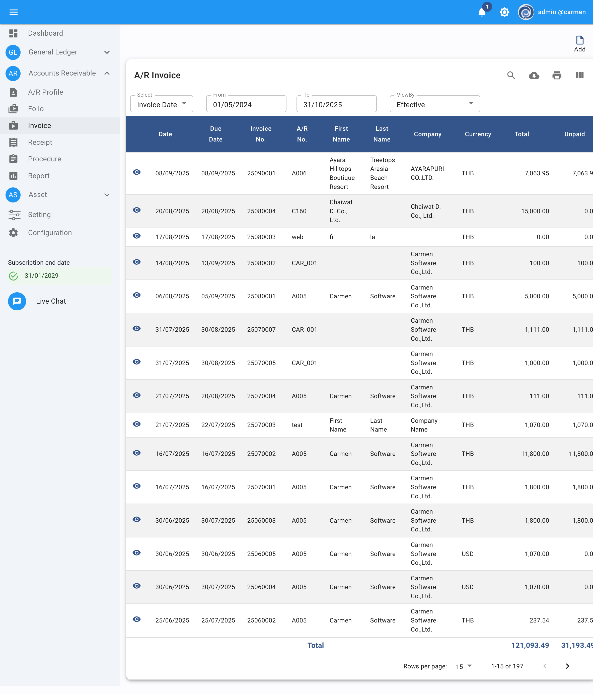

# Carmen 4 Screenshot Inventory

## Overview
Complete inventory of all captured screenshots for Carmen 4 ERP documentation.

**Total Screenshots**: 39
**Capture Date**: October 8, 2025
**System**: Carmen 4 (dev.carmen4.com)
**Business Unit**: carmen, carmencloud
**User**: admin

---

## Core/Dashboard (1 screenshot)

### `/docs/screenshots/core/01-dashboard.png`
- **Description**: Main dashboard with statistical highlights, annual revenue chart, P&L summary, daily monitor accounts, actual vs budget, payable/receivable aging, income statement, and budget trend
- **Content**: Occupancy, ADR, RevPAR, TRevPAR metrics, multiple financial charts and widgets
- **Use in**: system-overview.md, executive-summary.md

---

## General Ledger Module (10 screenshots)

### `/docs/screenshots/gl/02-journal-voucher-list.png`
- **Description**: Journal Voucher list showing entries with dates, JV numbers, descriptions, and amounts
- **Content**: Filterable list with date range 01/01/2024 to 31/12/2025
- **Use in**: functional-requirements.md, gl-procedures.md

### `/docs/screenshots/gl/03-template-voucher-list.png`
- **Description**: Template Voucher management screen
- **Content**: Reusable voucher templates with prefixes and descriptions
- **Use in**: functional-requirements.md, developer-onboarding-guide.md

### `/docs/screenshots/gl/04-recurring-voucher-list.png`
- **Description**: Recurring Voucher configuration screen
- **Content**: Automated recurring transaction setup
- **Use in**: functional-requirements.md, business-process-flows.md

### `/docs/screenshots/gl/05-allocation-voucher-list.png`
- **Description**: Allocation Voucher list with profiles and descriptions
- **Content**: 6 allocation profiles including MEAL SATIT, Staff meal jung, food, CC, JV, AC
- **Use in**: functional-requirements.md, gl-workflows.md

### `/docs/screenshots/gl/06-account-summary.png`
- **Description**: Account Summary financial report
- **Content**: Comprehensive account balances and summary data
- **Use in**: functional-requirements.md, reports documentation

### `/docs/screenshots/gl/07-chart-of-accounts.png`
- **Description**: Chart of Accounts listing with 5,446 accounts
- **Content**: Account codes, descriptions (English/Thai), nature, type, and status
- **Use in**: functional-requirements.md, data-dictionary.md, chart-of-accounts.md

### `/docs/screenshots/gl/08-budget.png`
- **Description**: Budget management interface
- **Content**: Budget planning and tracking functionality
- **Use in**: functional-requirements.md, budget-management.md

### `/docs/screenshots/gl/09-procedure.png`
- **Description**: GL Procedure screen showing Close Period functionality
- **Content**: Last Closed Period: 31/03/2024, Current Period: 30/04/2024, CLOSE button
- **Use in**: functional-requirements.md, gl-period-close-workflow.md

### `/docs/screenshots/gl/10-reports-list.png`
- **Description**: Complete GL Reports menu with 10 report types
- **Content**: Account Balance, Account Detail, Account Detail by Department, Budget, Chart of Account, Daily Trial Balance, Journal Voucher, Journal Voucher Checklist, Trial Balance, Trial Balance by Debit-Credit
- **Use in**: functional-requirements.md, reports documentation

---

## Accounts Receivable Module (7 screenshots)

### `/docs/screenshots/ar/01-ar-menu.png`
- **Description**: AR module navigation menu
- **Content**: Profile, Folio, Invoice, Receipt, Procedure, Report submenu items
- **Use in**: module-structure.md, functional-requirements.md

### `/docs/screenshots/ar/02-ar-profile-list.png`
- **Description**: AR Profile (customer) list with 132 profiles
- **Content**: Profile codes, names (Thai/English), categories, credit terms, credit limits
- **Use in**: functional-requirements.md, ar-customer-management.md

### `/docs/screenshots/ar/03-folio-list.png`
- **Description**: Folio management screen
- **Content**: Guest folios with check-in/out dates, room numbers, amounts
- **Use in**: functional-requirements.md, ar-workflows.md

### `/docs/screenshots/ar/04-invoice-list.png`
- **Description**: AR Invoice list showing 197 invoices
- **Content**: Invoice dates, numbers, A/R numbers, first/last names, companies, currencies, totals, unpaid amounts
- **Use in**: functional-requirements.md, ar-invoice-workflow.md

### `/docs/screenshots/ar/ar-06-procedure.png`
- **Description**: AR Procedure screen with PMS integration
- **Content**: Apply Contract, Posting from 12+ PMS systems (Hotelogix, Guestline, HotelTime, Oasis, IQWare, CSV, zoho, easyfo, Comanche, Cloudbeds, HMS), Close Period (Last Closed: 30/04/2024, Current: 31/05/2024)
- **Use in**: functional-requirements.md, integration-architecture.md, ar-workflows.md

### `/docs/screenshots/ar/ar-07-reports-list.png`
- **Description**: Complete AR Reports menu with 16 report types
- **Content**: Aging Detail, Aging Summary, Aging with Period, Available Credit, Folio, Folio/Invoice, Invoice Checklist, Invoice Detail, Profile, Profile Transaction Summary, Receipt Checklist, Receipt Detail, Settled Invoice, Transaction Summary, Unsettled Invoice, VAT Sale
- **Use in**: functional-requirements.md, reports documentation

---

## Accounts Payable Module (6 screenshots)

### `/docs/screenshots/ap/ap-01-ap-menu.png`
- **Description**: AP module navigation menu
- **Content**: Vendor, Invoice, Payment, Procedure, Report submenu items with icons
- **Use in**: module-structure.md, functional-requirements.md

### `/docs/screenshots/ap/ap-02-vendor-list.png`
- **Description**: Vendor master list with 8 vendors
- **Content**: Vendor codes (C001-C006, M002, V001), vendor names (Carmen Telecomunication, Carmen Software, Carmen Transport, Carmen Restaurant, Chaiwat, Marl Transportation), TAX IDs, contact names, categories (TR, CodeVendorCategoryAS), emails, status (all Active)
- **Use in**: functional-requirements.md, ap-vendor-management.md

### `/docs/screenshots/ap/ap-03-invoice-list.png`
- **Description**: AP Invoice list showing 54 invoices (15 displayed)
- **Content**: Seq numbers, input dates, vendors, vendor names, invoice numbers, invoice dates, descriptions (Thai/English), currencies (THB/USD), amounts, unpaid amounts, source, workflow status (Effective). Examples: invoices from Carmen Telecomunication, Carmen Software, Chaiwat Dantaradeth, Carmen Restaurant
- **Use in**: functional-requirements.md, ap-invoice-workflow.md

### `/docs/screenshots/ap/ap-04-payment-list.png`
- **Description**: AP Payment list showing 26 payments (15 displayed)
- **Content**: Seq numbers, payment dates, vendors, vendor names, payment types (CHQ, BBL), cheque numbers, cheque dates, descriptions, currencies (THB/USD), exchange rates, totals, status (all Effective). Payment methods include bank transfers (BBL) and cheques (CHQ)
- **Use in**: functional-requirements.md, ap-payment-workflow.md

### `/docs/screenshots/ap/ap-05-procedure.png`
- **Description**: AP Procedure screen with automated postings and reconciliation
- **Content**: Posting from Receiving (date range, POST button), Cheque Reconciliation (default clearing date 08/10/2025, Active checkbox), Input Tax Reconciliation, Withholding Tax Reconciliation, Close Period (Last Closed: 31/03/2023, Current: 30/04/2023, CLOSE button)
- **Use in**: functional-requirements.md, ap-procedures.md, integration-guide.md

### `/docs/screenshots/ap/ap-06-reports-list.png`
- **Description**: Complete AP Reports menu with 18 report types
- **Content**: Aging Detail, Aging Summary, Cheque Reconciliation, Daily Invoice Checklist, Daily Payment Checklist, Expense Analysis, Invoice Detail, Invoice Summary, Monthly Memorandum, Paid Invoice, Payment, Tax Invoice, Transaction Summary with Department, Unpaid Invoice, Vendor Information, Vendor Transaction, Withholding Tax Payment (Form), Withholding Tax Payment (Report)
- **Use in**: functional-requirements.md, reports documentation

---

## Asset Management Module (7 screenshots)

### `/docs/screenshots/asset/asset-01-asset-menu.png`
- **Description**: Asset module navigation menu
- **Content**: Vendor, Pre-Register Asset, Asset Register, Asset Disposal, Procedure, Report submenu items with icons
- **Use in**: module-structure.md, functional-requirements.md

### `/docs/screenshots/asset/asset-02-vendor-list.png`
- **Description**: Vendor master list with 531 vendors
- **Content**: Vendor codes, names (Thai/English), contact names, categories (TR/OT), emails, status
- **Use in**: functional-requirements.md, asset-vendor-management.md

### `/docs/screenshots/asset/asset-03-pre-register-asset-list.png`
- **Description**: Pre-Register Asset workflow screen (empty state)
- **Content**: Table structure showing Date, Invoice No., Vendor, Vendor Name, Comment, Amount, Unit, Total, Status columns
- **Use in**: functional-requirements.md, asset-workflows.md

### `/docs/screenshots/asset/asset-04-asset-register-list.png`
- **Description**: Asset Register showing 457 fixed assets
- **Content**: Asset images, input/acquire dates, codes, asset numbers, names (Thai/English), categories, locations, remaining quantity, amounts. Examples: CS0001 (Computer Software ฿20,102), AIRAD0001 (Air Conditioning ฿24,000), FUHK series (Furniture & Fixtures)
- **Use in**: functional-requirements.md, asset-management.md, erd-asset-module.md

### `/docs/screenshots/asset/asset-05-asset-disposal-list.png`
- **Description**: Asset Disposal tracking with 5 disposed assets
- **Content**: Disposal dates, codes, asset numbers, names, remarks. Records: CS0001 items, AIRAD0001 (air conditioning), COAD0009 (TP-Link router)
- **Use in**: functional-requirements.md, asset-disposal-workflow.md

### `/docs/screenshots/asset/asset-06-procedure.png`
- **Description**: Asset Procedure screen with automated postings
- **Content**: Posting from Accounts Payable (date range, POST button), Posting from Receiving (date range, POST button), Close Period (Last Closed: 31/03/2024, Current: 30/04/2024, CLOSE button)
- **Use in**: functional-requirements.md, asset-workflows.md, integration-guide.md

### `/docs/screenshots/asset/asset-07-reports-list.png`
- **Description**: Complete Asset Reports menu with 11 report types
- **Content**: Asset Account Detail, Asset QRCode List, Balance List, Depreciation by Monthly, Depreciation by Yearly, Depreciation Summary by Category, Depreciation Summary by Department, Disposal, Impairment, Name List, Register
- **Use in**: functional-requirements.md, reports documentation

---

## Settings Module (3 screenshots)

### `/docs/screenshots/settings/settings-01-ar-settings.png`
- **Description**: AR module settings configuration
- **Content**: Default values for A/R Invoice (Debit/Credit departments & accounts, Tax 1 & Tax 2 settings), Default values for A/R Receipt (Debit/Credit settings, tax configuration), Default Unit, Invoice prefix (AR), Setup Lookup buttons (Type, Title, Owner, Project), Allow Edit Folio checkbox, Copy Receipt Ref checkbox
- **Use in**: functional-requirements.md, developer-onboarding-guide.md, configuration-guide.md

### `/docs/screenshots/settings/settings-02-gl-settings.png`
- **Description**: GL module settings configuration
- **Content**: Allow edit JV from posting (Active), Allow Posting Invoice-Folio from AR (Active), Reverse Account Nature When Negative (Active), Retain Earning Account (GEN/312001), GL Posting Account (Inactive, GEN), Setup Lookup (Prefix button), Fiscal Year (01/01/2024 to 31/12/2024), Closed Period (AR: 30/04/2024, Asset: 31/03/2024, GL: 31/03/2024), Current Period (AR: 31/05/2024, Asset: 30/04/2024, GL: 30/04/2024)
- **Use in**: functional-requirements.md, developer-onboarding-guide.md, period-close-procedures.md

### `/docs/screenshots/settings/settings-03-asset-settings.png`
- **Description**: Asset module settings configuration
- **Content**: Asset Register Number Format (Auto Category), Reverse Assets and Acc. Depre. Account (Active), Allow create duplicate TaxID on vendor profile (Inactive), Set Asset Account Code for Posting button, Setup Lookup (Vendor Category, Category, Department, Location buttons)
- **Use in**: functional-requirements.md, developer-onboarding-guide.md, asset-configuration.md

---

## Configuration Module (7 screenshots)

### `/docs/screenshots/configuration/configuration-01-company-profile.png`
- **Description**: Company profile configuration screen
- **Content**: Hotel Information (Hotel & Resort, ป่า address, 022840429 phone), Company Information (register name, company register ID: 1111, TAX ID: 0815532000053, register date: 01/01/2020, zip: 20154, country: Thailand), Branch ID: 00000 (default)
- **Use in**: functional-requirements.md, system-architecture.md, company-setup.md

### `/docs/screenshots/configuration/configuration-02-product-license.png`
- **Description**: Product licensing information
- **Content**: Register ID: 0815532000053, Product ID: FFDQYRVGBHFSQZZJIYTQ, 99 Business Units, 11/98 Active Users, Module subscriptions (GL, Asset, AR - all expire 31/01/2029), Interface subscriptions (ABCD, BlueLedger, BEE, Procurement, FutureLog, MC, Hotelogix, Guestline, Opera, HotelTime - 10+ interfaces, all 99 units, expire 31/01/2029)
- **Use in**: system-overview.md, integration-architecture.md, licensing.md

### `/docs/screenshots/configuration/configuration-03-system-preference.png`
- **Description**: System-wide preferences
- **Content**: Decimal Separator (.), Thousand Separator (,), Base Decimal (2), Rate Decimal (4), Cost/Unit Decimal (2), Qty Decimal (2), Base Currency (THB), DateFormat (dd/MM/yyyy), EnableTax2 (Disabled)
- **Use in**: functional-requirements.md, system-architecture.md, localization.md

### `/docs/screenshots/configuration/configuration-04-users.png`
- **Description**: User management screen with 11 active users
- **Content**: Users list (tenant, User01, Train, ala, HOD, testtenant, GG, ACC01, PPGrit, GM, FC), username, email, status columns, Add button, search/export/print tools
- **Use in**: functional-requirements.md, permission-matrix.md, user-management.md

### `/docs/screenshots/configuration/configuration-05-currency.png`
- **Description**: Currency management with exchange rates
- **Content**: Currency table (EURO/Euro/Cent, USD/Dollar/Cent, MRV, AUD/Dollar/Cent, Code/Currency/D.Currency - all active, updated 2024), Exchange Rate table (USD: 35.00, AUD: 28.00, MRV: 0.41, EURO: 47.00 with buying/selling/average rates and dates)
- **Use in**: functional-requirements.md, multi-currency.md, exchange-rate-management.md

### `/docs/screenshots/configuration/configuration-06-department.png`
- **Description**: Department/cost center configuration with 101 departments
- **Content**: Department codes and descriptions (102/102 Desc, GEN, 002, 111, 402, zzzzz, 20301/Japanese Rest., 20201/Chinese Rest., 20101/All Day Rest., Gee, 135/Lub D Merch, 122/Lub D G&G, 121/SU Tropics, 1001/***CASH ON HAND, 200/fb), Add button, search/export/print tools
- **Use in**: functional-requirements.md, data-dictionary.md, cost-center-management.md

### `/docs/screenshots/configuration/configuration-07-chart-of-accounts.png`
- **Description**: Master chart of accounts configuration with 5,440 accounts
- **Content**: Account structure showing codes (0100-1000 series), descriptions (English/Thai), nature (Debit/Credit), type (Header/BalanceSheet), status (Active). Examples: *** Current Assets ***, ** Cash **, Cash on Hand (0100-1101), Cash Sales Clearance, House Funds, Petty Cash, Post Dated Cheque
- **Use in**: functional-requirements.md, data-dictionary.md, chart-of-accounts.md, erd-gl-module.md

---

## Usage Guidelines

### Markdown Documentation
Reference screenshots using relative paths:
```markdown

```

### HTML Documentation
Reference screenshots from public/docs/ directory:
```html

```

### Documentation Priority
**High Priority** (integrate screenshots first):
1. system-overview.md
2. functional-requirements.md
3. executive-summary.md
4. module-structure.md
5. system-architecture.md
6. data-dictionary.md
7. developer-onboarding-guide.md
8. business-process-flows.md

**Medium Priority**:
9. All workflow documents (ar-invoice-workflow.md, gl-period-close-workflow.md, etc.)
10. ERD documents (erd-gl-module.md, erd-ar-module.md, erd-asset-module.md)
11. Architecture documents
12. Integration guides

**Low Priority**:
13. Individual report documentation
14. API documentation
15. Technical deep-dives

---

## File Naming Convention

**Pattern**: `{module}-{sequence}-{screen-name}.png`

**Examples**:
- `gl/02-journal-voucher-list.png`
- `ar/04-invoice-list.png`
- `asset/asset-04-asset-register-list.png`
- `configuration/configuration-05-currency.png`
- `settings/settings-02-gl-settings.png`

**Consistency**: All screenshots use descriptive kebab-case names for easy identification.

---

## Next Steps

1. ✅ Screenshot capture completed (39 screenshots: GL=10, AR=7, AP=6, Asset=7, Settings=3, Configuration=7, Core=1)
2. ✅ Inventory documentation created
3. ⏳ Update markdown documentation files with screenshot references
4. ⏳ Update HTML conversion script for image optimization
5. ⏳ Build and deploy updated documentation to Vercel
